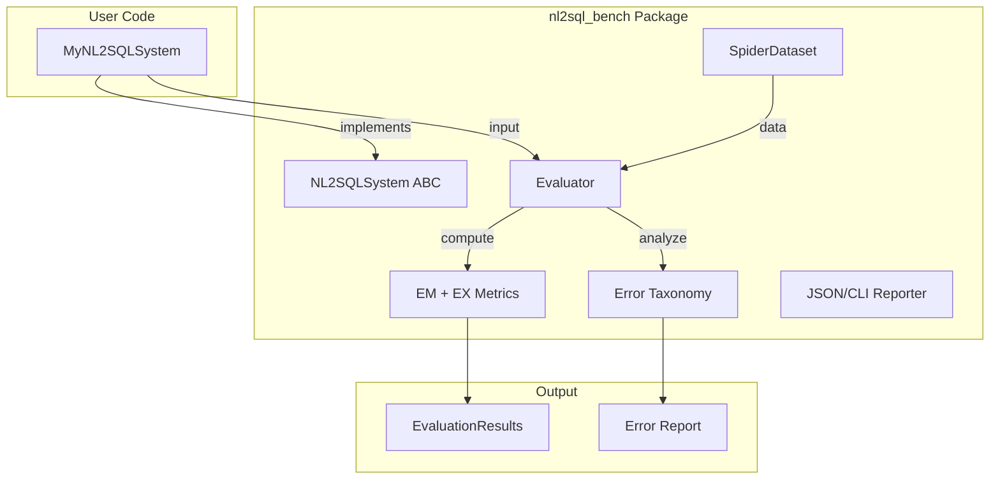

# NL2SQL-Bench: Framework Danh gia He thong NL2SQL

## Tong quan Kien truc




## Cau truc Thu muc Cuoi cung

```
nl2sql-bench/
├── nl2sql_bench/
│   ├── __init__.py
│   ├── core/
│   │   ├── __init__.py
│   │   ├── base.py              # NL2SQLSystem, NL2SQLInput, NL2SQLOutput
│   │   └── evaluator.py         # Evaluator class
│   ├── datasets/
│   │   ├── __init__.py
│   │   └── spider.py            # SpiderDataset loader
│   ├── metrics/
│   │   ├── __init__.py
│   │   ├── exact_match.py       # Wrap Spider's evaluation
│   │   └── execution.py         # Execution accuracy
│   ├── analysis/
│   │   ├── __init__.py
│   │   └── error_taxonomy.py    # Error classification
│   └── baselines/
│       ├── __init__.py
│       └── multi_agent_6step.py # Your system as baseline
├── examples/
│   ├── simple_llm_system.py
│   └── evaluate_baseline.py
├── tests/
│   └── test_evaluator.py
├── pyproject.toml
├── README.md
└── LICENSE
```

---

## PHASE 1: Core Infrastructure (5-7 ngay)

### Task 1.1: Khoi tao Project Structure

**File:** `nl2sql-bench/pyproject.toml`

```toml
[project]
name = "nl2sql-bench"
version = "0.1.0"
description = "A standardized evaluation framework for NL2SQL systems"
readme = "README.md"
requires-python = ">=3.10"
dependencies = [
    "pydantic>=2.0",
    "pandas>=2.0",
    "sqlite3",
]

[project.optional-dependencies]
dev = ["pytest", "black", "ruff"]
baselines = ["crewai", "openai", "anthropic", "google-generativeai"]

[project.scripts]
nl2sql-bench = "nl2sql_bench.cli:main"
```

**Prompt cho AI:**

```
Tao project structure cho nl2sql-bench framework:
1. Tao thu muc nl2sql-bench/ trong workspace hien tai
2. Tao pyproject.toml voi dependencies: pydantic>=2.0, pandas>=2.0
3. Tao cac file __init__.py cho tat ca subpackages
4. Tao README.md co ban voi mo ta project

Luu y:
- Python >= 3.10
- Su dung Pydantic v2 cho data validation
- Cau truc theo plan da dinh nghia
```

---

### Task 1.2: Dinh nghia Core Interfaces

**File:** `nl2sql_bench/core/base.py`

```python
from abc import ABC, abstractmethod
from typing import Dict, List, Optional, Any
from pydantic import BaseModel, Field

class NL2SQLInput(BaseModel):
    """Input for NL2SQL system"""
    question: str = Field(..., description="Natural language question")
    db_id: str = Field(..., description="Database identifier")
    schema: Dict[str, Any] = Field(..., description="Database schema in Spider format")
    
    # Optional context
    evidence: Optional[str] = Field(None, description="Additional context/hint")
    
class NL2SQLOutput(BaseModel):
    """Output from NL2SQL system"""
    sql: str = Field(..., description="Generated SQL query")
    confidence: float = Field(1.0, ge=0.0, le=1.0, description="Confidence score")
    
    # Optional metadata for analysis
    intermediate_steps: Optional[List[Dict]] = Field(None, description="Pipeline steps for debugging")
    error: Optional[str] = Field(None, description="Error message if failed")

class NL2SQLSystem(ABC):
    """Abstract base class for NL2SQL systems"""
    
    @property
    def name(self) -> str:
        """System name for reporting"""
        return self.__class__.__name__
    
    @property
    def version(self) -> str:
        """System version"""
        return "1.0.0"
    
    @abstractmethod
    def predict(self, input: NL2SQLInput) -> NL2SQLOutput:
        """
        Generate SQL from natural language question.
        
        Args:
            input: NL2SQLInput containing question, db_id, and schema
            
        Returns:
            NL2SQLOutput containing generated SQL and metadata
        """
        pass
    
    def predict_batch(self, inputs: List[NL2SQLInput]) -> List[NL2SQLOutput]:
        """Batch prediction (default: sequential)"""
        return [self.predict(inp) for inp in inputs]
```

**Prompt cho AI:**

```
Tao file nl2sql_bench/core/base.py dinh nghia core interfaces:

1. NL2SQLInput (Pydantic BaseModel):
   - question: str (required)
   - db_id: str (required)  
   - schema: Dict (Spider format, required)
   - evidence: Optional[str] (for BIRD dataset tuong lai)

2. NL2SQLOutput (Pydantic BaseModel):
   - sql: str (required)
   - confidence: float (0-1, default 1.0)
   - intermediate_steps: Optional[List[Dict]] (for debugging)
   - error: Optional[str]

3. NL2SQLSystem (ABC):
   - name property (return class name)
   - version property (default "1.0.0")
   - predict(input: NL2SQLInput) -> NL2SQLOutput (abstract)
   - predict_batch(inputs: List[NL2SQLInput]) -> List[NL2SQLOutput] (default sequential)

Su dung Pydantic v2 syntax voi Field() cho validation va description.
```

---

### Task 1.3: Spider Dataset Loader

**File:** `nl2sql_bench/datasets/spider.py`

**Prompt cho AI:**

```
Tao file nl2sql_bench/datasets/spider.py de load Spider dataset:

1. Class SpiderDataset:
   - __init__(self, data_dir: str, split: str = "dev", tables_file: str = "tables.json")
   - Load questions tu dev.json hoac train_spider.json
   - Load schemas tu tables.json
   - Property: questions -> List[Dict]
   - Property: schemas -> Dict[str, Dict] (key = db_id)
   - Method: __len__() -> int
   - Method: __iter__() -> yields NL2SQLInput objects
   - Method: get_gold_sql(index: int) -> str

2. Schema format can giu nguyen Spider format:
   {
     "db_id": "...",
     "table_names_original": [...],
     "column_names_original": [[table_idx, col_name], ...],
     "column_types": [...],
     "foreign_keys": [[col_idx1, col_idx2], ...],
     "primary_keys": [col_idx, ...]
   }

3. Xu ly:
   - encoding='utf-8' khi doc file
   - Validate file exists truoc khi load
   - Raise clear error messages

Tham khao cau truc Spider dataset tu project hien tai.
```

---

### Task 1.4: Metrics Implementation

**File:** `nl2sql_bench/metrics/execution.py`

**Prompt cho AI:**

```
Tao file nl2sql_bench/metrics/execution.py de tinh Execution Accuracy:

1. Function exec_match(pred_sql: str, gold_sql: str, db_path: str) -> bool:
   - Execute ca 2 SQL tren SQLite database
   - So sanh ket qua (sets, khong quan tam thu tu)
   - Return True neu ket qua giong nhau
   - Handle exceptions (syntax error, runtime error) -> return False

2. Function compute_execution_accuracy(predictions: List[str], golds: List[str], 
                                       db_paths: List[str]) -> float:
   - Tinh ty le exec_match = True
   - Return accuracy 0.0 - 1.0

3. Xu ly edge cases:
   - Empty result sets
   - NULL values
   - Different column orders (normalize)
   - Timeout (set limit 30s per query)

Tham khao code tu experiments/test-suite-sql-eval/evaluation.py
```

**File:** `nl2sql_bench/metrics/exact_match.py`

**Prompt cho AI:**

```
Tao file nl2sql_bench/metrics/exact_match.py de tinh Exact Match:

1. Wrap lai Spider's evaluation logic tu test-suite-sql-eval
2. Function compute_exact_match(pred_sql: str, gold_sql: str, 
                                db_id: str, schema: Dict) -> bool
3. Xu ly cac components: SELECT, WHERE, GROUP BY, ORDER BY, etc.
4. Ignore value differences (DISABLE_VALUE = True)
5. Ignore DISTINCT differences (DISABLE_DISTINCT = True)

Co the import truc tiep tu experiments/test-suite-sql-eval/ hoac re-implement
phan core logic.
```

---

### Task 1.5: Evaluator Class

**File:** `nl2sql_bench/core/evaluator.py`

**Prompt cho AI:**

```
Tao file nl2sql_bench/core/evaluator.py - Evaluator chinh:

1. Class EvaluationResult (Pydantic BaseModel):
   - total: int
   - exact_match: float (0-1)
   - execution_accuracy: float (0-1)
   - by_difficulty: Dict[str, Dict] (easy/medium/hard/extra)
   - errors: List[Dict] (chi tiet cac cau sai)
   - metadata: Dict (system name, timestamp, etc.)

2. Class Evaluator:
   - __init__(self, dataset: SpiderDataset, db_dir: str, output_dir: str = "results/")
   - run(self, system: NL2SQLSystem, verbose: bool = True) -> EvaluationResult
   - Method run():
     a. Iterate qua dataset
     b. Goi system.predict() cho moi input
     c. Tinh EM va EX metrics
     d. Phan loai theo difficulty
     e. Luu ket qua vao output_dir
     f. Return EvaluationResult

3. Progress reporting:
   - Print progress moi 100 cau
   - Print summary khi hoan thanh

4. Error handling:
   - Catch exceptions tu system.predict()
   - Log va tiep tuc (khong crash)
   - Ghi nhan cau loi vao errors list
```

---

## PHASE 2: Error Analysis (3-5 ngay)

### Task 2.1: Error Taxonomy

**File:** `nl2sql_bench/analysis/error_taxonomy.py`

**Prompt cho AI:**

```
Tao file nl2sql_bench/analysis/error_taxonomy.py - Phan loai loi:

1. Enum ErrorCategory:
   - FIELD_SELECTION: Chon sai cot trong SELECT
   - JOIN_PATH: Thieu/thua/sai JOIN
   - AGGREGATION: Sai COUNT/SUM/AVG/etc
   - GROUP_BY: Sai GROUP BY column
   - NESTED_QUERY: Sai subquery structure
   - VALUE_GROUNDING: Sai gia tri filter
   - SET_OPERATION: Sai UNION/INTERSECT/EXCEPT
   - SYNTAX_ERROR: Loi cu phap SQL
   - OTHER: Cac loi khac

2. Function classify_error(pred_sql: str, gold_sql: str, 
                           schema: Dict) -> List[ErrorCategory]:
   - Parse ca 2 SQL
   - So sanh tung component
   - Return list cac loai loi

3. Function analyze_errors(results: List[Dict]) -> Dict:
   - Input: list cac cau sai voi pred/gold SQL
   - Output: {
       "total_errors": int,
       "by_category": {ErrorCategory: count},
       "by_category_percentage": {ErrorCategory: float},
       "examples": {ErrorCategory: [top 3 examples]}
     }

Tham khao error patterns tu:
- evaluation_logs/pattern_recognition_evaluation_report.md
- evaluation_logs/failure_analysis_spider1.csv
```

---

### Task 2.2: Report Generator

**File:** `nl2sql_bench/analysis/reporter.py`

**Prompt cho AI:**

```
Tao file nl2sql_bench/analysis/reporter.py - Sinh bao cao:

1. Function generate_json_report(result: EvaluationResult, 
                                  error_analysis: Dict,
                                  output_path: str) -> str:
   - Tao JSON report day du
   - Return path to saved file

2. Function generate_cli_summary(result: EvaluationResult) -> str:
   - Format dep cho terminal output
   - Bao gom: EM, EX, breakdown by difficulty
   - Bao gom: Top 3 error categories

3. Format output:
```

## ================== NL2SQL-Bench Results ==================

System: MyNL2SQLSystem v1.0.0
Dataset: Spider dev (1034 questions)

## OVERALL METRICS

  Exact Match:        76.8%
  Execution Accuracy: 84.0%

## BY DIFFICULTY

  Easy:    92.3% EM | 95.1% EX (234 questions)
  Medium:  78.5% EM | 86.2% EX (456 questions)
  Hard:    68.2% EM | 75.4% EX (289 questions)
  Extra:   54.1% EM | 62.3% EX (55 questions)

# TOP ERROR CATEGORIES

1. JOIN_PATH:       23.4% (54 errors)
2. FIELD_SELECTION: 18.7% (43 errors)
3. AGGREGATION:     15.2% (35 errors)

```

```

---

## PHASE 3: Baseline va Examples (3-5 ngay)

### Task 3.1: Port Multi-Agent 6-Step Baseline

**File:** `nl2sql_bench/baselines/multi_agent_6step.py`

**Prompt cho AI:**

```
Port he thong 6-step tu project hien tai thanh baseline:

1. Class MultiAgent6StepSystem(NL2SQLSystem):
   - __init__(self, config_path: str = None)
   - Load agents config tu YAML
   - Implement predict() method

2. Wrap lai NL2SQLFlow tu src/nl2sql_6step/nl2sql_flow/main.py:
   - Giu nguyen pipeline logic
   - Convert input/output sang NL2SQLInput/NL2SQLOutput format

3. Config:
   - Cho phep override LLM models qua config
   - Default: su dung cau hinh hien tai (Claude + Gemini + GPT-4o)

4. Dependencies:
   - crewai
   - Cac LLM APIs

Tham khao:
- src/nl2sql_6step/nl2sql_flow/main.py
- src/nl2sql_6step/nl2sql_flow/crews/nl2sql_crew/nl2sql_crew.py
- src/nl2sql_6step/nl2sql_flow/crews/nl2sql_crew/config/agents.yaml
```

---

### Task 3.2: Simple LLM Example

**File:** `examples/simple_llm_system.py`

**Prompt cho AI:**

```
Tao file examples/simple_llm_system.py - Vi du don gian:

1. Class SimpleLLMSystem(NL2SQLSystem):
   - Su dung 1 LLM duy nhat (OpenAI GPT-4)
   - Direct prompt: question + schema -> SQL

2. Prompt template:
```

You are an SQL expert. Generate a SQL query for the following question.

Database Schema:
{schema}

Question: {question}

Return only the SQL query, nothing else.

```

3. Day du vi du su dung:
```python
from nl2sql_bench import NL2SQLSystem, Evaluator, SpiderDataset
from simple_llm_system import SimpleLLMSystem

# Initialize
system = SimpleLLMSystem(api_key="...")
dataset = SpiderDataset(data_dir="path/to/spider", split="dev")
evaluator = Evaluator(dataset=dataset, db_dir="path/to/databases")

# Run evaluation
results = evaluator.run(system)
print(results.summary())
```

```

---

### Task 3.3: CLI Interface

**File:** `nl2sql_bench/cli.py`

**Prompt cho AI:**
```

Tao file nl2sql_bench/cli.py - Command line interface:

1. Main commands:
  - nl2sql-bench evaluate --system  --dataset  --output 
  - nl2sql-bench compare --results   ...
  - nl2sql-bench analyze --results
2. Arguments:
  - --system: Python module path to NL2SQLSystem class
  - --dataset: Path to Spider dataset directory
  - --db-dir: Path to databases directory
  - --output: Output directory for results
  - --verbose: Show progress
3. Su dung argparse hoac click
4. Example usage:

```bash
# Evaluate a system
nl2sql-bench evaluate \
  --system mypackage.MySystem \
  --dataset ./spider_data \
  --db-dir ./spider_data/database \
  --output ./results

# Compare multiple results
nl2sql-bench compare \
  --results results/system1.json results/system2.json
```

```

---

## PHASE 4: Documentation va Testing (2-3 ngay)

### Task 4.1: README.md

**Prompt cho AI:**
```

Tao README.md day du cho nl2sql-bench:

1. Badges: Python version, License, PyPI version (placeholder)
2. Sections:
  - Overview: Mo ta ngan gon
  - Features: Danh sach tinh nang
  - Installation: pip install + from source
  - Quick Start: 10 dong code vi du
  - Usage Guide:
    - Implementing NL2SQLSystem
    - Running evaluation
    - Understanding results
  - Error Taxonomy: Giai thich cac loai loi
  - Baselines: Cac baseline co san
  - Citation: BibTeX cho paper (placeholder)
  - License: MIT
3. Code examples co syntax highlighting
4. Tieng Anh, academic tone

```

---

### Task 4.2: Unit Tests

**File:** `tests/test_evaluator.py`

**Prompt cho AI:**
```

Tao unit tests cho nl2sql-bench:

1. test_nl2sql_input_validation()
  - Test Pydantic validation
2. test_nl2sql_output_creation()
  - Test output model
3. test_spider_dataset_loading()
  - Mock data
  - Test iteration
4. test_execution_accuracy()
  - Test SQL execution comparison
  - Test edge cases
5. test_exact_match()
  - Test SQL structure comparison
6. test_evaluator_run()
  - Mock system
  - Test full pipeline

Su dung pytest, pytest-mock

```

---

## PHASE 5: PyPI Publishing (1 ngay)

### Task 5.1: Prepare for PyPI

**Prompt cho AI:**
```

Chuan bi publish len PyPI:

1. Update pyproject.toml:
  - Add classifiers
  - Add URLs (homepage, repository)
  - Add authors
2. Tao MANIFEST.in neu can
3. Tao .github/workflows/publish.yml:
  - Trigger on release
  - Build va upload to PyPI
4. Test local install:
  pip install -e .
5. Build:
  python -m build
6. Upload to TestPyPI truoc:
  twine upload --repository testpypi dist/*

```

---

## Summary: Tong hop Prompts theo Thu tu

| STT | Task | File chinh | Thoi gian |
|-----|------|------------|-----------|
| 1 | Project structure | pyproject.toml, __init__.py | 0.5 ngay |
| 2 | Core interfaces | core/base.py | 1 ngay |
| 3 | Spider loader | datasets/spider.py | 1 ngay |
| 4 | Execution metric | metrics/execution.py | 1 ngay |
| 5 | Exact match metric | metrics/exact_match.py | 1 ngay |
| 6 | Evaluator | core/evaluator.py | 1.5 ngay |
| 7 | Error taxonomy | analysis/error_taxonomy.py | 1.5 ngay |
| 8 | Reporter | analysis/reporter.py | 1 ngay |
| 9 | 6-step baseline | baselines/multi_agent_6step.py | 2 ngay |
| 10 | Simple example | examples/simple_llm_system.py | 0.5 ngay |
| 11 | CLI | cli.py | 1 ngay |
| 12 | README | README.md | 0.5 ngay |
| 13 | Tests | tests/ | 1 ngay |
| 14 | PyPI prep | workflows, MANIFEST | 0.5 ngay |

**Tong: ~14 ngay lam viec (2-3 tuan)**
```

