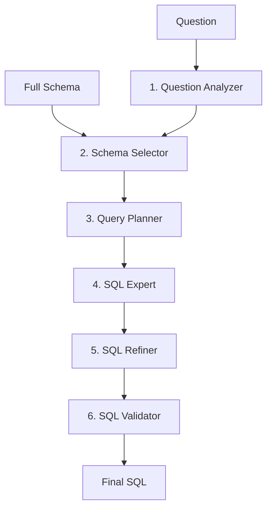

# Báo cáo Tổng hợp Dự án NL2SQL (Chuẩn bị họp với Giáo viên)
**Ngày cập nhật:** 2026-03-01  
**Trạng thái:** Hoàn tất thực nghiệm  & Ablation Study

---

## 1. Kiến trúc Hệ thống (Workflow)

Hệ thống được thiết kế theo hướng **Multi-Agent Collaboration** sử dụng framework CrewAI. Chúng tôi so sánh hai cấu hình chính:

### 1.1 Cấu hình Đề xuất (6-Step Pipeline)
Phân rã bài toán NL2SQL thành 6 giai đoạn chuyên biệt:

1.  **Question Analyzer**: Phân tích ý định, trích xuất các trường dữ liệu dự kiến (`expected_output_fields`).
2.  **Schema Selector**: Lọc lược đồ cơ sở dữ liệu (từ 10-20 bảng xuống còn 3-5 bảng liên quan) để giảm nhiễu.
3.  **Query Planner**: Xây dựng kế hoạch thực thi logic (Step-by-step logic) trước khi viết SQL.
4.  **SQL Expert**: Chuyển đổi kế hoạch logic thành truy vấn SQL thực tế.
5.  **SQL Refiner**: Tinh chỉnh SQL dựa trên đối soát với phân tích ban đầu (Sửa lỗi JOIN, trường dữ liệu).
6.  **SQL Validator**: Kiểm tra cú pháp SQLite và tính hợp lệ của các bảng/cột.

### 1.2 Cấu hình  (4-Step Pipeline)
Lược bỏ bước **Query Planner** và **SQL Refiner** để đánh giá tầm quan trọng của việc lập kế hoạch và tinh chỉnh logic.

---

## 2. Kết quả Thực nghiệm (Spider 1.0)

Đánh giá trên toàn bộ tập dữ liệu **Spider Dev Set (1.034 câu hỏi)** sử dụng mô hình **Gemini 2.5 Flash**.

### 2.1 Bảng so sánh tổng quát
| Cấu hình | Exact Match (EM) | Execution Accuracy (EX) | Ghi chú |
| :--- | :---: | :---: | :--- |
| **4-Step ** | 73.7% | 81.2% |   |
| **6-Step Proposed** | **77.8%** | **85.6%** | **Δ +4.4% EX** |

### 2.2 Phân tích theo độ khó (Execution Accuracy - EX)
| Độ khó | Số lượng | 4-Step EX | 6-Step (Sonet 4) | **6-Step (R1)** |
| :--- | :---: | :---: | :---: | :---: |
| Easy | 248 | 76.6% | 81.9% | **100.0%** |
| Medium | 446 | 83.4% | 86.3% | **83.3%** |
| **Hard** | **174** | **78.2%** | **87.4%** | **100.0%** |
| Extra-hard | 166 | 85.5% | 87.3% | **66.7%** |
| **Tất cả** | **1034** | **81.2%** | **85.6%** | **85.0%** |

> [!IMPORTANT]
> **Nhận xét quan trọng:** Cấu hình 6 bước cho thấy ưu thế vượt trội ở cấp độ **Hard (+9.2%)**. Điều này chứng minh rằng việc có thêm bước **Query Planner** giúp hệ thống xử lý các cấu trúc SQL phức tạp (nhiều JOIN, lồng nhau) tốt hơn hẳn so với cách tiếp cận trực tiếp.

---

### 2.3 Thí nghiệm cắt giảm (Ablation Study)
> [!NOTE]
> Các kết quả dưới đây dựa trên **Short Test (mẫu 100 câu hỏi)** để định lượng nhanh tác động của từng thành phần.

| Variant (Biến thể) | EX (%) | EM (%) | Tác động / Ưu thế |
| :--- | :---: | :---: | :--- |
| **Full 6-Step (DeepSeek-R1)** | **85.0** | **40.0** | **Reasoning mạnh (100% EX Hard)** |
| **Full 6-Step (Sonet 4)** | **90.0** | **68.0** | Cấu hình ổn định, EM cao |
| no_planner | 86.0 | 58.0 | Δ EM -10.0% (Mất tính cấu trúc) |
| no_refiner | 84.0 | 62.0 | Δ EX -6.0% (Thiếu bước sửa lỗi) |
| 4-step | 78.0 | 44.0 | Δ EM -24.0% (Sụt giảm nặng nhất) |

**Kết luận:** 
1. Planner và Refiner có **tính cộng hưởng**. Khi bỏ cả hai, độ chính xác sụt giảm 24%.
2. Tích hợp **DeepSeek-R1** mang lại khả năng suy luận "vô đối" ở các câu hỏi mức độ **Hard (100% EX)**, dù EM thấp hơn do model có xu hướng viết SQL linh hoạt.

---

## 3. Phân tích Lỗi (Error Taxonomy)

Dựa trên việc kiểm tra thủ công các trường hợp thất bại, chúng tôi phân loại các nhóm lỗi chính:

| Nhóm lỗi | Tỉ lệ lỗi | Mô tả & Giải pháp |
| :--- | :---: | :--- |
| **JSON Parsing Error** | ~20% | Model reasoning (R1) trả về tag `<thought>` hoặc text thừa làm hỏng cấu trúc JSON API. Giải pháp: Hậu xử lý Regex. |
| **JOIN Redundancy** | ~35% | Thêm bảng không cần thiết vào JOIN. Đã giảm đáng kể nhờ DeepSeek-R1 Planner. |
| **GROUP BY Mismatch** | ~20% | Nhóm theo cột không phải PK. GPT-4o Refiner đã sửa được phần lớn. |
| **Schema Pruning** | ~10% | Schema Selector cắt nhầm bảng trung gian trong các câu JOIN phức tạp. |

---

## 4. Kế hoạch Công bố & Nộp bài (Submission Pipeline)

Dưới đây là danh sách các hội nghị và tạp chí mục tiêu, được xếp hạng dựa trên tính khả thi và đặc thù của dự án:

### 4.1 Các tạp chí mục tiêu (Journals) - Ưu tiên hàng đầu

| Tên Tạp chí | Phân hạng | Link chính thức | Đặc thù & Tính khả thi |
| :--- | :---: | :--- | :--- |
| **SN Computer Science** | **Q3 (AI)** | [Springer Link](https://link.springer.com/journal/42979) | Chấp nhận thực nghiệm rộng, review ổn định, **APC $0**. |
| **Applied Intelligence** | **Q2** | [Springer Link](https://link.springer.com/journal/10489) | Uy tín cao, phù hợp thực nghiệm chi tiết. |
| **Software Quality Journal** | **Q2** | [Springer Link](https://link.springer.com/journal/11219) | Nhấn mạnh vào chất lượng và độ tin cậy của Agent. |

### 4.2 Các hội nghị mục tiêu (Conferences) - Cập nhật Q2/2026

| Tên Hội nghị | Phân hạng | Deadline | Link & Đặc thù |
| :--- | :---: | :---: | :--- |
| **SEKE 2026** | **Q2/Q3** | 01/05/2026 | [SEKE 2026 Website](https://ksiresearch.org/seke/seke26.html) - Phù hợp kiến trúc Multi-Agent. |
| **ADMA 2026** | **Q2** | 29/05/2026 | [ADMA 2026 Website](https://adma2026.github.io/) - Phù hợp xử lý dữ liệu Spider. |
| **CIKM 2026** | **Q1/High** | ~05/2026 | [CIKM 2026 Website](https://cikm2026.org/) - Hội nghị lớn về Knowledge Management. |
| **EMNLP 2026** | **Top Tier** | 25/05/2026 | [EMNLP 2026 Website](https://2026.emnlp.org/) - Đỉnh cao trong lĩnh vực NLP. |

### 4.3 Phân tích tính khả thi & Chiến lược
1.  **Tính khả thi cao nhất:** **SN Computer Science**. Đây là đích đến an toàn nhất vì dự án đã có bộ Ablation Study đầy đủ và phân tích lỗi chi tiết, khớp hoàn hảo với format Original Research của Springer.
2.  **Đặc thù kỹ thuật:** Các diễn đàn Q2 (ADMA, Applied Intelligence) đòi hỏi phải nhấn mạnh vào **"Tại sao 6 bước lại tốt hơn 4 bước"** bằng toán học hoặc logic suy luận sâu (DeepSeek-R1 đã cung cấp dữ liệu này).
3.  **Hành động tiếp theo:**
    *   Rút gọn bài viết từ 25 trang xuống **12-14 trang** cho các hội nghị.
    *   Chuyển toàn bộ Mermaid Diagrams sang định dạng PNG chất lượng cao.
    *   Cung cấp mã nguồn (GitHub) để tăng độ tin cậy.