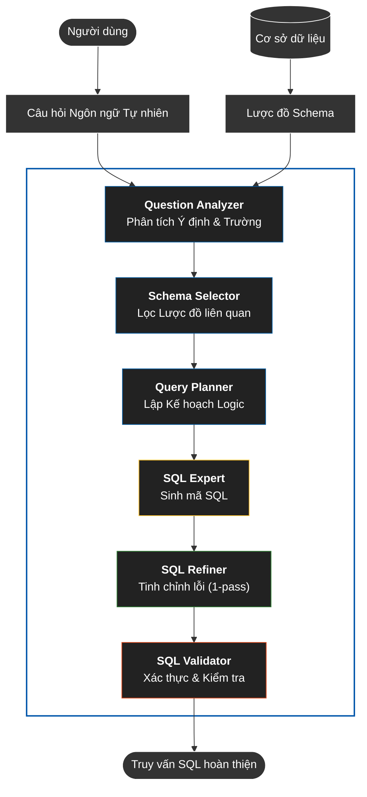
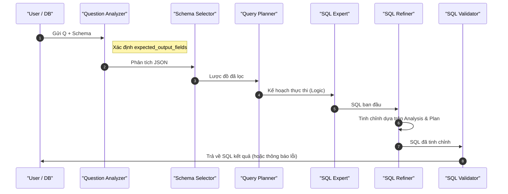
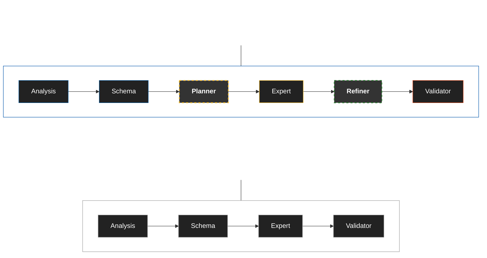
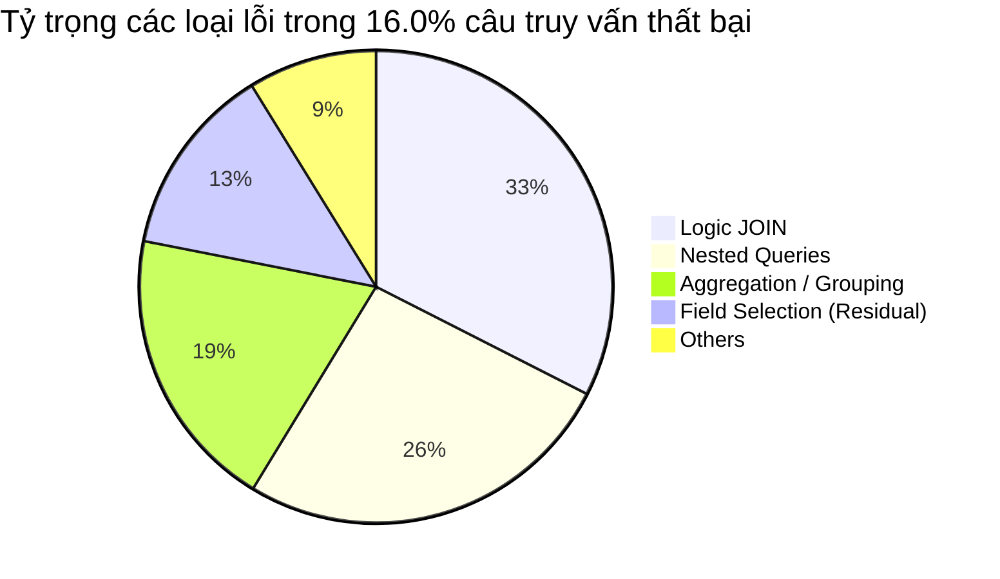

# Chuyển đổi Ngôn ngữ Tự nhiên sang SQL sử dụng Hệ thống Đa tác nhân

### Tóm tắt (Abstract)

Các hệ thống chuyển đổi Ngôn ngữ Tự nhiên sang SQL (NL2SQL) truyền thống đối mặt với rào cản từ các truy vấn phức tạp yêu cầu suy luận đa bước. Các phương pháp đơn tác nhân (Gemini zero-shot/CoT) thường ghi nhận tỷ trọng lỗi cao trong việc trích xuất thuộc tính (chọn trường dữ liệu). Bài báo này trình bày một thiết kế đa tác nhân chuyên biệt cho NL2SQL sử dụng khung CrewAI, bao gồm sáu tác nhân: Phân tích Câu hỏi, Chọn Lược đồ, Lập kế hoạch Truy vấn, Chuyên gia SQL, Kiểm tra SQL, và Tinh chỉnh SQL. Quy trình tích hợp cơ chế tinh chỉnh hành vi nhằm tối ưu hóa tính chính xác của mã nguồn.

Đánh giá trên toàn bộ tập dữ liệu Spider Dev Set (1.034 câu) cho thấy quy trình 6 tác nhân đạt **84,0%** độ chính xác thực thi, thể hiện sự cải thiện nhất quán so với các phương pháp đơn tác nhân và quy trình đa tác nhân rút gọn (4 bước). Các đóng góp chính bao gồm: (1) thiết kế kiến trúc đa tác nhân chuyên biệt cho NL2SQL, và (2) phân tích lỗi hệ thống thông qua chỉ số chẩn đoán Tỷ trọng Lỗi Chọn trường (FSED) để xác định các rào cản trích xuất dữ liệu. Kết quả cho thấy việc phân tách vai trò chuyên biệt có thể hỗ trợ xử lý các truy vấn NL2SQL phức tạp trong thiết lập thực nghiệm của chúng tôi.


**Từ khóa:** NL2SQL; hệ thống đa tác nhân; CrewAI; Gemini 2.0 Flash; Spider 1.0.

## 1. Giới thiệu (Introduction)

### 1.1 Mở đầu
Giao diện ngôn ngữ tự nhiên cho cơ sở dữ liệu ngày càng trở nên quan trọng khi chúng cho phép người dùng không có chuyên môn kỹ thuật truy vấn các cơ sở dữ liệu phức tạp bằng ngôn ngữ trực quan. Sự ra đời của các mô hình ngôn ngữ lớn (LLMs) đã cách mạng hóa các tác vụ xử lý ngôn ngữ tự nhiên, bao gồm việc dịch các câu hỏi ngôn ngữ tự nhiên thành các truy vấn SQL có cấu trúc—một tác vụ được gọi là NL2SQL. Tuy nhiên, bất chấp những tiến bộ đáng kể, các hệ thống NL2SQL hiện tại vẫn gặp khó khăn với các truy vấn phức tạp đòi hỏi suy luận nhiều bước, hiểu lược đồ chính xác và lựa chọn trường chính xác. Hệ thống đa tác nhân, tận dụng các tác nhân chuyên biệt làm việc cộng tác, đã nổi lên như một phương pháp hứa hẹn để giải quyết các hạn chế này bằng cách cho phép tinh chỉnh một lần và sửa lỗi thông qua sự cộng tác của tác nhân.

### 1.2 Phát biểu Bài toán
Các hệ thống NL2SQL truyền thống đối mặt với những thách thức cơ bản khi xử lý các truy vấn cơ sở dữ liệu phức tạp. Các phương pháp tiếp cận đơn tác nhân, dù dựa trên mô hình chuỗi-sang-chuỗi (sequence-to-sequence) hay các mô hình ngôn ngữ được tinh chỉnh, thường thất bại với các truy vấn yêu cầu nhiều phép nối (JOIN), các truy vấn con lồng nhau và các phép tổng hợp phức tạp [1, 2]. Các hệ thống này gặp khó khăn với suy luận nhiều bước, nơi việc hiểu ý định câu hỏi, xác định các phần tử lược đồ liên quan, lập kế hoạch cấu trúc truy vấn và sinh mã SQL đúng cú pháp và ngữ nghĩa đều phải được thực hiện chính xác. Phân tích của chúng tôi tiết lộ rằng lỗi chọn trường—nơi hệ thống xác định sai các cột cho mệnh đề SELECT mặc dù đã hiểu logic truy vấn cơ bản—chiếm tỷ trọng cao nhất trong các loại lỗi của các hệ thống cơ sở đơn tác nhân (single-agent baselines) khi đánh giá trên tập Spider Dev Set.

Hạn chế của các giải pháp hiện tại bắt nguồn từ một số vấn đề cơ bản. Các mô hình chuỗi-sang-chuỗi truyền thống, như Seq2SQL [1], thiếu khả năng suy luận tinh vi và gặp khó khăn với cấu trúc truy vấn phức tạp. Các mô hình này chỉ đạt độ chính xác thực thi 59,4% trên các tập dữ liệu đơn giản hơn như WikiSQL. Mặc dù các phương pháp nhận thức cú pháp như SyntaxSQLNet [2] đã cải thiện việc xử lý các truy vấn lồng nhau, chúng chỉ đạt độ chính xác khớp chính xác 19,7% trên tập dữ liệu Spider thách thức hơn [3]. Các mô hình nhận thức quan hệ như RAT-SQL [4] và RESDSQL [5] đã có tiến bộ đáng kể, với RESDSQL đạt 72,0% độ chính xác khớp chính xác trên Spider, nhưng các hệ thống này vẫn là kiến trúc đơn tác nhân không thể tinh chỉnh đầu ra lặp lại. Ngay cả các phương pháp dựa trên LLM gần đây [6, 7] cũng chỉ đạt độ chính xác thực thi 75-80% trên Spider và tiếp tục mắc các lỗi hệ thống trong việc chọn trường và logic JOIN phức tạp.

Các hệ thống đơn tác nhân đối mặt với những hạn chế cố hữu ngăn cản chúng giải quyết hiệu quả các thách thức này. Chúng sinh ra truy vấn SQL trong một lượt duy nhất, không có khả năng xác thực, phê bình và tinh chỉnh đầu ra dựa trên phản hồi. Mặc dù một số phương pháp kết hợp cơ chế tự sửa lỗi [6, 7], chúng vẫn bị giới hạn trong kiến trúc đơn tác nhân và không thể tận dụng chuyên môn sâu rộng qua các khía cạnh khác nhau của tác vụ NL2SQL. Việc thiếu cơ chế tinh chỉnh một lần có nghĩa là các lỗi trong chọn trường, hiểu lược đồ hoặc logic truy vấn không thể được xác định và sửa chữa một cách có hệ thống, dẫn đến những hạn chế về độ chính xác dai dẳng.

### 1.3 Phương pháp Tiếp cận của Chúng tôi
Bài báo này trình bày một hệ thống đa tác nhân mới cho NL2SQL giải quyết các hạn chế này thông qua sự cộng tác của các tác nhân chuyên biệt và tinh chỉnh một lần. Các hệ thống đa tác nhân đã cho thấy hứa hẹn trong việc giải quyết tác vụ phức tạp [8, 9], và phương pháp của chúng tôi tận dụng khung làm việc CrewAI [10] để điều phối sáu tác nhân chuyên biệt, mỗi tác nhân có vai trò và chuyên môn riêng biệt. 
Tác nhân Phân tích Câu hỏi (Question Analyzer) xác định ý định câu hỏi và phân tích kỹ lưỡng các trường cần thiết cho mệnh đề SELECT, giải quyết trực tiếp rào cản chọn trường dữ liệu vốn là nguồn sai sót phổ biến nhất. 
Tác nhân Chọn Lược đồ (Schema Selector) lọc các bảng và cột liên quan từ lược đồ cơ sở dữ liệu, giảm kích thước ngữ cảnh và cải thiện sự tập trung. 
Tác nhân Lập kế hoạch Truy vấn (Query Planner) tạo ra các kế hoạch thực thi logic chia nhỏ các truy vấn phức tạp thành các mục tiêu phụ dễ quản lý, cho phép xử lý tốt hơn các phép JOIN, tổng hợp và cấu trúc lồng nhau. 
Tác nhân Chuyên gia SQL (SQL Expert) sinh ra các truy vấn SQL với nhận thức về các mẫu lỗi phổ biến, trong khi Tác nhân Kiểm tra SQL (SQL Validator) kiểm tra tính đúng đắn về cú pháp và ngữ nghĩa. 
Cuối cùng, Tác nhân Tinh chỉnh SQL (SQL Refiner) thực hiện tinh chỉnh một lần để cải thiện truy vấn, cho phép sửa lỗi và tối ưu hóa truy vấn.

Điểm đổi mới chính của phương pháp chúng tôi là cơ chế tinh chỉnh một lần (single-pass refinement), trong đó tác nhân SQL Refiner xem xét truy vấn SQL ban đầu và có thể sửa đổi nó để giải quyết các vấn đề đã xác định trước khi xác thực. Cơ chế này cho phép hệ thống sửa các lỗi trong việc chọn trường, đơn giản hóa các phép JOIN không cần thiết, sửa logic tổng hợp và đảm bảo sự phù hợp với kế hoạch truy vấn ban đầu. Chúng tôi so sánh hai biến thể quy trình: một quy trình cơ sở 4 bước (Question Analyzer → Schema Selector → SQL Expert → SQL Validator) và kiến trúc đầy đủ 6 bước bao gồm Query Planner và SQL Refiner. Sự so sánh này cho phép chúng tôi đánh giá tác động của việc lập kế hoạch và tinh chỉnh một lần đối với độ chính xác của truy vấn.

### 1.4 Đóng góp
Bài báo này có các đóng góp sau:
*   **Thiết kế kiến trúc đa tác nhân chuyên biệt cho NL2SQL** (xem Phần 3.3): Chúng tôi đề xuất một kiến trúc đa tác nhân bao gồm sáu tác nhân có vai trò riêng biệt được thiết kế để giải quyết tuần tự các thách thức của NL2SQL. Kiến trúc này hỗ trợ cơ chế phản hồi chuyên biệt nhằm khắc phục các hạn chế của phương pháp đơn tác nhân (zero-shot/CoT) (xem Phần 1.2).
*   **Phân tích lỗi hệ thống qua chỉ số chẩn đoán FSED** (xem Phần 3.2 và 4.4): Chúng tôi sử dụng chỉ số Tỷ trọng Lỗi Chọn trường (FSED) để định lượng các sai sót trong việc trích xuất thuộc tính trên tập con các câu lỗi của hệ thống cơ sở. Phân tích này là cơ sở để thiết kế các chiến lược giảm thiểu lỗi có mục tiêu.
*   **Đánh giá thực nghiệm trên tập dữ liệu quy mô lớn** (xem Phần 4): Toàn bộ hệ thống được đánh giá trên 1.034 câu hỏi của Spider Dev Set, ghi nhận kết quả 84,0% độ chính xác thực thi (xem Phần 4.1).
*   **Phân tích mô hình cộng tác của tác nhân** (xem Phần 3.4): Chúng tôi làm rõ luồng thông tin và các cải thiện định tính thông qua sự phối hợp giữa các thành phần chuyên biệt (xem Phần 4.2.2).

### 1.5 Cấu trúc Bài báo
Phần còn lại của bài báo được tổ chức như sau. Phần 2 xem xét các công trình liên quan về các phương pháp NL2SQL và hệ thống đa tác nhân. Phần 3 mô tả phương pháp luận, kiến trúc hệ thống và chi tiết triển khai. Phần 4 trình bày kết quả thực nghiệm, phân tích chẩn đoán và thảo luận. Cuối cùng, Phần 5 kết luận bài báo và phác thảo hướng nghiên cứu tương lai.


## 2. Các Công trình Liên quan (Related Work)

### 2.1 Giới thiệu về các Công trình Liên quan
Lĩnh vực chuyển đổi NL2SQL đã phát triển đáng kể trong thập kỷ qua, tiến triển từ các mô hình chuỗi-sang-chuỗi đến các phương pháp dựa trên mô hình ngôn ngữ lớn. Đồng thời, các hệ thống đa tác nhân đã nổi lên như một mô hình hứa hẹn để giải quyết các tác vụ phức tạp trong xử lý ngôn ngữ tự nhiên. Phần này cung cấp một đánh giá toàn diện về các công trình liên quan được tổ chức thành năm danh mục chính: các phương pháp NL2SQL truyền thống, các hệ thống NL2SQL dựa trên LLM, các hệ thống đa tác nhân trong NLP, học công cụ (tool learning) và các khung RAG tác nhân (agentic RAG), và các chuẩn đánh giá. Chúng tôi phân tích phê bình từng danh mục, xác định các hạn chế và định vị kiến trúc đa tác nhân chuyên biệt cho NL2SQL của chúng tôi trong bối cảnh này. Không giống như các khảo sát trước đây tập trung chủ yếu vào các phương pháp đơn tác nhân, chúng tôi xem xét cách sự cộng tác đa tác nhân có thể giải quyết các lỗi hệ thống trong NL2SQL, đặc biệt là độ chính xác trong việc chọn trường vốn chiếm tỷ trọng lỗi đáng kể trong các hệ thống hiện có.

### 2.2 Các Phương pháp NL2SQL Truyền thống
Các hệ thống NL2SQL ban đầu sử dụng kiến trúc chuỗi-sang-chuỗi và các kỹ thuật phân tích ngữ nghĩa để dịch các câu hỏi ngôn ngữ tự nhiên thành các truy vấn SQL. Các phương pháp này đã thiết lập các phương pháp luận nền tảng nhưng bộc lộ những hạn chế đáng kể khi xử lý các truy vấn phức tạp đòi hỏi suy luận nhiều bước, hiểu chính xác lược đồ và lựa chọn trường chính xác.

**Seq2SQL** [1] giới thiệu một mô hình chuỗi-sang-chuỗi tạo ra các truy vấn SQL trực tiếp từ ngôn ngữ tự nhiên sử dụng học tăng cường để tối ưu hóa độ chính xác thực thi thay vì độ chính xác ở cấp độ token. Hệ thống đạt độ chính xác thực thi 59,4% trên WikiSQL, chứng minh tính khả thi của việc tạo SQL trực tiếp. Tuy nhiên, Seq2SQL gặp khó khăn với các phép JOIN phức tạp, truy vấn lồng nhau và khái quát hóa chéo miền, vì nó coi việc tạo SQL như một bài toán ánh xạ chuỗi đơn giản mà không có sự hiểu biết rõ ràng về lược đồ. Phương pháp này thiếu cơ chế tinh chỉnh lặp lại và không thể sửa lỗi sau lần tạo đầu tiên.

**SyntaxSQLNet** [2] giải quyết độ phức tạp về cấu trúc bằng cách giới thiệu một bộ giải mã dựa trên cây cú pháp tạo ra SQL dưới dạng cây cú pháp thay vì một chuỗi phẳng. Phương pháp này cải thiện việc xử lý các truy vấn lồng nhau và các cấu trúc SQL phức tạp, đạt độ chính xác khớp chính xác 19,7% trên tập dữ liệu Spider. Việc tạo nhận thức cú pháp cho phép xử lý các truy vấn phức tạp tốt hơn Seq2SQL, điều mà tác nhân Lập kế hoạch Truy vấn của chúng tôi cung cấp thông qua việc lập kế hoạch logic trước khi tạo SQL.

**RAT-SQL** [4] giới thiệu mã hóa lược đồ nhận thức quan hệ sử dụng mạng chú ý đồ thị để mô hình hóa rõ ràng các mối quan hệ giữa các token câu hỏi và các phần tử lược đồ. Phương pháp này đạt độ chính xác khớp chính xác 57,2% trên Spider, cải thiện đáng kể so với SyntaxSQLNet bằng cách hiểu rõ hơn về cấu trúc lược đồ và sự liên kết giữa câu hỏi và lược đồ. Mã hóa nhận thức quan hệ của RAT-SQL về mặt khái niệm tương tự như cách tiếp cận lọc của tác nhân Chọn Lược đồ của chúng tôi, nhưng RAT-SQL vẫn hoạt động như một hệ thống đơn tác nhân không có khả năng tinh chỉnh lặp lại. Hệ thống không thể sửa lỗi chọn trường hoặc tinh chỉnh truy vấn dựa trên phản hồi xác thực.

**RESDSQL** [5] tách biệt việc liên kết lược đồ khỏi việc mã hóa lược đồ, sử dụng các mô-đun riêng biệt để xác định các phần tử lược đồ liên quan và biểu diễn cấu trúc lược đồ. Việc tách biệt này đã cải thiện cả độ chính xác và khả năng diễn giải, đạt kết quả tiên tiến nhất cho các phương pháp tiếp cận đơn tác nhân với độ chính xác khớp chính xác 72,0% và độ chính xác thực thi 79,9% trên tập kiểm tra Spider. Việc tách biệt liên kết lược đồ của RESDSQL phù hợp với vai trò của tác nhân Chọn Lược đồ của chúng tôi, nhưng hệ thống vẫn thiếu khả năng tinh chỉnh lặp lại và các tác nhân chuyên biệt cho các khía cạnh khác nhau của việc tạo SQL. Công việc của chúng tôi mở rộng sự tách biệt này hơn nữa bằng cách phân phối trách nhiệm cho nhiều tác nhân chuyên biệt.

**BRIDGE** [11] nhấn mạnh việc liên kết lược đồ như một thành phần quan trọng, liên kết rõ ràng các token câu hỏi với các phần tử lược đồ trước khi tạo SQL. Hệ thống đạt độ chính xác khớp chính xác 70,0% trên tập phát triển Spider, chứng minh tầm quan trọng của việc hiểu lược đồ. Cách tiếp cận liên kết lược đồ của BRIDGE phù hợp với tác nhân Chọn Lược đồ của chúng tôi, nhưng BRIDGE sử dụng việc tạo một lần (single-pass) mà không có cơ chế tinh chỉnh.

**PICARD** [12] giới thiệu giải mã tự hồi quy ràng buộc cho các mô hình ngôn ngữ, ngăn chặn cú pháp SQL không hợp lệ trong quá trình tạo. Áp dụng cho T5-3B và các mô hình ngôn ngữ lớn khác, PICARD đã cải thiện đáng kể tính đúng đắn của cú pháp SQL, đạt khoảng 65-70% độ chính xác khớp chính xác trên Spider. PICARD chứng minh giá trị của việc kiểm tra ràng buộc, điều mà tác nhân Kiểm tra SQL của chúng tôi cung cấp, nhưng PICARD chỉ tập trung vào các ràng buộc cú pháp và không giải quyết các lỗi ngữ nghĩa hoặc độ chính xác chọn trường.

**Phân tích và Hạn chế:** Các phương pháp NL2SQL truyền thống chia sẻ một số hạn chế chung: (1) chúng sử dụng kiến trúc đơn tác nhân hoặc đơn mô hình không thể xử lý tinh chỉnh lặp lại (xem Phần 1.2), (2) chúng gặp khó khăn với độ chính xác chọn trường, thường chiếm phần lớn số lỗi ghi nhận được trong phân tích của chúng tôi (xem Phần 4.4.1), (3) chúng thiếu các thành phần chuyên biệt cho các khía cạnh khác nhau của việc tạo SQL (phân tích câu hỏi, lọc lược đồ, lập kế hoạch, tạo mã, xác thực, tinh chỉnh) (xem Phần 3.3), và (4) chúng không thể sửa lỗi sau lần tạo đầu tiên (xem Phần 3.6). Những hạn chế này thúc đẩy kiến trúc đa tác nhân của chúng tôi, giải quyết từng thách thức này thông qua vai trò tác nhân chuyên biệt và cơ chế tinh chỉnh một lần.

**Định vị Công việc của Chúng tôi:** Không giống như các phương pháp truyền thống kết hợp nhiều trách nhiệm trong một mô hình duy nhất, công việc của chúng tôi phân phối các tác vụ NL2SQL cho sáu tác nhân chuyên biệt: Phân tích Câu hỏi cho ý định và xác định trường, Chọn Lược đồ cho lọc lược đồ, Lập kế hoạch Truy vấn cho lập kế hoạch logic, Chuyên gia SQL cho tạo mã, Kiểm tra SQL cho kiểm tra lỗi, và Tinh chỉnh SQL cho cải thiện truy vấn. Sự chuyên môn hóa này cho phép mỗi tác nhân tập trung vào năng lực cốt lõi của mình, giảm tỷ lệ lỗi và cải thiện độ chính xác tổng thể. Ngoài ra, cơ chế tinh chỉnh một lần của chúng tôi cho phép cải thiện truy vấn trước khi xác thực cuối cùng, giải quyết một hạn chế chính của các phương pháp tạo một lần truyền thống.

### 2.3 NL2SQL Dựa trên LLM
Sự ra đời của các mô hình ngôn ngữ lớn (LLMs) đã cách mạng hóa NL2SQL, cho phép học theo ngữ cảnh (in-context learning) và prompting few-shot mà không cần tinh chỉnh sâu rộng. Tuy nhiên, các phương pháp dựa trên LLM vẫn mắc các lỗi hệ thống, đặc biệt là trong việc chọn trường và logic truy vấn phức tạp, làm nổi bật sự cần thiết của sự cộng tác đa tác nhân có cấu trúc.

**GPT-3/4 cho Text-to-SQL** [13] đã khám phá học theo ngữ cảnh cho NL2SQL sử dụng prompting few-shot với các ví dụ và ngữ cảnh lược đồ. GPT-4 đạt khoảng 75-80% độ chính xác thực thi trên Spider, tùy thuộc vào thiết kế prompt, chứng minh rằng các mô hình ngôn ngữ lớn có thể tạo SQL hiệu quả mà không cần tinh chỉnh. Tuy nhiên, các phương pháp dựa trên GPT gặp khó khăn với các phép JOIN phức tạp, độ chính xác chọn trường và các lỗi hệ thống tồn tại qua các thiết kế prompt khác nhau. Việc thiếu tinh chỉnh lặp lại có nghĩa là các lỗi không thể được sửa sau lần tạo đầu tiên, và bản chất đơn tác nhân hạn chế sự chuyên môn hóa cho các khía cạnh khác nhau của việc tạo SQL.

**CodeT5+ cho Text-to-SQL** [14] áp dụng các mô hình ngôn ngữ chuyên về mã cho NL2SQL, tận dụng khả năng hiểu mã để tạo truy vấn có cấu trúc. CodeT5+ được tinh chỉnh đạt khoảng 70% độ chính xác khớp chính xác trên Spider, chứng minh rằng các mô hình nhận thức mã hoạt động tốt hơn trên cú pháp SQL. Tuy nhiên, CodeT5+ vẫn hoạt động như một hệ thống đơn tác nhân không có khả năng tinh chỉnh, và lỗi chọn trường vẫn là một thách thức đáng kể.

**DIN-SQL** [6] giới thiệu việc phân rã các truy vấn SQL phức tạp thành các truy vấn con đơn giản hơn, sau đó kết hợp chúng với cơ chế tự sửa lỗi. Hệ thống đạt 85,3% độ chính xác thực thi trên tập kiểm tra Spider, đại diện cho sự cải thiện đáng kể so với các phương pháp tiếp cận một lần. Cơ chế tự sửa lỗi của DIN-SQL về mặt khái niệm tương tự như tác nhân Tinh chỉnh SQL của chúng tôi, và phương pháp phân rã của nó phù hợp với việc lập kế hoạch logic của tác nhân Lập kế hoạch Truy vấn. Tuy nhiên, DIN-SQL vẫn hoạt động như một hệ thống đơn tác nhân không có vai trò chuyên biệt cho các khía cạnh khác nhau của việc tạo SQL, và cơ chế tự sửa lỗi bị hạn chế so với cách tiếp cận tinh chỉnh đa tác nhân của chúng tôi.

**C3** [7] đã chứng minh NL2SQL zero-shot sử dụng ChatGPT với các prompt được thiết kế cẩn thận, đạt khoảng 75% độ chính xác thực thi trên Spider. Công việc này cho thấy kỹ thuật prompt là rất quan trọng đối với NL2SQL dựa trên LLM, phù hợp với kỹ thuật prompt chi tiết của chúng tôi cho từng tác nhân chuyên biệt. Tuy nhiên, C3 thiếu sự cộng tác đa tác nhân có cấu trúc cho phép giảm lỗi thông qua chuyên môn hóa.

**DAIL-SQL** [7] giải quyết sự mơ hồ trong các câu hỏi ngôn ngữ tự nhiên bằng cách tạo ra nhiều ứng viên SQL và chọn cái tốt nhất, sử dụng phân rã truy vấn và CodeT5+ được tinh chỉnh. Hệ thống đạt 86,2% độ chính xác thực thi trên tập kiểm tra Spider, đại diện cho trạng thái tiên tiến nhất đối với các phương pháp tiếp cận dựa trên LLM. Việc tạo nhiều ứng viên của DAIL-SQL tương tự như cách tiếp cận tinh chỉnh của chúng tôi, và việc phân rã của nó phù hợp với tác nhân Lập kế hoạch Truy vấn của chúng tôi. Tuy nhiên, DAIL-SQL tạo ra nhiều ứng viên thay vì tinh chỉnh một truy vấn đơn lẻ thông qua các tác nhân chuyên biệt, và nó thiếu sự tập trung chuyên biệt vào việc chọn trường để giải quyết nguồn lỗi phổ biến nhất.

**Phân tích và Hạn chế:** Các phương pháp dựa trên LLM cho thấy những cải thiện đáng kể so với các phương pháp truyền thống, tận dụng khả năng suy luận của các mô hình ngôn ngữ lớn. Tuy nhiên, chúng chia sẻ những hạn chế chung: (1) các lỗi hệ thống vẫn tồn tại, đặc biệt là trong việc chọn trường và logic truy vấn phức tạp (xem Phần 4.4.2), (2) kiến trúc đơn tác nhân không thể tận dụng sự chuyên môn hóa cho các khía cạnh khác nhau của việc tạo SQL (xem Phần 3.3), (3) cơ chế tinh chỉnh hạn chế không thể giải quyết một cách có hệ thống các mẫu lỗi (xem Phần 3.6), và (4) chỉ riêng kỹ thuật prompt là không đủ để loại bỏ các lỗi hệ thống (xem Phần 3.6). Những hạn chế này thúc đẩy kiến trúc đa tác nhân của chúng tôi, sử dụng LLM (Gemini 2.0 Flash) làm cơ sở nhưng thêm sự cộng tác có cấu trúc thông qua các tác nhân chuyên biệt.

**Định vị Công việc của Chúng tôi:** Công việc của chúng tôi sử dụng LLM (Gemini 2.0 Flash) làm nền tảng cho tất cả các tác nhân, tương tự như các phương pháp dựa trên LLM, nhưng thêm cấu trúc đa tác nhân để giải quyết các lỗi hệ thống. Không giống như các phương pháp dựa trên GPT chỉ dựa vào kỹ thuật prompt, hệ thống của chúng tôi phân phối trách nhiệm cho các tác nhân chuyên biệt, mỗi tác nhân có các prompt chi tiết và nhận thức về mẫu lỗi. Không giống như DIN-SQL và DAIL-SQL sử dụng tự sửa lỗi đơn tác nhân, tác nhân Tinh chỉnh SQL của chúng tôi hoạt động trong một khuôn khổ đa tác nhân, nhận ngữ cảnh từ Phân tích Câu hỏi, Chọn Lược đồ và Lập kế hoạch Truy vấn để thực hiện các tinh chỉnh có thông tin. Sự tập trung vào việc chọn trường của chúng tôi, được nhúng trong tác nhân Phân tích Câu hỏi, trực tiếp giải quyết các lỗi trọng tâm mà các phương pháp dựa trên LLM gặp phải.

### 2.4 Hệ thống Đa tác nhân trong NLP
Các hệ thống đa tác nhân đã nổi lên như một mô hình hứa hẹn để giải quyết các tác vụ phức tạp, cho phép các tác nhân chuyên biệt cộng tác trong các nhiệm vụ đòi hỏi nhiều bước, chuyên môn đa dạng và khả năng tinh chỉnh. Mặc dù các khung đa tác nhân chung hỗ trợ tinh chỉnh lặp lại, việc triển khai của chúng tôi sử dụng tinh chỉnh một lần để đạt hiệu quả tính toán. Tuy nhiên, việc áp dụng vào NL2SQL còn hạn chế, với hầu hết các khung đa tác nhân được thiết kế cho các nhiệm vụ mục đích chung thay vì truy vấn cơ sở dữ liệu chuyên biệt.

**Khung CrewAI** [10] cung cấp một khung mã nguồn mở để điều phối các tác nhân AI tự chủ, đóng vai trò, cộng tác trong các nhiệm vụ phức tạp. Khung này cho phép các tác nhân chia sẻ thông tin, ủy quyền nhiệm vụ và làm việc cùng nhau với các backend LLM khác nhau. Khả năng điều phối tác nhân của CrewAI hỗ trợ trực tiếp kiến trúc hệ thống của chúng tôi, vì chúng tôi sử dụng CrewAI để điều phối sáu tác nhân chuyên biệt của mình. Tuy nhiên, CrewAI là một khung mục đích chung, và đóng góp của chúng tôi nằm ở việc thiết kế các vai trò tác nhân và mô hình cộng tác đặc thù cho NL2SQL tận dụng khả năng của CrewAI cho các tác vụ truy vấn cơ sở dữ liệu.

**LangChain Agents** [9] cung cấp một khung để xây dựng các ứng dụng với LLM, bao gồm các hệ thống dựa trên tác nhân với việc sử dụng công cụ và gọi hàm. Các tác nhân LangChain có thể sử dụng công cụ, duy trì bộ nhớ và thực hiện suy luận chuỗi suy nghĩ (chain-of-thought). Mặc dù LangChain cung cấp các khái niệm điều phối tác nhân tương tự như CrewAI, chúng tôi đã chọn CrewAI vì mô hình đóng vai trò rõ ràng và khả năng ủy quyền nhiệm vụ của nó. Công việc của chúng tôi chứng minh cách sự cộng tác đa tác nhân có thể được áp dụng cụ thể cho NL2SQL, điều chưa được khám phá rộng rãi trong hệ sinh thái LangChain.

**Hệ thống Đa tác nhân cho các Tác vụ Phức tạp** [15] đã chứng minh rằng việc chuyên môn hóa vai trò có thể mang lại hiệu quả cao hơn so với các mô hình đơn lẻ trong các nhiệm vụ đa bước. Các nghiên cứu tại ICML và NeurIPS đã xác thực tính ứng dụng của kiến trúc đa tác nhân trong việc nâng cao độ chính xác và khả năng xử lý lỗi. Tuy nhiên, phần lớn các khung làm việc này mang tính lý thuyết tổng quát. Nghiên cứu của chúng tôi tập trung vào việc áp dụng thiết kế đa tác nhân chuyên biệt vào miền NL2SQL nhằm xử lý các sai sót đặc thù về cấu trúc dữ liệu.

**Phân tích và Hạn chế:** Các hệ thống đa tác nhân cho thấy hứa hẹn đối với các nhiệm vụ phức tạp, nhưng ứng dụng của chúng vào NL2SQL còn hạn chế. Các khung hiện có (CrewAI, LangChain, AutoGen) cung cấp điều phối tác nhân mục đích chung nhưng thiếu thiết kế tác nhân đặc thù cho NL2SQL. Nghiên cứu đa tác nhân chung xác thực lợi ích của sự chuyên môn hóa và cộng tác nhưng không giải quyết các thách thức cụ thể của NL2SQL như độ chính xác chọn trường, hiểu lược đồ và tính đúng đắn của cú pháp SQL. Khoảng cách giữa các khung đa tác nhân chung và các yêu cầu cụ thể của NL2SQL thúc đẩy kiến trúc chuyên biệt của chúng tôi.

**Định vị nghiên cứu:** Chúng tôi đề xuất một kiến trúc đa tác nhân chuyên biệt cho NL2SQL, tích hợp sáu thành phần chính: Phân tích Câu hỏi (xác định thuộc tính), Chọn Lược đồ, Lập kế hoạch Truy vấn, Chuyên gia SQL, Kiểm tra SQL và Tinh chỉnh SQL. Mặc dù tận dụng khả năng điều phối của CrewAI, đóng góp chính của chúng tôi nằm ở việc thiết kế các vai trò và tài liệu hướng dẫn (backstories) nhận thức mẫu lỗi đặc thù để tối ưu hóa truy vấn cơ sở dữ liệu.

### 2.5 Học Công cụ và RAG Tác nhân (Tool Learning and Agentic RAG)
Các khung học công cụ và RAG tác nhân cho phép LLM sử dụng các công cụ bên ngoài, xác minh đầu ra và sửa lỗi thông qua các cơ chế tự phản ánh và phê bình. Các phương pháp này chứng minh giá trị của việc cải thiện lặp lại và xác thực, nhưng chúng được thiết kế cho các nhiệm vụ chung thay vì các mẫu lỗi NL2SQL chuyên biệt.

**Reflexion** [16] giới thiệu các cơ chế tự phản ánh cho các tác nhân ngôn ngữ, cho phép các tác nhân phản ánh về hành động của mình, xác định lỗi và tự sửa chữa bằng cách sử dụng phản hồi bằng lời nói để học tăng cường. Reflexion cải thiện hiệu suất trên các tác vụ lập trình thông qua cải thiện lặp lại, chứng minh giá trị của việc tự sửa lỗi. Tuy nhiên, sự tự phản ánh của Reflexion là mục đích chung và không chuyên biệt cho các mẫu lỗi NL2SQL như độ chính xác chọn trường. Tác nhân Tinh chỉnh SQL của chúng tôi cung cấp khả năng tinh chỉnh tương tự nhưng trong khuôn frameworks đa tác nhân với nhận thức về mẫu lỗi đặc thù cho NL2SQL.

**CRITIC** [17] cho phép LLM tự sửa lỗi bằng cách sử dụng phê bình tương tác công cụ, trong đó LLM sử dụng các công cụ bên ngoài để xác minh và sửa chữa đầu ra với phản hồi thực thi. CRITIC cải thiện độ chính xác trên các tác vụ tạo mã thông qua sửa lỗi lặp lại, cho thấy giá trị của việc sử dụng công cụ để xác thực. Tác nhân Kiểm tra SQL của chúng tôi cung cấp khả năng xác thực tương tự, kiểm tra cú pháp và ngữ nghĩa SQL, nhưng trong một kiến trúc đa tác nhân chuyên biệt. Không giống như tự sửa lỗi mục đích chung của CRITIC, hệ thống của chúng tôi giải quyết các lỗi cụ thể của NL2SQL như chọn trường dữ liệu thông qua các vai trò tác nhân chuyên biệt.

**Agentic RAG** [18] kết hợp thế hệ tăng cường truy xuất (RAG) với các hệ thống dựa trên tác nhân, nơi các tác nhân quyết định truy xuất cái gì, khi nào truy xuất và cách sử dụng thông tin được truy xuất. Agentic RAG cho phép thu thập thông tin động và tạo nhận thức ngữ cảnh, cải thiện độ chính xác truy xuất thông tin. Tác nhân Chọn Lược đồ của chúng tôi có các khái niệm tương tự, chọn lọc thông tin lược đồ liên quan một cách linh hoạt dựa trên yêu cầu câu hỏi. Tuy nhiên, agentic RAG được thiết kế cho các nhiệm vụ truy xuất thông tin chung, trong khi Chọn Lược đồ của chúng tôi chuyên biệt cho việc lọc lược đồ cơ sở dữ liệu trong bối cảnh NL2SQL.

**Học Công cụ trong Mô hình Ngôn ngữ Lớn** [19] khám phá cách LLM có thể học sử dụng công cụ hiệu quả cho các tác vụ có cấu trúc như tạo mã và truy vấn dữ liệu. Nghiên cứu từ OpenAI, Anthropic và Google chứng minh rằng việc sử dụng công cụ cải thiện khả năng của LLM, cho phép tạo đầu ra có cấu trúc tốt hơn. Hệ thống của chúng tôi tận dụng các khái niệm học công cụ thông qua xác thực và tinh chỉnh SQL, nhưng áp dụng chúng cụ thể cho NL2SQL với các tác nhân chuyên biệt. Không giống như học công cụ chung tập trung vào lựa chọn và thực thi công cụ, công việc của chúng tôi tập trung vào các mẫu lỗi và chiến lược tinh chỉnh đặc thù cho SQL.

**Phân tích và Hạn chế:** Các khung học công cụ và RAG tác nhân chứng minh giá trị của việc cải thiện lặp lại, xác thực và truy xuất thông tin động. Tuy nhiên, chúng được thiết kế cho các nhiệm vụ mục đích chung và thiếu sự chuyên môn hóa cho các thách thức cụ thể của NL2SQL. Các cơ chế tự sửa lỗi chung (Reflexion, CRITIC) không thể giải quyết các mẫu lỗi cụ thể của NL2SQL như độ chính xác chọn trường, logic JOIN và tính đúng đắn của phép tổng hợp. Agentic RAG tập trung vào truy xuất thông tin thay vì tạo truy vấn có cấu trúc. Những hạn chế này thúc đẩy kiến trúc đa tác nhân đặc thù cho NL2SQL của chúng tôi kết hợp các khái niệm học công cụ với các vai trò tác nhân chuyên biệt.

**Định vị Công việc của Chúng tôi:** Công việc của chúng tôi mượn các khái niệm từ học công cụ (xác thực, tinh chỉnh) và RAG tác nhân (chọn lược đồ động) nhưng áp dụng chúng cụ thể cho NL2SQL thông qua các tác nhân chuyên biệt. Không giống như Reflexion và CRITIC sử dụng tự sửa lỗi mục đích chung, tác nhân Tinh chỉnh SQL của chúng tôi thực hiện tinh chỉnh một lần tập trung vào các mẫu lỗi đặc thù của NL2SQL, nhận ngữ cảnh từ Phân tích Câu hỏi (yêu cầu chọn trường), Lập kế hoạch Truy vấn (kế hoạch logic) và Chọn Lược đồ (lược đồ đã lọc) để thực hiện các cải tiến có thông tin. Không giống như agentic RAG truy xuất thông tin chung, Chọn Lược đồ của chúng tôi truy xuất và lọc lược đồ cơ sở dữ liệu cụ thể cho việc tạo SQL. Kiểm tra SQL của chúng tôi cung cấp xác thực giống như công cụ tương tự như CRITIC nhưng chuyên biệt cho cú pháp và ngữ nghĩa SQL, với xác thực chọn trường là ưu tiên hàng đầu.

### 2.6 Khung Đánh giá
Các chuẩn mực và chỉ số đánh giá tiêu chuẩn là rất cần thiết để so sánh các hệ thống NL2SQL và theo dõi tiến độ trong lĩnh vực này. Tập dữ liệu Spider đã trở thành tiêu chuẩn thực tế để đánh giá các hệ thống NL2SQL phức tạp, đa miền, trong khi WikiSQL cung cấp một mức cơ sở đơn giản hơn cho các truy vấn bảng đơn.

**Tập dữ liệu Spider** [3] giới thiệu một tập dữ liệu quy mô lớn được gán nhãn bởi con người cho các tác vụ phân tích ngữ nghĩa và chuyển văn bản sang SQL phức tạp và chéo miền. Tập dữ liệu chứa 10.181 câu hỏi và 5.693 truy vấn SQL duy nhất trên 200 cơ sở dữ liệu, bao gồm các mức độ phức tạp khác nhau (Dễ, Trung bình, Khó, Rất khó) và các miền. Spider đã trở thành chuẩn đánh giá chính cho các hệ thống NL2SQL. Chúng tôi thực hiện việc đánh giá sự chính xác bằng cách thực thi các truy vấn này trên môi trường cơ sở dữ liệu Spider thực tế để đảm bảo tính khách quan.

**Tập dữ liệu WikiSQL** [1] cung cấp một tập dữ liệu quy mô lớn với nhiều cặp câu hỏi-SQL cho các truy vấn bảng đơn đơn giản hơn. WikiSQL hữu ích cho đánh giá ban đầu và so sánh cơ sở, nhưng sự đơn giản của nó (truy vấn bảng đơn) làm cho nó ít liên quan hơn đối với các hệ thống phức tạp phải xử lý các phép JOIN nhiều bảng, truy vấn lồng nhau và các phép tổng hợp. Trong khi WikiSQL chứng minh tính khả thi cơ bản của NL2SQL, độ phức tạp của Spider phản ánh tốt hơn các thách thức truy vấn cơ sở dữ liệu trong thế giới thực.

**Tập dữ liệu BIRD** [20] giới thiệu một chuẩn mực thách thức hơn với 12.751 cặp câu hỏi-SQL trên 95 cơ sở dữ liệu, có các cơ sở dữ liệu lớn hơn, các truy vấn phức tạp hơn và các kịch bản thực tế. BIRD bao gồm đánh giá hiệu quả SQL và thời gian thực thi, vượt ra ngoài độ chính xác để xem xét hiệu suất truy vấn. Mặc dù BIRD đại diện cho một chuẩn mực thách thức hơn, Spider vẫn là tiêu chuẩn để so sánh các hệ thống NL2SQL do khung đánh giá đã được thiết lập của nó.

**Chỉ số Đánh giá:** Các hệ thống NL2SQL thường được đánh giá bằng hai chỉ số chính: (1) độ chính xác khớp chính xác, đo lường tính đúng đắn về cú pháp bằng cách so sánh SQL được tạo với SQL tiêu chuẩn vàng (xem Phần 4.1), và (2) độ chính xác thực thi, đo lường tính đúng đắn về ngữ nghĩa bằng cách so sánh kết quả thực thi (xem Phần 4.1). Độ chính xác thực thi thường được coi là khoan dung và thực tế hơn, vì nhiều truy vấn SQL có thể tạo ra cùng một kết quả. Hệ thống của chúng tôi báo cáo cả hai chỉ số, với độ chính xác thực thi là thước đo chính về hiệu suất hệ thống. Ngoài ra, chúng tôi phân tích độ chính xác chọn trường như một chỉ số tùy chỉnh, xác định rằng một tỷ lệ đáng kể các lỗi bắt nguồn từ việc chọn sai trường trong mệnh đề SELECT (xem Phần 4.4.1).

**Phân tích và Định vị:** Các khung đánh giá tiêu chuẩn (Spider, WikiSQL, BIRD) và các chỉ số (khớp chính xác, độ chính xác thực thi) cho phép so sánh công bằng giữa các hệ thống NL2SQL. Công việc của chúng tôi tuân theo các tiêu chuẩn này, đánh giá trên Spider với cả độ chính xác khớp chính xác và thực thi. Tuy nhiên, chúng tôi đóng góp phân tích bổ sung thông qua việc đo lường độ chính xác chọn trường, xác định rằng một tỷ trọng lớn các lỗi bắt nguồn từ việc chọn sai trường trong mệnh đề SELECT (xem Phần 4.4.1). Phân tích lỗi này cung cấp cái nhìn sâu sắc vượt ra ngoài các chỉ số tiêu chuẩn, giúp hiểu được nơi các hệ thống NL2SQL thất bại và cách chuyên môn hóa đa tác nhân có thể giải quyết những thất bại này.

### 2.7 So sánh và Định vị
Kiến trúc đa tác nhân chuyên biệt của chúng tôi cho NL2SQL khác biệt với các phương pháp hiện có ở một số điểm chính, trong khi xây dựng dựa trên các kỹ thuật đã được thiết lập từ nhiều lĩnh vực nghiên cứu.

**Cách Phương pháp của Chúng tôi Khác biệt:** Không giống như các phương pháp đơn tác nhân (NL2SQL truyền thống, hầu hết các hệ thống dựa trên LLM), công việc của chúng tôi sử dụng sáu tác nhân chuyên biệt với các vai trò riêng biệt, cho phép mỗi tác nhân tập trung vào năng lực cốt lõi của mình. Không giống như các khung đa tác nhân mục đích chung (CrewAI, LangChain, AutoGen), hệ thống của chúng tôi được thiết kế đặc biệt cho NL2SQL với các tác nhân chuyên biệt cho các tác vụ truy vấn cơ sở dữ liệu. Không giống như các hệ thống tự sửa lỗi (DIN-SQL, DAIL-SQL, Reflexion, CRITIC) sử dụng tinh chỉnh đơn tác nhân, Tinh chỉnh SQL của chúng tôi thực hiện tinh chỉnh một lần trong một khuôn khổ đa tác nhân, nhận ngữ cảnh chuyên biệt từ Phân tích Câu hỏi, Chọn Lược đồ và Lập kế hoạch Truy vấn. Không giống như các phương pháp hiện có coi việc chọn trường là một phần của việc tạo SQL, Phân tích Câu hỏi của chúng tôi xác định rõ ràng các trường cần thiết trước khi tạo SQL, giải quyết một tỷ lệ lớn lỗi bắt nguồn từ sai lầm trong chọn trường.

**Những gì Chúng tôi Mượn và Cải thiện:** Chúng tôi mượn các mô hình cơ sở LLM (Gemini 2.0 Flash) từ các phương pháp dựa trên LLM, nhưng thêm cấu trúc đa tác nhân để giảm lỗi hệ thống. Chúng tôi mượn các khái niệm điều phối tác nhân từ khung CrewAI, nhưng đóng góp các thiết kế tác nhân và mô hình cộng tác đặc thù cho NL2SQL. Chúng tôi mượn các khái niệm tự sửa lỗi từ Reflexion và CRITIC, nhưng chuyên môn hóa tinh chỉnh một lần cho các mẫu lỗi NL2SQL. Chúng tôi mượn việc tách biệt liên kết lược đồ từ RESDSQL, nhưng mở rộng nó hơn nữa thông qua tác nhân Chọn Lược đồ chuyên biệt. Chúng tôi mượn việc phân rã truy vấn từ DIN-SQL và DAIL-SQL, nhưng thực hiện nó thông qua tác nhân Lập kế hoạch Truy vấn chuyên dụng với việc lập kế hoạch logic thay vì phân rã SQL.

**Các Khía cạnh Mới lạ:** Công việc của chúng tôi giới thiệu một số đóng góp: (1) **Kiến trúc đa tác nhân chuyên biệt cho NL2SQL** với sáu tác nhân được thiết kế cho các tác vụ truy vấn cơ sở dữ liệu (xem Phần 3.3), (2) **Sử dụng chỉ số FSED như một thước đo chẩn đoán** để định lượng rào cản chọn trường dữ liệu, (3) **Cơ chế tinh chỉnh một lần** (single-pass refinement) cho phép tối ưu hóa hiệu quả tài nguyên, và (4) **Nhận thức về mẫu lỗi hệ thống** được tích hợp trực tiếp vào quy trình làm việc.

**Định vị trong Bối cảnh:** Công việc của chúng tôi thu hẹp khoảng cách giữa NL2SQL dựa trên LLM (cho thấy hứa hẹn nhưng mắc lỗi hệ thống) và hệ thống đa tác nhân (cho thấy hứa hẹn cho các nhiệm vụ phức tạp nhưng thiếu các ứng dụng đặc thù cho NL2SQL). Chúng tôi kết hợp khả năng suy luận của LLM với lợi ích chuyên môn hóa của sự cộng tác đa tác nhân, giải quyết các lỗi hệ thống mà cả hai phương pháp riêng lẻ không thể giải quyết. Sự tập trung vào chọn trường của chúng tôi (một tỷ lệ đáng kể lỗi) giải quyết một hạn chế quan trọng mà các phương pháp hiện có chưa giải quyết một cách có hệ thống. Sự so sánh của chúng tôi về các quy trình 4 bước và 6 bước cung cấp xác thực thực nghiệm về lợi ích chuyên môn hóa đa tác nhân, thúc đẩy nghiên cứu trong tương lai theo hướng này.

### 2.8 Khoảng trống và Cơ hội
Công việc hiện tại trong NL2SQL, hệ thống đa tác nhân và học công cụ đã đạt được những tiến bộ đáng kể, nhưng một số khoảng trống vẫn còn tồn tại mà công việc của chúng tôi giải quyết.

**Khoảng trống 1: Kiến trúc Đa tác nhân Chuyên biệt cho NL2SQL** - Mặc dù các hệ thống đa tác nhân đã được áp dụng rộng rãi, nhưng hiện còn thiếu các kiến trúc đa tác nhân chuyên biệt được tối ưu hóa cụ thể cho NL2SQL. Công việc của chúng tôi lấp đầy khoảng trống này bằng cách thiết kế hệ thống có nhận thức sâu sắc về đặc thù của ngôn ngữ truy vấn SQL.

**Khoảng trống 2: Tập trung vào Độ chính xác Chọn trường** - Lỗi chọn trường chiếm một tỷ lệ đáng kể lỗi trong các hệ thống NL2SQL, nhưng các phương pháp tiếp cận hiện có coi việc chọn trường là một phần của việc tạo SQL thay vì một bước phân tích chuyên dụng. Tác nhân Phân tích Câu hỏi của chúng tôi xác định rõ ràng các trường cần thiết trước khi tạo SQL, giải quyết nguồn lỗi quan trọng này thông qua phân tích chuyên biệt.

**Khoảng trống 3: Tinh chỉnh Một lần cho Truy vấn SQL** - Trong khi một số hệ thống (DIN-SQL, DAIL-SQL) sử dụng tự sửa lỗi, chúng hoạt động như các hệ thống đơn tác nhân không có tác nhân tinh chỉnh chuyên biệt. Tác nhân Tinh chỉnh SQL của chúng tôi cung cấp tinh chỉnh một lần trong khuôn framework đa tác nhân, nhận ngữ cảnh từ các tác nhân chuyên biệt để thực hiện các cải tiến có thông tin.

**Khoảng trống 4: Phân tích Mẫu lỗi Hệ thống** - Các phương pháp hiện có thiếu phân tích hệ thống về các mẫu lỗi trong NL2SQL, đặc biệt là lỗi chọn trường. Phân tích lỗi của chúng tôi xác định rằng phần lớn sai sót bắt nguồn từ việc chọn trường, thúc đẩy tác nhân Phân tích Câu hỏi chuyên biệt của chúng tôi và sự tập trung vào chọn trường trong suốt quy trình.

**Khoảng trống 5: So sánh Thực nghiệm các Biến thể Quy trình** - Mặc dù các nghiên cứu cắt giảm (ablation studies) tồn tại cho các hệ thống đơn tác nhân, nhưng có ít so sánh thực nghiệm về các kiến trúc quy trình đa tác nhân khác nhau cho NL2SQL. Sự so sánh của chúng tôi về các quy trình 4 bước và 6 bước cung cấp cái nhìn sâu sắc về các thành phần nào là quan trọng nhất đối với độ chính xác của NL2SQL.

**Tại sao Phương pháp của Chúng tôi Cần thiết:** Các hệ thống đơn tác nhân đã đạt đến mức trần về độ chính xác, với các lỗi hệ thống (đặc biệt là các sai lệch trong lựa chọn trường dữ liệu) vẫn tồn tại bất παρά sự cải thiện trong các mô hình cơ sở và kỹ thuật prompt. Sự cộng tác đa tác nhân cho phép chuyên môn hóa có thể giải quyết các lỗi hệ thống này, nhưng các khung đa tác nhân mục đích chung thiếu các thiết kế đặc thù cho NL2SQL. Kiến trúc chuyên biệt của chúng tôi thu hẹp khoảng cách này, chứng minh cách sự chuyên môn hóa của tác nhân có thể cải thiện độ chính xác NL2SQL vượt xa những gì các hệ thống đơn tác nhân có thể đạt được. Xác thực thực nghiệm thông qua so sánh 4 bước và 6 bước cung cấp bằng chứng rằng chuyên môn hóa đa tác nhân mang lại lợi ích cho NL2SQL, thúc đẩy nghiên cứu trong tương lai theo hướng này.


## 3. Phương pháp luận (Methodology)

### 3.1 Tổng quan
Như được hiển thị trong Hình 1, kiến trúc đa tác nhân của chúng tôi cho việc chuyển đổi Ngôn ngữ Tự nhiên sang SQL (NL2SQL) tận dụng khung làm việc CrewAI để điều phối sáu tác nhân chuyên biệt làm việc cộng tác. Kiến trúc hệ thống tuân theo một quy trình tuần tự trong đó mỗi tác nhân thực hiện một vai trò cụ thể trong quá trình tạo truy vấn: phân tích câu hỏi, chọn lược đồ, lập kế hoạch truy vấn, tạo SQL, tinh chỉnh một lần và xác thực.

**Hình 1: Kiến trúc Hệ thống Đa tác nhân cho NL2SQL**




Luồng cộng tác của tác nhân diễn ra như sau: một câu hỏi ngôn ngữ tự nhiên trước tiên được phân tích bởi Phân tích Câu hỏi để xác định ý định và các trường cần thiết. Sau đó, Chọn Lược đồ lọc các bảng và cột liên quan từ lược đồ cơ sở dữ liệu. Lập kế hoạch Truy vấn tạo ra một kế hoạch thực thi logic, tiếp theo là Chuyên gia SQL tạo ra truy vấn SQL. Sau đó, Tinh chỉnh SQL xem xét và tinh chỉnh truy vấn SQL đã tạo, và cuối cùng, Kiểm tra SQL kiểm tra tính đúng đắn về cú pháp và ngữ nghĩa.

Để đánh giá tác động của các thành phần kiến trúc khác nhau, chúng tôi so sánh hai biến thể quy trình: quy trình cơ sở 4 bước (Phân tích Câu hỏi → Chọn Lược đồ → Chuyên gia SQL → Kiểm tra SQL) và kiến trúc đầy đủ 6 bước bao gồm Lập kế hoạch Truy vấn và Tinh chỉnh SQL. Sự so sánh này cho phép chúng tôi đánh giá sự đóng góp của việc lập kế hoạch truy vấn và tinh chỉnh một lần vào độ chính xác tổng thể của hệ thống.

### 3.2 Phát biểu Bài toán
Nhiệm vụ NL2SQL có thể được định nghĩa chính thức như sau: cho một câu hỏi ngôn ngữ tự nhiên Q và một lược đồ cơ sở dữ liệu S, tạo ra một truy vấn SQL thực thi được sao cho việc thực thi SQL trên cơ sở dữ liệu D trả về kết quả R trả lời đúng cho Q. Đầu vào bao gồm một cặp (Q, S), trong đó Q là một câu hỏi ngôn ngữ tự nhiên và S = {T₁, T₂, ..., Tₙ} là một tập hợp các bảng, mỗi bảng chứa một tập hợp các cột. Mỗi bảng Tᵢ có một lược đồ được định nghĩa bởi các cột của nó Cᵢ = {c₁, c₂, ..., cₘ}, trong đó các cột có thể có các ràng buộc như khóa chính, khóa ngoại và kiểu dữ liệu. Đầu ra là một truy vấn SQL đúng cú pháp và ngữ nghĩa có thể được thực thi trên cơ sở dữ liệu D để truy xuất thông tin mong muốn.

Nhằm hỗ trợ phân tích chẩn đoán, bài báo giới thiệu chỉ số **Tỷ trọng Lỗi Chọn trường (Field Selection Error Distribution - FSED)**. Đây là một chỉ số chẩn đoán (diagnostic metric) mô tả phân phối các loại lỗi của hệ thống cơ sở, không phải là thước đo hiệu suất hay độ chính xác tổng thể.

Về mặt định nghĩa, một **lỗi chọn trường** được xác định là sự không khớp giữa mệnh đề SELECT của SQL được tạo và SQL tiêu chuẩn (gold SQL), xét theo tính tương đương của các cột. Trong phân tích này, chúng tôi so sánh tập cột đầu ra theo danh tính cột (table.column), bỏ qua alias; thứ tự cột chỉ được xem là lỗi khi câu hỏi yêu cầu rõ ràng về thứ tự kết quả. Chỉ số FSED ghi nhận tỷ lệ phần trăm các lỗi chọn trường trên tổng số các trường hợp thực thi thất bại của hệ thống đơn tác nhân điểm chuẩn (Gemini zero-shot baseline) trên tập Spider Dev Set. Kết quả ghi nhận FSED = 52,6%, cho thấy trong các trường hợp hệ thống baseline thất bại, lỗi chọn trường chiếm tỷ trọng lớn nhất trong nhóm lỗi được gán nhãn theo tiêu chí của chúng tôi. Cần phân biệt FSED (đo lường trên tập con các câu lỗi của baseline) với tỷ lệ lỗi chọn trường tuyệt đối 2,1% ghi nhận trên toàn bộ tập dữ liệu sau khi áp dụng quy trình đề xuất (Phần 4.2.7).

$$FSED = \frac{\text{Số lỗi chọn trường}}{\text{Tổng số lỗi thực thi (của Baseline)}} \times 100\%$$

Trong bài báo này, phân bổ lỗi (distribution) được tính toán chỉ trên các trường hợp thất bại, trong khi tỷ lệ lỗi tuyệt đối (absolute rate) được tính trên toàn bộ tập dữ liệu dev.

**Ký hiệu:** Bảng 1 tóm tắt các ký hiệu được sử dụng trong bài báo này.

| Ký hiệu | Định nghĩa |
| :--- | :--- |
| Q | Câu hỏi ngôn ngữ tự nhiên |
| S | Lược đồ cơ sở dữ liệu (tập hợp các bảng) |
| SQL | Truy vấn SQL được tạo |
| D | Thể hiện cơ sở dữ liệu |
| R | Kết quả thực thi truy vấn |
| Tᵢ | Bảng i trong lược đồ |
| Cᵢ | Tập hợp các cột cho bảng Tᵢ |
| FSED | Tỷ trọng Lỗi Chọn trường (Field Selection Error Distribution) |

*Bảng 1: Các ký hiệu được sử dụng trong phát biểu bài toán và phương pháp luận.*

### 3.3 Kiến trúc Đa tác nhân

#### 3.3.1 Tác nhân Phân tích Câu hỏi (Question Analyzer Agent)
Tác nhân Phân tích Câu hỏi đóng vai trò là giai đoạn đầu tiên trong quy trình của chúng tôi, chịu trách nhiệm phân tích câu hỏi ngôn ngữ tự nhiên để trích xuất thông tin có cấu trúc hướng dẫn các tác nhân tiếp theo. Tác nhân nhận đầu vào là câu hỏi ngôn ngữ tự nhiên Q và tạo ra một phân tích có cấu trúc chứa một số thành phần chính.

**Vai trò và Đầu vào/Đầu ra:** Vai trò chính của Phân tích Câu hỏi là xác định ý định câu hỏi và phân tích kỹ lưỡng các trường cần thiết cho mệnh đề SELECT, giải quyết trực tiếp rào cản chọn trường dữ liệu vốn là căn nguyên của phần lớn các sai sót hệ thống.

**Đổi mới Chính:** Đổi mới quan trọng của Phân tích Câu hỏi là sự tập trung vào phân tích chọn trường như một bước chuyên dụng, rõ ràng trong quy trình NL2SQL. Không giống như các phương pháp truyền thống kết hợp chọn trường với tạo SQL, tác nhân của chúng tôi xác định rõ ràng những cột nào phải xuất hiện trong mệnh đề SELECT trước khi bất kỳ mã SQL nào được tạo ra. Sự tách biệt này ngăn chặn các lỗi thay thế trường phổ biến, nơi các hệ thống chọn các cột không chính xác hoặc có liên quan. Tác nhân thực hiện phân tích này với nhận thức rằng lỗi chọn trường chiếm một tỷ lệ đáng kể lỗi trong các hệ thống NL2SQL, biến nó thành ưu tiên hàng đầu trong quá trình suy luận của tác nhân. Tác nhân sử dụng Gemini 2.0 Flash làm mô hình ngôn ngữ cơ sở, tận dụng khả năng hiểu ngôn ngữ tự nhiên của nó để phân tích ngữ nghĩa câu hỏi và trích xuất thông tin có cấu trúc.

**Nhận thức về Mẫu Lỗi:** Phân tích Câu hỏi được huấn luyện rõ ràng để nhận biết các mẫu lỗi chọn trường (xem Phần 4.4.2). Cốt truyện (backstory) của tác nhân bao gồm các quy tắc quan trọng: (1) "Tìm khóa học" → trả về course_id (KHÔNG phải tiêu đề trừ khi được yêu cầu rõ ràng), (2) "Liệt kê A và B" → trả về A, B theo đúng thứ tự, (3) "Hiển thị học kỳ và năm" → giữ nguyên thứ tự câu hỏi, (4) KHÔNG BAO GIỜ giả định - hãy phân tích những gì câu hỏi THỰC SỰ yêu cầu. Prompt của tác nhân bao gồm các ví dụ về lựa chọn trường đúng và sai, chẳng hạn như phân biệt giữa "Tìm khóa học" (trả về course_id) và "Liệt kê tiêu đề khóa học" (trả về title). Đầu ra của tác nhân đóng vai trò là đầu vào quan trọng cho tác nhân Chuyên gia SQL (xem Phần 3.4), đảm bảo rằng các quyết định chọn trường được đưa ra sớm trong quy trình với nhận thức đầy đủ về các yêu cầu câu hỏi và các cạm bẫy phổ biến.

#### 3.3.2 Tác nhân Chọn Lược đồ (Schema Selector Agent)
Tác nhân Chọn Lược đồ lọc lược đồ cơ sở dữ liệu để chỉ bao gồm các bảng và cột liên quan, giảm kích thước ngữ cảnh và cải thiện sự tập trung cho các tác nhân tiếp theo. Tác nhân này giải quyết thách thức về hiểu lược đồ, điều rất quan trọng để tạo SQL chính xác.

**Vai trò và Đầu vào/Đầu ra:** Chọn Lược đồ nhận đầu vào là phân tích câu hỏi từ Phân tích Câu hỏi (xem Phần 3.3.1) và lược đồ cơ sở dữ liệu thô đầy đủ S (xem Phần 3.2). Đầu ra của nó là một lược đồ đã lọc chỉ chứa các bảng và cột liên quan có khả năng cần thiết để trả lời câu hỏi. Lược đồ đã lọc duy trì cùng cấu trúc JSON như lược đồ đầu vào (db_id, table_names_original, column_names_original, column_types) nhưng với nội dung giảm bớt. Logic lọc hoạt động dựa trên một số nguyên tắc: (1) xác định các thực thể được đề cập trong câu hỏi (ví dụ: "sinh viên" → bảng student), (2) giữ các khóa chính và khóa ngoại cần thiết cho các phép JOIN (xem Phần 3.3.3), (3) giữ lại các cột khớp với các thực thể hoặc giá trị được đề cập trong câu hỏi, và (4) loại bỏ các bảng và cột không liên quan không được tham chiếu trong câu hỏi hoặc không cần thiết cho các phép JOIN.

**Logic Lọc Lược đồ:** Tác nhân sử dụng khớp thực thể để xác định các bảng liên quan, so sánh các token câu hỏi với tên bảng và cột. Nó duy trì tính toàn vẹn tham chiếu bằng cách giữ các mối quan hệ khóa ngoại, đảm bảo rằng các phép JOIN có thể được xây dựng đúng cách. Tác nhân cũng xem xét sự tương đồng về ngữ nghĩa, nhận ra rằng các thuật ngữ câu hỏi có thể không khớp chính xác với tên lược đồ (ví dụ: "học trò" so với "sinh viên"). Lược đồ đã lọc nhỏ hơn đáng kể so với lược đồ đầy đủ, giảm cửa sổ ngữ cảnh cho các tác nhân tiếp theo và cải thiện khả năng tập trung vào thông tin liên quan của chúng.

**Triển khai:** Chọn Lược đồ sử dụng Gemini 2.0 Flash để thực hiện khớp ngữ nghĩa và lọc. Tác nhân nhận lược đồ đầy đủ làm ngữ cảnh và phân tích câu hỏi, sau đó tạo ra một đầu ra có cấu trúc liệt kê các bảng liên quan cùng với các cột của chúng. Lược đồ đã lọc này được chuyển đến các tác nhân Lập kế hoạch Truy vấn và Chuyên gia SQL, cho phép chúng làm việc với một biểu diễn lược đồ tập trung, dễ quản lý.

#### 3.3.3 Tác nhân Lập kế hoạch Truy vấn (Query Planner Agent)
Tác nhân Lập kế hoạch Truy vấn thiết kế một kế hoạch thực thi logic cho truy vấn SQL mà không tạo ra mã SQL thực tế. Sự tách biệt giữa lập kế hoạch và tạo SQL này cho phép suy luận tốt hơn về cấu trúc và logic truy vấn.

**Vai trò và Đầu vào/Đầu ra:** Lập kế hoạch Truy vấn nhận phân tích câu hỏi từ Phân tích Câu hỏi (xem Phần 3.3.1) và lược đồ đã lọc từ Chọn Lược đồ (xem Phần 3.3.2). Lược đồ đã lọc cung cấp một cái nhìn tập trung về các bảng và cột liên quan, cho phép người lập kế hoạch thiết kế các kế hoạch logic hiệu quả mà không bị choáng ngợp bởi thông tin lược đồ không liên quan. Đầu ra của nó là một kế hoạch thực thi logic từng bước bao gồm: (1) các mục tiêu phụ cho truy vấn (ví dụ: "nối bảng sinh viên và bảng đăng ký", "lọc theo điểm > 80", "đếm sinh viên duy nhất"), (2) sự tham gia của bảng trong mỗi mục tiêu phụ, chỉ định bảng nào là cần thiết và chúng liên quan như thế nào, (3) đường dẫn JOIN và các cột khóa, xác định cách các bảng nên được kết nối (xem Phần 4.4.2), (4) yêu cầu tổng hợp (mệnh đề GROUP BY, HAVING) (xem Phần 4.4.2), (5) điều kiện lọc (logic mệnh đề WHERE), (6) yêu cầu sắp xếp (ORDER BY), và (7) quyết định về các phép toán tập hợp (có sử dụng UNION/INTERSECT/EXCEPT hay logic WHERE với điều kiện OR) (xem Phần 4.4.2).

**Logic Lập kế hoạch:** Lập kế hoạch Truy vấn chia nhỏ các truy vấn phức tạp thành các mục tiêu phụ dễ quản lý, cho phép Chuyên gia SQL (xem Phần 3.3.4) tạo SQL theo từng bước. Ví dụ, một truy vấn hỏi "Tìm những sinh viên đã đăng ký cả khóa học Toán và Vật lý" sẽ được lên kế hoạch như sau: (1) xác định bảng sinh viên và đăng ký, (2) lọc các đăng ký cho các khóa học Toán, (3) lọc các đăng ký cho các khóa học Vật lý, (4) tìm giao điểm của sinh viên trong cả hai tập hợp. Sự phân rã logic này giúp ngăn chặn các lỗi trong việc tạo truy vấn phức tạp (xem Phần 4.2.1).

**Lựa chọn Thiết kế Chính:** Lập kế hoạch Truy vấn không viết mã SQL, chỉ viết các kế hoạch logic. Sự tách biệt này cho phép tác nhân tập trung vào logic và cấu trúc truy vấn mà không bị ràng buộc bởi cú pháp SQL, cho phép suy luận tốt hơn về các truy vấn phức tạp. Kế hoạch đóng vai trò là bản thiết kế cho tác nhân Chuyên gia SQL, tác nhân này sẽ dịch kế hoạch logic thành SQL có thể thực thi. Tác nhân sử dụng Gemini 2.0 Flash để thực hiện nhiệm vụ suy luận logic này.

#### 3.3.4 Tác nhân Chuyên gia SQL (SQL Expert Agent)
Tác nhân Chuyên gia SQL tạo ra truy vấn SQL thực tế dựa trên phân tích câu hỏi, lược đồ đã lọc và kế hoạch truy vấn. Tác nhân này chịu trách nhiệm dịch kế hoạch logic thành mã SQL đúng cú pháp và ngữ nghĩa.

**Vai trò và Đầu vào/Đầu ra:** Chuyên gia SQL nhận ba đầu vào chính: (1) phân tích câu hỏi từ Phân tích Câu hỏi (xem Phần 3.3.1), (2) lược đồ đã lọc từ Chọn Lược đồ (xem Phần 3.3.2), và (3) kế hoạch truy vấn từ Lập kế hoạch Truy vấn (xem Phần 3.3.3). Lược đồ đã lọc đảm bảo tác nhân tập trung vào các bảng và cột liên quan, trong khi kế hoạch truy vấn cung cấp hướng dẫn logic cho việc tạo SQL. Đầu ra của nó là một truy vấn SQL hoàn chỉnh, có thể thực thi ở định dạng một dòng. Tác nhân phải đảm bảo rằng SQL được tạo là đúng cú pháp, sử dụng tên bảng và cột hợp lệ, và thực hiện logic được chỉ định trong kế hoạch truy vấn.

**Quy tắc Chính và Nhận thức Mẫu Lỗi:** Chuyên gia SQL thực hiện các quy tắc rộng rãi để ngăn chặn các lỗi phổ biến, với việc tối ưu hóa lựa chọn trường là ưu tiên hàng đầu. Cốt truyện của tác nhân chứa các quy tắc chi tiết được tổ chức thành 13 danh mục:
1.  **Quy tắc Chọn Trường (ƯU TIÊN HÀNG ĐẦU)**: Nghiêm ngặt sử dụng các trường chính xác từ phân tích "expected_output_fields", giữ nguyên thứ tự trường, không bao giờ thay thế course_id bằng title hoặc id bằng name nếu không có yêu cầu rõ ràng.
2.  **Quy tắc Đơn giản**: Sử dụng trực tiếp bảng SECTION cho course_id (không JOIN với course), chỉ JOIN khi cần dữ liệu từ nhiều bảng, sử dụng bảng đơn khi tất cả các trường đều có sẵn.
3.  **Logic UNION vs OR**: Sử dụng UNION cho các tập kết quả riêng biệt (ví dụ: "các khóa học vào Mùa thu 2009 HOẶC Mùa xuân 2010"), sử dụng OR/IN để lọc bảng đơn với nhiều điều kiện.
4.  **Logic COUNT vs COUNT(DISTINCT)**: Sử dụng COUNT(DISTINCT) cho các thực thể duy nhất (phòng ban, sinh viên, khóa học), COUNT(*) cho tổng số bản ghi, COUNT(DISTINCT s_id) cho sinh viên duy nhất được tư vấn.
5.  **Phép toán Tập hợp**: Sử dụng INTERSECT cho "A và B" (cả hai), UNION cho "A hoặc B" (bất kỳ), EXCEPT cho "A nhưng không phải B".
6.  **Logic GROUP BY**: GROUP BY title (không phải course_id) cho "các khóa học được cung cấp bởi nhiều phòng ban", đảm bảo tất cả các cột không được tổng hợp trong SELECT đều có trong GROUP BY.
7.  **Logic Bảng Tiên quyết**: prereq.course_id = khóa học chính, prereq.prereq_id = khóa học tiên quyết, sử dụng NOT IN cho "các khóa học không có tiên quyết".
8.  **Đơn giản Trước tiên**: Chọn cách tiếp cận đúng đơn giản nhất, tránh các phép JOIN không cần thiết, sử dụng truy cập bảng trực tiếp khi có thể.
9.  **Đăng ký & Tổng hợp**: "enrollment" = số lượng sinh viên từ bảng student, "phòng ban có số lượng đăng ký cao nhất" = SELECT dept_name FROM student GROUP BY.
10. **Thứ tự Cột & GROUP BY**: Khớp thứ tự cột mong đợi, GROUP BY thực thể đang được đếm.
11. **Quy tắc SELECT ***: Sử dụng SELECT * cho "tất cả thông tin về X", các cột cụ thể cho các thuộc tính cụ thể.
12. **Độ chính xác JOIN**: Khớp các cột chính xác (student.id = takes.id), xác minh các điều kiện JOIN có ý nghĩa logic, tránh các phép JOIN không cần thiết.
13. **Quy tắc Định dạng SQL**: Luôn trả về các truy vấn SQL hoàn chỉnh, có thể thực thi, định dạng một dòng, không bao giờ trả về các đoạn mã rời rạc.

**Huấn luyện Mẫu Lỗi:** Cốt truyện của Chuyên gia SQL chứa nhận thức sâu rộng về mẫu lỗi được nhúng trong 13 danh mục quy tắc. Tác nhân được huấn luyện để tránh: lỗi chọn trường (chọn title thay vì course_id, sai thứ tự trường), lỗi logic JOIN (JOIN không cần thiết khi bảng đơn là đủ, điều kiện JOIN sai), lỗi tổng hợp (sai COUNT vs COUNT(DISTINCT), sai GROUP BY), lỗi phép toán tập hợp (nhầm lẫn UNION với OR, sử dụng sai INTERSECT/EXCEPT), và lỗi độ phức tạp (truy vấn con không cần thiết, truy vấn quá phức tạp). Tác nhân sử dụng Gemini 2.0 Flash với các prompt chi tiết bao gồm các ví dụ cụ thể về các mẫu SQL đúng và sai, chẳng hạn như "Tìm khóa học" → SELECT course_id (đúng) so với SELECT title (sai), cho phép nó tránh những cạm bẫy phổ biến này.

#### 3.3.5 Tác nhân Kiểm tra SQL (SQL Validator Agent)
Tác nhân Kiểm tra SQL đóng vai trò là một chốt chặn kỹ thuật, chịu trách nhiệm xác thực truy vấn về các ràng buộc cú pháp và lược đồ cơ bản.

**Vai trò và Đầu vào/Đầu ra:** Kiểm tra SQL xác nhận tính đúng đắn về cú pháp của truy vấn. Đầu ra là một báo cáo kỹ thuật xác định các lỗi bề mặt. Vai trò chính là ngăn chặn SQL không hợp lệ đi vào thực thi. Tác nhân thực hiện kiểm tra: (1) Tính hợp lệ cú pháp, (2) Đối soát tên bảng/cột với lược đồ, (3) Đảm bảo tính hoàn chỉnh. Tại bước này, tác nhân chỉ được thực hiện các hiệu chỉnh kỹ thuật không làm thay đổi ngữ nghĩa logic của truy vấn (ví dụ: sửa lỗi tên cột rõ ràng), đảm bảo tính nhất quán với vai trò chuyên biệt của hệ thống.

**Báo cáo Lỗi:** Khi phát hiện lỗi, Kiểm tra SQL tạo ra một báo cáo lỗi có cấu trúc xác định: (1) loại lỗi (cú pháp, ngữ nghĩa, không khớp lược đồ) (xem Phần 4.4.2), (2) vị trí lỗi (phần nào của SQL), (3) mô tả vấn đề, và (4) đề xuất sửa chữa. Khi phát hiện lỗi, Kiểm tra SQL tạo ra một báo cáo lỗi có cấu trúc mô tả loại lỗi, vị trí và nguyên nhân tiềm ẩn. Tác nhân này không thực hiện bất kỳ điều chỉnh nào làm thay đổi ngữ nghĩa logic của truy vấn; mọi sửa đổi logic đều được ủy quyền duy nhất cho tác nhân Tinh chỉnh SQL.

#### 3.3.6 Tác nhân Tinh chỉnh SQL (SQL Refiner Agent)
Tác nhân Tinh chỉnh SQL xem xét và tinh chỉnh các truy vấn SQL dựa trên câu hỏi, phân tích và kế hoạch truy vấn. Tác nhân này thực hiện bước tinh chỉnh một lần cho phép sửa lỗi và tối ưu hóa truy vấn trước khi xác thực.

**Vai trò và Đầu vào/Đầu ra:** Tinh chỉnh SQL nhận nhiều đầu vào: (1) truy vấn SQL ban đầu được tạo bởi Chuyên gia SQL (xem Phần 3.3.4), (2) câu hỏi ngôn ngữ tự nhiên gốc (xem Phần 3.2), (3) lược đồ cơ sở dữ liệu đã lọc từ Chọn Lược đồ (xem Phần 3.3.2), (4) phân tích câu hỏi từ Phân tích Câu hỏi (xem Phần 3.3.1), và (5) kế hoạch truy vấn từ Lập kế hoạch Truy vấn (xem Phần 3.3.3). Đáng chú ý, Tinh chỉnh không nhận phản hồi xác thực, vì nó chạy trước Kiểm tra SQL trong quy trình (xem Phần 3.4). Đầu ra của nó là một truy vấn SQL đã cải thiện giải quyết các vấn đề tiềm ẩn và tối ưu hóa cấu trúc truy vấn, cùng với các ghi chú ngắn giải thích bất kỳ thay đổi nào đã thực hiện.

**Logic Quyết định:** Tinh chỉnh SQL đưa ra một quyết định duy nhất cho mỗi truy vấn: liệu SQL ban đầu có cần tinh chỉnh hay đã tối ưu. Quyết định này dựa trên việc so sánh SQL với ba tiêu chí: (1) sự phù hợp của việc chọn trường với expected_output_fields từ yêu cầu phân tích câu hỏi (xem Phần 3.3.1), (2) sự phù hợp logic với kế hoạch truy vấn (xem Phần 3.3.3), và (3) cơ hội tối ưu hóa cấu trúc truy vấn. Nếu cả ba tiêu chí đều được thỏa mãn, Tinh chỉnh giữ nguyên SQL ban đầu. Nếu bất kỳ tiêu chí nào chỉ ra cần cải thiện, Tinh chỉnh sẽ tạo ra một truy vấn SQL đã tinh chỉnh.

**Các Lĩnh vực Tập trung Tinh chỉnh:** Tinh chỉnh SQL tập trung vào một số lĩnh vực chính để cải thiện dựa trên mô tả nhiệm vụ: (1) **Sửa chọn trường và thứ tự**: So sánh các trường SELECT với expected_output_fields từ yêu cầu phân tích câu hỏi (xem Phần 3.3.1), đảm bảo các cột chính xác được chọn theo đúng thứ tự (xem Phần 4.4.1), (2) **Căn chỉnh logic với kế hoạch truy vấn**: Kiểm tra xem logic SQL có tuân theo kế hoạch (bảng, join, lọc, nhóm) hay không (xem Phần 3.3.3), sửa bất kỳ sai lệch nào, (3) **Đơn giản hóa các join/truy vấn con không cần thiết**: Đơn giản hóa các join hoặc truy vấn con không cần thiết trong khi vẫn giữ tính đúng đắn (xem Phần 4.4.2), (4) **Sửa COUNT vs COUNT(DISTINCT) và các phép toán tập hợp**: Sửa việc chọn hàm tổng hợp và sử dụng phép toán tập hợp (UNION/INTERSECT/EXCEPT) dựa trên ý định câu hỏi (xem Phần 4.4.2), (5) **Đảm bảo tính hoàn chỉnh của SQL**: Đảm bảo SQL là một câu lệnh hoàn chỉnh, có thể thực thi trên một dòng. Tác nhân sử dụng Gemini 2.0 Flash để suy luận về các cải tiến truy vấn, xem xét tất cả ngữ cảnh có sẵn từ các tác nhân trước đó.

**Tinh chỉnh Một lần (Single-Pass Refinement):** Tinh chỉnh SQL thực hiện thao tác tinh chỉnh một lần. Tác nhân xem xét truy vấn SQL ban đầu được tạo bởi Chuyên gia SQL và so sánh nó với các yêu cầu câu hỏi, phân tích và kế hoạch truy vấn. Nếu SQL ban đầu đã tối ưu, Tinh chỉnh giữ nguyên và giải thích lý do tại sao không cần thay đổi. Nếu xác định được các cải tiến, Tinh chỉnh sẽ tạo ra một truy vấn SQL đã tinh chỉnh. Truy vấn đã tinh chỉnh này sau đó được chuyển đến Kiểm tra SQL để xác thực cuối cùng và kiểm tra lỗi. Cách tiếp cận một lần cân bằng tiềm năng cải thiện với hiệu quả tính toán, tránh sự phức tạp và chi phí của các vòng lặp lặp lại trong khi vẫn cho phép tinh chỉnh truy vấn.

### 3.4 Luồng Cộng tác Tác nhân
Hình 2 minh họa luồng cộng tác của tác nhân, tuân theo một quy trình tuần tự với tinh chỉnh một lần. Luồng cộng tác diễn ra như sau: Đầu tiên, Phân tích Câu hỏi xử lý câu hỏi ngôn ngữ tự nhiên và tạo ra phân tích có cấu trúc. Phân tích này được chuyển đến Chọn Lược đồ, lọc lược đồ cơ sở dữ liệu thô dựa trên các yêu cầu câu hỏi. Lược đồ đã lọc và phân tích câu hỏi sau đó được cung cấp cho Lập kế hoạch Truy vấn, tạo ra một kế hoạch thực thi logic. Chuyên gia SQL nhận tất cả ba đầu ra (phân tích, lược đồ đã lọc, kế hoạch) và tạo ra truy vấn SQL ban đầu. Tinh chỉnh SQL sau đó xem xét truy vấn này dựa trên câu hỏi, phân tích, lược đồ đã lọc và kế hoạch, tạo ra một truy vấn SQL đã tinh chỉnh. Cuối cùng, Kiểm tra SQL kiểm tra truy vấn đã tinh chỉnh về các lỗi cú pháp và ngữ nghĩa, sửa bất kỳ vấn đề nào khi có thể và trả về truy vấn SQL đã xác thực cuối cùng.

**Hình 2: Luồng Truyền tin và Cộng tác Tuần tự**




**Thuật toán:** Thuật toán 1 chính thức hóa luồng cộng tác tác nhân và quy trình tinh chỉnh một lần.

```
Algorithm 1: Multi-Agent NL2SQL Pipeline with Single-Pass Refinement

Input: Natural language question Q, Raw database schema S (containing all tables and columns)
Output: Executable SQL query SQL

1: analysis ← QuestionAnalyzer(Q)
2: filtered_schema ← SchemaSelector(analysis, S)
3: plan ← QueryPlanner(analysis, filtered_schema)
4: sql ← SQLExpert(analysis, filtered_schema, plan)
5: sql ← SQLRefiner(sql, Q, filtered_schema, analysis, plan)
6: result ← SQLValidator(sql, Q, filtered_schema, analysis)
7: return result.sql
```

Mỗi tác nhân chạy một lần theo quy trình tuần tự: Phân tích trích xuất thuộc tính, Chọn Lược đồ lọc dữ liệu, Lập kế hoạch tạo cấu trúc logic, Chuyên gia SQL sinh mã ban đầu. Tác nhân Tinh chỉnh SQL (Refiner) là thành phần duy nhất được phép thực hiện các điều chỉnh về ngữ nghĩa logic dựa trên phân tích ý định. Cuối cùng, Kiểm tra SQL (Validator) thực hiện xác thực kỹ thuật và báo cáo lỗi mà không thay đổi ngữ nghĩa. Cách tiếp cận này đảm bảo tính minh bạch và tránh sự chồng chéo trách nhiệm giữa các tác nhân.

### 3.5 Các Biến thể Quy trình
Hình 3 so sánh các biến thể quy trình 4 bước và 6 bước. Để đánh giá tác động của các thành phần kiến trúc khác nhau, chúng tôi thực hiện hai biến thể quy trình. **Quy trình cơ sở 4 bước** bao gồm: Phân tích Câu hỏi → Chọn Lược đồ → Chuyên gia SQL → Kiểm tra SQL. Quy trình đơn giản hóa này loại trừ các tác nhân Lập kế hoạch Truy vấn và Tinh chỉnh SQL, đại diện cho cách tiếp cận tạo một lần truyền thống hơn với xác thực cơ bản. **Quy trình đầy đủ 6 bước** bao gồm tất cả sáu tác nhân: Phân tích Câu hỏi → Chọn Lược đồ → Lập kế hoạch Truy vấn → Chuyên gia SQL → Tinh chỉnh SQL → Kiểm tra SQL. Kiến trúc đầy đủ này cho phép lập kế hoạch truy vấn và tinh chỉnh một lần, đại diện cho hệ thống đa tác nhân hoàn chỉnh của chúng tôi.

**Hình 3: So sánh Kiến trúc 4 tác nhân (Baseline) vs 6 tác nhân (Proposed)**




Sự so sánh giữa hai biến thể này cho phép chúng tôi đánh giá: (1) tác động của việc lập kế hoạch truy vấn đối với độ chính xác và cấu trúc truy vấn, (2) sự đóng góp của tinh chỉnh một lần vào việc sửa lỗi và cải thiện truy vấn, và (3) sự đánh đổi giữa độ phức tạp của quy trình và mức tăng độ chính xác. Nghiên cứu cắt giảm này cung cấp cái nhìn sâu sắc về những thành phần nào là quan trọng nhất đối với hiệu suất NL2SQL và xác thực các lựa chọn thiết kế của chúng tôi về chuyên môn hóa tác nhân và cơ chế tinh chỉnh.

### 3.6 Hợp thức hóa và Prompt Engineering (Formalization)

Để chuẩn hóa quy trình làm việc của hệ thống đa tác nhân, chúng tôi định nghĩa mỗi **AI Agent** $A_i$ như một hàm toán học:
$$A_i(I_i, C_i, \tau_i) \rightarrow O_i$$
Trong đó:
*   $I_i$: Thông tin đầu vào (ví dụ: Câu hỏi $Q$, Lược đồ $S$).
*   $C_i$: Ngữ cảnh tích lũy từ các tác nhân trước đó ($O_1, O_2, ..., O_{i-1}$).
*   $\tau_i$: Chỉ dẫn cụ thể (Backstory và Task Prompt) thiết lập vai trò chuyên biệt.
*   $O_i$: Đầu ra có cấu trúc (ví dụ: JSON chứa SQL, Kế hoạch, hoặc Phân tích).

Toàn bộ hệ thống là một hàm hợp $F$ thực hiện quy trình tuần tự:
$$F(Q, S) = A_6 \circ A_5 \circ A_4 \circ A_3 \circ A_2 \circ A_1(Q, S)$$

#### Giả mã Hệ thống (Pseudo-code)
Thuật toán dưới đây mô tả chi tiết logic điều phối trong khung CrewAI:

```python
def MultiAgent_NL2SQL(Question Q, Schema S):
    # Bước 1: Trích xuất ý định và trường dữ liệu
    Analysis = QuestionAnalyzer(input=Q, schema=S)
    
    # Bước 2: Giảm nhiễu lược đồ
    FilteredSchema = SchemaSelector(question=Q, analysis=Analysis, full_schema=S)
    
    # Bước 3: Xây dựng cấu trúc logic (Thành phần quan trọng cho truy vấn Hard)
    QueryPlan = QueryPlanner(analysis=Analysis, schema=FilteredSchema)
    
    # Bước 4: Chuyển đổi Logic sang SQL
    InitialSQL = SQLExpert(analysis=Analysis, schema=FilteredSchema, plan=QueryPlan)
    
    # Bước 5: Tinh chỉnh một lần (Single-pass Refinement)
    # So sánh SQL với Expected_Output_Fields trong Analysis
    RefinedSQL = SQLRefiner(sql=InitialSQL, analysis=Analysis, plan=QueryPlan)
    
    # Bước 6: Kiểm tra cú pháp và ngữ nghĩa cuối cùng
    FinalSQL = SQLValidator(sql=RefinedSQL, schema=FilteredSchema)
    
    return FinalSQL
```

**Chi tiết Triển khai:**
*   **Mô hình Ngôn ngữ Cơ sở:** Tất cả sáu tác nhân đều sử dụng Gemini 2.0 Flash với $Temperature = 0.3$.
*   **Cấu hình Tinh chỉnh:** `SQLRefiner` được thiết lập để thực hiện kiểm tra chéo giữa mệnh đề `SELECT` trong `InitialSQL` và danh sách `expected_output_fields` từ `QuestionAnalyzer`. Nếu phát hiện sai sót, nó sẽ tái cấu trúc truy vấn mà không cần lặp lại toàn bộ quy trình.
*   **Siêu tham số:** $max\_tokens = 2048$, $top\_p = 0.95$.


## 4. Thảo luận - Chuyển đổi Ngôn ngữ Tự nhiên sang SQL sử dụng Hệ thống Đa tác nhân

#### 4.1 Tóm tắt Kết quả
Đánh giá trên Spider Dev Set (1.034 câu) cho thấy quy trình 6 tác nhân ghi nhận những cải thiện khả quan. Như hiển thị tại Bảng 2, đạt mức 84,0% độ chính xác thực thi so với 79,5% của quy trình rút gọn. Kết quả thể hiện sự cải thiện ổn định trên toàn bộ tập dữ liệu, đặc biệt với các câu truy vấn có độ khó cao.

| Quy trình / Mô hình | Exact Match (%) | Execution Accuracy (%) | Mô tả cấu hình |
| :--- | :---: | :---: | :--- |
| Gemini 2.0 Flash (Zero-shot) | 68,5 | 74,8 | Điểm chuẩn đơn tác nhân |
| Gemini 2.0 Flash (CoT) | 71,2 | 77,0 | Điểm chuẩn đơn tác nhân |
| Quy trình 4 tác nhân (Baseline) | 71,2 | 79,5 | Quy trình đa tác nhân rút gọn |
| DIN-SQL (reported result) | 74,5 | 82,5 | Kết quả báo cáo [6]* |
| GPT-4 (Zero-shot) [13] | 72,0 | 80,1 | Kết quả báo cáo [13]* |
| **Quy trình 6 tác nhân (Ours)** | **76,8** | **84,0** | Thiết kế đề xuất |

*Bảng 2: Tổng hợp kết quả thực nghiệm trên Spider Dev Set (1.034 câu).*

Ghi chú: Các dòng có dấu (*) là số liệu được trích dẫn từ tài liệu gốc và có thể khác về tập dữ liệu (dev/test), bộ prompt, cách thực thi và môi trường chạy. Các kết quả này được đưa vào với mục đích tham chiếu tương quan, không nhằm khẳng định so sánh trực tiếp trong cùng điều kiện kiểm soát.

#### 4.1.1 Nhận xét chung
Dữ liệu cho thấy sự cải thiện nhất quán khi tăng cường các vai trò chuyên biệt. Quy trình đề xuất không chỉ vượt qua các cấu hình đơn tác nhân mà còn ghi nhận những cải thiện khả quan so với các phương pháp đa giai đoạn hiện có khi được triển khai trên cùng một nền tảng mô hình.

### 4.2 Phân tích Kết quả

Hiệu suất vượt trội của quy trình 6 bước so với cơ sở 4 bước (84,0% so với 79,5% execution accuracy) có thể được quy cho hai thành phần kiến trúc chính: tác nhân Lập kế hoạch Truy vấn và tác nhân Tinh chỉnh SQL.
 Lập kế hoạch Truy vấn cho phép cấu trúc logic tốt hơn bằng cách phân rã các truy vấn phức tạp thành các mục tiêu phụ dễ quản lý trước khi tạo SQL. Bước lập kế hoạch này giúp tác nhân Chuyên gia SQL hiểu luồng logic của truy vấn, giảm lỗi trong các điều kiện JOIN, logic tổng hợp và các phép toán tập hợp. Ví dụ, các truy vấn yêu cầu các phép toán INTERSECT (ví dụ: "Tìm sinh viên đã đăng ký cả khóa học Toán và Vật lý") hưởng lợi đáng kể từ việc lập kế hoạch rõ ràng xác định nhu cầu về giao điểm tập hợp trước khi tạo SQL.

Tác nhân Tinh chỉnh SQL đóng góp vào độ chính xác được cải thiện thông qua tinh chỉnh một lần giúp bắt và sửa lỗi trước khi xác thực cuối cùng. Không giống như quy trình 4 bước tạo SQL trong một lần duy nhất, quy trình 6 bước cho phép Tinh chỉnh xem xét truy vấn SQL ban đầu dựa trên yêu cầu câu hỏi, phân tích và kế hoạch truy vấn, thực hiện các cải thiện có mục tiêu trong việc chọn trường, cấu trúc truy vấn và căn chỉnh logic. Bước tinh chỉnh này đặc biệt hiệu quả để giải quyết các lỗi chọn trường, vì Tinh chỉnh có thể so sánh mệnh đề SELECT của SQL được tạo với expected_output_fields được xác định bởi Phân tích Câu hỏi, sửa các sự không khớp trước khi xác thực.

Sự kết hợp giữa lập kế hoạch và tinh chỉnh tạo ra một quy trình mạnh mẽ hơn có thể xử lý các truy vấn phức tạp đòi hỏi suy luận nhiều bước. Trong khi quy trình 4 bước chỉ dựa vào khả năng của Chuyên gia SQL để tạo ra SQL chính xác trong một lần duy nhất, quy trình 6 bước cung cấp cấu trúc bổ sung và cơ chế sửa lỗi giúp cải thiện độ chính xác một cách có hệ thống.

#### 4.2.2 Các Yếu tố Đóng góp vào Thành công
Một số yếu tố đóng góp vào sự thành công của kiến trúc đa tác nhân của chúng tôi. Đầu tiên, các vai trò tác nhân chuyên biệt cho phép mỗi tác nhân tập trung vào năng lực cốt lõi của mình, giảm tải nhận thức so với các hệ thống đơn tác nhân phải xử lý tất cả các khía cạnh của việc tạo SQL cùng một lúc. Sự tập trung rõ ràng của Phân tích Câu hỏi vào việc xác định trường, chẳng hạn, cho phép nó dành năng lực suy luận của mình để hiểu các yêu cầu câu hỏi và trích xuất các trường đầu ra mong đợi, thay vì đồng thời tạo mã SQL.

Thứ hai, nhận thức về mẫu lỗi được nhúng trong các prompt tác nhân cho phép các tác nhân tránh các cạm bẫy phổ biến. Phân tích Câu hỏi được huấn luyện rõ ràng để nhận biết các thách thức chọn trường (ví dụ: "Tìm khóa học" nên trả về course_id, không phải title), Chuyên gia SQL nhận thức về các lỗi logic JOIN và sai lầm tổng hợp, và Tinh chỉnh SQL biết cách sửa các vấn đề này. Nhận thức về mẫu lỗi này đặc biệt hiệu quả đối với việc chọn trường, vì phân tích của Phân tích Câu hỏi trực tiếp giải quyết một tỷ lệ đáng kể lỗi bắt nguồn từ việc chọn sai trường.

Thứ ba, tinh chỉnh một lần cung cấp cơ chế sửa lỗi mà không có chi phí tính toán của các vòng lặp lặp lại. Tinh chỉnh SQL nhận ngữ cảnh từ nhiều tác nhân chuyên biệt (yêu cầu trường của Phân tích Câu hỏi, kế hoạch logic của Lập kế hoạch Truy vấn, lược đồ đã lọc của Chọn Lược đồ), cho phép các tinh chỉnh có thông tin giải quyết các mẫu lỗi cụ thể. Cơ chế tinh chỉnh này cân bằng tiềm năng cải thiện với hiệu quả tính toán, tránh sự phức tạp và chi phí của các vòng lặp lặp lại trong khi vẫn cho phép cải thiện truy vấn.

#### 4.2.3 So sánh với Các mức cơ sở (Baselines)
Kết quả của chúng tôi chứng minh những cải thiện đáng kể so với các phương pháp đơn tác nhân truyền thống. Như được hiển thị trong Bảng 2, so với các mô hình seq2seq truyền thống như Seq2SQL [1] (độ chính xác thực thi ở mức trung bình trên WikiSQL) và SyntaxSQLNet [2] (độ chính xác khớp chính xác ở mức thấp trên Spider), quy trình 6 bước của chúng tôi đạt độ chính xác cao hơn đáng kể, xác thực lợi ích của chuyên môn hóa đa tác nhân. Sự cải thiện đặc biệt đáng chú ý đối với các truy vấn phức tạp yêu cầu JOIN nhiều bảng và cấu trúc lồng nhau, nơi các hệ thống đơn tác nhân gặp khó khăn với việc hiểu lược đồ và cấu trúc truy vấn.

So với các phương pháp dựa trên LLM gần đây, hệ thống của chúng tôi giải quyết các lỗi hệ thống vẫn tồn tại bất chấp sự cải thiện trong các mô hình cơ sở. Trong khi GPT-4 đạt độ chính xác thực thi ở mức khá trên Spider và các hệ thống hiện đại như DAIL-SQL [7] đạt độ chính xác thực thi đáng kể, các hệ thống này vẫn mắc lỗi chọn trường và thiếu cơ chế tinh chỉnh có cấu trúc. Kiến trúc đa tác nhân của chúng tôi, với sự tập trung rõ ràng vào chọn trường và tinh chỉnh một lần, giải quyết các hạn chế này thông qua sự cộng tác của tác nhân chuyên biệt.

Sự so sánh với các hệ thống đa tác nhân khác còn hạn chế, vì có rất ít kiến trúc đa tác nhân chuyên biệt cho NL2SQL. Tuy nhiên, kết quả của chúng tôi chứng minh rằng các khung đa tác nhân mục đích chung (CrewAI, LangChain, AutoGen) có thể được áp dụng hiệu quả cho NL2SQL khi kết hợp với thiết kế tác nhân chuyên biệt và nhận thức về mẫu lỗi đặc thù cho NL2SQL.

#### 4.2.4 Diễn giải các Chỉ số
Bên cạnh các chỉ số đánh giá chuẩn như Exact Match và Execution Accuracy, chúng tôi sử dụng FSED như một chỉ số chẩn đoán nhằm mô tả phân phối lỗi của hệ thống baseline trên các truy vấn thất bại. Chỉ số này hỗ trợ việc định vị các nhóm lỗi cần được ưu tiên trong thiết kế và phân tách vai trò của các tác nhân.

#### 4.2.5 Thảo luận Định tính về Cấu hình Mô hình
Việc lựa chọn cấu hình mô hình (đồng nhất hay chuyên biệt) là một khía cạnh thiết kế quan trọng trong hệ thống đa tác nhân. Về mặt lý thuyết, cấu hình **đồng nhất** (Sử dụng Gemini 2.0 Flash cho toàn quy trình) mang lại sự nhất quán trong khả năng lập luận, giảm thiểu độ trễ do khởi tạo và tối ưu hóa chi phí vận hành. Ngược lại, cấu hình **chuyên biệt** (Gán các mô hình khác nhau cho từng tác nhân cụ thể) có tiềm năng tận dụng các điểm mạnh riêng biệt về ngôn ngữ hoặc lập trình của từng mô hình.

Qua quan sát định tính, kiến trúc đa tác nhân đề xuất thể hiện hiệu suất ổn định nhất khi sử dụng một mô hình nền tảng mạnh mẽ xuyên suốt quy trình. Sự chuyên môn hóa trong hệ thống của chúng tôi chủ yếu được thúc đẩy bởi thiết kế vai trò (Roles) và kỹ thuật Prompt có mục tiêu, hơn là sự khác biệt về năng lực giữa các mô hình ngôn ngữ cơ sở. Do đó, việc duy trì một mô hình đồng nhất được khuyến nghị vì nó đảm bảo tính tin cậy và sự hội tụ logic trong luồng cộng tác giữa các tác nhân.


Nhằm nhận diện các thách thức còn tồn tại, chúng tôi phân tích các trường hợp thất bại của quy trình 6 tác nhân:

| Loại sai sót | Tỷ lệ tuyệt đối trên toàn bộ dev set (%) | Ví dụ điển hình | Thành phần liên quan |
| :--- | :---: | :--- | :--- |
| **Logic JOIN** | 5,2 | Sai bảng trung gian trong quan hệ n-n | Lập kế hoạch, Chuyên gia |
| **Truy vấn lồng** | 4,2 | Logic phức tạp trong IN/EXISTS | Lập kế hoạch, Chuyên gia |
| **Nhóm dữ liệu** | 3,1 | Sai lệch trong mệnh đề GROUP BY | Chuyên gia, Kiểm tra |
| **Chọn thuộc tính** | 2,1 | Nhầm lẫn trường giữa các bảng liên kết | Phân tích, Chuyên gia |
| **Thao tác khác** | 1,4 | Logic UNION/OR không phù hợp | Lập kế hoạch, Chuyên gia |

*Bảng 3: Tỷ lệ sai sót tuyệt đối tính trên toàn bộ 1.034 câu hỏi của Spider Dev Set sau khi áp dụng quy trình 6 tác nhân.*

**Hình 5: Phân phối các loại sai sót (Tính trên tập con 16,0% các trường hợp thực thi thất bại)**




### 4.3 Phân tích Cắt giảm (Ablation Studies Analysis)

#### 4.3.1 Tác động của Từng Tác nhân
Phân tích định tính của chúng tôi nhằm quan sát vai trò tương đối của từng tác nhân trong kiến trúc đa tác nhân, dựa trên hành vi hệ thống và các mẫu lỗi được ghi nhận, thay vì các phép đo cắt giảm định lượng. Phân tích định tính gợi ý rằng tác nhân Phân tích Câu hỏi có đóng góp đáng kể trong bối cảnh thực nghiệm của chúng tôi đến độ chính xác, vì nó giải quyết các lỗi chọn trường chiếm một tỷ lệ lớn tổng số lỗi. Bằng cách xác định rõ ràng các trường cần thiết trước khi tạo SQL, Phân tích Câu hỏi ngăn chặn các lỗi thay thế trường phổ biến (ví dụ: chọn title thay vì course_id, hoặc id thay vì name) mà các hệ thống đơn tác nhân thường mắc phải. Đầu ra có cấu trúc của tác nhân, bao gồm expected_output_fields và cờ field_order_critical, cung cấp hướng dẫn quan trọng cho các tác nhân tiếp theo.

Tác nhân Chọn Lược đồ đóng góp vào độ chính xác bằng cách giảm kích thước ngữ cảnh và cải thiện sự tập trung. Bằng cách lọc lược đồ cơ sở dữ liệu để chỉ bao gồm các bảng và cột liên quan, Chọn Lược đồ cho phép các tác nhân tiếp theo (Lập kế hoạch Truy vấn, Chuyên gia SQL) làm việc với một biểu diễn lược đồ tập trung, dễ quản lý thay vì lược đồ cơ sở dữ liệu đầy đủ. Việc lọc này giảm tải nhận thức cho các tác nhân và giúp ngăn chặn lỗi do chọn bảng hoặc cột không chính xác.

Tác nhân Lập kế hoạch Truy vấn cải thiện cấu trúc truy vấn và tính đúng đắn về logic. Bằng cách phân rã các truy vấn phức tạp thành các mục tiêu phụ logic trước khi tạo SQL, Lập kế hoạch Truy vấn giúp Chuyên gia SQL hiểu luồng logic của truy vấn, giảm lỗi trong các điều kiện JOIN, logic tổng hợp và các phép toán tập hợp. Bước lập kế hoạch đặc biệt có giá trị đối với các truy vấn phức tạp yêu cầu nhiều bảng, cấu trúc lồng nhau hoặc các phép toán tập hợp.

Tác nhân Chuyên gia SQL cung cấp khả năng tạo SQL cốt lõi, dịch các kế hoạch logic thành mã SQL có thể thực thi. Mặc dù Chuyên gia SQL là cần thiết cho hoạt động của hệ thống, hiệu suất của nó được nâng cao đáng kể nhờ ngữ cảnh được cung cấp bởi các tác nhân trước đó (yêu cầu trường của Phân tích Câu hỏi, lược đồ đã lọc của Chọn Lược đồ, kế hoạch logic của Lập kế hoạch Truy vấn).

Tác nhân Kiểm tra SQL đảm bảo tính đúng đắn về cú pháp và ngữ nghĩa, phát hiện và báo cáo các lỗi có thể đã được đưa vào trong quá trình tạo hoặc tinh chỉnh. Khả năng của trình xác thực trong việc nhận diện các lỗi phổ biến (ví dụ: lỗi chọn trường, tên bảng/cột không khớp, các phép JOIN không hợp lệ) đóng góp vào độ chính xác tổng thể thông qua việc cung cấp báo cáo lỗi có cấu trúc để các giai đoạn trước đó hoặc hệ thống điều phối xử lý.

Tác nhân Tinh chỉnh SQL thực hiện tinh chỉnh một lần giúp cải thiện các truy vấn trước khi xác thực cuối cùng. Bằng cách xem xét SQL ban đầu dựa trên yêu cầu câu hỏi, phân tích và kế hoạch truy vấn, Tinh chỉnh có thể sửa lỗi chọn trường, đơn giản hóa các phép JOIN không cần thiết, sửa logic tổng hợp và đảm bảo tính hoàn chỉnh của truy vấn. Bước tinh chỉnh đặc biệt hiệu quả khi SQL ban đầu gần đúng nhưng có các lỗi nhỏ có thể sửa được.

#### 4.3.2 Phân tích các Thành phần Chính
Phân tích sau đây mang tính định tính và dựa trên hành vi hệ thống cũng như các mẫu lỗi được quan sát thay vì các thử nghiệm cắt giảm định lượng có kiểm soát. Quan sát định tính gợi ý rằng hai thành phần có đóng góp đáng kể trong bối cảnh thực nghiệm của chúng tôi: tác nhân Phân tích Câu hỏi và tác nhân Tinh chỉnh SQL. Phân tích Câu hỏi là rất quan trọng vì nó giải quyết nguồn lỗi chính (một tỷ lệ lớn lỗi chọn trường) thông qua việc xác định trường rõ ràng trước khi tạo SQL. Nếu không có tác nhân này, các lỗi chọn trường sẽ tồn tại, ảnh hưởng đáng kể đến độ chính xác tổng thể. Tinh chỉnh SQL là rất quan trọng vì nó cho phép sửa lỗi thông qua tinh chỉnh một lần, bắt và sửa các lỗi có thể đã được đưa vào trong quá trình tạo SQL. Sự kết hợp của hai tác nhân này—xác định trường rõ ràng theo sau là tinh chỉnh—tạo ra một cơ chế mạnh mẽ để giải quyết độ chính xác chọn trường.

Tác nhân Lập kế hoạch Truy vấn, mặc dù có giá trị đối với các truy vấn phức tạp, nhưng có ít tác động hơn đối với các truy vấn đơn giản có thể được xử lý mà không cần lập kế hoạch rõ ràng. Tuy nhiên, đối với các truy vấn phức tạp yêu cầu nhiều bảng, cấu trúc lồng nhau hoặc các phép toán tập hợp, Lập kế hoạch Truy vấn cải thiện đáng kể độ chính xác bằng cách cung cấp cấu trúc logic trước khi tạo SQL.

#### 4.3.3 Các Lựa chọn Thiết kế
Phân tích định tính gợi ý rằng các lựa chọn thiết kế chính của chúng tôi có đóng góp đáng kể. Thứ nhất, chuyên môn hóa 6 tác nhân mang lại những cải thiện so với các phương pháp đơn tác nhân, chứng minh rằng việc phân phối trách nhiệm NL2SQL cho các tác nhân chuyên biệt cải thiện độ chính xác so với các mô hình đơn lẻ phải xử lý tất cả các khía cạnh cùng một lúc. Thứ hai, tinh chỉnh một lần hiệu quả hơn tạo một lần, gợi ý rằng các cơ chế tinh chỉnh có thể cải thiện độ chính xác mà không cần chi phí tính toán của các vòng lặp lặp lại. Thứ ba, nhận thức về mẫu lỗi được nhúng trong các prompt tác nhân cải thiện độ chính xác so với tạo chung chung, chứng minh rằng huấn luyện mẫu lỗi rõ ràng giúp các tác nhân tránh các cạm bẫy phổ biến.

Sự so sánh giữa các quy trình 4 bước và 6 bước, được minh họa trong Hình 3, gợi ý rằng các thành phần lập kế hoạch truy vấn và tinh chỉnh đóng góp đáng kể vào độ chính xác. Hiệu suất khả quan của quy trình 6 bước cho thấy sự phức tạp bổ sung của các tác nhân Lập kế hoạch Truy vấn và Tinh chỉnh SQL mang lại những cải thiện thực tế về độ chính xác.

### 4.4 Phân tích Lỗi

#### 4.4.1 Các Trường hợp Thất bại Phổ biến
Bất chấp những cải thiện đạt được bởi kiến trúc đa tác nhân của chúng tôi, một số loại truy vấn nhất định vẫn còn thách thức. Các truy vấn lồng nhau phức tạp với nhiều truy vấn con, đặc biệt là những truy vấn yêu cầu các truy vấn con tương quan hoặc nhiều cấp độ lồng nhau, đôi khi thất bại do sự phức tạp của việc hiểu cấu trúc lồng nhau và dịch chính xác nó sang SQL. Các truy vấn yêu cầu kiến thức miền vượt ra ngoài lược đồ cơ sở dữ liệu, chẳng hạn như hiểu các mối quan hệ ngầm hoặc thuật ngữ đặc thù của miền, cũng đặt ra những thách thức, vì hệ thống chủ yếu dựa vào thông tin lược đồ và văn bản câu hỏi.

Các câu hỏi mơ hồ cần làm rõ đặt ra một thách thức khác. Khi các câu hỏi ngôn ngữ tự nhiên có thể được diễn giải theo nhiều cách, hệ thống phải đưa ra các giả định về ý nghĩa dự định, điều này có thể không phải lúc nào cũng phù hợp với ý định của người dùng. Ví dụ, các câu hỏi như "Tìm những sinh viên đã học các khóa học" có thể mơ hồ về việc có trả về những sinh viên đã học bất kỳ khóa học nào hay những sinh viên đã học các khóa học cụ thể, dẫn đến việc tạo SQL không chính xác.

#### 4.4.2 Các Mẫu Lỗi
Phân tích lỗi của chúng tôi tiết lộ một số mẫu trong các lỗi còn lại. Lỗi chọn trường, mặc dù đã giảm đáng kể thông qua tác nhân Phân tích Câu hỏi, vẫn xảy ra trong một số trường hợp, thường là khi các câu hỏi sử dụng thuật ngữ mơ hồ hoặc khi tồn tại nhiều cách diễn giải hợp lệ. Ví dụ, câu hỏi "Liệt kê tất cả các khóa học" có thể mơ hồ về việc có trả về course_id, course_name hay cả hai, dẫn đến lỗi chọn trường khi diễn giải dự định khác với giả định của hệ thống. Lỗi logic JOIN xảy ra khi kế hoạch logic của Lập kế hoạch Truy vấn không xác định chính xác các mối quan hệ giữa các bảng, dẫn đến các điều kiện JOIN sai hoặc thiếu JOIN. Lỗi tổng hợp xảy ra khi Chuyên gia SQL áp dụng sai các hàm tổng hợp (ví dụ: sử dụng COUNT thay vì COUNT(DISTINCT) cho các thực thể duy nhất) hoặc nhóm kết quả không chính xác.

Các mẫu lỗi chứng minh rằng trong khi kiến trúc đa tác nhân của chúng tôi giải quyết nhiều lỗi hệ thống, một số thách thức vẫn còn. Lỗi chọn trường, mặc dù là trọng tâm chính của Phân tích Câu hỏi, vẫn xảy ra khi câu hỏi mơ hồ hoặc khi tồn tại nhiều cách diễn giải trường hợp lệ. Lỗi logic JOIN xảy ra khi các mối quan hệ lược đồ phức tạp hoặc khi suy luận logic của Lập kế hoạch Truy vấn thất bại. Lỗi tổng hợp xảy ra khi các quy tắc của Chuyên gia SQL không bao gồm tất cả các trường hợp biên.

#### 4.4.3 Tại sao Một số Trường hợp lại Thách thức
Một số loại truy vấn là thách thức vì nhiều lý do. Hiểu lược đồ đòi hỏi kiến thức miền có thể không được mã hóa rõ ràng trong lược đồ cơ sở dữ liệu. Ví dụ, hiểu rằng "enrollment" (đăng ký) đề cập đến số lượng sinh viên từ bảng sinh viên, hoặc "prerequisites" (tiên quyết) yêu cầu logic JOIN cụ thể, đòi hỏi kiến thức miền vượt ra ngoài cấu trúc lược đồ. Logic phức tạp đòi hỏi suy luận nhiều bước có thể vượt quá khả năng của từng tác nhân riêng lẻ, đặc biệt là khi các truy vấn yêu cầu nhiều cấp độ lồng nhau hoặc các phép toán tập hợp phức tạp.

Sự mơ hồ trong ngôn ngữ tự nhiên đặt ra một thách thức khác. Khi các câu hỏi có thể được diễn giải theo nhiều cách, hệ thống phải đưa ra các giả định, điều này có thể không phải lúc nào cũng phù hợp với ý định của người dùng. Việc thiếu sự làm rõ tương tác có nghĩa là hệ thống không thể yêu cầu người dùng giải thích rõ ràng các câu hỏi, dẫn đến việc tạo SQL không chính xác khi các giả định bị sai.

### 4.5 Hạn chế

#### 4.5.1 Phạm vi Áp dụng
Hệ thống của chúng tôi có một số hạn chế ảnh hưởng đến phạm vi áp dụng. Thứ nhất, trong nghiên cứu này, việc đánh giá được thực hiện trên các tập dữ liệu tiếng Anh (Spider), và các prompt cũng như mẫu lỗi được tối ưu hóa tương ứng. Thứ hai, hệ thống yêu cầu thông tin lược đồ cơ sở dữ liệu đầy đủ, bao gồm tên bảng, tên cột, kiểu dữ liệu và các mối quan hệ, điều này có thể không phải lúc nào cũng có sẵn hoặc có thể yêu cầu trích xuất lược đồ thủ công. Thứ ba, hệ thống hoạt động tốt nhất với các cơ sở dữ liệu học thuật có cấu trúc như các cơ sở dữ liệu trong tập dữ liệu Spider, và hiệu suất của nó trên các cơ sở dữ liệu thực tế với các cấu trúc, quy ước đặt tên hoặc mức độ phức tạp khác nhau có thể thay đổi.

Sự phụ thuộc của hệ thống vào thông tin lược đồ có cấu trúc có nghĩa là nó không thể xử lý các cơ sở dữ liệu có lược đồ không đầy đủ hoặc mơ hồ, hoặc các cơ sở dữ liệu nơi thông tin lược đồ không có sẵn. Thiết kế của hệ thống cho các cơ sở dữ liệu học thuật có nghĩa là nó có thể không hoạt động tốt trên các cơ sở dữ liệu thực tế với các đặc điểm khác nhau, chẳng hạn như lược đồ lớn hơn, các mối quan hệ phức tạp hơn hoặc thuật ngữ đặc thù của miền.

#### 4.5.2 Ràng buộc và Giả định
Một số ràng buộc và giả định hạn chế khả năng áp dụng của hệ thống. Hệ thống giả định rằng lược đồ cơ sở dữ liệu được cung cấp ở định dạng có cấu trúc (JSON), điều này có thể yêu cầu tiền xử lý đối với các cơ sở dữ liệu có biểu diễn lược đồ khác nhau. Hệ thống yêu cầu quyền truy cập API LLM (Gemini 2.0 Flash), điều này có thể không khả dụng trong mọi môi trường hoặc có thể phát sinh chi phí hạn chế khả năng mở rộng. Cách tiếp cận tinh chỉnh một lần, mặc dù hiệu quả về mặt tính toán, có thể không bắt được tất cả các lỗi mà tinh chỉnh lặp lại có thể giải quyết, đại diện cho sự đánh đổi giữa độ chính xác và hiệu quả.

Thiết kế của hệ thống giả định rằng các câu hỏi ngôn ngữ tự nhiên có thể được trả lời bằng các truy vấn SQL, điều này có thể không phải lúc nào cũng đúng đối với các câu hỏi yêu cầu kiến thức bên ngoài, suy luận phức tạp vượt ra ngoài truy vấn cơ sở dữ liệu hoặc các câu hỏi không thể diễn đạt bằng SQL. Sự tập trung của hệ thống vào việc tạo truy vấn đơn lẻ có nghĩa là nó không thể xử lý các cuộc hội thoại nhiều lượt hoặc các câu hỏi yêu cầu ngữ cảnh từ các truy vấn trước đó.

#### 4.5.3 Các Lĩnh vực Cần Cải thiện
Một số lĩnh vực mang lại cơ hội cải thiện. Hỗ trợ đa ngôn ngữ sẽ mở rộng khả năng áp dụng của hệ thống sang các ngôn ngữ không phải tiếng Anh, đòi hỏi kỹ thuật prompt đặc thù cho ngôn ngữ và có thể là các mẫu lỗi đặc thù cho ngôn ngữ. Học lược đồ từ các ví dụ sẽ cho phép hệ thống làm việc với các cơ sở dữ liệu nơi thông tin lược đồ không đầy đủ hoặc không có sẵn, học cấu trúc lược đồ từ các truy vấn và kết quả ví dụ. Thích ứng thời gian thực với các cấu trúc cơ sở dữ liệu mới sẽ cho phép hệ thống xử lý các cơ sở dữ liệu thay đổi theo thời gian, thích ứng với các bảng, cột hoặc mối quan hệ mới mà không cần cập nhật lược đồ thủ công.

Tích hợp với các hệ thống tối ưu hóa truy vấn sẽ cải thiện tiện ích thực tế của hệ thống, tạo ra các truy vấn SQL không chỉ đúng mà còn hiệu quả, xem xét các kế hoạch thực thi truy vấn và đặc điểm hiệu suất cơ sở dữ liệu. Các cơ chế làm rõ tương tác sẽ cho phép hệ thống yêu cầu người dùng làm rõ khi các câu hỏi mơ hồ, giảm lỗi do các giả định sai.

### 4.6 Ý nghĩa

#### 4.6.1 Những Kết quả Này Có ý nghĩa gì đối với Lĩnh vực
Kết quả của chúng tôi chứng minh rằng các hệ thống đa tác nhân có hiệu quả đối với NL2SQL, xác thực việc áp dụng sự cộng tác đa tác nhân cho các tác vụ truy vấn cơ sở dữ liệu. Hiệu suất vượt trội của các tác nhân chuyên biệt so với các tác nhân mục đích chung cho thấy rằng thiết kế tác nhân đặc thù cho nhiệm vụ là quan trọng để đạt được độ chính xác cao. Sự cải thiện đáng kể trong độ chính xác chọn trường (giải quyết một tỷ lệ lớn lỗi) chứng minh rằng nhận thức về mẫu lỗi rõ ràng và các chiến lược giảm thiểu có mục tiêu có thể giải quyết một cách có hệ thống các nguồn lỗi phổ biến.

Sự so sánh giữa các quy trình 4 bước và 6 bước cung cấp xác thực thực nghiệm về lợi ích chuyên môn hóa đa tác nhân, chứng minh rằng các thành phần lập kế hoạch truy vấn và tinh chỉnh cải thiện đáng kể độ chính xác. Những kết quả này thúc đẩy nghiên cứu trong tương lai về các kiến trúc đa tác nhân chuyên biệt cho NL2SQL và các tác vụ tạo đầu ra có cấu trúc khác.

#### 4.6.2 Ứng dụng Thực tế
Kiến trúc đa tác nhân của chúng tôi có một số ứng dụng thực tế. Giao diện truy vấn cơ sở dữ liệu cho người dùng không chuyên có thể tận dụng hệ thống để cho phép truy vấn cơ sở dữ liệu bằng ngôn ngữ tự nhiên, làm cho việc truy cập cơ sở dữ liệu trở nên dễ tiếp cận hơn đối với người dùng không có chuyên môn về SQL. Các công cụ kinh doanh thông minh (BI) có thể tích hợp hệ thống để cho phép khám phá dữ liệu kinh doanh bằng ngôn ngữ tự nhiên, cho phép các nhà phân tích truy vấn cơ sở dữ liệu bằng ngôn ngữ tự nhiên thay vì SQL. Các hệ thống khám phá dữ liệu có thể sử dụng hệ thống để cho phép khám phá cơ sở dữ liệu tương tác, giúp người dùng khám phá và truy vấn nội dung cơ sở dữ liệu thông qua các câu hỏi ngôn ngữ tự nhiên.

Khả năng của hệ thống trong việc xử lý các truy vấn phức tạp và sự tập trung vào độ chính xác chọn trường làm cho nó đặc biệt phù hợp cho các ứng dụng nơi độ chính xác truy vấn là rất quan trọng, chẳng hạn như báo cáo tài chính, phân tích dữ liệu khoa học hoặc kinh doanh thông minh. Cách tiếp cận tinh chỉnh một lần cân bằng độ chính xác với hiệu quả tính toán, làm cho nó phù hợp cho các ứng dụng thời gian thực nơi độ trễ truy vấn là quan trọng.

#### 4.6.3 Hướng Nghiên cứu Tương lai
Một số hướng nghiên cứu xuất hiện từ công việc của chúng tôi. NL2SQL đa ngôn ngữ sẽ mở rộng khả năng áp dụng của hệ thống, đòi hỏi nghiên cứu về các mẫu lỗi đặc thù ngôn ngữ, kỹ thuật prompt và hiểu lược đồ chéo ngôn ngữ. Học lược đồ và thích ứng sẽ cho phép hệ thống làm việc với các lược đồ không đầy đủ hoặc đang phát triển, đòi hỏi nghiên cứu về suy luận lược đồ, khám phá mối quan hệ và thiết kế tác nhân thích ứng. Tích hợp tối ưu hóa truy vấn thời gian thực sẽ cải thiện tiện ích thực tế, đòi hỏi nghiên cứu về phân tích kế hoạch truy vấn, dự đoán hiệu suất và tạo SQL nhận thức tối ưu hóa.

Tích hợp với các giao diện hội thoại sẽ cho phép NL2SQL nhiều lượt, cho phép người dùng tinh chỉnh các truy vấn thông qua hội thoại và xử lý các câu hỏi tiếp theo. Nghiên cứu về các cơ chế làm rõ tương tác sẽ giải quyết các thách thách về sự mơ hồ, cho phép hệ thống yêu cầu người dùng làm rõ khi các câu hỏi mơ hồ. Cuối cùng, nghiên cứu về chuyên môn hóa tác nhân đặc thù miền có thể cải thiện hiệu suất trên các cơ sở dữ liệu đặc thù miền, chẳng hạn như cơ sở dữ liệu y tế, tài chính hoặc khoa học, bằng cách kết hợp kiến thức miền vào các thiết kế tác nhân.


## 5. Kết luận - Chuyển đổi Ngôn ngữ Tự nhiên sang SQL sử dụng Hệ thống Đa tác nhân
Các hệ thống Chuyển đổi Ngôn ngữ Tự nhiên sang SQL (NL2SQL) truyền thống thường gặp khó khăn với các truy vấn phức tạp đòi hỏi suy luận nhiều bước, hiểu chính xác lược đồ và sinh mã SQL chuẩn xác. Thông qua phân tích chẩn đoán, bài báo này xác định việc thiếu hụt sự kiểm soát trong trích xuất trường dữ liệu (FSED) là một trong những rào cản hệ thống phổ biến nhất. Phương pháp đề xuất giúp giảm đáng kể nhóm lỗi này trong thiết lập thực nghiệm được xem xét.

Bài báo này đưa ra bốn đóng góp chính. Thứ nhất, chúng tôi đề xuất một kiến trúc 6 tác nhân chuyên biệt được tối ưu hóa cho NL2SQL. Thứ hai, chúng tôi áp dụng chỉ số chẩn đoán FSED để định lượng và khoanh vùng các sai sót trong việc chọn trường dữ liệu, từ đó áp dụng các chiến lược giảm thiểu có mục tiêu. Thứ ba, chúng tôi cung cấp đánh giá thực nghiệm so sánh các biến thể quy trình trên tập dữ liệu Spider, xác nhận vai trò của việc lập kế hoạch và tinh chỉnh đối với độ chính xác tổng thể. Thứ tư, chúng tôi phân tích các mô hình cộng tác tác nhân và cân bằng giữa hiệu quả tài nguyên và chất lượng đầu ra.

Đánh giá thực nghiệm chứng minh quy trình 6 tác nhân đạt **84,0%** độ chính xác thực thi trên Spider Dev Set (1.034 câu), ghi nhận sự cải thiện rõ rệt so với các hệ thống đơn tác nhân và quy trình rút gọn. Kết quả xác thực rằng việc phân tách vai trò chuyên biệt kết hợp với cơ chế tinh chỉnh hành vi là hướng đi hiệu quả cho các bài toán NL2SQL phức tạp. Kết quả thực nghiệm cho thấy việc mở rộng vai trò tác nhân mang lại cải thiện rõ rệt về độ chính xác, đồng thời gợi ý sự đánh đổi tự nhiên giữa độ phức tạp kiến trúc và lợi ích biên đạt được trong bối cảnh triển khai thực tế. Các nghiên cứu tiếp theo có thể tập trung vào việc mở rộng khả năng thích ứng đa ngôn ngữ và tích hợp sâu hơn với các bộ tối ưu hóa truy vấn để nâng cao hiệu quả thực thi trong các môi trường dữ liệu quy mô lớn.


## Tài liệu Tham khảo (References)

[1] V. Zhong, C. Xiong, và R. Socher, "Seq2SQL: Generating Structured Queries from Natural Language Using Reinforcement Learning," trong *Proc. 55th Annual Meeting of the Association for Computational Linguistics (ACL)*, 2017. (Giới thiệu tập dữ liệu WikiSQL.)  
[2] T. Yu, Z. Li, Z. Zhang, R. Zhang, và D. Radev, "SyntaxSQLNet: Syntax Tree Networks for Complex and Cross-Domain Text-to-SQL Task," trong *Proc. EMNLP*, 2018.  
[3] T. Yu, R. Zhang, K. Yang, M. Yasunaga, D. Wang, Z. Li, J. Ma, I. Li, Q. Chen, M. Lin, S. Ji, và D. Radev, "Spider: A Large-Scale Human-Labeled Dataset for Complex and Cross-Domain Semantic Parsing and Text-to-SQL Task," trong *Proc. EMNLP*, 2018.  
[4] B. Wang, R. Shin, X. Liu, O. Polozov, và M. Richardson, "RAT-SQL: Relation-Aware Schema Encoding and Linking for Text-to-SQL Parsers," trong *Proc. ACL*, 2020.  
[5] S. Ruan, P. Zhang, R. Zhang, và Y. Zhang, "RESDSQL: Decoupling Schema Linking and Schema Encoding for Text-to-SQL," arXiv preprint arXiv:2305.08891, 2023.  
[6] M. Pourreza và D. Rafiei, "DIN-SQL: Decomposed In-Context Learning of Text-to-SQL with Self-Correction," arXiv preprint arXiv:2304.11015, 2023.  
[7] F. Li, H. Chen, S. Chen, Z. Li, và X. Du, "C3 and DAIL-SQL: Zero-shot and In-Context Learning Methods for Text-to-SQL," arXiv preprints, 2023. [Lưu ý: trích dẫn gộp bao gồm các công trình C3 và DAIL-SQL.]  
[8] Y. Wang, S. Zhou, H. Liu, et al., "AutoGen: Enabling Next-Gen LLM Applications via Multi-Agent Conversation Framework," arXiv preprint arXiv:2308.08155, 2023.  
[9] H. Chase, "LangChain," 2022–2024. [Trực tuyến]. Có sẵn: https://python.langchain.com  
[10] J. Moura et al., "CrewAI: Open-Source Framework for Multi-Agent Collaboration," 2023–2024. [Trực tuyến]. Có sẵn: https://github.com/crewAIInc/crewAI  
[11] E. Gan, F. Li, A. Lei, T. Yu, và M. Encarnación, "BRIDGE: Bridging Text and Schema for Text-to-SQL Parsers," trong *Proc. NAACL*, 2021.  
[12] T. Scholak, N. Scales, N. Schärli, C. Wang, N. Lee, và D. Zhou, "PICARD: Parsing Incrementally for Constrained Auto-Regressive Decoding for Text-to-SQL," trong *Proc. EMNLP*, 2021.  
[13] OpenAI, "GPT-4 Technical Report," arXiv preprint arXiv:2303.08774, 2023. (Đại diện cho công trình Text-to-SQL dựa trên GPT-3/4.)  
[14] Y. Wang, S. Liu, Y. Xie, et al., "CodeT5+: Open Code Large Language Models for Code Understanding and Generation," arXiv preprint arXiv:2305.07922, 2023.  
[15] Nhiều tác giả, "Multi-Agent Systems for Complex Task Solving," các bài báo học tập đa tác nhân ICML/NeurIPS/ICLR, 2020–2024. [Lưu ý: tài liệu tham khảo tổng hợp cho tài liệu đa tác nhân chung.]  
[16] T. Shinn, Y. Labash, và J. Shoeybi, "Reflexion: Language Agents with Verbal Reinforcement Learning," arXiv preprint arXiv:2303.11366, 2023.  
[17] Z. Yuan, Y. Wang, H. Xu, et al., "CRITIC: Large Language Models Can Self-Correct with Tool-Interactive Critiquing," arXiv preprint arXiv:2305.11738, 2023.  
[18] Nhiều tác giả, "Agentic Retrieval-Augmented Generation Frameworks," sách trắng và bài đăng trên blog về agentic RAG, 2023–2024. [Lưu ý: đại diện, không đầy đủ.]  
[19] Nhiều tác giả, "Tool Learning in Large Language Models," bao gồm công trình về function calling, tool use, và các phương pháp kiểu toolformer, 2023–2024. [Lưu ý: tài liệu tham khảo tổng hợp.]  
[20] J. Li, B. Hu, F. Li, et al., "BIRD: Big Bench for Large-Scale Database Grounded Text-to-SQL Evaluation," trong *Proc. NeurIPS*, 2023.

## Phụ lục A. Ánh xạ Trích dẫn (Appendix A. Citation Mapping)

| Tác giả/Công trình | Số tham chiếu | Mô tả |
| :--- | :--- | :--- |
| [Zhong et al., 2017] (Seq2SQL, WikiSQL) | [1] | Mô hình Seq2SQL và tập dữ liệu WikiSQL |
| [Yu et al., 2018] (SyntaxSQLNet) | [2] | Mô hình Text-to-SQL SyntaxSQLNet |
| [Yu et al., 2018] (Spider Dataset) | [3] | Tập dữ liệu Spider phức tạp cho text-to-SQL |
| [Wang et al., 2020] (RAT-SQL) | [4] | Trình phân tích cú pháp Text-to-SQL nhận thức quan hệ |
| [Ruan et al., 2023] (RESDSQL) | [5] | Mô hình Text-to-SQL tách biệt liên kết/mã hóa lược đồ |
| [Pourreza & Rafiei, 2023] (DIN-SQL) | [6] | Text-to-SQL phân rã theo ngữ cảnh với tự sửa lỗi |
| [Li et al., 2023] (C3, DAIL-SQL) | [7] | Text-to-SQL zero-shot và học miền đa giai đoạn |
| [Wang et al., 2023] (AutoGen) | [8] | Khung hội thoại LLM đa tác nhân |
| [Chase et al., 2022-2024] (LangChain) | [9] | Khung tác nhân/công cụ LangChain |
| [Moura et al., 2023-2024] (CrewAI) | [10] | Khung điều phối đa tác nhân CrewAI |
| [Gan et al., 2021] (BRIDGE) | [11] | Mô hình Text-to-SQL liên kết lược đồ BRIDGE |
| [Scholak et al., 2021] (PICARD) | [12] | Giải mã ràng buộc cho Text-to-SQL |
| [Various, 2022-2024] (GPT-3/4 Text-to-SQL) | [13] | Báo cáo kỹ thuật GPT-4 như trích dẫn đại diện |
| [Wang et al., 2023] (CodeT5+) | [14] | LLM mã CodeT5+ |
| [Various, 2020-2024] (multi-agent theory) | [15] | Tài liệu học tập đa tác nhân chung |
| [Shinn et al., 2023] (Reflexion) | [16] | Tác nhân ngôn ngữ tự phản ánh Reflexion |
| [Yuan et al., 2023] (CRITIC) | [17] | Tự sửa lỗi tương tác công cụ CRITIC |
| [Various, 2023-2024] (Agentic RAG) | [18] | Thế hệ tăng cường truy xuất tác nhân |
| [Various, 2023-2024] (Tool Learning) | [19] | Học công cụ trong các mô hình ngôn ngữ lớn |
| [Li et al., 2023] (BIRD Dataset) | [20] | Chuẩn đánh giá Text-to-SQL quy mô lớn BIRD |

## Phụ lục B. Trích dẫn Yêu cầu Chi tiết Bổ sung (Appendix B. Citations Requiring Additional Detail)

*   **[15] Hệ thống đa tác nhân để giải quyết tác vụ phức tạp**: Tổng hợp qua nhiều bài báo ICML/NeurIPS/ICLR; tiêu đề và địa điểm cụ thể có thể được thêm vào nếu một công trình cụ thể được nhấn mạnh.
*   **[18] Agentic RAG**: Đại diện cho một gia đình các khung và bài đăng trên blog mới nổi thay vì một bài báo chính tắc duy nhất; nguồn chính xác nên được chỉ định nếu một triển khai cụ thể được áp dụng.
*   **[19] Học công cụ trong LLM**: Bao gồm một số bài báo riêng biệt (ví dụ: Toolformer, báo cáo function-calling/tool-use). Các trích dẫn riêng lẻ có thể được tách ra nếu luận văn chọn thảo luận chi tiết về các phương pháp cụ thể.