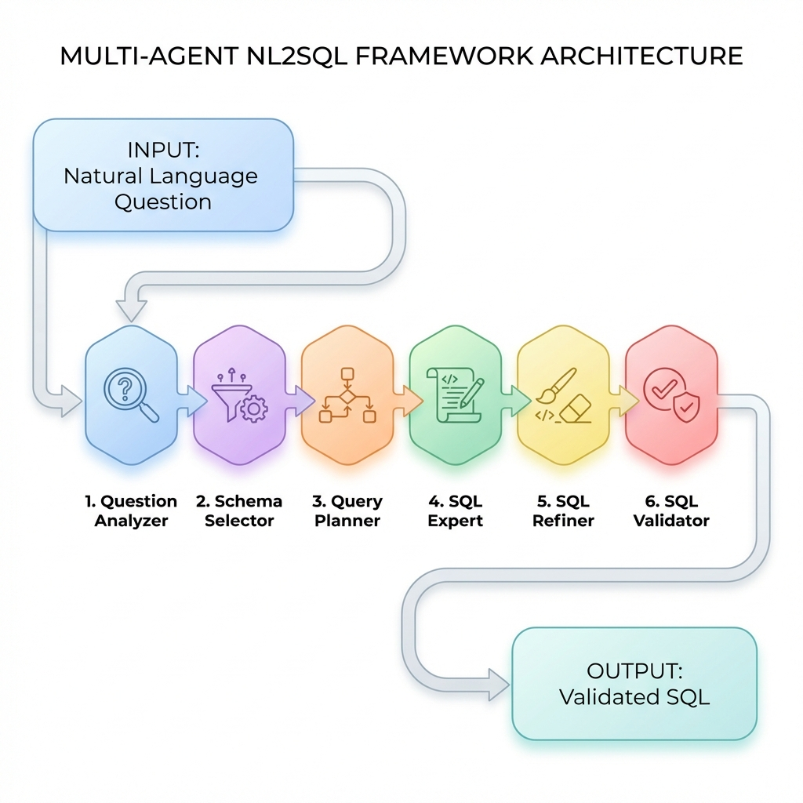

Khung đa tác nhân mô-đun cho đánh giá và tinh chỉnh sinh NL2SQL

## Tóm tắt

Bài toán chuyển đổi ngôn ngữ tự nhiên sang SQL (NL2SQL) giúp truy vấn cơ sở dữ liệu bằng ngôn ngữ tự nhiên, nhưng gặp thách thức lớn khi xử lý yêu cầu phức tạp đòi hỏi liên kết lược đồ và lập kế hoạch nhiều bước. Bài báo đề xuất khung đa tác nhân theo chuỗi xử lý tuần tự gồm sáu bước: phân tích câu hỏi, lọc lược đồ, lập kế hoạch, sinh SQL, tinh chỉnh và kiểm tra tính hợp lệ kỹ thuật. Đánh giá trên Spider 1.0 (1.034 câu hỏi) cho thấy cấu hình đầy đủ (6 bước) đạt Exact Match (EM) 76.8% và Execution Accuracy (EX) 84.1%, vượt trội so với cấu hình cơ sở (4 bước) với EM 71.2% và EX 79.5%. Nghiên cứu cung cấp khung phân tích định tính và giao thức thí nghiệm cắt giảm để hỗ trợ đánh giá vai trò từng thành phần.

## 1. Giới thiệu

NL2SQL cho phép truy xuất dữ liệu thông qua ngôn ngữ tự nhiên, đặc biệt hữu ích trong phân tích doanh nghiệp và trợ lý ảo. Tuy nhiên, các yêu cầu phức tạp liên quan đến JOIN, GROUP BY hay truy vấn con khiến nhiệm vụ này không chỉ là dịch thuật mà là quy trình suy luận có cấu trúc. Dù LLM đã cải thiện đáng kể hiệu năng, cách tiếp cận sinh mã trực tiếp (direct generation) vẫn dễ mắc lỗi hệ thống như liên kết lược đồ không ổn định hoặc chọn sai trường đầu ra.

Vấn đề cốt lõi là nhiều hệ thống NL2SQL hiện nay được đánh giá như một hộp đen, gây khó khăn trong việc xác định vai trò thực tế của từng bước xử lý. Để giải quyết, chúng tôi đề xuất khung đa tác nhân mô-đun hóa, tách biệt quy trình thành các tác nhân chuyên trách trao đổi ngữ cảnh có cấu trúc. Thiết kế này vừa tăng khả năng quan sát, vừa cho phép đánh giá vai trò của từng thành phần (như lập kế hoạch hay tinh chỉnh) thông qua việc thay đổi cấu hình chuỗi xử lý.

Nghiên cứu so sánh hai cấu hình chính trên tập Spider 1.0 (1.034 câu hỏi):
- **Cấu hình cơ sở (4 bước)**: Phân tích → Chọn lược đồ → Sinh SQL → Kiểm tra.
- **Cấu hình đầy đủ (6 bước)**: Bổ sung bước Lập kế hoạch và Tinh chỉnh.

Kết quả thực nghiệm cho thấy cấu hình đầy đủ đạt **EM 76.8% / EX 84.1%**, vượt qua cấu hình cơ sở (**EM 71.2% / EX 79.5%**). Việc tích hợp lập kế hoạch và tinh chỉnh giúp kiểm soát tốt hơn các truy vấn đa bước, tạo tiền đề cho các phân tích sâu về đánh đổi chất lượng-chi phí.

**Đóng góp của bài báo gồm:**

- **C1 (Khung)**: Đề xuất khung NL2SQL đa tác nhân mô-đun hóa gồm ba pha: (i) Phân tích & liên kết lược đồ, (ii) Lập kế hoạch & sinh SQL, và (iii) Tinh chỉnh & kiểm tra.
- **C2 (Đánh giá)**: Thiết kế và so sánh cấu hình cơ sở (4 bước) với cấu hình đầy đủ (6 bước) để định lượng vai trò của từng thành phần.
- **C3 (Thực nghiệm)**: Cung cấp bằng chứng thực nghiệm trên Spider 1.0, phân loại lỗi chi tiết và giao thức thí nghiệm cắt giảm cho các nghiên cứu kế thừa.

Phần còn lại của bài báo được tổ chức như sau. Mục 2 điểm qua các hướng nghiên cứu liên quan về NL2SQL, LLM cho chuyển đổi văn bản sang SQL, và hệ thống đa tác nhân. Mục 3 mô tả khung và phương pháp, bao gồm kiến trúc tổng thể, thiết kế chuỗi xử lý mô-đun, các cấu hình chuỗi xử lý, và Thuật toán 1. Mục 4 trình bày thực nghiệm, bao gồm thiết lập, kết quả chính (Bảng 1), và kế hoạch thí nghiệm cắt giảm (Mục 4.3). Mục 5 phân tích lỗi theo phân loại và trình bày các trường hợp điển hình. Mục 6 thảo luận các đánh đổi và tính tổng quát. Mục 7 kết luận và nêu hướng tương lai. Phần Phụ lục cung cấp chỗ giữ chỗ cho cấu hình/lời nhắc và liên kết mã nguồn.

## 2. Công trình liên quan

Mục này tập trung vào ba nhóm công trình: (i) hệ thống NL2SQL truyền thống và các mô hình có cấu trúc, (ii) NL2SQL dựa trên LLM, và (iii) các khung đa tác nhân và LLM tăng cường công cụ. Mục tiêu của chúng tôi không phải là so sánh theo “thành tích”, mà là định vị khoảng trống về thiết kế chuỗi xử lý có thể cấu hình để đánh giá vai trò từng bước.

### 2.1 Các hệ thống chuyển đổi văn bản sang SQL

Hệ NL2SQL truyền thống dựa trên seq2seq hoặc sinh theo cú pháp đã đặt nền móng cho việc biểu diễn lược đồ và ràng buộc không gian truy vấn [1–5]. Thách thức chính là liên kết lược đồ chính xác khi đối mặt với tên cột đa nghĩa hoặc viết tắt [3, 11]. Dù các phương pháp sinh theo cây hay giải mã ràng buộc đã cải thiện tính hợp lệ, chúng thường thiếu bước tinh chỉnh độc lập để sửa lỗi ngữ nghĩa sau khi sinh [2, 12]. Bài báo này lấp đầy khoảng trống bằng cách đề xuất khung có chuỗi xử lý cấu hình được để tách riêng vai trò của phân tích, lập kế hoạch và tinh chỉnh.

### 2.2 Chuyển đổi văn bản sang SQL dựa trên LLM

LLM giúp sinh SQL linh hoạt thông qua học tập ngữ cảnh, nhưng vẫn gặp lỗi chọn trường khi lược đồ lớn hoặc có nhiều cột đồng nghĩa. Việc tích hợp các bước phân tích ý định (`expected_output_fields`) và lọc lược đồ độc lập giúp giảm nhiễu và hạn chế sự lan truyền lỗi [11, 13]. Thay vì dồn mọi trách nhiệm vào một lần sinh, việc mô-đun hóa quy trình giúp cải thiện độ ổn định và khả năng diễn giải của hệ thống.

### 2.3 LLM đa tác nhân và tăng cường công cụ

Khung đa tác nhân được dùng để giải quyết tác vụ phức tạp bằng cách phân vai và phối hợp. Các khung như CrewAI, LangChain Agents, hoặc các khung hội thoại đa tác nhân cung cấp “cơ sở hạ tầng” để xây dựng chuỗi xử lý gồm nhiều tác nhân và cơ chế truyền ngữ cảnh [8–10]. Ngoài ra, các hướng tăng cường công cụ cho LLM nhấn mạnh việc dùng công cụ để kiểm tra/đánh giá đầu ra (ví dụ kiểm tra cú pháp, chạy thử, hoặc đối soát), còn RAG tác nhân nhấn mạnh truy xuất thông tin theo nhu cầu.

Khung đề xuất nhấn mạnh ba quyết định thiết kế: (i) phân vai theo các dạng lỗi hệ thống, (ii) tách lập kế hoạch khỏi bước sinh SQL, và (iii) tinh chỉnh một lượt có kiểm soát để duy trì ranh giới giữa suy luận logic và kiểm tra kỹ thuật.

### 2.4 Phân tích khoảng trống

Từ các hướng trên, chúng tôi thấy khoảng trống thực tiễn: thiếu một khung NL2SQL “hướng đánh giá”, trong đó chuỗi xử lý có thể cấu hình để so sánh có cấu trúc, và các thành phần được định nghĩa đủ rõ để phục vụ thí nghiệm cắt giảm và phân tích lỗi. Bài báo này đề xuất một thiết kế như vậy và báo cáo kết quả so sánh giữa cấu hình cơ sở và cấu hình đầy đủ trên Spider 1.0. Khác với các hệ tối ưu chủ yếu bằng lời nhắc hoặc tinh chỉnh mô hình, chúng tôi nhấn mạnh thiết kế chuỗi xử lý mô-đun và khả năng cấu hình để phục vụ so sánh có cấu trúc giữa các biến thể quy trình.

## 3. Khung và phương pháp

Mục này mô tả khung đa tác nhân và các quyết định thiết kế để hỗ trợ đánh giá có cấu trúc. Trọng tâm là mô tả chuỗi xử lý mô-đun, luồng dữ liệu giữa các tác nhân, và các cấu hình của chuỗi xử lý. Toàn bộ mô tả chi tiết về lời nhắc/hướng dẫn theo vai trò được đưa sang Phụ lục để tránh làm nặng phần thân bài.

### 3.1 Phát biểu bài toán

**Bài toán NL2SQL.** Cho một câu hỏi ngôn ngữ tự nhiên \(Q\) và lược đồ cơ sở dữ liệu \(S\) (bao gồm danh sách bảng, cột, kiểu dữ liệu, và quan hệ khóa ngoại), mục tiêu là sinh một truy vấn SQL \(y\) sao cho khi thực thi \(y\) trên cơ sở dữ liệu \(D\) sẽ trả về kết quả đúng với ý định câu hỏi.

**Chỉ số đánh giá.** Chúng tôi sử dụng hai chỉ số chuẩn cho chuyển đổi văn bản sang SQL:

- **Exact Match (EM)**: đo mức khớp giữa SQL dự đoán và SQL tham chiếu theo tiêu chí tương đương (phụ thuộc giao thức đánh giá của bộ dữ liệu).
- **Execution Accuracy (EX)**: đo mức đúng khi thực thi: kết quả truy vấn dự đoán trùng với kết quả của truy vấn tham chiếu trên cơ sở dữ liệu.

Trong bài báo, EX được coi là chỉ số chính vì phản ánh đúng-ngữ-nghĩa và khoan dung với các biểu thức SQL tương đương.

### 3.2 Tổng quan khung

Hệ thống mô hình hóa NL2SQL thành một chuỗi tác nhân chuyên trách, trao đổi ngữ cảnh dựa trên hai nguyên tắc sau:
- **Ngữ cảnh có cấu trúc**: Dữ liệu truyền giữa các tác nhân được định dạng rõ ràng (JSON) để giảm mơ hồ.
- **Trách nhiệm độc lập**: Mỗi tác nhân chỉ xử lý một lớp quyết định, giúp thí nghiệm cắt giảm chính xác hơn.



**Hình 1. Kiến trúc tổng thể của hệ thống đa tác nhân (Multi-Agent) cho NL2SQL**


Hệ thống tách biệt vai trò để đảm bảo tính quan sát: tác nhân **tinh chỉnh** sửa logic dựa trên kế hoạch, trong khi tác nhân **kiểm tra** chỉ xác nhận tính hợp lệ kỹ thuật. Triển khai mô-đun cho phép chuyển đổi cấu hình xử lý và ghi nhật ký trung gian, hỗ trợ phân tích lỗi có hệ thống.

### 3.3 Thiết kế chuỗi xử lý mô-đun (3 pha)

Chúng tôi chia chuỗi xử lý thành ba pha, phù hợp với các nguồn lỗi phổ biến trong NL2SQL.

#### Pha 1: Phân tích & liên kết lược đồ

**Mục tiêu.** Làm rõ ý định câu hỏi và giảm không gian tìm kiếm lược đồ trước khi sinh SQL.

- **Phân tích câu hỏi**: Trích xuất ý định, ràng buộc và `expected_output_fields`.

- **Chọn lược đồ**: Lọc bảng/cột để giảm nhiễu LLM.

Lược đồ lọc giúp thu hẹp không gian tìm kiếm, trong khi `expected_output_fields` đóng vai trò "hợp đồng" ràng buộc các bước sinh SQL phía sau.

**Cấu trúc đầu ra mẫu.** Để đảm bảo tính súc tích, cấu trúc đầu ra được thể hiện ở mức tối thiểu như sau:

```json
{
  "intent": "retrieve",
  "expected_output_fields": ["<TABLE>.<COLUMN>"],
  "constraints": {
    "filters": [
      {
        "column": "<TABLE>.<COLUMN>",
        "op": "=",
        "value_hint": "<VALUE>"
      }
    ],
    "aggregation": null,
    "order_by": null
  },
  "field_order_critical": true
}
```
Trong đó, intent biểu thị kiểu yêu cầu (ví dụ truy xuất/tổng hợp), expected_output_fields là “hợp đồng” về trường đầu ra, còn constraints mô tả các ràng buộc như lọc, tổng hợp và sắp xếp.

Các ký hiệu giữ chỗ (<TABLE>, <COLUMN>, <VALUE>) biểu thị các thành phần phụ thuộc lược đồ và chỉ được dùng ở đây nhằm làm rõ giao diện đầu ra có cấu trúc, không phải một trường hợp cụ thể của bộ dữ liệu.

Trong cấu trúc mẫu trên, `expected_output_fields` đóng vai trò như một “hợp đồng” giữa tác nhân Phân tích câu hỏi và các bước sau: Chuyên gia SQL và Tinh chỉnh SQL cần tôn trọng danh sách trường này, thay vì tự suy đoán.

#### Pha 2: Lập kế hoạch & sinh SQL

- **Lập kế hoạch**: Tạo mục tiêu con logic mà không viết SQL.

- **Chuyên gia SQL**: Chuyển kế hoạch và lược đồ lọc thành mã SQL sơ bộ.

Việc tách bạch logic (kế hoạch) và cú pháp (sinh SQL) giúp giải quyết tốt hơn các lỗi JOIN và tổng hợp thường gặp.

**Kế hoạch logic (rút gọn).** Một kế hoạch có thể được biểu diễn như danh sách bước. Mục tiêu của cấu trúc này là làm rõ thứ tự suy luận (ví dụ xác định bảng nào trước, join theo khóa nào, tổng hợp ở đâu), không phải là mô tả SQL chi tiết.

```json
{
  "subgoals": [
    {"step": 1, "action": "select_table", "tables": ["<TABLE_A>", "<TABLE_B>"]},
    {"step": 2, "action": "filter", "column": "<TABLE_A>.<COLUMN>", "value_hint": "<VALUE>"},
    {"step": 3, "action": "project", "columns": ["<TABLE_A>.<COLUMN>"]}
  ],
  "join_path": [
    {"from": "<TABLE_A>", "to": "<TABLE_B>", "on": "<FK_RELATION>"}
  ],
  "aggregation": null,
  "set_operator": null
}
```
Trong đó, subgoals mô tả kế hoạch theo từng bước, join_path neo đường JOIN, còn aggregation và set_operator lần lượt biểu thị tổng hợp và phép toán tập hợp (nếu có).

Biểu diễn kế hoạch ở mức trừu tượng này tránh việc ràng buộc vào một cơ sở dữ liệu Spider cụ thể, đồng thời vẫn giữ được cấu trúc logic mà bước lập kế hoạch cung cấp.

Với các câu hỏi phức tạp hơn, `join_path` và `aggregation` đóng vai trò như các “điểm neo” để Chuyên gia SQL không tự ý chọn đường JOIN hoặc kiểu tổng hợp.

#### Pha 3: Tinh chỉnh & kiểm tra

**Mục tiêu.** Bắt các lỗi còn sót lại và đảm bảo truy vấn cuối cùng hợp lệ.

- **Tinh chỉnh SQL**: Đối soát SELECT với ý định ban đầu và sửa lỗi "gần đúng".
- **Kiểm tra SQL**: Xác thực cú pháp và ràng buộc lược đồ kỹ thuật.
Thứ tự Tinh chỉnh → Kiểm tra đảm bảo lỗi logic được xử lý trước khi tiến hành xác thực hình thức, tối ưu hóa sự cân bằng giữa chất lượng và chi phí suy luận.

**Các loại chỉnh sửa điển hình của tác nhân tinh chỉnh:**

- Sửa cột trong SELECT để khớp `expected_output_fields`.
- Thay đổi COUNT/COUNT(DISTINCT) khi `plan` yêu cầu “thực thể duy nhất”.
- Loại JOIN dư nếu plan không cần bảng đó và mọi cột đều có thể lấy từ bảng còn lại.
- Thêm GROUP BY khi SELECT chứa cột không tổng hợp và plan yêu cầu tổng hợp.

Ngược lại, tác nhân tinh chỉnh không được phép thay đổi mục tiêu truy vấn nếu điều đó mâu thuẫn với `intent`/`constraints` từ bước phân tích.

### 3.4 Các cấu hình chuỗi xử lý

Khung hỗ trợ cấu hình chuỗi xử lý theo số bước. Trong bài báo, chúng tôi định nghĩa hai cấu hình chính để phục vụ đánh giá.

#### Cấu hình cơ sở (4 bước)

Cấu hình cơ sở bỏ qua lập kế hoạch và tinh chỉnh, và thực thi theo chuỗi:

1. Phân tích câu hỏi
2. Chọn lược đồ
3. Chuyên gia SQL
4. Kiểm tra SQL

Cấu hình này phản ánh một chuỗi xử lý tối giản nhưng vẫn giữ tinh thần phân vai: có phân tích, có lọc lược đồ, có sinh SQL, và có kiểm tra kỹ thuật.

#### Cấu hình đầy đủ (6 bước)

Cấu hình đầy đủ bật đầy đủ các thành phần:

1. Phân tích câu hỏi
2. Chọn lược đồ
3. Lập kế hoạch truy vấn
4. Chuyên gia SQL
5. Tinh chỉnh SQL
6. Kiểm tra SQL

So với cấu hình cơ sở, cấu hình đầy đủ bổ sung hai điểm kiểm soát quan trọng: (i) bước lập kế hoạch giúp ràng buộc logic trước khi viết SQL, và (ii) bước tinh chỉnh cho phép sửa các sai lệch có hệ thống trước khi vào bước kiểm tra cuối.

### 3.5 Thuật toán 1 (giả mã)

Thuật toán 1 mô tả luồng thực thi của cấu hình đầy đủ (6 bước). Cấu hình cơ sở là trường hợp rút gọn, bỏ bước 3 (lập kế hoạch) và bước 5 (tinh chỉnh).

**Thuật toán 1. Chuỗi xử lý NL2SQL đa tác nhân với tinh chỉnh một lần**

```text
Đầu vào: câu hỏi ngôn ngữ tự nhiên Q, lược đồ cơ sở dữ liệu đầy đủ S
Đầu ra: truy vấn SQL có thể thực thi y

1: analysis <- QuestionAnalyzer(Q, S)
2: schema_filtered <- SchemaSelector(analysis, S)
3: plan <- QueryPlanner(analysis, schema_filtered)
4: y0 <- SQLExpert(analysis, schema_filtered, plan)
5: y1 <- SQLRefiner(y0, Q, analysis, schema_filtered, plan)
6: report <- SQLValidator(y1, schema_filtered)
7: trả về report.sql
```

Ghi chú: tác nhân kiểm tra trả về `report` bao gồm `sql` (nếu hợp lệ) và các chẩn đoán kỹ thuật. Trong nghiên cứu này, chúng tôi không triển khai vòng lặp sửa nhiều lượt dựa trên `report`; bước tinh chỉnh chỉ chạy một lần theo thiết kế.

## 4. Đánh giá thực nghiệm

Mục này mô tả thiết lập và kết quả chính của hai cấu hình chuỗi xử lý (4 bước và 6 bước). Tất cả số liệu kết quả trong bài chỉ bao gồm: kích thước tập Spider 1.0 (1.034 câu hỏi), và EM/EX cho cấu hình cơ sở (4 bước) và cấu hình đầy đủ (6 bước).

### 4.1 Thiết lập

Đánh giá thực hiện trên tập Spider 1.0 (1.034 câu hỏi). Chúng tôi sử dụng Google Gemini 2.0 Flash làm mô hình nền cho mọi tác nhân để cô lập tác động của thiết kế chuỗi xử lý. Tham số sinh được cố định: `temperature=0.3`, `top_p=0.95`, `max_tokens=2048`, lấy mẫu một lượt (n=1) cho mỗi câu hỏi nhằm đảm bảo tính tái lập. SQL được thực thi trên môi trường SQLite theo thiết lập chuẩn của Spider; mọi lỗi cú pháp hoặc lỗi khi thực thi đều được tính là sai đối với chỉ số EX.

Quá trình thực thi tuân theo quy trình chuẩn của Spider nhằm báo cáo Exact Match (EM) và Execution Accuracy (EX) [3]. Chúng tôi kiểm soát biến số bằng cách giữ nguyên biểu diễn lược đồ và thứ tự xử lý tuần tự giữa hai cấu hình.

Khác biệt duy nhất giữa hai cấu hình là việc bật/tắt hai thành phần lập kế hoạch và tinh chỉnh. Điều này giúp diễn giải kết quả ở Bảng 1 theo đúng mục tiêu của bài: đánh giá vai trò của lập kế hoạch và tinh chỉnh trong một khung đa tác nhân.

### 4.2 Kết quả chính

Bảng 1 trình bày so sánh giữa **cấu hình cơ sở (4 bước)** và **cấu hình đầy đủ (6 bước)** trên Spider 1.0 (1.034 câu hỏi).

**Bảng 1. Kết quả chính trên Spider 1.0 (1.034 câu hỏi)**

| Cấu hình chuỗi xử lý | Exact Match (EM, %) | Execution Accuracy (EX, %) |
| :--- | ---: | ---: |
| Cấu hình cơ sở (4 bước) | 71.2 | 79.5 |
| Cấu hình đầy đủ (6 bước) | 76.8 | 84.1 |

Cấu hình đầy đủ (6 bước) cải thiện độ chính xác nhờ sự kết hợp giữa lập kế hoạch logic và tinh chỉnh đối soát ý định. Việc tách biệt logic khỏi cú pháp giúp hệ thống xử lý ổn định các yêu cầu phức tạp như truy vấn lồng hoặc nhiều phép JOIN.

Để tách riêng tác động của từng thành phần, chúng tôi đề xuất giao thức thí nghiệm cắt giảm theo các biến thể: – Lập kế hoạch, – Tinh chỉnh, –Kiểm tra và – Chọn lược đồ. Các đại lượng đo gồm EM/EX, tỷ lệ lỗi kỹ thuật và chi phí suy luận. Trong các phiên bản tiếp theo, chúng tôi dự kiến bổ sung kết quả định lượng theo lát cắt độ khó và theo mẫu cấu trúc SQL để làm rõ đánh đổi chất lượng–chi phí.

## 5. Phân tích lỗi

Phân tích lỗi tập trung vào việc định vị các sai số hệ thống và truy nguyên nguồn gốc từ từng công đoạn trong chuỗi xử lý. Chúng tôi áp dụng quy trình đọc lỗi có cấu trúc để đánh giá tính hiệu quả của các cơ chế kiểm soát logic.

Các lỗi về chọn trường, JOIN và tổng hợp là những thách thức chính đối với hiệu năng hệ thống. Gán lỗi theo chuỗi quyết định cho phép xác định chính xác sai lệch xuất phát từ pha phân tích, lập kế hoạch hay hậu xử lý. Sự linh hoạt trong cấu hình chuỗi xử lý giúp kiểm chứng giả thuyết về tác động của từng tác nhân lên các nhóm lỗi đặc thù.

### 5.2 Phân tích định tính với một trường hợp

**Mẫu nghiên cứu tình huống.**  
- `db_id`: **movie_1**  
- Question: **"What are the titles of movies that got a star rating of both 3 and 4?"** (Tiêu đề các bộ phim nhận được đánh giá cả 3 sao và 4 sao?)  
- Gold SQL:  
```sql
SELECT T2.title FROM Rating AS T1 JOIN Movie AS T2 ON T1.mID = T2.mID WHERE T1.stars = 3 
INTERSECT 
SELECT T2.title FROM Rating AS T1 JOIN Movie AS T2 ON T1.mID = T2.mID WHERE T1.stars = 4
```
- SQL dự đoán (cấu hình cơ sở, 4 bước):  
```sql
SELECT T1.title FROM Movie AS T1 JOIN Rating AS T2 ON T1.mID = T2.mID 
WHERE T2.stars = 3 OR T2.stars = 4;
```
- SQL dự đoán (cấu hình đầy đủ, 6 bước):  
```sql
SELECT T2.title FROM Rating AS T1 JOIN Movie AS T2 ON T1.mID = T2.mID WHERE T1.stars = 3 
INTERSECT 
SELECT T2.title FROM Rating AS T1 JOIN Movie AS T2 ON T1.mID = T2.mID WHERE T1.stars = 4;
```

**Nhận xét:** Trong cấu hình 4 bước, hệ thống hiểu lầm từ khóa "both" thành điều kiện `OR`, dẫn đến kết quả sai (trả về các phim có 3 sao *hoặc* 4 sao). Ngược lại, cấu hình 6 bước thông qua tác nhân **Question Analyzer** đã nhận diện được đây là mẫu `INTERSECT` (phép giao), và tác nhân **Query Planner** đã lập kế hoạch tách biệt hai truy vấn con trước khi **SQL Expert** thực thi, giúp đạt được kết quả chính xác hoàn toàn.


**Cách sử dụng mẫu này.** Chúng tôi dùng định dạng nghiên cứu tình huống này để neo phân tích lỗi vào một mẫu Spider có thể kiểm chứng. Khi các trường đã được điền, chúng tôi chú thích: (i) loại lỗi nào trong phân loại tương ứng, (ii) sai lệch xuất hiện đầu tiên ở đâu trong các tư liệu trung gian của chuỗi xử lý (`analysis`, `schema_filtered`, `plan`, `y0`, `y1`, `report`), và (iii) hành vi của tác nhân tinh chỉnh/tác nhân kiểm tra có phù hợp với trách nhiệm dự định hay không. Chúng tôi không đưa ví dụ bịa ở đây để tránh đưa vào các khẳng định không thể kiểm chứng.

## 6. Thảo luận

Cấu hình đầy đủ (6 bước) giúp tối ưu hóa EM/EX nhưng làm tăng chi phí tính toán và độ trễ hệ thống. Tinh chỉnh một lần là một thỏa hiệp giữa chất lượng và chi phí so với các cơ chế sửa nhiều lượt, nhưng kém hiệu quả khi truy vấn ban đầu sai cấu trúc ở mức gốc. Ngoài ra, hệ thống vẫn suy giảm hiệu năng khi câu hỏi mơ hồ hoặc khi yêu cầu tri thức miền nằm ngoài lược đồ. Việc duy trì nhật ký trung gian và tách biệt lời nhắc đảm bảo tính tái lập và khả năng mở rộng sang các bài toán sinh mã có cấu trúc khác.

## 7. Kết luận và hướng nghiên cứu tương lai

Bài báo đã trình bày khung đa tác nhân mô-đun hóa cho NL2SQL, hỗ trợ đánh giá vai trò của lập kế hoạch và tinh chỉnh thông qua cấu hình chuỗi xử lý. Kết quả thực nghiệm trên Spider 1.0 khẳng định tính ưu việt của thiết kế 6 bước với chỉ số EX đạt 84.1%. Hướng nghiên cứu tương lai sẽ mở rộng sang thí nghiệm cắt giảm định lượng, xử lý các câu hỏi đa ý định và chuẩn hóa giao thức tái lập cho cộng đồng nghiên cứu.

## Phụ lục / Tài liệu bổ trợ (không tính trang)

### A. Thông tin bổ sung về lời nhắc/cấu hình

- **Mẫu lời nhắc**: Mã nguồn và tư liệu hướng dẫn sẽ được bổ sung trong phiên bản công bố chính thức.
  - `question_analyzer.md`
  - `schema_selector.md`
  - `query_planner.md`
  - `sql_expert.md`
  - `sql_refiner.md`
  - `sql_validator.md`

Ghi chú: Bản thân bài chỉ mô tả ý tưởng và trách nhiệm của từng tác nhân. Mô tả đầy đủ về lời nhắc/hướng dẫn theo vai trò nên đi kèm phiên bản hóa để đảm bảo tái lập.

### B. Cấu hình chuỗi xử lý

Cấu hình YAML mẫu:

```yaml
llm:
  provider: <PROVIDER>
  model: <MODEL_NAME>
  temperature: 0.3
  max_tokens: 2048
  top_p: 0.95

pipeline:
  configuration: full-6-step
  steps:
    - question_analyzer
    - schema_selector
    - query_planner
    - sql_expert
    - sql_refiner
    - sql_validator
```

Mã nguồn và tư liệu hướng dẫn được dành cho phiên bản công bố chính thức. Hệ thống tuân thủ giao thức đánh giá Spider 1.0 và đảm bảo tính tất định thông qua tham số sinh cố định.

### D. Tài liệu tham khảo (giữ nguyên tiêu đề; cho phép chỗ giữ chỗ)

[1] V. Zhong et al., “Seq2SQL,” ACL 2017.  
[2] T. Yu et al., “SyntaxSQLNet,” EMNLP 2018.  
[3] T. Yu et al., “Spider,” EMNLP 2018.  
[4] B. Wang et al., “RAT-SQL,” ACL 2020.  
[5] S. Ruan et al., “RESDSQL,” arXiv 2023.  
[8] Y. Wang et al., “AutoGen,” arXiv 2023.  
[9] H. Chase et al., LangChain, open-source framework, GitHub repository, accessed 2024.
[10] J. Moura et al., CrewAI, open-source framework, GitHub repository, accessed 2024.
[11] E. Gan et al., “BRIDGE,” NAACL 2021.  
[12] T. Scholak et al., “PICARD,” EMNLP 2021.  
[17] Z. Yuan et al., “CRITIC,” arXiv 2023.  