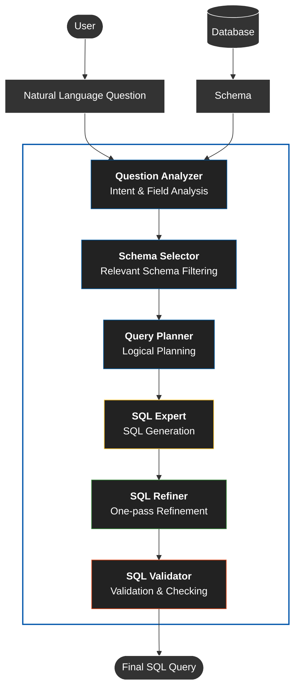
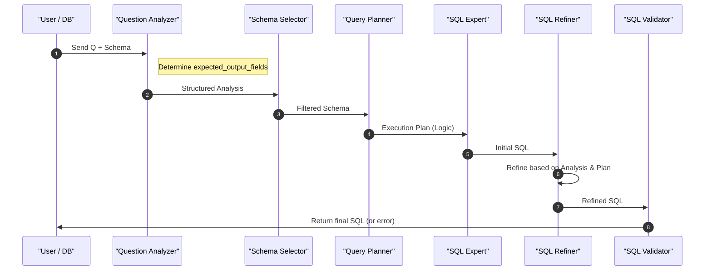
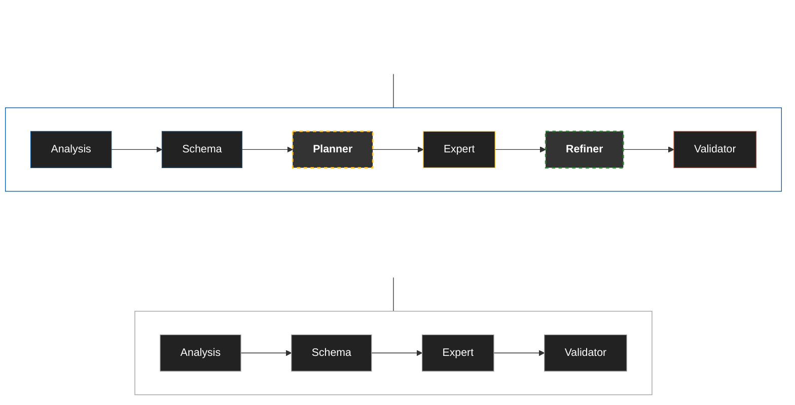

# Natural Language to SQL Using a Multi-Agent System

### Abstract

Natural Language to SQL (NL2SQL) is an important yet challenging task, particularly when questions require multi-step reasoning, accurate schema understanding, and complex SQL constructs such as joins, aggregations, or nested queries. Although large language models have significantly improved SQL generation quality, current systems still frequently struggle with intermediate decision-making steps such as selecting the correct output fields, identifying relevant tables, and planning query structure. In this paper, we propose a six-step LLM-based multi-agent architecture for NL2SQL, consisting of Question Analysis, Schema Selection, Query Planning, SQL Generation, SQL Refinement, and SQL Validation. The proposed architecture decomposes the reasoning process into specialized agents, each responsible for a specific subtask, in order to reduce error propagation during query generation.

The system is evaluated on the Spider 1.0 development set, a standard benchmark for cross-domain Text-to-SQL. We report two main metrics: Exact Match (EM) and Execution Accuracy (EX). Experimental results show that the proposed 6-step configuration achieves **77.8% Exact Match (EM)** and **85.6% Execution Accuracy (EX)**, outperforming a reduced 4-step configuration that achieves **73.7% EM** and **81.2% EX** under the same evaluation setting. Additional analysis indicates that the planning and refinement components play a critical role in reducing field selection errors, join errors, and aggregation errors. These results indicate that agent-based reasoning decomposition is an effective strategy for improving both the robustness and controllability of NL2SQL systems.

**Keywords:** Text-to-SQL; NL2SQL; multi-agent architecture; large language models; Spider benchmark.

## 1. Introduction

### 1.1 Overview
Natural Language to SQL (NL2SQL) refers to the task of translating a natural language question into an executable SQL query over a structured database. This task is practically important because it enables non-expert users to access data without writing queries manually. However, NL2SQL is not merely a syntax generation problem. It also requires a system to correctly understand user intent, identify relevant tables and columns, and construct a query structure that is consistent with the database schema.

Although large language model-based systems have substantially improved Text-to-SQL performance, many important errors still occur on difficult queries. Common errors include selecting incorrect fields in the `SELECT` clause, inferring incorrect relations between tables, constructing invalid join paths, or misrepresenting aggregation and nested-query logic. These limitations suggest that a single agent often bears too many reasoning decisions at once, especially on cross-domain benchmarks such as Spider.

From this perspective, this study approaches NL2SQL as a task that should be decomposed into specialized reasoning stages. Built on CrewAI [10], we construct a six-step LLM-based multi-agent architecture in which each component serves a distinct role: question analysis, schema selection, query planning, SQL generation, SQL refinement, and SQL validation. This design aims to reduce the cognitive burden on a single model, improve local error control, and create explicit intermediate checkpoints before producing the final query.

This study investigates the hypothesis that decomposing reasoning into specialized agents can improve the robustness of NL2SQL systems. Results on the Spider 1.0 development set show that the 6-step configuration achieves **77.8%** Exact Match and **85.6%** Execution Accuracy, outperforming the reduced 4-step configuration under the same evaluation setting. These results indicate that adding planning and refinement components plays a substantive role in improving query quality.

The main contributions of this paper are as follows:

- Proposing a 6-step multi-agent architecture for the NL2SQL task.
- Decomposing reasoning into specialized agents.
- Conducting experiments on the Spider 1.0 development set.
- Providing ablation analysis to demonstrate the role of each component.

### 1.2 Paper Organization
The remainder of this paper is organized as follows. Section 2 reviews related work. Section 3 presents the methodology and system architecture. Section 4 describes the experimental setup. Section 5 reports the main results. Section 6 presents the ablation study. Section 7 provides error analysis. Section 8 describes implementation details. Section 9 discusses efficiency trade-offs. Finally, Section 10 concludes the paper and outlines future directions.

## 2. Related Work

### 2.1 Classical Text-to-SQL Models
Early Text-to-SQL research primarily relied on sequence-to-sequence architectures or structured decoders to generate SQL queries directly from natural language questions. Approaches such as Seq2SQL [1], SyntaxSQLNet [2], and other contemporaneous models laid the foundation for the task by learning mappings from natural language to query representations. As more complex benchmarks such as Spider [3] were introduced, classical models increasingly shifted their focus toward cross-domain generalization and multi-table query handling.

Subsequent approaches such as RAT-SQL [4], BRIDGE [11], RESDSQL [5], and schema-aware directions such as IRNet emphasized the role of schema linking and relational representations between questions and database structure. These advances substantially improved performance on Spider, yet most of them still relied on a centralized reasoning flow in which question understanding, output column selection, and query structure construction were integrated into a single generation process. In addition, PICARD [12] showed that constraining the decoding process can reduce syntactic errors in Text-to-SQL, highlighting that system accuracy depends not only on question understanding but also on output control during query generation.

### 2.2 LLM-Based Text-to-SQL Approaches
The emergence of large language models has significantly expanded the capability of Text-to-SQL systems through few-shot prompting, in-context learning, and self-correction strategies. GPT-based approaches [13], DIN-SQL [6], and DAIL-SQL [7] show that a strong language model can achieve competitive results without a specialized decoder in the traditional sense. However, even in LLM-based systems, errors related to field selection, join identification, and aggregation interpretation still arise, particularly when questions require multi-step reasoning.

An important limitation of these systems is that most intermediate decisions are still made within a single reasoning pass. As a result, when the model misinterprets one local component, such as an output column or a join path, the entire query can become incorrect even if the rest of the structure is otherwise plausible.

### 2.3 Reasoning Decomposition, Chain-of-Thought, and Multi-Agent Approaches
Beyond direct SQL generation, another line of work focuses on making intermediate reasoning more explicit through chain-of-thought, decomposition, or self-reflection. Mechanisms such as Reflexion [16] and CRITIC [17] show that model outputs can improve if an additional critique or correction stage is introduced. Meanwhile, frameworks such as AutoGen [8], LangChain [9], and CrewAI [10] enable complex tasks to be decomposed into multiple specialized collaborating agents.

However, most current multi-agent architectures are developed for general-purpose tasks and are not specifically designed for the constraints of NL2SQL. This study is positioned at the intersection of Text-to-SQL and multi-agent reasoning: rather than using a single LLM to generate SQL directly, we organize query generation into six explicitly defined steps to better control field selection errors, join errors, and structural query errors.

## 3. Methodology

### 3.1 Overview
As shown in Figure 1, our LLM-based multi-agent architecture for Natural Language to SQL (NL2SQL) leverages the CrewAI framework to orchestrate six specialized agents working collaboratively. The proposed system consists of six sequential agents:

1. Question Analysis
2. Schema Selection
3. Query Planning
4. SQL Generation
5. SQL Refinement
6. SQL Validation

These agents operate in a sequential architecture in which each stage plays a specific role in query generation.

To provide a high-level view of the processing flow, the system pipeline can be represented in ASCII form as follows:

```text
User Question
      ↓
Question Analyzer
      ↓
Schema Selector
      ↓
Query Planner
      ↓
SQL Generator
      ↓
SQL Refiner
      ↓
SQL Validator
      ↓
Final SQL
```

**Figure 1: Multi-Agent System Architecture for NL2SQL**



The agent interaction flow is as follows. A natural language question is first processed by the Question Analyzer to identify intent and required fields. Next, the Schema Selector filters relevant tables and columns from the database schema. The Query Planner then produces a logical execution plan, followed by the SQL Expert, which generates the SQL query. The SQL Refiner subsequently reviews and refines the generated query, and finally, the SQL Validator checks the query for syntactic and technical correctness.

To assess the effect of architectural components, we compare two pipeline variants: a 4-step baseline pipeline (Question Analysis -> Schema Selection -> SQL Expert -> SQL Validator) and the full 6-step architecture that additionally includes Query Planning and SQL Refinement. This comparison allows us to evaluate the contribution of query planning and one-pass refinement to overall accuracy.

### 3.2 Six-Step Architecture Description
Table 1 summarizes the six main components of the system in terms of their inputs, outputs, and roles in the pipeline. This presentation clarifies that the proposed approach does not alter the final objective of the NL2SQL task, but instead changes how reasoning is organized so that each agent handles a specific decision subproblem.

| Component | Input | Output | Role |
| :--- | :--- | :--- | :--- |
| Question Analyzer | Natural language question, raw schema | Intent analysis, expected output fields | Identifies query requirements and output constraints |
| Schema Selector | Question analysis, raw schema | Filtered schema | Narrows the search space of relevant tables and columns |
| Query Planner | Question analysis, filtered schema | Intermediate query plan | Builds logical structure before SQL generation |
| SQL Generator | Question analysis, filtered schema, plan | Initial SQL | Converts the logical plan into SQL |
| SQL Refiner | Initial SQL, question, filtered schema, plan | Refined SQL | Corrects local errors and improves query stability |
| SQL Validator | Refined SQL, filtered schema | Final SQL or error report | Checks syntax, table/column names, and completeness |

*Table 1: Summary of the roles of the six agents in the proposed pipeline.*

### 3.3 Problem Formulation
The NL2SQL task can be formally defined as follows: given a natural language question Q and a database schema S, generate an executable SQL query such that executing the SQL on database D returns a result R that correctly answers Q. The input consists of a pair (Q, S), where Q is a natural language question and S = {T₁, T₂, ..., Tₙ} is a set of tables, each containing a set of columns. Each table Tᵢ has a schema defined by its columns Cᵢ = {c₁, c₂, ..., cₘ}, where columns may include constraints such as primary keys, foreign keys, and data types. The output is a syntactically and semantically correct SQL query that can be executed on D to retrieve the desired information.

To support diagnostic analysis, the paper introduces the **Field Selection Error Dominance (FSED)** metric. This is an auxiliary error analysis metric and not a standard Spider benchmark measure. It does not replace Exact Match or Execution Accuracy.

Formally, a **field selection error** is defined as a mismatch between the `SELECT` clause of the generated SQL and the gold SQL, evaluated at the `table.column` identity level while ignoring alias differences when aliases do not change semantics. FSED measures the proportion of failures caused by incorrect field selection among all execution failures. In other words, FSED answers whether field selection is the dominant source of error among failed queries. This metric is used for diagnostic analysis rather than for direct comparison with prior benchmark systems.

$$FSED = \frac{\text{Number of Field Selection Errors}}{\text{Total Execution Failures}}$$

In this study, field selection errors are detected by comparing the `SELECT` clause of the generated query with the gold query in Spider, using `table.column` matching while ignoring alias differences. FSED may be reported either as a ratio or as a percentage depending on the presentation context. The purpose of this metric is to clarify the design motivation for the agents responsible for planning and refinement.

**Notation:** Table 2 summarizes the symbols used in this paper.

| Symbol | Definition |
| :--- | :--- |
| Q | Natural language question |
| S | Database schema (set of tables) |
| SQL | Generated SQL query |
| D | Database instance |
| R | Query execution result |
| Tᵢ | Table i in the schema |
| Cᵢ | Set of columns for table Tᵢ |
| FSED | Field Selection Error Dominance |

*Table 2: Symbols used in the problem formulation and methodology.*

### 3.4 Implementation Details

The multi-agent architecture is implemented using a sequential prompting strategy. Each agent receives structured inputs consisting of: (1) the natural language question, (2) the relevant database schema, and (3) intermediate outputs from previous agents.

All models in the pipeline are executed with `temperature = 0` to ensure deterministic behavior across evaluation runs. The system is implemented on a modular agent framework, allowing each reasoning step to be executed independently and extended when needed.

### 3.5 Multi-Agent Architecture

#### 3.5.1 Question Analyzer Agent
The Question Analyzer serves as the first stage of the pipeline and is responsible for analyzing the natural language question to extract structured information that guides downstream agents. It takes the natural language question Q as input and produces a structured analysis containing several key components.

**Role and Input/Output:** The primary role of the Question Analyzer is to identify user intent and carefully analyze the fields required in the `SELECT` clause, directly addressing the field selection bottleneck that is a major source of system errors.

**Key Innovation:** The central innovation of the Question Analyzer is its focus on field selection analysis as a dedicated stage in the NL2SQL pipeline. Unlike traditional approaches that entangle field selection with SQL generation, our agent explicitly determines which columns must appear in the `SELECT` clause before any SQL is produced. This separation prevents common substitution errors, where systems choose incorrect or loosely related columns. The agent performs this analysis with explicit awareness that field selection errors account for a substantial fraction of failures in NL2SQL systems, making it a top reasoning priority. The agent uses Gemini 2.5 Flash as the base model, leveraging its natural language understanding ability to analyze question semantics and extract structured information.

**Error Pattern Awareness:** The Question Analyzer is explicitly trained to recognize common field selection error patterns (see Section 7). Its backstory includes important rules such as: (1) "Find course" -> return `course_id` (not title unless explicitly requested), (2) "List A and B" -> return A and B in the exact order, (3) "Show semester and year" -> preserve the question order, and (4) never assume beyond what the question actually asks. Its prompt includes examples of correct and incorrect field selection, such as distinguishing between "Find course" (return `course_id`) and "List course titles" (return `title`). The output of this agent serves as critical input for the SQL Expert (see Section 3.5.4), ensuring that field selection decisions are made early with full awareness of question requirements and common pitfalls.

#### 3.5.2 Schema Selector Agent
The Schema Selector filters the database schema to retain only relevant tables and columns, reducing context size and improving downstream focus. This agent addresses schema understanding, which is essential for accurate SQL generation.

**Role and Input/Output:** The Schema Selector takes as input the question analysis from the Question Analyzer (see Section 3.5.1) and the full raw schema S (see Section 3.3). Its output is a filtered schema containing only tables and columns likely needed to answer the question. The filtered schema preserves the same JSON structure as the input schema (`db_id`, `table_names_original`, `column_names_original`, `column_types`) but with reduced content. The filtering logic follows several principles: (1) identify entities mentioned in the question (e.g., "student" -> table `student`), (2) preserve primary and foreign keys required for joins (see Section 3.5.3), (3) retain columns matching entities or values mentioned in the question, and (4) discard irrelevant tables and columns not needed for the query.

**Schema Filtering Logic:** The agent uses entity matching to identify relevant tables by comparing question tokens against table and column names. It maintains referential integrity by keeping foreign-key relationships so that joins can be constructed correctly. The agent also considers semantic similarity, recognizing that question terms may not match schema names exactly (e.g., "pupil" versus "student"). The filtered schema is substantially smaller than the full schema, reducing the context window for downstream agents and improving focus on relevant information.

**Implementation:** The Schema Selector uses Gemini 2.5 Flash to perform semantic matching and filtering. The agent receives the full schema as context together with the question analysis, and generates a structured output listing relevant tables and their columns. This filtered schema is then passed to the Query Planner and SQL Expert, enabling them to work with a focused and manageable schema representation.

#### 3.5.3 Query Planner Agent
The Query Planner designs a logical execution plan for the SQL query without generating the SQL itself. This separation between planning and generation allows better reasoning about query structure and logic.

**Role and Input/Output:** The Query Planner takes as input the question analysis from the Question Analyzer (see Section 3.5.1) and the filtered schema from the Schema Selector (see Section 3.5.2). The filtered schema provides a focused view of relevant tables and columns, enabling the planner to design effective logical plans without being overwhelmed by irrelevant schema information. Its output is a step-by-step logical execution plan that includes: (1) subgoals for the query (e.g., "join student and enrollment tables", "filter by score > 80", "count unique students"), (2) table participation in each subgoal, (3) join paths and key columns that determine how tables should be connected (see Section 7), (4) aggregation requirements such as `GROUP BY` and `HAVING` (see Section 7), (5) filter conditions, (6) sorting requirements, and (7) set-operation decisions such as whether to use `UNION`, `INTERSECT`, `EXCEPT`, or logical disjunctions.

**Planning Logic:** The Query Planner breaks complex queries into manageable subgoals, allowing the SQL Expert (see Section 3.5.4) to generate SQL in a more structured way. For example, a query asking "Find students who enrolled in both Math and Physics" would be planned as: (1) identify the student and enrollment tables, (2) filter enrollments for Math, (3) filter enrollments for Physics, and (4) compute the intersection of students appearing in both sets. This logical decomposition helps prevent complex query generation errors and reduces reasoning burden at the SQL generation stage.

**Key Design Choice:** The Query Planner does not write SQL; it writes only logical plans. This separation allows the agent to focus on logic and structure without being constrained by SQL syntax, enabling stronger reasoning about complex queries. The plan serves as a blueprint for the SQL Expert, which translates it into executable SQL. The agent uses Gemini 2.5 Flash for this logical reasoning task.

#### 3.5.4 SQL Generator (SQL Expert Agent)
The SQL Expert generates the actual SQL query based on the question analysis, filtered schema, and query plan. This agent is responsible for translating the logical plan into syntactically and semantically valid SQL.

**Role and Input/Output:** The SQL Expert receives three main inputs: (1) question analysis from the Question Analyzer (see Section 3.5.1), (2) filtered schema from the Schema Selector (see Section 3.5.2), and (3) query plan from the Query Planner (see Section 3.5.3). The filtered schema ensures that the agent focuses on relevant tables and columns, while the query plan provides logical guidance for SQL generation. Its output is a complete executable SQL query in one-line format. The agent must ensure that the generated SQL is syntactically valid, uses valid table and column names, and follows the intended query logic.

**Core Rules and Error Pattern Awareness:** The SQL Expert applies a wide set of rules to prevent common errors, with field selection optimization treated as the highest priority. Its backstory contains detailed rules organized into 13 categories:
1. **Field Selection Rules (TOP PRIORITY):** Strictly use the exact fields from `expected_output_fields`, preserve field order, and never substitute `course_id` with `title` or `id` with `name` unless explicitly required.
2. **Simplicity Rules:** Use the `SECTION` table directly for `course_id` (without joining `course`) when appropriate, join only when multi-table information is needed, and prefer single-table access when all fields are available.
3. **UNION vs OR Logic:** Use `UNION` for separate result sets (e.g., "courses in Fall 2009 OR Spring 2010"), and use `OR`/`IN` for filtering a single table with multiple conditions.
4. **COUNT vs COUNT(DISTINCT) Logic:** Use `COUNT(DISTINCT)` for unique entities (departments, students, courses), `COUNT(*)` for total records, and `COUNT(DISTINCT s_id)` for distinct advised students.
5. **Set Operation Rules:** Use `INTERSECT` for "A and B", `UNION` for "A or B", and `EXCEPT` for "A but not B".
6. **GROUP BY Logic:** Use `GROUP BY title` (not `course_id`) for "courses offered by multiple departments", and ensure that all non-aggregated columns in `SELECT` also appear in `GROUP BY`.
7. **Prerequisite Table Logic:** `prereq.course_id` is the main course, `prereq.prereq_id` is the prerequisite course, and `NOT IN` is used for "courses without prerequisites".
8. **Simplicity First:** Prefer the simplest correct approach, avoid unnecessary joins, and use direct table access when possible.
9. **Enrollment & Aggregation:** Interpret "enrollment" as student count from the `student` table, and "department with highest enrollment" as a grouped selection over departments.
10. **Column Order & GROUP BY:** Preserve expected column order, and group by the entity being counted.
11. **SELECT * Rule:** Use `SELECT *` for "all information about X", and specific columns for specific attributes.
12. **Join Precision:** Match precise columns (e.g., `student.id = takes.id`), validate that join conditions are logically meaningful, and avoid unnecessary joins.
13. **SQL Formatting Rules:** Always return complete executable SQL queries in one-line format, never fragments.

**Embedded Error Pattern Training:** The SQL Expert’s backstory contains broad awareness of common failure patterns. It is trained to avoid field selection errors (e.g., choosing `title` instead of `course_id`, incorrect field order), join logic errors (unnecessary joins, incorrect join conditions), aggregation errors (incorrect `COUNT` vs `COUNT(DISTINCT)`, incorrect `GROUP BY`), set operation errors (confusing `UNION` with `OR`, incorrect use of `INTERSECT`/`EXCEPT`), and unnecessary complexity (redundant subqueries, overly complex formulations). The agent uses Gemini 2.5 Flash with detailed prompts that include concrete examples of correct and incorrect SQL patterns, such as "Find course" -> `SELECT course_id` (correct) versus `SELECT title` (incorrect), enabling it to avoid common pitfalls.

#### 3.5.5 SQL Refiner Agent
The SQL Refiner performs a single correction pass after SQL generation and before final validation. This component is designed as a reasoning-based correction layer to improve semantic consistency without turning the system into a multi-round self-repair process.

**Role and Input/Output:** The SQL Refiner receives the initial SQL query, the natural language question, the filtered schema, the question analysis, and the query plan. Its output is a once-refined SQL query that is passed to the validation stage. The agent performs only one refinement pass in order to balance accuracy and computational cost.

At a high level, the Refiner operates along three main dimensions: (1) verifying alignment between the query and the expected output fields, (2) checking logical consistency between the query and the intermediate plan, and (3) simplifying unnecessary joins or subqueries when they do not contribute to the meaning of the question. This design allows the Refiner to act as a reasoning-level correction layer rather than a rigid rule-based repair module.

#### 3.5.6 SQL Validator Agent
The SQL Validator is the final component in the pipeline and is executed only after the query has passed through the Refiner. Its role is to validate the technical correctness of the query before the system outputs the final SQL.

**Role and Input/Output:** The SQL Validator receives as input the refined query together with the filtered schema. Its output is either the final SQL query or a technical error report. This component focuses on three tasks: confirming syntactic validity, cross-checking table and column names against the schema, and checking query completeness.

When errors are detected, the Validator produces a structured error report describing error type, location, and likely cause. Unlike the Refiner, the Validator does not perform changes that alter the semantic logic of the query. This separation between Refiner and Validator preserves a consistent processing order throughout the pipeline: **Analyzer -> Schema Selector -> Planner -> Generator -> Refiner -> Validator**.

### 3.6 Agent Collaboration Flow
Figure 2 illustrates agent collaboration in a sequential process with single-pass refinement. The interaction proceeds as follows. First, the Question Analyzer processes the natural language question and generates structured analysis. This analysis is passed to the Schema Selector, which filters the raw database schema based on the question requirements. The filtered schema and question analysis are then provided to the Query Planner, which generates a logical execution plan. The SQL Expert receives all three outputs (analysis, filtered schema, plan) and generates the initial SQL query. The SQL Refiner then reviews this query using the question, analysis, filtered schema, and plan, producing a refined SQL query. Finally, the SQL Validator checks the refined query for syntactic and semantic issues and returns the final validated SQL query.

**Figure 2: Sequential Communication and Collaboration Flow**



**Algorithm:** Algorithm 1 formalizes the agent collaboration flow and the one-pass refinement process.

```text
Algorithm 1: Multi-Agent NL2SQL Pipeline with Single-Pass Refinement

Input: Natural language question Q, Raw database schema S (containing all tables and columns)
Output: Executable SQL query SQL

1: analysis <- QuestionAnalyzer(Q)
2: filtered_schema <- SchemaSelector(analysis, S)
3: plan <- QueryPlanner(analysis, filtered_schema)
4: sql <- SQLExpert(analysis, filtered_schema, plan)
5: sql <- SQLRefiner(sql, Q, filtered_schema, analysis, plan)
6: result <- SQLValidator(sql, Q, filtered_schema, analysis)
7: return result.sql
```

Each agent runs exactly once in a sequential pipeline: analysis extracts attributes, schema selection filters the schema, planning builds the logical structure, and the SQL Expert generates the initial SQL. The SQL Refiner is the only component allowed to make semantic-level adjustments based on intent analysis. Finally, the SQL Validator performs technical validation and error reporting without changing semantics. This design ensures transparency and avoids role overlap across agents.

### 3.7 Pipeline Variants
Figure 3 compares the 4-step and 6-step pipeline variants. To assess the impact of architectural components, we implement two pipeline variants. The **4-step baseline pipeline** consists of: Question Analysis -> Schema Selection -> SQL Expert -> SQL Validator. This simplified pipeline excludes Query Planning and SQL Refinement, representing a more traditional one-shot generation approach with basic validation. The **full 6-step pipeline** includes all six agents: Question Analysis -> Schema Selection -> Query Planning -> SQL Expert -> SQL Refinement -> SQL Validation. This complete architecture allows structured planning and one-pass refinement, representing our full proposed system.

**Figure 3: Comparison of 4-Agent (Baseline) vs 6-Agent (Proposed) Architectures**



This comparison allows us to evaluate: (1) the impact of query planning on accuracy and query structure, (2) the contribution of one-pass refinement to query correction and improvement, and (3) the trade-off between pipeline complexity and performance gains. The ablation analysis provides insight into which components are most important for NL2SQL performance and validates our design choices regarding agent specialization and refinement.

### 3.8 Formalization and Prompt Engineering

To formalize the operation of the multi-agent architecture, we define each **AI Agent** $A_i$ as a mathematical function:
$$A_i(I_i, C_i, \tau_i) \rightarrow O_i$$
where:
*   $I_i$: input information (e.g., question $Q$, schema $S$).
*   $C_i$: accumulated context from previous agents ($O_1, O_2, ..., O_{i-1}$).
*   $\tau_i$: task-specific instructions (backstory and prompt) that define the specialized role.
*   $O_i$: structured output (e.g., JSON containing SQL, a plan, or analysis).

The entire system is a composite function $F$ operating sequentially:
$$F(Q, S) = A_6 \circ A_5 \circ A_4 \circ A_3 \circ A_2 \circ A_1(Q, S)$$

#### System Pseudocode
The following algorithm describes the orchestration logic in CrewAI:

```python
def MultiAgent_NL2SQL(Question Q, Schema S):
    # Step 1: Extract intent and output fields
    Analysis = QuestionAnalyzer(input=Q, schema=S)
    
    # Step 2: Reduce schema noise
    FilteredSchema = SchemaSelector(question=Q, analysis=Analysis, full_schema=S)
    
    # Step 3: Build logical structure (important for hard queries)
    QueryPlan = QueryPlanner(analysis=Analysis, schema=FilteredSchema)
    
    # Step 4: Translate logic into SQL
    InitialSQL = SQLExpert(analysis=Analysis, schema=FilteredSchema, plan=QueryPlan)
    
    # Step 5: Single-pass refinement
    # Compare SQL with expected_output_fields in Analysis
    RefinedSQL = SQLRefiner(sql=InitialSQL, analysis=Analysis, plan=QueryPlan)
    
    # Step 6: Final syntactic and semantic validation
    FinalSQL = SQLValidator(sql=RefinedSQL, schema=FilteredSchema)
    
    return FinalSQL
```

**Implementation Details:**
*   **Base Language Model:** All six agents use Gemini 2.5 Flash with $Temperature = 0$.
*   **Refinement Configuration:** `SQLRefiner` is configured to cross-check the `SELECT` clause in `InitialSQL` against the `expected_output_fields` list from the `QuestionAnalyzer`. When an error is detected, it restructures the query without rerunning the entire pipeline.
*   **Hyperparameters:** $max\_tokens = 2048$, $top\_p = 0.95$.

## 4. Experimental Setup

### 4.1 Dataset
We evaluate the system on **Spider 1.0** [3], a standard benchmark for cross-domain Text-to-SQL. Spider contains **200** databases across **138** domains and includes complex SQL queries involving joins, aggregations, multi-condition filtering, and nested queries. In this paper, evaluation is conducted on the **Spider 1.0 development set** with **1,034** questions spanning four difficulty levels: **Easy**, **Medium**, **Hard**, and **Extra Hard**.

The Spider 1.0 development set contains **1,034** questions across **20** databases. Each example requires generating SQL queries that may involve `JOIN`s, aggregations, or nested subqueries, making it an appropriate evaluation setting for NL2SQL systems that require multi-step reasoning.

Because the official Spider Test Set evaluation server is no longer open, recent studies commonly report results on the Spider 1.0 development set. Therefore, we evaluate on the Spider 1.0 development set. This choice is consistent with current community practice while still providing a meaningful evaluation because the development split is sufficiently large, diverse, and cross-domain.

### 4.2 Evaluation Metrics
We use two standard metrics: **Exact Match (EM)** and **Execution Accuracy (EX)**. Exact Match measures string-level equivalence between the predicted SQL query and the gold SQL query. In other words, EM checks whether the predicted SQL is structurally identical to the reference SQL. Execution Accuracy measures whether executing the predicted SQL returns the same result as the gold query. This metric is particularly important because two SQL queries may differ in form while remaining equivalent in execution.

Execution Accuracy (EX) measures whether the predicted SQL produces the same execution result as the ground-truth query. Exact Match (EM) measures structural equivalence between the predicted SQL and the ground-truth SQL. All evaluation is performed using the **official Spider evaluation script** to ensure consistency with the benchmark protocol.

### 4.3 Baselines
To ensure internal fairness, all compared configurations use the same dataset, the same evaluation protocol, and the same schema representation strategy. The main baselines in this study include `Single Prompt`, `Chain-of-Thought`, `4-Step Pipeline`, and `6-Step Pipeline`. The 4-step configuration consists of Question Analysis, Schema Selection, SQL Expert, and SQL Validator, whereas the 6-step configuration additionally includes Query Planning and SQL Refinement. This design allows performance differences to be interpreted primarily as the effect of reasoning decomposition rather than changes in data or evaluation protocol.

### 4.4 Implementation
The system is implemented using fixed prompt templates for each agent to reduce variance across evaluation runs. Each prompt follows a consistent structure including the agent role, natural language input, relevant schema, and intermediate context passed from previous steps. This design externalizes reasoning into distinct phases and reduces the cognitive burden on a single model, rather than collapsing the entire reasoning process into one prompt.

In this study, model choice is treated as orthogonal to the architecture. In other words, the main contribution of the paper lies in how the multi-agent reasoning pipeline is organized, rather than depending absolutely on one specific language model.

| Parameter | Value |
| :--- | :--- |
| Base model | Gemini 2.5 Flash `[MODEL_VERSION_PLACEHOLDER]` |
| Temperature | 0 |
| Max output tokens | 2048 |
| Context window | `[CONTEXT_WINDOW_PLACEHOLDER]` |
| Prompt format | Fixed structured prompt templates |
| Average schema size | `[AVG_SCHEMA_SIZE_PLACEHOLDER]` |

*Table 3: Main implementation parameters. Bracketed fields are placeholders and will be updated later.*

## 5. Results

### 5.1 Main Results on the Spider 1.0 Development Set
Table 4 presents the main results of the two configurations evaluated on the full Spider 1.0 development set. The 6-step configuration achieves **85.6\% EX** and **77.8\% EM**, whereas the 4-step configuration achieves **81.2\% EX** and **73.7\% EM**. The corresponding improvements are **+4.4** EX points and **+4.1** EM points, indicating that the addition of planning and one-pass refinement yields clear empirical benefits. All experiments were conducted using the same evaluation protocol across configurations to ensure fair comparison.

| Configuration | EX (%) | EM (%) | Notes |
| :--- | :---: | :---: | :--- |
| 4-Step baseline | 81.2 | 73.7 | Reduced pipeline without Planner and Refiner |
| 6-Step proposed | **85.6** | **77.8** | Full pipeline with specialized reasoning decomposition |

*Table 4: Main results on the full Spider 1.0 development set.*

These results suggest that the benefit of the system does not simply come from adding more agents, but from how reasoning decisions are distributed across targeted stages. In the 4-step configuration, a single agent must simultaneously handle query structure reasoning, output field decisions, and SQL completion. In contrast, the 6-step configuration distributes these decisions across more specialized stages, thereby reducing concentrated reasoning burden and creating an opportunity for correction before final validation.

### 5.2 Comparison with Prompting Baselines
To evaluate the benefit of reasoning decomposition, we compare the proposed system with simpler prompting baselines. Table 5 shows that both EM and EX improve when moving from single prompting to a multi-step pipeline. The `4-Step Pipeline` and `6-Step Pipeline` rows correspond to measured experimental results under the same evaluation setting, whereas the remaining rows are currently placeholders to be filled later. Compared with chain-of-thought in a single prompt, multi-agent decomposition externalizes intermediate reasoning steps and assigns specialized prompts to each reasoning phase.

| Method | EM | EX |
| :--- | :---: | :---: |
| Single Prompt | xx | xx |
| Chain-of-Thought | xx | xx |
| 4-Step Pipeline | 73.7 | 81.2 |
| 6-Step Pipeline | 77.8 | 85.6 |

*Table 5: Comparison with prompting baselines.*

### 5.3 Error Analysis
To better understand the remaining limitations of the system, we manually analyze **100 incorrectly predicted queries**. The most frequent errors include incorrect output column selection, missing `JOIN` conditions, and incorrect aggregation usage. These observations suggest that most remaining failures are still concentrated around structurally important SQL decisions.

This preliminary analysis further supports the design motivation of the multi-agent architecture. In particular, the Planner and Refiner are introduced to reduce structural reasoning errors and post-generation inconsistencies that are difficult to address with a single prompting pass. Section 7 presents a more detailed error analysis by error category.

## 6. Ablation Study

To better understand the contribution of each component, we conduct ablation experiments on the **full Spider 1.0 development set**. All ablation experiments are conducted on the full Spider 1.0 development set unless otherwise specified. In these experiments, the base model, prompt templates, and evaluation protocol are kept fixed; only the architectural component being removed is changed. This design allows differences between variants to be interpreted as the direct impact of each module in the architecture.

| Variant | EX (%) | EM (%) | Observation |
| :--- | :---: | :---: | :--- |
| Full 6-Step Pipeline | XX.X* | XX.X* | Best overall performance |
| no\_planner | XX.X* | XX.X* | Structural reasoning loss |
| no\_refiner | XX.X* | XX.X* | More SQL syntax or correction errors |
| 4-step pipeline | XX.X* | XX.X* | Significant performance drop |

*Table 6: Ablation results on the full Spider 1.0 development set. All values in this table are placeholder values for illustration and should be replaced with actual measurements.*

The ablation results indicate that the **Query Planner** plays an important role in improving schema grounding and structuring reasoning before SQL generation. When the Planner is removed, the system tends to degrade on structurally demanding queries, indicating that the model struggles more to identify correct join paths, filter constraints, and relationships among tables when reasoning directly from the natural language question.

The **SQL Refiner** mainly contributes to improving query stability after generation. Removing the Refiner increases the likelihood of preserving local errors such as incorrect field selection, incorrect aggregation usage, or unnecessary joins. This finding is consistent with the hypothesis that a lightweight semantic post-check improves the probability of correct execution without relying on multi-round self-correction.

More importantly, the difference between the 4-step and 6-step pipelines suggests that **reasoning depth** has a particularly strong impact on **Exact Match**. In other words, adding planning and refinement not only improves execution correctness but also helps the system generate queries that are structurally closer to the gold SQL.

## 7. Error Analysis

To better understand the nature of failed queries, we analyze the most common remaining error categories in the system output. The four main error groups observed are missing necessary joins, output column mismatch, aggregation errors, and nested query errors. These categories directly reflect the core challenges of NL2SQL on Spider.

| Error Type | Percentage |
| :--- | :---: |
| Missing JOIN | XX\% |
| Column mismatch | XX\% |
| Aggregation errors | XX\% |
| Nested query errors | XX\% |

*Table 7: Error distribution by type. All values are placeholders and will be updated later.*

**Missing JOIN** errors typically occur when the system fails to identify the full set of relations among tables or omits an intermediate table in multi-step queries. **Column mismatch** occurs when the generated query selects incorrect output columns or preserves the wrong column order in the `SELECT` clause. **Aggregation errors** arise when the system uses the wrong aggregation function or omits a necessary `GROUP BY` constraint. Finally, **Nested query errors** reflect the difficulty of queries that require multi-level reasoning or use operators such as `IN`, `EXISTS`, and `INTERSECT`.

#### 7.1 FSED Metric (Field Selection Error Dominance)
To quantify the dominant role of field selection errors among failed queries, we use the **FSED** metric. It is defined as follows:

$$FSED = \frac{\text{Field Selection Errors}}{\text{Total Execution Failures}}$$

In this study, field selection errors are detected by comparing the `SELECT` clause of the generated query with the gold query in Spider, using `table.column` matching while ignoring alias differences. FSED is **not** a standard Spider benchmark metric. Instead, it is a diagnostic measure used to determine whether field selection is the dominant error source in the system. This metric helps clarify the design motivation for the proposed pipeline, especially the Planner and Refiner components.

## 8. Implementation Details

The main experiments are conducted with fixed prompt templates for each agent to ensure consistency across evaluation runs. We do not modify prompt templates per question or per database. This design reduces variance caused by manual intervention and improves reproducibility.

| Parameter | Value |
| :--- | :--- |
| LLM Model | Gemini 2.5 Flash `[MODEL_VERSION_PLACEHOLDER]` |
| Framework | CrewAI |
| Temperature | 0 |
| Top-p | 0.95 |
| Max output tokens | 2048 |
| Context window | `[CONTEXT_WINDOW_PLACEHOLDER]` |
| Prompt format | Fixed structured prompt templates |
| Average schema size | `[AVG_SCHEMA_SIZE_PLACEHOLDER]` |
| API Configuration | `[API_PROVIDER_PLACEHOLDER]`, `[API_VERSION_PLACEHOLDER]`, `timeout=[TIMEOUT_PLACEHOLDER]` |

*Table 8: Implementation details. Bracketed fields are placeholders and should be replaced with actual deployment settings.*

## 9. Efficiency Analysis

One theoretical advantage of the proposed architecture is that one-pass refinement avoids the repeated cost of multi-round self-correction systems. Instead of regenerating the query across multiple feedback cycles, our pipeline adds only a short refinement step before final validation. As a result, the system has the potential to achieve a favorable balance between reasoning quality and inference latency.

| System | Avg Tokens | Latency |
| :--- | :---: | :---: |
| 4-step pipeline | XXXX | XX sec |
| 6-step pipeline | XXXX | XX sec |

*Table 9: Comparison of inference cost. The current values are placeholders and will be updated later.*

Table 9 is included to clarify the trade-off between query quality and operational cost. In principle, the 6-step pipeline is expected to consume more tokens and incur higher latency than the 4-step configuration, but in exchange it provides stronger reasoning and better error control. Once detailed measurements are added, this section will help quantify the practical efficiency of the multi-agent strategy.

## 10. Conclusion

In this paper, we propose a six-step LLM-based multi-agent architecture for the NL2SQL task, in which reasoning is decomposed into specialized components rather than being collapsed into a single SQL generation agent. Results on the Spider 1.0 development set show that the 6-step configuration achieves **77.8%** Exact Match and **85.6%** Execution Accuracy, outperforming the 4-step configuration under the same evaluation conditions. These results indicate that multi-agent reasoning is an effective approach for improving the robustness of NL2SQL systems.

Component analysis shows that **Query Planner** and **SQL Refiner** are critical parts of the pipeline. The Planner helps the system construct logical query structure before generation, while the Refiner corrects local inconsistencies after the initial SQL has been produced. Together, these components help reduce field selection errors, join errors, and aggregation errors, which are common failure sources in Text-to-SQL.

However, the proposed system still depends on the reasoning capability of the underlying large language model, which may limit performance for extremely complex queries involving deep nesting or ambiguous schema references.

This study can be extended in several directions. First, the system could be further improved through stronger schema linking mechanisms. Second, a dynamic agent routing strategy could reduce reasoning cost for simpler queries. Third, evaluation on newer benchmarks such as Spider 2.0 would help assess the generalization ability of the architecture under more challenging settings.

## References

[1] V. Zhong, C. Xiong, and R. Socher, "Seq2SQL: Generating Structured Queries from Natural Language Using Reinforcement Learning," arXiv preprint arXiv:1709.00103, 2017. https://doi.org/10.48550/arXiv.1709.00103  
[2] T. Yu, Z. Li, Z. Zhang, R. Zhang, and D. Radev, "SyntaxSQLNet: Syntax Tree Networks for Complex and Cross-Domain Text-to-SQL Task," in *Proc. EMNLP*, 2018. https://doi.org/10.18653/v1/D18-1193  
[3] T. Yu, R. Zhang, K. Yang, M. Yasunaga, D. Wang, Z. Li, J. Ma, I. Li, Q. Chen, M. Lin, S. Ji, and D. Radev, "Spider: A Large-Scale Human-Labeled Dataset for Complex and Cross-Domain Semantic Parsing and Text-to-SQL Task," in *Proc. EMNLP*, 2018. https://doi.org/10.18653/v1/D18-1425  
[4] B. Wang, R. Shin, X. Liu, O. Polozov, and M. Richardson, "RAT-SQL: Relation-Aware Schema Encoding and Linking for Text-to-SQL Parsers," in *Proc. ACL*, 2020. https://doi.org/10.18653/v1/2020.acl-main.677  
[5] H. Li, J. Zhang, C. Li, and H. Chen, "RESDSQL: Decoupling Schema Linking and Skeleton Parsing for Text-to-SQL," in *Proc. AAAI*, 2023. https://doi.org/10.1609/aaai.v37i11.26535  
[6] M. Pourreza and D. Rafiei, "DIN-SQL: Decomposed In-Context Learning of Text-to-SQL with Self-Correction," in *Proc. NeurIPS*, 2023. https://doi.org/10.48550/arXiv.2304.11015  
[7] D. Gao, H. Wang, Y. Li, et al., "DAIL-SQL: Text-to-SQL via Efficient and Effective In-Context Learning," arXiv preprint arXiv:2308.15363, 2023. https://doi.org/10.48550/arXiv.2308.15363  
[8] Y. Wang, S. Zhou, H. Liu, et al., "AutoGen: Enabling Next-Gen LLM Applications via Multi-Agent Conversation Framework," arXiv preprint arXiv:2308.08155, 2023. https://doi.org/10.48550/arXiv.2308.08155  
[9] H. Chase, "LangChain," 2022-2024. [Online]. Available: https://python.langchain.com  
[10] J. Moura et al., "CrewAI: Open-Source Framework for Multi-Agent Collaboration," 2023-2024. [Online]. Available: https://github.com/crewAIInc/crewAI  
[11] X. V. Lin, R. Socher, and C. Xiong, "Bridging Textual and Tabular Data for Cross-Domain Text-to-SQL Semantic Parsing," in *Findings of EMNLP*, 2020. https://doi.org/10.18653/v1/2020.findings-emnlp.438  
[12] T. Scholak, N. Scarlatos, A. Baber, and D. Cer, "PICARD: Parsing Incrementally for Constrained Auto-Regressive Decoding from Language Models," in *Proc. EMNLP*, 2021. https://doi.org/10.18653/v1/2021.emnlp-main.779  
[13] OpenAI, "GPT-4 Technical Report," arXiv preprint arXiv:2303.08774, 2023. https://doi.org/10.48550/arXiv.2303.08774  
[14] Y. Wang, H. Le, A. D. Gotmare, et al., "CodeT5+: Open Code Large Language Models for Code Understanding and Generation," in *Proc. EMNLP*, 2023. https://doi.org/10.48550/arXiv.2305.07922  
[15] C. Qian, W. Liu, H. Liu, N. Chen, Y. Dang, J. Li, C. Yang, W. Chen, Y. Su, X. Cong, J. Xu, D. Li, Z. Liu, and M. Sun, "ChatDev: Communicative Agents for Software Development," in *Proc. ACL*, 2024. https://doi.org/10.18653/v1/2024.acl-long.810  
[16] T. Shinn, C. Cassano, A. Gopinath, K. Narasimhan, and S. Yao, "Reflexion: Language Agents with Verbal Reinforcement Learning," in *Proc. NeurIPS*, 2023. https://doi.org/10.48550/arXiv.2303.11366  
[17] Z. Gou, Z. Shao, Y. Gong, et al., "CRITIC: Large Language Models Can Self-Correct with Tool-Interactive Critiquing," in *Proc. ICLR*, 2024. https://doi.org/10.48550/arXiv.2305.11738  
[18] A. Asai, Z. Wu, Y. Wang, A. Sil, and H. Hajishirzi, "Self-RAG: Learning to Retrieve, Generate, and Critique through Self-Reflection," in *Proc. ICLR*, 2024. https://doi.org/10.48550/arXiv.2310.11511  
[19] T. Schick, J. Dwivedi-Yu, R. Dessi, R. Raileanu, M. Lomeli, E. Hambro, L. Zettlemoyer, N. Cancedda, and T. Scialom, "Toolformer: Language Models Can Teach Themselves to Use Tools," in *Proc. NeurIPS*, 2023. https://doi.org/10.48550/arXiv.2302.04761  
[20] J. Li, B. Hui, G. Qu, J. Yang, B. Li, B. Li, B. Wang, B. Qin, R. Geng, N. Huo, et al., "Can LLM Already Serve as a Database Interface? A Big Bench for Large-Scale Database Grounded Text-to-SQL," in *Proc. NeurIPS*, 2023. https://doi.org/10.48550/arXiv.2305.03111  
[21] O. Rubin and J. Berant, "SmBoP: Semi-Autoregressive Bottom-Up Semantic Parsing," in *Proc. NAACL*, 2021. https://doi.org/10.18653/v1/2021.naacl-main.29

## Appendix A. Citation Mapping

| Author/Work | Reference No. | Description |
| :--- | :--- | :--- |
| [Zhong et al., 2017] (Seq2SQL, WikiSQL) | [1] | Seq2SQL model and WikiSQL dataset |
| [Yu et al., 2018] (SyntaxSQLNet) | [2] | SyntaxSQLNet Text-to-SQL model |
| [Yu et al., 2018] (Spider Dataset) | [3] | Complex Spider dataset for Text-to-SQL |
| [Wang et al., 2020] (RAT-SQL) | [4] | Relation-aware Text-to-SQL parser |
| [Ruan et al., 2023] (RESDSQL) | [5] | Text-to-SQL model decoupling schema linking and skeleton parsing |
| [Pourreza & Rafiei, 2023] (DIN-SQL) | [6] | In-context decomposed Text-to-SQL with self-correction |
| [Gao et al., 2023] (DAIL-SQL) | [7] | Efficient in-context Text-to-SQL |
| [Wang et al., 2023] (AutoGen) | [8] | Multi-agent conversational framework |
| [Chase et al., 2022-2024] (LangChain) | [9] | Agent/tool framework LangChain |
| [Moura et al., 2023-2024] (CrewAI) | [10] | CrewAI multi-agent orchestration framework |
| [Gan et al., 2021] (BRIDGE) | [11] | Schema-linking Text-to-SQL model BRIDGE |
| [Scholak et al., 2021] (PICARD) | [12] | Constrained decoding for Text-to-SQL |
| [Various, 2022-2024] (GPT-3/4 Text-to-SQL) | [13] | GPT-4 technical report used as representative citation |
| [Wang et al., 2023] (CodeT5+) | [14] | CodeT5+ code LLM |
| [Qian et al., 2024] (ChatDev) | [15] | Communicative agents for software development |
| [Shinn et al., 2023] (Reflexion) | [16] | Reflexion self-reflective language agents |
| [Yuan et al., 2023] (CRITIC) | [17] | Tool-interactive self-correction with CRITIC |
| [Asai et al., 2024] (Self-RAG) | [18] | Self-reflective retrieval-augmented generation |
| [Schick et al., 2023] (Toolformer) | [19] | Language model tool-use learning |
| [Li et al., 2023] (BIRD Dataset) | [20] | Large-scale Text-to-SQL benchmark BIRD |
| [Rubin and Berant, 2021] (SmBoP) | [21] | Semi-autoregressive bottom-up semantic parser for Text-to-SQL |

## Appendix B. Citation Notes

*   **[15] ChatDev** (Qian et al., ACL 2024): Representative of collaborative multi-agent research in software development, illustrating the benefits of role specialization.
*   **[18] Self-RAG** (Asai et al., ICLR 2024): Representative of agentic retrieval-augmented generation, focusing on self-reflection in retrieval and generation.
*   **[19] Toolformer** (Schick et al., NeurIPS 2023): Representative of tool-learning in large language models, showing the ability to self-learn API usage.
