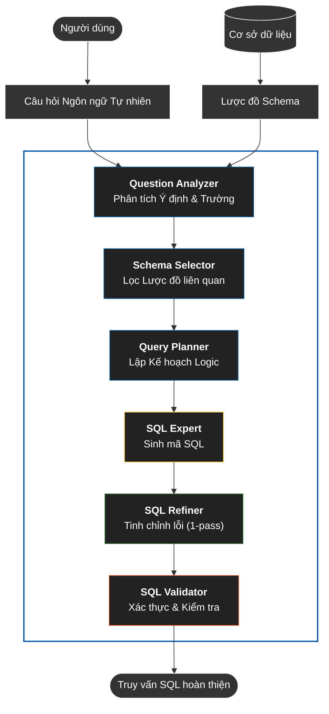
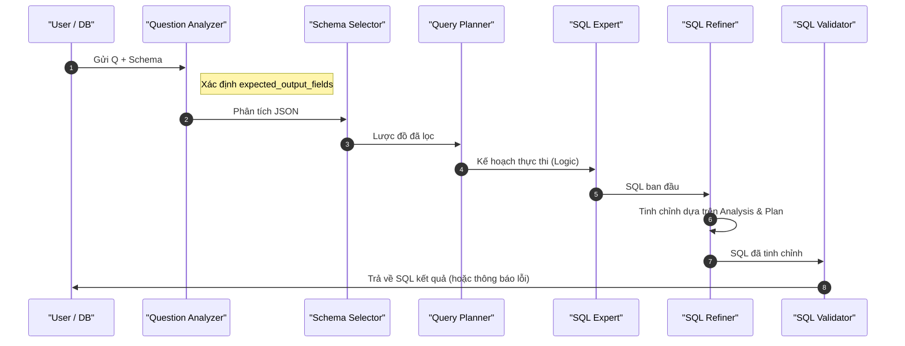
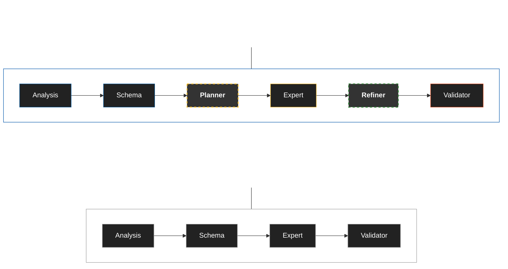

# Chuyển đổi Ngôn ngữ Tự nhiên sang SQL sử dụng Hệ thống Đa tác nhân

### Tóm tắt (Abstract)

Chuyển đổi ngôn ngữ tự nhiên sang SQL (NL2SQL) vẫn là một bài toán khó khi câu hỏi yêu cầu suy luận nhiều bước, lựa chọn đúng trường đầu ra và xây dựng truy vấn với nhiều phép nối hoặc truy vấn lồng. Nhiều hệ thống dựa trên mô hình ngôn ngữ lớn có thể sinh truy vấn SQL hợp lệ, nhưng vẫn gặp lỗi hệ thống ở giai đoạn chọn trường, lập kế hoạch logic và hiệu chỉnh truy vấn trước khi xác thực. Bài báo này đề xuất một kiến trúc đa tác nhân gồm sáu thành phần chuyên biệt trên nền CrewAI, bao gồm tác nhân phân tích câu hỏi, chọn lược đồ, lập kế hoạch truy vấn, sinh SQL, tinh chỉnh SQL và kiểm tra SQL. Điểm nhấn của phương pháp là tách riêng suy luận về trường đầu ra khỏi bước sinh SQL, đồng thời bổ sung cơ chế tinh chỉnh một lần trước giai đoạn xác thực kỹ thuật.

Thực nghiệm trên Spider Dev Set với 1.034 câu hỏi cho thấy quy trình đề xuất đạt **77,8%** Exact Match và **85,6%** Execution Accuracy, cao hơn cấu hình đa tác nhân rút gọn 4 bước với **73,7%** Exact Match và **81,2%** Execution Accuracy trong cùng điều kiện đánh giá. Phân tích kết quả cho thấy việc phân rã nhiệm vụ theo vai trò chuyên biệt giúp giảm các lỗi thường gặp liên quan đến chọn trường, phép nối, tổng hợp và truy vấn lồng. Các kết quả này cho thấy chiến lược phân tách suy luận theo tác nhân kết hợp với tinh chỉnh một lần là một hướng tiếp cận khả thi cho NL2SQL trên Spider 1.0.


**Từ khóa:** NL2SQL; hệ thống đa tác nhân; CrewAI; Gemini 2.5 Flash; Spider 1.0.

## 1. Giới thiệu (Introduction)

### 1.1 Mở đầu
Chuyển đổi ngôn ngữ tự nhiên sang SQL (NL2SQL) là một hướng nghiên cứu quan trọng vì nó cho phép người dùng không chuyên truy cập cơ sở dữ liệu bằng ngôn ngữ tự nhiên thay vì phải viết truy vấn thủ công. Trong bối cảnh các hệ phân tích dữ liệu ngày càng phức tạp, yêu cầu đặt ra không chỉ là sinh được câu lệnh SQL hợp lệ mà còn phải bảo đảm truy vấn phản ánh đúng ý định của người dùng. Sự phát triển của các mô hình ngôn ngữ lớn đã cải thiện đáng kể chất lượng sinh truy vấn, nhưng độ chính xác vẫn suy giảm rõ khi câu hỏi đòi hỏi nhiều bước suy luận, nhiều phép nối hoặc các ràng buộc tổng hợp phức tạp.

### 1.2 Phát biểu Bài toán
Khó khăn cốt lõi của NL2SQL nằm ở chỗ hệ thống phải thực hiện đúng đồng thời bốn loại suy luận: hiểu ý định câu hỏi, xác định phần tử lược đồ liên quan, xây dựng cấu trúc logic của truy vấn và sinh ra câu lệnh SQL đúng về cú pháp lẫn ngữ nghĩa. Khi một trong các bước này sai lệch, truy vấn cuối cùng có thể vẫn hợp lệ về mặt cú pháp nhưng trả về kết quả không đúng. Trên tập Spider 1.0, vấn đề này trở nên rõ rệt hơn vì dữ liệu bao gồm nhiều cơ sở dữ liệu khác nhau và nhiều câu hỏi yêu cầu phép nối, truy vấn lồng và tổng hợp.

Các phương pháp trước đây, từ kiến trúc chuỗi-sang-chuỗi đến các hệ dựa trên mô hình ngôn ngữ lớn, đã cải thiện đáng kể chất lượng Text-to-SQL nhưng vẫn chủ yếu xử lý bài toán theo hướng một mô hình hoặc một luồng suy luận trung tâm [1, 2, 4, 5, 6, 7]. Cách tiếp cận này có ưu điểm về tính đơn giản triển khai, nhưng nó khiến các quyết định về trường đầu ra, quan hệ giữa các bảng và cấu trúc truy vấn bị nén vào cùng một bước sinh SQL. Trong thực tế, nhiều lỗi còn lại không đến từ việc hệ thống hoàn toàn không hiểu câu hỏi, mà từ việc hiểu gần đúng nhưng chọn sai cột, nối sai bảng hoặc biểu diễn sai phép tổng hợp.

Khoảng trống mà nghiên cứu này tập trung giải quyết không phải là thiếu mô hình nền mạnh, mà là thiếu một chiến lược phân rã suy luận đủ rõ để kiểm soát các nguồn lỗi đó. Đặc biệt, lỗi chọn trường thường bị hòa lẫn vào giai đoạn sinh truy vấn, trong khi đây lại là nhóm lỗi có tác động trực tiếp đến tính đúng đắn của kết quả trả về. Từ góc nhìn này, một kiến trúc có khả năng tách suy luận về trường đầu ra khỏi bước sinh SQL và bổ sung một bước hiệu chỉnh trước xác thực là cần thiết để nâng độ ổn định của hệ thống trên Spider.

### 1.3 Phương pháp Tiếp cận của Chúng tôi
Nghiên cứu này tiếp cận NL2SQL như một bài toán cần phân rã nhiệm vụ thành các bước suy luận chuyên biệt thay vì giao toàn bộ quá trình cho một tác nhân duy nhất. Trên nền CrewAI [10], chúng tôi xây dựng một chuỗi xử lý gồm sáu tác nhân, trong đó Phân tích Câu hỏi xác định ý định và trường đầu ra, Chọn Lược đồ thu hẹp phạm vi lược đồ, Lập kế hoạch Truy vấn xây dựng cấu trúc logic, Chuyên gia SQL sinh truy vấn, Tinh chỉnh SQL hiệu chỉnh truy vấn một lần và Kiểm tra SQL thực hiện xác thực kỹ thuật cuối cùng. Cách tổ chức này tạo ra các điểm kiểm soát rõ ràng giữa các giai đoạn và làm giảm áp lực suy luận tập trung ở bước sinh SQL.

Đóng góp phương pháp luận cốt lõi của bài báo nằm ở hai quyết định thiết kế. Quyết định thứ nhất là tách suy luận về trường đầu ra khỏi giai đoạn sinh SQL, qua đó buộc hệ thống xác định sớm những gì cần xuất hiện trong mệnh đề `SELECT`. Quyết định thứ hai là đưa vào một giai đoạn tinh chỉnh một lần trước xác thực để sửa các sai lệch cục bộ về trường, phép nối và phép tổng hợp mà không cần sử dụng cơ chế tự sửa lỗi nhiều vòng. Hai quyết định này được đánh giá trực tiếp thông qua so sánh giữa cấu hình 4 bước và cấu hình 6 bước trên Spider Dev Set.

### 1.4 Đóng góp
Nghiên cứu này đóng góp trên ba phương diện gắn kết chặt chẽ với nhau. Thứ nhất, bài báo đề xuất một chiến lược phân rã nhiệm vụ cho hệ thống NL2SQL đa tác nhân, trong đó suy luận về trường đầu ra được tách riêng khỏi bước sinh SQL nhằm kiểm soát tốt hơn các lỗi ở mệnh đề `SELECT`. Thứ hai, bài báo đưa vào một giai đoạn tinh chỉnh một lần trước xác thực để hiệu chỉnh truy vấn theo ngữ cảnh đã tích lũy từ các bước trước mà không làm tăng chi phí như các cơ chế tự sửa lỗi nhiều vòng. Thứ ba, bài báo cung cấp đánh giá nhất quán trên Spider Dev Set, cho thấy cấu hình 6 bước đạt 77,8% Exact Match và 85,6% Execution Accuracy, cao hơn cấu hình 4 bước trong cùng điều kiện, đồng thời làm rõ các nhóm lỗi mà kiến trúc đề xuất có thể giảm hiệu quả nhất.

### 1.5 Cấu trúc Bài báo
Phần còn lại của bài báo được tổ chức như sau. Phần 2 tổng quan các công trình liên quan và định vị nghiên cứu trong bối cảnh Text-to-SQL và hệ thống đa tác nhân. Phần 3 trình bày phát biểu bài toán, kiến trúc hệ thống và cơ chế cộng tác giữa các tác nhân. Phần 4 mô tả thiết lập thực nghiệm, hệ so sánh, kết quả chính, phân tích thành phần, phân tích lỗi và thảo luận. Cuối cùng, Phần 5 kết luận bài báo và nêu các hướng nghiên cứu tiếp theo.


## 2. Các Công trình Liên quan (Related Work)

### 2.1 Text-to-SQL trên Spider
Nghiên cứu Text-to-SQL đã phát triển từ các mô hình chuỗi-sang-chuỗi ban đầu sang các hệ thống có nhận thức lược đồ và gần đây là các phương pháp dựa trên mô hình ngôn ngữ lớn. Các công trình sớm như Seq2SQL [1] và SyntaxSQLNet [2] đặt nền tảng cho việc sinh truy vấn có cấu trúc, nhưng hiệu quả của chúng còn hạn chế khi phải xử lý truy vấn nhiều bảng, truy vấn lồng và suy luận chéo miền. Khi Spider [3] trở thành chuẩn đánh giá chính cho NL2SQL phức tạp, bài toán không còn dừng ở việc sinh cú pháp đúng mà chuyển sang yêu cầu hiểu chính xác quan hệ giữa câu hỏi và lược đồ.

Các phương pháp sau đó như RAT-SQL [4], BRIDGE [11] và RESDSQL [5] cải thiện đáng kể hiệu quả bằng cách tăng cường liên kết lược đồ và biểu diễn quan hệ giữa câu hỏi với các bảng, cột trong cơ sở dữ liệu. Dù vậy, các hệ thống này vẫn chủ yếu hoạt động theo mô hình suy luận tập trung, trong đó các quyết định về trường đầu ra, phép nối và cấu trúc truy vấn được gom vào một luồng sinh SQL thống nhất. Cách tổ chức đó giúp mô hình hóa bài toán một cách gọn gàng, nhưng cũng làm cho các sai lệch cục bộ, đặc biệt ở mệnh đề `SELECT` hoặc ở đường nối giữa các bảng, khó được phát hiện và sửa có hệ thống trước khi tạo ra truy vấn cuối cùng.

### 2.2 Phương pháp Dựa trên LLM và Cộng tác Tác nhân
Sự xuất hiện của các mô hình ngôn ngữ lớn đã mở rộng đáng kể năng lực của hệ thống Text-to-SQL thông qua few-shot prompting, in-context learning và các cơ chế tự sửa lỗi. Các hướng như GPT-based Text-to-SQL [13], DIN-SQL [6] và DAIL-SQL [7] cho thấy mô hình ngôn ngữ lớn có thể đạt kết quả rất mạnh trên Spider mà không cần thiết kế bộ giải mã chuyên biệt theo kiểu cổ điển. Tuy nhiên, ngay cả khi độ chính xác tổng thể tăng lên, các lỗi liên quan đến chọn trường, phép nối và biểu diễn phép tổng hợp vẫn tiếp tục tồn tại, đặc biệt trong các câu hỏi đòi hỏi nhiều bước suy luận hoặc nhiều cách diễn giải gần nhau.

Song song với đó, các khung đa tác nhân như CrewAI [10], LangChain [9] và AutoGen [8] cho thấy lợi ích của việc phân rã nhiệm vụ phức tạp thành các vai trò chuyên biệt có cộng tác. Các nghiên cứu về tự phản ánh và tự sửa lỗi như Reflexion [16] và CRITIC [17] cũng chứng minh rằng đầu ra của mô hình có thể được cải thiện nhờ một bước phê bình hoặc hiệu chỉnh sau sinh. Tuy vậy, phần lớn các hướng này vẫn được thiết kế cho bài toán mục đích chung. Chúng chưa giải quyết trực tiếp yêu cầu rất đặc thù của NL2SQL là phải kiểm soát đồng thời trường đầu ra, cấu trúc quan hệ, phép tổng hợp và tính hợp lệ của truy vấn trong cùng một chuỗi xử lý gắn với lược đồ cơ sở dữ liệu.

### 2.3 Khoảng trống Nghiên cứu và Định vị Công trình
Từ các hướng nghiên cứu trên có thể thấy rằng khoảng trống hiện nay không nằm ở việc thiếu mô hình nền mạnh, mà ở việc thiếu một chiến lược phân rã suy luận được thiết kế riêng cho NL2SQL. Các hệ thống Text-to-SQL mạnh trên Spider chủ yếu cải thiện thông qua biểu diễn lược đồ tốt hơn hoặc prompt mạnh hơn, trong khi các khung đa tác nhân và tự sửa lỗi lại thường thiếu cơ chế đặc thù để kiểm soát các lỗi ngữ nghĩa cốt lõi của truy vấn SQL. Vì vậy, một câu hỏi nghiên cứu còn bỏ ngỏ là liệu việc tách riêng một số quyết định quan trọng, đặc biệt là suy luận về trường đầu ra, khỏi bước sinh SQL có thể cải thiện độ ổn định của hệ thống hay không.

Công trình này được định vị tại giao điểm giữa hai dòng nghiên cứu đó. Bài báo không chỉ áp dụng khung đa tác nhân cho NL2SQL, mà đề xuất một chiến lược phân rã nhiệm vụ trong đó suy luận về trường đầu ra được tách khỏi giai đoạn sinh SQL và một bước tinh chỉnh một lần được đặt trước xác thực kỹ thuật. Dưới góc nhìn học thuật, đóng góp của nghiên cứu vì thế không phải là thay thế các mô hình nền hiện có, mà là bổ sung một cơ chế điều phối suy luận nhằm giảm các lỗi còn lại mà các hệ thống một luồng thường khó kiểm soát. Việc đánh giá trên Spider Dev Set và việc so sánh giữa cấu hình 4 bước với 6 bước được sử dụng để kiểm tra trực tiếp giá trị của quyết định thiết kế này.

## 3. Phương pháp luận (Methodology)

### 3.1 Tổng quan
Như được hiển thị trong Hình 1, kiến trúc đa tác nhân của chúng tôi cho việc chuyển đổi Ngôn ngữ Tự nhiên sang SQL (NL2SQL) tận dụng khung làm việc CrewAI để điều phối sáu tác nhân chuyên biệt làm việc cộng tác. Kiến trúc hệ thống tuân theo một quy trình tuần tự trong đó mỗi tác nhân thực hiện một vai trò cụ thể trong quá trình tạo truy vấn: phân tích câu hỏi, chọn lược đồ, lập kế hoạch truy vấn, tạo SQL, tinh chỉnh một lần và xác thực.

**Hình 1: Kiến trúc Hệ thống Đa tác nhân cho NL2SQL**




Luồng cộng tác của tác nhân diễn ra như sau: một câu hỏi ngôn ngữ tự nhiên trước tiên được phân tích bởi Phân tích Câu hỏi để xác định ý định và các trường cần thiết. Sau đó, Chọn Lược đồ lọc các bảng và cột liên quan từ lược đồ cơ sở dữ liệu. Lập kế hoạch Truy vấn tạo ra một kế hoạch thực thi logic, tiếp theo là Chuyên gia SQL tạo ra truy vấn SQL. Sau đó, Tinh chỉnh SQL xem xét và tinh chỉnh truy vấn SQL đã tạo, và cuối cùng, Kiểm tra SQL kiểm tra tính đúng đắn về cú pháp và ngữ nghĩa.

Để đánh giá tác động của các thành phần kiến trúc khác nhau, chúng tôi so sánh hai biến thể quy trình: quy trình cơ sở 4 bước (Phân tích Câu hỏi → Chọn Lược đồ → Chuyên gia SQL → Kiểm tra SQL) và kiến trúc đầy đủ 6 bước bao gồm Lập kế hoạch Truy vấn và Tinh chỉnh SQL. Sự so sánh này cho phép chúng tôi đánh giá sự đóng góp của việc lập kế hoạch truy vấn và tinh chỉnh một lần vào độ chính xác tổng thể của hệ thống.

### 3.2 Phát biểu Bài toán
Nhiệm vụ NL2SQL có thể được định nghĩa chính thức như sau: cho một câu hỏi ngôn ngữ tự nhiên Q và một lược đồ cơ sở dữ liệu S, tạo ra một truy vấn SQL thực thi được sao cho việc thực thi SQL trên cơ sở dữ liệu D trả về kết quả R trả lời đúng cho Q. Đầu vào bao gồm một cặp (Q, S), trong đó Q là một câu hỏi ngôn ngữ tự nhiên và S = {T₁, T₂, ..., Tₙ} là một tập hợp các bảng, mỗi bảng chứa một tập hợp các cột. Mỗi bảng Tᵢ có một lược đồ được định nghĩa bởi các cột của nó Cᵢ = {c₁, c₂, ..., cₘ}, trong đó các cột có thể có các ràng buộc như khóa chính, khóa ngoại và kiểu dữ liệu. Đầu ra là một truy vấn SQL đúng cú pháp và ngữ nghĩa có thể được thực thi trên cơ sở dữ liệu D để truy xuất thông tin mong muốn.

Nhằm hỗ trợ phân tích chẩn đoán, bài báo giới thiệu chỉ số **Tỷ trọng Lỗi Chọn trường (Field Selection Error Distribution - FSED)**. Đây là một chỉ số chẩn đoán (diagnostic metric) mô tả phân phối các loại lỗi của hệ thống cơ sở, không phải là thước đo hiệu suất hay độ chính xác tổng thể.

Về mặt định nghĩa, một **lỗi chọn trường** được xác định là sự không khớp giữa mệnh đề SELECT của SQL được tạo và SQL tiêu chuẩn (gold SQL), xét theo tính tương đương của các cột. Trong phân tích này, chúng tôi so sánh tập cột đầu ra theo danh tính cột (table.column), bỏ qua alias; thứ tự cột chỉ được xem là lỗi khi câu hỏi yêu cầu rõ ràng về thứ tự kết quả. Chỉ số FSED ghi nhận tỷ lệ phần trăm các lỗi chọn trường trên tổng số các trường hợp thực thi thất bại của hệ thống đơn tác nhân điểm chuẩn (Gemini zero-shot baseline) trên tập Spider Dev Set. Kết quả ghi nhận FSED = 52,6%, cho thấy trong các trường hợp hệ thống baseline thất bại, lỗi chọn trường chiếm tỷ trọng lớn nhất trong nhóm lỗi được gán nhãn theo tiêu chí của chúng tôi. Cần phân biệt FSED (đo lường trên tập con các câu lỗi của baseline) với tỷ lệ lỗi chọn trường tuyệt đối 2,1% ghi nhận trên toàn bộ tập dữ liệu sau khi áp dụng quy trình đề xuất (Phần 4.5).

$$FSED = \frac{\text{Số lỗi chọn trường}}{\text{Tổng số lỗi thực thi (của Baseline)}} \times 100\%$$

Trong bài báo này, phân bổ lỗi (distribution) được tính toán chỉ trên các trường hợp thất bại, trong khi tỷ lệ lỗi tuyệt đối (absolute rate) được tính trên toàn bộ tập dữ liệu dev.

**Ký hiệu:** Bảng 1 tóm tắt các ký hiệu được sử dụng trong bài báo này.

| Ký hiệu | Định nghĩa |
| :--- | :--- |
| Q | Câu hỏi ngôn ngữ tự nhiên |
| S | Lược đồ cơ sở dữ liệu (tập hợp các bảng) |
| SQL | Truy vấn SQL được tạo |
| D | Thể hiện cơ sở dữ liệu |
| R | Kết quả thực thi truy vấn |
| Tᵢ | Bảng i trong lược đồ |
| Cᵢ | Tập hợp các cột cho bảng Tᵢ |
| FSED | Tỷ trọng Lỗi Chọn trường (Field Selection Error Distribution) |

*Bảng 1: Các ký hiệu được sử dụng trong phát biểu bài toán và phương pháp luận.*

### 3.3 Kiến trúc Đa tác nhân

#### 3.3.1 Tác nhân Phân tích Câu hỏi (Question Analyzer Agent)
Tác nhân Phân tích Câu hỏi đóng vai trò là giai đoạn đầu tiên trong quy trình của chúng tôi, chịu trách nhiệm phân tích câu hỏi ngôn ngữ tự nhiên để trích xuất thông tin có cấu trúc hướng dẫn các tác nhân tiếp theo. Tác nhân nhận đầu vào là câu hỏi ngôn ngữ tự nhiên Q và tạo ra một phân tích có cấu trúc chứa một số thành phần chính.

**Vai trò và Đầu vào/Đầu ra:** Vai trò chính của Phân tích Câu hỏi là xác định ý định câu hỏi và phân tích kỹ lưỡng các trường cần thiết cho mệnh đề SELECT, giải quyết trực tiếp rào cản chọn trường dữ liệu vốn là căn nguyên của phần lớn các sai sót hệ thống.

**Đổi mới Chính:** Đổi mới quan trọng của Phân tích Câu hỏi là sự tập trung vào phân tích chọn trường như một bước chuyên dụng, rõ ràng trong quy trình NL2SQL. Không giống như các phương pháp truyền thống kết hợp chọn trường với tạo SQL, tác nhân của chúng tôi xác định rõ ràng những cột nào phải xuất hiện trong mệnh đề SELECT trước khi bất kỳ mã SQL nào được tạo ra. Sự tách biệt này ngăn chặn các lỗi thay thế trường phổ biến, nơi các hệ thống chọn các cột không chính xác hoặc có liên quan. Tác nhân thực hiện phân tích này với nhận thức rằng lỗi chọn trường chiếm một tỷ lệ đáng kể lỗi trong các hệ thống NL2SQL, biến nó thành ưu tiên hàng đầu trong quá trình suy luận của tác nhân. Tác nhân sử dụng Gemini 2.5 Flash làm mô hình ngôn ngữ cơ sở, tận dụng khả năng hiểu ngôn ngữ tự nhiên của nó để phân tích ngữ nghĩa câu hỏi và trích xuất thông tin có cấu trúc.

**Nhận thức về Mẫu Lỗi:** Phân tích Câu hỏi được huấn luyện rõ ràng để nhận biết các mẫu lỗi chọn trường (xem Phần 4.5). Cốt truyện (backstory) của tác nhân bao gồm các quy tắc quan trọng: (1) "Tìm khóa học" → trả về course_id (KHÔNG phải tiêu đề trừ khi được yêu cầu rõ ràng), (2) "Liệt kê A và B" → trả về A, B theo đúng thứ tự, (3) "Hiển thị học kỳ và năm" → giữ nguyên thứ tự câu hỏi, (4) KHÔNG BAO GIỜ giả định - hãy phân tích những gì câu hỏi THỰC SỰ yêu cầu. Prompt của tác nhân bao gồm các ví dụ về lựa chọn trường đúng và sai, chẳng hạn như phân biệt giữa "Tìm khóa học" (trả về course_id) và "Liệt kê tiêu đề khóa học" (trả về title). Đầu ra của tác nhân đóng vai trò là đầu vào quan trọng cho tác nhân Chuyên gia SQL (xem Phần 3.4), đảm bảo rằng các quyết định chọn trường được đưa ra sớm trong quy trình với nhận thức đầy đủ về các yêu cầu câu hỏi và các cạm bẫy phổ biến.

#### 3.3.2 Tác nhân Chọn Lược đồ (Schema Selector Agent)
Tác nhân Chọn Lược đồ lọc lược đồ cơ sở dữ liệu để chỉ bao gồm các bảng và cột liên quan, giảm kích thước ngữ cảnh và cải thiện sự tập trung cho các tác nhân tiếp theo. Tác nhân này giải quyết thách thức về hiểu lược đồ, điều rất quan trọng để tạo SQL chính xác.

**Vai trò và Đầu vào/Đầu ra:** Chọn Lược đồ nhận đầu vào là phân tích câu hỏi từ Phân tích Câu hỏi (xem Phần 3.3.1) và lược đồ cơ sở dữ liệu thô đầy đủ S (xem Phần 3.2). Đầu ra của nó là một lược đồ đã lọc chỉ chứa các bảng và cột liên quan có khả năng cần thiết để trả lời câu hỏi. Lược đồ đã lọc duy trì cùng cấu trúc JSON như lược đồ đầu vào (db_id, table_names_original, column_names_original, column_types) nhưng với nội dung giảm bớt. Logic lọc hoạt động dựa trên một số nguyên tắc: (1) xác định các thực thể được đề cập trong câu hỏi (ví dụ: "sinh viên" → bảng student), (2) giữ các khóa chính và khóa ngoại cần thiết cho các phép JOIN (xem Phần 3.3.3), (3) giữ lại các cột khớp với các thực thể hoặc giá trị được đề cập trong câu hỏi, và (4) loại bỏ các bảng và cột không liên quan không được tham chiếu trong câu hỏi hoặc không cần thiết cho các phép JOIN.

**Logic Lọc Lược đồ:** Tác nhân sử dụng khớp thực thể để xác định các bảng liên quan, so sánh các token câu hỏi với tên bảng và cột. Nó duy trì tính toàn vẹn tham chiếu bằng cách giữ các mối quan hệ khóa ngoại, đảm bảo rằng các phép JOIN có thể được xây dựng đúng cách. Tác nhân cũng xem xét sự tương đồng về ngữ nghĩa, nhận ra rằng các thuật ngữ câu hỏi có thể không khớp chính xác với tên lược đồ (ví dụ: "học trò" so với "sinh viên"). Lược đồ đã lọc nhỏ hơn đáng kể so với lược đồ đầy đủ, giảm cửa sổ ngữ cảnh cho các tác nhân tiếp theo và cải thiện khả năng tập trung vào thông tin liên quan của chúng.

**Triển khai:** Chọn Lược đồ sử dụng Gemini 2.5 Flash để thực hiện khớp ngữ nghĩa và lọc. Tác nhân nhận lược đồ đầy đủ làm ngữ cảnh và phân tích câu hỏi, sau đó tạo ra một đầu ra có cấu trúc liệt kê các bảng liên quan cùng với các cột của chúng. Lược đồ đã lọc này được chuyển đến các tác nhân Lập kế hoạch Truy vấn và Chuyên gia SQL, cho phép chúng làm việc với một biểu diễn lược đồ tập trung, dễ quản lý.

#### 3.3.3 Tác nhân Lập kế hoạch Truy vấn (Query Planner Agent)
Tác nhân Lập kế hoạch Truy vấn thiết kế một kế hoạch thực thi logic cho truy vấn SQL mà không tạo ra mã SQL thực tế. Sự tách biệt giữa lập kế hoạch và tạo SQL này cho phép suy luận tốt hơn về cấu trúc và logic truy vấn.

**Vai trò và Đầu vào/Đầu ra:** Lập kế hoạch Truy vấn nhận phân tích câu hỏi từ Phân tích Câu hỏi (xem Phần 3.3.1) và lược đồ đã lọc từ Chọn Lược đồ (xem Phần 3.3.2). Lược đồ đã lọc cung cấp một cái nhìn tập trung về các bảng và cột liên quan, cho phép người lập kế hoạch thiết kế các kế hoạch logic hiệu quả mà không bị choáng ngợp bởi thông tin lược đồ không liên quan. Đầu ra của nó là một kế hoạch thực thi logic từng bước bao gồm: (1) các mục tiêu phụ cho truy vấn (ví dụ: "nối bảng sinh viên và bảng đăng ký", "lọc theo điểm > 80", "đếm sinh viên duy nhất"), (2) sự tham gia của bảng trong mỗi mục tiêu phụ, chỉ định bảng nào là cần thiết và chúng liên quan như thế nào, (3) đường dẫn JOIN và các cột khóa, xác định cách các bảng nên được kết nối (xem Phần 4.5), (4) yêu cầu tổng hợp (mệnh đề GROUP BY, HAVING) (xem Phần 4.5), (5) điều kiện lọc (logic mệnh đề WHERE), (6) yêu cầu sắp xếp (ORDER BY), và (7) quyết định về các phép toán tập hợp (có sử dụng UNION/INTERSECT/EXCEPT hay logic WHERE với điều kiện OR) (xem Phần 4.5).

**Logic Lập kế hoạch:** Lập kế hoạch Truy vấn chia nhỏ các truy vấn phức tạp thành các mục tiêu phụ dễ quản lý, cho phép Chuyên gia SQL (xem Phần 3.3.4) tạo SQL theo từng bước. Ví dụ, một truy vấn hỏi "Tìm những sinh viên đã đăng ký cả khóa học Toán và Vật lý" sẽ được lên kế hoạch như sau: (1) xác định bảng sinh viên và đăng ký, (2) lọc các đăng ký cho các khóa học Toán, (3) lọc các đăng ký cho các khóa học Vật lý, (4) tìm giao điểm của sinh viên trong cả hai tập hợp. Sự phân rã logic này giúp ngăn chặn các lỗi trong việc tạo truy vấn phức tạp (xem Phần 4.4).

**Lựa chọn Thiết kế Chính:** Lập kế hoạch Truy vấn không viết mã SQL, chỉ viết các kế hoạch logic. Sự tách biệt này cho phép tác nhân tập trung vào logic và cấu trúc truy vấn mà không bị ràng buộc bởi cú pháp SQL, cho phép suy luận tốt hơn về các truy vấn phức tạp. Kế hoạch đóng vai trò là bản thiết kế cho tác nhân Chuyên gia SQL, tác nhân này sẽ dịch kế hoạch logic thành SQL có thể thực thi. Tác nhân sử dụng Gemini 2.5 Flash để thực hiện nhiệm vụ suy luận logic này.

#### 3.3.4 Tác nhân Chuyên gia SQL (SQL Expert Agent)
Tác nhân Chuyên gia SQL tạo ra truy vấn SQL thực tế dựa trên phân tích câu hỏi, lược đồ đã lọc và kế hoạch truy vấn. Tác nhân này chịu trách nhiệm dịch kế hoạch logic thành mã SQL đúng cú pháp và ngữ nghĩa.

**Vai trò và Đầu vào/Đầu ra:** Chuyên gia SQL nhận ba đầu vào chính: (1) phân tích câu hỏi từ Phân tích Câu hỏi (xem Phần 3.3.1), (2) lược đồ đã lọc từ Chọn Lược đồ (xem Phần 3.3.2), và (3) kế hoạch truy vấn từ Lập kế hoạch Truy vấn (xem Phần 3.3.3). Lược đồ đã lọc đảm bảo tác nhân tập trung vào các bảng và cột liên quan, trong khi kế hoạch truy vấn cung cấp hướng dẫn logic cho việc tạo SQL. Đầu ra của nó là một truy vấn SQL hoàn chỉnh, có thể thực thi ở định dạng một dòng. Tác nhân phải đảm bảo rằng SQL được tạo là đúng cú pháp, sử dụng tên bảng và cột hợp lệ, và thực hiện logic được chỉ định trong kế hoạch truy vấn.

**Quy tắc Chính và Nhận thức Mẫu Lỗi:** Chuyên gia SQL thực hiện các quy tắc rộng rãi để ngăn chặn các lỗi phổ biến, với việc tối ưu hóa lựa chọn trường là ưu tiên hàng đầu. Cốt truyện của tác nhân chứa các quy tắc chi tiết được tổ chức thành 13 danh mục:
1.  **Quy tắc Chọn Trường (ƯU TIÊN HÀNG ĐẦU)**: Nghiêm ngặt sử dụng các trường chính xác từ phân tích "expected_output_fields", giữ nguyên thứ tự trường, không bao giờ thay thế course_id bằng title hoặc id bằng name nếu không có yêu cầu rõ ràng.
2.  **Quy tắc Đơn giản**: Sử dụng trực tiếp bảng SECTION cho course_id (không JOIN với course), chỉ JOIN khi cần dữ liệu từ nhiều bảng, sử dụng bảng đơn khi tất cả các trường đều có sẵn.
3.  **Logic UNION vs OR**: Sử dụng UNION cho các tập kết quả riêng biệt (ví dụ: "các khóa học vào Mùa thu 2009 HOẶC Mùa xuân 2010"), sử dụng OR/IN để lọc bảng đơn với nhiều điều kiện.
4.  **Logic COUNT vs COUNT(DISTINCT)**: Sử dụng COUNT(DISTINCT) cho các thực thể duy nhất (phòng ban, sinh viên, khóa học), COUNT(*) cho tổng số bản ghi, COUNT(DISTINCT s_id) cho sinh viên duy nhất được tư vấn.
5.  **Phép toán Tập hợp**: Sử dụng INTERSECT cho "A và B" (cả hai), UNION cho "A hoặc B" (bất kỳ), EXCEPT cho "A nhưng không phải B".
6.  **Logic GROUP BY**: GROUP BY title (không phải course_id) cho "các khóa học được cung cấp bởi nhiều phòng ban", đảm bảo tất cả các cột không được tổng hợp trong SELECT đều có trong GROUP BY.
7.  **Logic Bảng Tiên quyết**: prereq.course_id = khóa học chính, prereq.prereq_id = khóa học tiên quyết, sử dụng NOT IN cho "các khóa học không có tiên quyết".
8.  **Đơn giản Trước tiên**: Chọn cách tiếp cận đúng đơn giản nhất, tránh các phép JOIN không cần thiết, sử dụng truy cập bảng trực tiếp khi có thể.
9.  **Đăng ký & Tổng hợp**: "enrollment" = số lượng sinh viên từ bảng student, "phòng ban có số lượng đăng ký cao nhất" = SELECT dept_name FROM student GROUP BY.
10. **Thứ tự Cột & GROUP BY**: Khớp thứ tự cột mong đợi, GROUP BY thực thể đang được đếm.
11. **Quy tắc SELECT ***: Sử dụng SELECT * cho "tất cả thông tin về X", các cột cụ thể cho các thuộc tính cụ thể.
12. **Độ chính xác JOIN**: Khớp các cột chính xác (student.id = takes.id), xác minh các điều kiện JOIN có ý nghĩa logic, tránh các phép JOIN không cần thiết.
13. **Quy tắc Định dạng SQL**: Luôn trả về các truy vấn SQL hoàn chỉnh, có thể thực thi, định dạng một dòng, không bao giờ trả về các đoạn mã rời rạc.

**Huấn luyện Mẫu Lỗi:** Cốt truyện của Chuyên gia SQL chứa nhận thức sâu rộng về mẫu lỗi được nhúng trong 13 danh mục quy tắc. Tác nhân được huấn luyện để tránh: lỗi chọn trường (chọn title thay vì course_id, sai thứ tự trường), lỗi logic JOIN (JOIN không cần thiết khi bảng đơn là đủ, điều kiện JOIN sai), lỗi tổng hợp (sai COUNT vs COUNT(DISTINCT), sai GROUP BY), lỗi phép toán tập hợp (nhầm lẫn UNION với OR, sử dụng sai INTERSECT/EXCEPT), và lỗi độ phức tạp (truy vấn con không cần thiết, truy vấn quá phức tạp). Tác nhân sử dụng Gemini 2.5 Flash với các prompt chi tiết bao gồm các ví dụ cụ thể về các mẫu SQL đúng và sai, chẳng hạn như "Tìm khóa học" → SELECT course_id (đúng) so với SELECT title (sai), cho phép nó tránh những cạm bẫy phổ biến này.

#### 3.3.5 Tác nhân Kiểm tra SQL (SQL Validator Agent)
Tác nhân Kiểm tra SQL đóng vai trò là một chốt chặn kỹ thuật, chịu trách nhiệm xác thực truy vấn về các ràng buộc cú pháp và lược đồ cơ bản.

**Vai trò và Đầu vào/Đầu ra:** Kiểm tra SQL xác nhận tính đúng đắn về cú pháp của truy vấn. Đầu ra là một báo cáo kỹ thuật xác định các lỗi bề mặt. Vai trò chính là ngăn chặn SQL không hợp lệ đi vào thực thi. Tác nhân thực hiện kiểm tra: (1) Tính hợp lệ cú pháp, (2) Đối soát tên bảng/cột với lược đồ, (3) Đảm bảo tính hoàn chỉnh. Tại bước này, tác nhân chỉ được thực hiện các hiệu chỉnh kỹ thuật không làm thay đổi ngữ nghĩa logic của truy vấn (ví dụ: sửa lỗi tên cột rõ ràng), đảm bảo tính nhất quán với vai trò chuyên biệt của hệ thống.

**Báo cáo Lỗi:** Khi phát hiện lỗi, Kiểm tra SQL tạo ra một báo cáo lỗi có cấu trúc xác định: (1) loại lỗi (cú pháp, ngữ nghĩa, không khớp lược đồ) (xem Phần 4.5), (2) vị trí lỗi (phần nào của SQL), (3) mô tả vấn đề, và (4) đề xuất sửa chữa. Khi phát hiện lỗi, Kiểm tra SQL tạo ra một báo cáo lỗi có cấu trúc mô tả loại lỗi, vị trí và nguyên nhân tiềm ẩn. Tác nhân này không thực hiện bất kỳ điều chỉnh nào làm thay đổi ngữ nghĩa logic của truy vấn; mọi sửa đổi logic đều được ủy quyền duy nhất cho tác nhân Tinh chỉnh SQL.

#### 3.3.6 Tác nhân Tinh chỉnh SQL (SQL Refiner Agent)
Tác nhân Tinh chỉnh SQL xem xét và tinh chỉnh các truy vấn SQL dựa trên câu hỏi, phân tích và kế hoạch truy vấn. Tác nhân này thực hiện bước tinh chỉnh một lần cho phép sửa lỗi và tối ưu hóa truy vấn trước khi xác thực.

**Vai trò và Đầu vào/Đầu ra:** Tinh chỉnh SQL nhận nhiều đầu vào: (1) truy vấn SQL ban đầu được tạo bởi Chuyên gia SQL (xem Phần 3.3.4), (2) câu hỏi ngôn ngữ tự nhiên gốc (xem Phần 3.2), (3) lược đồ cơ sở dữ liệu đã lọc từ Chọn Lược đồ (xem Phần 3.3.2), (4) phân tích câu hỏi từ Phân tích Câu hỏi (xem Phần 3.3.1), và (5) kế hoạch truy vấn từ Lập kế hoạch Truy vấn (xem Phần 3.3.3). Đáng chú ý, Tinh chỉnh không nhận phản hồi xác thực, vì nó chạy trước Kiểm tra SQL trong quy trình (xem Phần 3.4). Đầu ra của nó là một truy vấn SQL đã cải thiện giải quyết các vấn đề tiềm ẩn và tối ưu hóa cấu trúc truy vấn, cùng với các ghi chú ngắn giải thích bất kỳ thay đổi nào đã thực hiện.

**Logic Quyết định:** Tinh chỉnh SQL đưa ra một quyết định duy nhất cho mỗi truy vấn: liệu SQL ban đầu có cần tinh chỉnh hay đã tối ưu. Quyết định này dựa trên việc so sánh SQL với ba tiêu chí: (1) sự phù hợp của việc chọn trường với expected_output_fields từ yêu cầu phân tích câu hỏi (xem Phần 3.3.1), (2) sự phù hợp logic với kế hoạch truy vấn (xem Phần 3.3.3), và (3) cơ hội tối ưu hóa cấu trúc truy vấn. Nếu cả ba tiêu chí đều được thỏa mãn, Tinh chỉnh giữ nguyên SQL ban đầu. Nếu bất kỳ tiêu chí nào chỉ ra cần cải thiện, Tinh chỉnh sẽ tạo ra một truy vấn SQL đã tinh chỉnh.

**Các Lĩnh vực Tập trung Tinh chỉnh:** Tinh chỉnh SQL tập trung vào một số lĩnh vực chính để cải thiện dựa trên mô tả nhiệm vụ: (1) **Sửa chọn trường và thứ tự**: So sánh các trường SELECT với expected_output_fields từ yêu cầu phân tích câu hỏi (xem Phần 3.3.1), đảm bảo các cột chính xác được chọn theo đúng thứ tự (xem Phần 4.5), (2) **Căn chỉnh logic với kế hoạch truy vấn**: Kiểm tra xem logic SQL có tuân theo kế hoạch (bảng, join, lọc, nhóm) hay không (xem Phần 3.3.3), sửa bất kỳ sai lệch nào, (3) **Đơn giản hóa các join/truy vấn con không cần thiết**: Đơn giản hóa các join hoặc truy vấn con không cần thiết trong khi vẫn giữ tính đúng đắn (xem Phần 4.5), (4) **Sửa COUNT vs COUNT(DISTINCT) và các phép toán tập hợp**: Sửa việc chọn hàm tổng hợp và sử dụng phép toán tập hợp (UNION/INTERSECT/EXCEPT) dựa trên ý định câu hỏi (xem Phần 4.5), (5) **Đảm bảo tính hoàn chỉnh của SQL**: Đảm bảo SQL là một câu lệnh hoàn chỉnh, có thể thực thi trên một dòng. Tác nhân sử dụng Gemini 2.5 Flash để suy luận về các cải tiến truy vấn, xem xét tất cả ngữ cảnh có sẵn từ các tác nhân trước đó.

**Tinh chỉnh Một lần (Single-Pass Refinement):** Tinh chỉnh SQL thực hiện thao tác tinh chỉnh một lần. Tác nhân xem xét truy vấn SQL ban đầu được tạo bởi Chuyên gia SQL và so sánh nó với các yêu cầu câu hỏi, phân tích và kế hoạch truy vấn. Nếu SQL ban đầu đã tối ưu, Tinh chỉnh giữ nguyên và giải thích lý do tại sao không cần thay đổi. Nếu xác định được các cải tiến, Tinh chỉnh sẽ tạo ra một truy vấn SQL đã tinh chỉnh. Truy vấn đã tinh chỉnh này sau đó được chuyển đến Kiểm tra SQL để xác thực cuối cùng và kiểm tra lỗi. Cách tiếp cận một lần cân bằng tiềm năng cải thiện với hiệu quả tính toán, tránh sự phức tạp và chi phí của các vòng lặp lặp lại trong khi vẫn cho phép tinh chỉnh truy vấn.

### 3.4 Luồng Cộng tác Tác nhân
Hình 2 minh họa luồng cộng tác của tác nhân, tuân theo một quy trình tuần tự với tinh chỉnh một lần. Luồng cộng tác diễn ra như sau: Đầu tiên, Phân tích Câu hỏi xử lý câu hỏi ngôn ngữ tự nhiên và tạo ra phân tích có cấu trúc. Phân tích này được chuyển đến Chọn Lược đồ, lọc lược đồ cơ sở dữ liệu thô dựa trên các yêu cầu câu hỏi. Lược đồ đã lọc và phân tích câu hỏi sau đó được cung cấp cho Lập kế hoạch Truy vấn, tạo ra một kế hoạch thực thi logic. Chuyên gia SQL nhận tất cả ba đầu ra (phân tích, lược đồ đã lọc, kế hoạch) và tạo ra truy vấn SQL ban đầu. Tinh chỉnh SQL sau đó xem xét truy vấn này dựa trên câu hỏi, phân tích, lược đồ đã lọc và kế hoạch, tạo ra một truy vấn SQL đã tinh chỉnh. Cuối cùng, Kiểm tra SQL kiểm tra truy vấn đã tinh chỉnh về các lỗi cú pháp và ngữ nghĩa, sửa bất kỳ vấn đề nào khi có thể và trả về truy vấn SQL đã xác thực cuối cùng.

**Hình 2: Luồng Truyền tin và Cộng tác Tuần tự**




**Thuật toán:** Thuật toán 1 chính thức hóa luồng cộng tác tác nhân và quy trình tinh chỉnh một lần.

```
Algorithm 1: Multi-Agent NL2SQL Pipeline with Single-Pass Refinement

Input: Natural language question Q, Raw database schema S (containing all tables and columns)
Output: Executable SQL query SQL

1: analysis ← QuestionAnalyzer(Q)
2: filtered_schema ← SchemaSelector(analysis, S)
3: plan ← QueryPlanner(analysis, filtered_schema)
4: sql ← SQLExpert(analysis, filtered_schema, plan)
5: sql ← SQLRefiner(sql, Q, filtered_schema, analysis, plan)
6: result ← SQLValidator(sql, Q, filtered_schema, analysis)
7: return result.sql
```

Mỗi tác nhân chạy một lần theo quy trình tuần tự: Phân tích trích xuất thuộc tính, Chọn Lược đồ lọc dữ liệu, Lập kế hoạch tạo cấu trúc logic, Chuyên gia SQL sinh mã ban đầu. Tác nhân Tinh chỉnh SQL (Refiner) là thành phần duy nhất được phép thực hiện các điều chỉnh về ngữ nghĩa logic dựa trên phân tích ý định. Cuối cùng, Kiểm tra SQL (Validator) thực hiện xác thực kỹ thuật và báo cáo lỗi mà không thay đổi ngữ nghĩa. Cách tiếp cận này đảm bảo tính minh bạch và tránh sự chồng chéo trách nhiệm giữa các tác nhân.

### 3.5 Các Biến thể Quy trình
Hình 3 so sánh các biến thể quy trình 4 bước và 6 bước. Để đánh giá tác động của các thành phần kiến trúc khác nhau, chúng tôi thực hiện hai biến thể quy trình. **Quy trình cơ sở 4 bước** bao gồm: Phân tích Câu hỏi → Chọn Lược đồ → Chuyên gia SQL → Kiểm tra SQL. Quy trình đơn giản hóa này loại trừ các tác nhân Lập kế hoạch Truy vấn và Tinh chỉnh SQL, đại diện cho cách tiếp cận tạo một lần truyền thống hơn với xác thực cơ bản. **Quy trình đầy đủ 6 bước** bao gồm tất cả sáu tác nhân: Phân tích Câu hỏi → Chọn Lược đồ → Lập kế hoạch Truy vấn → Chuyên gia SQL → Tinh chỉnh SQL → Kiểm tra SQL. Kiến trúc đầy đủ này cho phép lập kế hoạch truy vấn và tinh chỉnh một lần, đại diện cho hệ thống đa tác nhân hoàn chỉnh của chúng tôi.

**Hình 3: So sánh Kiến trúc 4 tác nhân (Baseline) vs 6 tác nhân (Proposed)**




Sự so sánh giữa hai biến thể này cho phép chúng tôi đánh giá: (1) tác động của việc lập kế hoạch truy vấn đối với độ chính xác và cấu trúc truy vấn, (2) sự đóng góp của tinh chỉnh một lần vào việc sửa lỗi và cải thiện truy vấn, và (3) sự đánh đổi giữa độ phức tạp của quy trình và mức tăng độ chính xác. Nghiên cứu cắt giảm này cung cấp cái nhìn sâu sắc về những thành phần nào là quan trọng nhất đối với hiệu suất NL2SQL và xác thực các lựa chọn thiết kế của chúng tôi về chuyên môn hóa tác nhân và cơ chế tinh chỉnh.

### 3.6 Hợp thức hóa và Prompt Engineering (Formalization)

Để chuẩn hóa quy trình làm việc của hệ thống đa tác nhân, chúng tôi định nghĩa mỗi **AI Agent** $A_i$ như một hàm toán học:
$$A_i(I_i, C_i, \tau_i) \rightarrow O_i$$
Trong đó:
*   $I_i$: Thông tin đầu vào (ví dụ: Câu hỏi $Q$, Lược đồ $S$).
*   $C_i$: Ngữ cảnh tích lũy từ các tác nhân trước đó ($O_1, O_2, ..., O_{i-1}$).
*   $\tau_i$: Chỉ dẫn cụ thể (Backstory và Task Prompt) thiết lập vai trò chuyên biệt.
*   $O_i$: Đầu ra có cấu trúc (ví dụ: JSON chứa SQL, Kế hoạch, hoặc Phân tích).

Toàn bộ hệ thống là một hàm hợp $F$ thực hiện quy trình tuần tự:
$$F(Q, S) = A_6 \circ A_5 \circ A_4 \circ A_3 \circ A_2 \circ A_1(Q, S)$$

#### Giả mã Hệ thống (Pseudo-code)
Thuật toán dưới đây mô tả chi tiết logic điều phối trong khung CrewAI:

```python
def MultiAgent_NL2SQL(Question Q, Schema S):
    # Bước 1: Trích xuất ý định và trường dữ liệu
    Analysis = QuestionAnalyzer(input=Q, schema=S)
    
    # Bước 2: Giảm nhiễu lược đồ
    FilteredSchema = SchemaSelector(question=Q, analysis=Analysis, full_schema=S)
    
    # Bước 3: Xây dựng cấu trúc logic (Thành phần quan trọng cho truy vấn Hard)
    QueryPlan = QueryPlanner(analysis=Analysis, schema=FilteredSchema)
    
    # Bước 4: Chuyển đổi Logic sang SQL
    InitialSQL = SQLExpert(analysis=Analysis, schema=FilteredSchema, plan=QueryPlan)
    
    # Bước 5: Tinh chỉnh một lần (Single-pass Refinement)
    # So sánh SQL với Expected_Output_Fields trong Analysis
    RefinedSQL = SQLRefiner(sql=InitialSQL, analysis=Analysis, plan=QueryPlan)
    
    # Bước 6: Kiểm tra cú pháp và ngữ nghĩa cuối cùng
    FinalSQL = SQLValidator(sql=RefinedSQL, schema=FilteredSchema)
    
    return FinalSQL
```

**Chi tiết Triển khai:**
*   **Mô hình Ngôn ngữ Cơ sở:** Tất cả sáu tác nhân đều sử dụng Gemini 2.5 Flash với $Temperature = 0.3$.
*   **Cấu hình Tinh chỉnh:** `SQLRefiner` được thiết lập để thực hiện kiểm tra chéo giữa mệnh đề `SELECT` trong `InitialSQL` và danh sách `expected_output_fields` từ `QuestionAnalyzer`. Nếu phát hiện sai sót, nó sẽ tái cấu trúc truy vấn mà không cần lặp lại toàn bộ quy trình.
*   **Siêu tham số:** $max\_tokens = 2048$, $top\_p = 0.95$.


## 4. Thực nghiệm (Experiments)

### 4.1 Experimental Setup
Toàn bộ thực nghiệm được thực hiện trên tập Spider Dev Set gồm 1.034 câu hỏi, là phần đánh giá chuẩn của Spider 1.0 dành cho bài toán NL2SQL chéo miền [3]. Chúng tôi giữ nguyên thiết lập chỉ dùng Spider 1.0 để bảo đảm tính nhất quán của dữ liệu, của lược đồ cơ sở dữ liệu và của giao thức đánh giá trong toàn bộ bài báo. Hai chỉ số được báo cáo là Exact Match, đo mức trùng khớp giữa truy vấn sinh ra và truy vấn chuẩn, và Execution Accuracy, đo mức tương đương về kết quả thực thi giữa truy vấn sinh ra và truy vấn chuẩn.

Để bảo đảm tính công bằng nội bộ, cả cấu hình 4 bước và cấu hình 6 bước đều được triển khai trên cùng nền tảng mô hình Gemini 2.5 Flash, cùng dữ liệu đầu vào và cùng quy trình đánh giá. Cấu hình 4 bước gồm Phân tích Câu hỏi, Chọn Lược đồ, Chuyên gia SQL và Kiểm tra SQL. Cấu hình 6 bước bổ sung thêm Lập kế hoạch Truy vấn và Tinh chỉnh SQL trước giai đoạn xác thực. Thiết kế này cho phép việc so sánh phản ánh trực tiếp tác động của chiến lược phân rã nhiệm vụ và của cơ chế tinh chỉnh một lần.

### 4.2 Baselines and Comparison Systems
Hệ thống so sánh chính trong nghiên cứu này là cấu hình 4 bước, vì đây là biến thể gần nhất với phương pháp đề xuất nhưng không sử dụng hai thành phần được xem là then chốt, gồm Lập kế hoạch Truy vấn và Tinh chỉnh SQL. Do đó, mức chênh lệch giữa hai cấu hình phản ánh trực tiếp giá trị của việc đưa lập kế hoạch logic vào trước giai đoạn sinh SQL và đưa tinh chỉnh một lần vào trước giai đoạn xác thực.

Bên cạnh baseline nội bộ, chúng tôi cũng đặt kết quả của hệ thống trong bối cảnh các mốc kết quả nổi bật trên Spider đã được báo cáo trong tài liệu, bao gồm RAT-SQL [4], SmBoP [21] và DIN-SQL [6]. Các số liệu này được trích từ bài báo gốc và được dùng cho mục đích định vị tương đối, không nhằm khẳng định ưu thế trực tiếp, vì các công trình sử dụng mô hình nền, tập split, chiến lược huấn luyện, prompt và môi trường thực thi khác nhau.

| Hệ thống | Chỉ số chính được báo cáo trong tài liệu | Kết quả báo cáo | Ghi chú |
| :--- | :---: | :---: | :--- |
| RAT-SQL [4] | EM | 57,2 | Kết quả báo cáo trong bài gốc trên Spider |
| SmBoP [21] | EM | 69,5 | Kết quả báo cáo trong bài gốc trên Spider |
| DIN-SQL [6] | EX | 85,3 | Kết quả báo cáo trong bài gốc trên Spider |
| Phương pháp đề xuất | EM / EX | 77,8 / 85,6 | Kết quả của nghiên cứu này trên Spider Dev Set |

*Bảng 2: So sánh định vị với các kết quả Spider được báo cáo trong tài liệu.*

### 4.3 Main Results on Spider Dev Set
Bảng 3 trình bày kết quả chính của hai cấu hình được đánh giá trong cùng điều kiện. Cấu hình 6 bước đạt 77,8% Exact Match và 85,6% Execution Accuracy, trong khi cấu hình 4 bước đạt 73,7% Exact Match và 81,2% Execution Accuracy. Mức cải thiện tương ứng là 4,1 điểm ở Exact Match và 4,4 điểm ở Execution Accuracy, cho thấy việc bổ sung tác nhân Lập kế hoạch Truy vấn và Tinh chỉnh SQL mang lại lợi ích thực nghiệm rõ ràng trên Spider Dev Set.

| Cấu hình | Exact Match (%) | Execution Accuracy (%) | Chênh lệch EX |
| :--- | :---: | :---: | :---: |
| 4-Step baseline | 73,7 | 81,2 | - |
| 6-Step proposed | **77,8** | **85,6** | **+4,4** |

*Bảng 3: Kết quả chính trên Spider Dev Set trong cùng điều kiện đánh giá.*

Kết quả này cho thấy lợi ích của phương pháp không chỉ nằm ở việc tăng số lượng tác nhân, mà ở cách phân công suy luận theo vai trò. Khi hệ thống phải xử lý toàn bộ quá trình trong bốn bước, tác nhân sinh SQL vừa phải suy luận cấu trúc logic vừa phải quyết định trường đầu ra và hoàn thiện truy vấn trong một lần. Ngược lại, cấu hình 6 bước chuyển các quyết định đó sang những giai đoạn chuyên biệt hơn, nhờ vậy giảm áp lực suy luận tập trung và tăng khả năng hiệu chỉnh trước khi xác thực cuối cùng.

### 4.4 Ablation Analysis
Mặc dù nghiên cứu hiện chưa triển khai đầy đủ tập ablation định lượng cho từng tác nhân riêng lẻ, so sánh giữa cấu hình 4 bước và 6 bước vẫn cung cấp một nền tảng phân tích bán định lượng đủ rõ để rút ra một số nhận xét về đóng góp của các thành phần chính. Mức tăng 4,4 điểm Execution Accuracy và 4,1 điểm Exact Match cho thấy hai tác nhân được bổ sung không chỉ mang ý nghĩa mô tả kiến trúc mà có tác động thực tế đến chất lượng đầu ra của hệ thống.

Vai trò của Question Analyzer thể hiện ở việc tách suy luận về trường đầu ra ra khỏi giai đoạn sinh SQL. Trong các hệ thống sinh SQL trực tiếp, lỗi ở mệnh đề `SELECT` thường xuất hiện ngay cả khi ý định truy vấn tổng thể đã được hiểu đúng. Bằng cách buộc hệ thống xác định trước các trường cần trả về và thứ tự của chúng, tác nhân này tạo ra một ràng buộc ngữ nghĩa rõ ràng cho các bước tiếp theo. Cơ chế này đặc biệt quan trọng đối với các truy vấn có nhiều cột cùng miền nghĩa hoặc có nhiều cách diễn giải gần nhau ở mức từ vựng.

Vai trò của Query Planner nằm ở việc chuyển một yêu cầu ngôn ngữ tự nhiên thành cấu trúc logic trung gian trước khi sinh SQL. Khi truy vấn đòi hỏi nhiều phép nối, truy vấn lồng hoặc kết hợp giữa điều kiện lọc và phép tổng hợp, bước lập kế hoạch giúp xác định trước bảng nào cần tham gia, quan hệ nối nào là trung tâm và phép toán nào là cần thiết. Điều này không loại bỏ toàn bộ lỗi phức tạp, nhưng nó làm giảm khả năng tác nhân sinh SQL phải tự suy luận tất cả quan hệ trong một lần, vốn là nguyên nhân thường gặp của lỗi `JOIN` và lỗi truy vấn lồng.

Vai trò của SQL Refiner thể hiện ở chỗ nó cung cấp một lớp hiệu chỉnh ngắn nhưng có mục tiêu trước khi truy vấn được chuyển sang giai đoạn xác thực. Khác với các cơ chế tự sửa lỗi nhiều vòng, tác nhân này chỉ thực hiện một lượt xem xét lại truy vấn đã sinh ra trên cơ sở câu hỏi gốc, phân tích trường đầu ra, lược đồ đã lọc và kế hoạch logic. Nhờ vậy, các sai lệch nhỏ nhưng có ảnh hưởng lớn, như chọn sai cột, sử dụng `COUNT` thay vì `COUNT(DISTINCT)` hoặc thêm phép nối không cần thiết, có cơ hội được sửa mà không phải lặp lại toàn bộ quy trình.

Từ góc nhìn thực nghiệm, kết quả 4 bước so với 6 bước cho phép diễn giải rằng lợi ích của kiến trúc đề xuất đến từ sự kết hợp giữa phân rã nhiệm vụ và tinh chỉnh một lần, chứ không chỉ từ việc thêm một bước xử lý trung gian. Nói cách khác, Question Analyzer làm rõ đầu ra cần thiết, Query Planner làm rõ cấu trúc logic cần thiết, còn SQL Refiner làm rõ truy vấn thực tế cần được điều chỉnh ở đâu trước khi xác thực. Ba vai trò này tạo thành phần cốt lõi cho chiến lược phân rã nhiệm vụ mà bài báo đề xuất.

### 4.5 Error Analysis
Phân tích lỗi cho thấy bốn nhóm sai sót còn lại có ý nghĩa nhất đối với hệ thống là lỗi chọn trường, lỗi `JOIN`, lỗi tổng hợp và lỗi truy vấn lồng. Việc phân loại theo bốn nhóm này phù hợp với bản chất của bài toán NL2SQL trên Spider, nơi câu hỏi thường yêu cầu kết hợp nhiều thao tác quan hệ trong cùng một truy vấn.

Lỗi chọn trường xuất hiện khi hệ thống hiểu tương đối đúng ý định truy vấn nhưng chọn sai cột trong mệnh đề `SELECT`. Đây là nhóm lỗi mà kiến trúc đề xuất nhắm trực tiếp ngay từ giai đoạn đầu thông qua Question Analyzer. Việc xác định trước các trường đầu ra không loại bỏ hoàn toàn sai sót, đặc biệt trong các câu hỏi mơ hồ hoặc có nhiều cách ánh xạ hợp lệ giữa ngôn ngữ tự nhiên và lược đồ, nhưng nó làm giảm đáng kể khả năng để tác nhân sinh SQL thay thế một cột đúng bằng một cột gần nghĩa.

Lỗi `JOIN` phát sinh khi hệ thống chọn sai bảng trung gian, bỏ sót đường nối cần thiết hoặc thêm các phép nối không phục vụ trực tiếp cho câu trả lời. Kiến trúc đề xuất giảm nhóm lỗi này bằng hai cơ chế bổ sung. Query Planner xác định trước cấu trúc quan hệ cần dùng, còn SQL Refiner có thể loại bỏ các phép nối dư thừa hoặc căn chỉnh lại truy vấn theo kế hoạch logic. Điều này đặc biệt hữu ích với các truy vấn nhiều bảng trong Spider, nơi lỗi ở một quan hệ khóa ngoại có thể làm sai toàn bộ truy vấn.

Lỗi tổng hợp xuất hiện khi truy vấn dùng sai hàm tổng hợp hoặc sai điều kiện nhóm, chẳng hạn nhầm giữa `COUNT(*)` và `COUNT(DISTINCT ...)`, hoặc thiếu điều kiện `GROUP BY` cần thiết. Trong hệ thống đề xuất, loại lỗi này được xử lý chủ yếu bằng sự kết hợp giữa kế hoạch logic và bước tinh chỉnh một lần. Planner giúp nhận diện sớm nhu cầu tổng hợp, còn Refiner có thể kiểm tra lại tính nhất quán giữa ý định câu hỏi và cấu trúc tổng hợp đã được sinh ra.

Lỗi truy vấn lồng vẫn là thách thức nổi bật nhất đối với các câu hỏi đòi hỏi nhiều mức suy luận hoặc nhiều ràng buộc phụ thuộc lẫn nhau. Mặc dù Query Planner hỗ trợ phân rã các truy vấn dạng này thành các mục tiêu phụ, việc chuyển chính xác toàn bộ cấu trúc lồng sang SQL vẫn khó khi câu hỏi yêu cầu `IN`, `EXISTS`, `INTERSECT` hoặc các dạng kết hợp tương đương. Do đó, đây là nhóm lỗi cho thấy rõ giới hạn hiện tại của single-pass refinement: hệ thống có thể sửa các sai lệch cục bộ, nhưng chưa phải lúc nào cũng đủ mạnh để tái cấu trúc hoàn toàn một truy vấn lồng phức tạp đã được sinh sai từ đầu.

Tổng thể, cấu trúc đa tác nhân của phương pháp đề xuất cho thấy hiệu quả giảm lỗi rõ nhất ở hai nhóm chọn trường và `JOIN`, là những nhóm gắn trực tiếp với hai quyết định thiết kế chính của bài báo. Ngược lại, các lỗi tổng hợp phức tạp và truy vấn lồng sâu vẫn là những hướng cần tiếp tục cải thiện trong các nghiên cứu tiếp theo.

### 4.6 Discussion
Kết quả thực nghiệm cho thấy đóng góp trung tâm của nghiên cứu không nằm ở việc tăng độ phức tạp bề mặt của hệ thống, mà ở cách phân rã suy luận thành các giai đoạn có mục tiêu. Khi suy luận về trường đầu ra được thực hiện riêng trước bước sinh SQL, hệ thống có thêm một ràng buộc ngữ nghĩa rõ ràng đối với đầu ra. Khi bước tinh chỉnh một lần được đặt trước xác thực, truy vấn sinh ra có thêm cơ hội được hiệu chỉnh theo đúng câu hỏi và đúng kế hoạch logic trước khi đi vào kiểm tra kỹ thuật. Hai quyết định này tạo nên phần cốt lõi trong tính mới của phương pháp dưới góc nhìn NL2SQL đa tác nhân.

Việc định vị phương pháp so với các benchmark Spider trong tài liệu cần được hiểu theo hướng bối cảnh nghiên cứu hơn là so sánh trực tiếp. Các hệ thống như RAT-SQL, SmBoP và DIN-SQL được xây dựng trong những điều kiện huấn luyện và đánh giá khác nhau, nên bảng so sánh chỉ có giá trị tham chiếu về mặt vị trí tương đối. Trong khung tham chiếu đó, kết quả của nghiên cứu này cho thấy chiến lược phân rã nhiệm vụ và tinh chỉnh một lần có sức cạnh tranh thực nghiệm đáng kể trên Spider Dev Set mà không cần mở rộng sang tập dữ liệu khác.

#### 4.6.1 Efficiency Analysis
Một ưu điểm lý thuyết của kiến trúc đề xuất là cơ chế tinh chỉnh một lần giúp tránh chi phí lặp lại của các hệ tự sửa lỗi nhiều vòng. Trong các hệ thống multi-loop self-refinement, truy vấn có thể phải trải qua nhiều lần sinh lại và kiểm tra lại trước khi đạt đầu ra cuối cùng. Ngược lại, quy trình của chúng tôi chỉ thêm một bước hiệu chỉnh ngắn trước xác thực, nhờ đó kỳ vọng giảm tổng số lời gọi mô hình và giảm biến động chi phí giữa các truy vấn.

Ở giai đoạn hiện tại, chúng tôi chưa đưa vào bài báo số liệu hoàn chỉnh về chi phí token và độ trễ thực thi. Các chỉ số này sẽ được bổ sung trong phiên bản tiếp theo dưới dạng `Token Cost = [TOKEN_COST_PLACEHOLDER]` và `Latency = [LATENCY_PLACEHOLDER]`. Khi các số liệu này được hoàn tất, chúng sẽ giúp lượng hóa rõ hơn mức đánh đổi giữa độ chính xác và hiệu quả vận hành của single-pass refinement so với các cơ chế tinh chỉnh lặp nhiều vòng.

## 5. Kết luận - Chuyển đổi Ngôn ngữ Tự nhiên sang SQL sử dụng Hệ thống Đa tác nhân
Các hệ thống NL2SQL hiện đại đã cải thiện đáng kể chất lượng sinh truy vấn, nhưng vẫn gặp khó khăn khi phải đồng thời quyết định trường đầu ra, cấu trúc quan hệ và hình thức truy vấn trong một bước suy luận duy nhất. Bài báo này tiếp cận vấn đề đó bằng một chiến lược phân rã nhiệm vụ theo tác nhân, trong đó suy luận về trường đầu ra được tách riêng khỏi bước sinh SQL và một giai đoạn tinh chỉnh một lần được đặt trước bước xác thực kỹ thuật.

Kết quả trên Spider Dev Set cho thấy cấu hình 6 bước đạt **77,8%** Exact Match và **85,6%** Execution Accuracy, cao hơn cấu hình 4 bước với **73,7%** Exact Match và **81,2%** Execution Accuracy trong cùng điều kiện đánh giá. Mức cải thiện này cho thấy việc bổ sung lập kế hoạch logic và tinh chỉnh một lần không chỉ làm thay đổi kiến trúc hệ thống mà còn mang lại tác động thực tế đến chất lượng truy vấn được sinh ra.

Đóng góp chính của nghiên cứu nằm ở việc định vị NL2SQL như một bài toán cần phân rã suy luận hơn là chỉ tối ưu một tác nhân sinh SQL duy nhất. Kết quả thực nghiệm và phân tích lỗi cho thấy cách tiếp cận này đặc biệt hữu ích đối với các lỗi chọn trường và lỗi `JOIN`, đồng thời vẫn còn dư địa cải thiện đối với các truy vấn lồng và các trường hợp tổng hợp phức tạp. Trong các nghiên cứu tiếp theo, việc bổ sung phân tích hiệu quả vận hành và mở rộng đánh giá chiều sâu của từng thành phần sẽ giúp làm rõ hơn giá trị của single-pass refinement trong các hệ thống NL2SQL đa tác nhân.


## Tài liệu Tham khảo (References)

[1] V. Zhong, C. Xiong, và R. Socher, "Seq2SQL: Generating Structured Queries from Natural Language Using Reinforcement Learning," arXiv preprint arXiv:1709.00103, 2017. https://doi.org/10.48550/arXiv.1709.00103  
[2] T. Yu, Z. Li, Z. Zhang, R. Zhang, và D. Radev, "SyntaxSQLNet: Syntax Tree Networks for Complex and Cross-Domain Text-to-SQL Task," trong *Proc. EMNLP*, 2018. https://doi.org/10.18653/v1/D18-1193  
[3] T. Yu, R. Zhang, K. Yang, M. Yasunaga, D. Wang, Z. Li, J. Ma, I. Li, Q. Chen, M. Lin, S. Ji, và D. Radev, "Spider: A Large-Scale Human-Labeled Dataset for Complex and Cross-Domain Semantic Parsing and Text-to-SQL Task," trong *Proc. EMNLP*, 2018. https://doi.org/10.18653/v1/D18-1425  
[4] B. Wang, R. Shin, X. Liu, O. Polozov, và M. Richardson, "RAT-SQL: Relation-Aware Schema Encoding and Linking for Text-to-SQL Parsers," trong *Proc. ACL*, 2020. https://doi.org/10.18653/v1/2020.acl-main.677  
[5] H. Li, J. Zhang, C. Li, và H. Chen, "RESDSQL: Decoupling Schema Linking and Skeleton Parsing for Text-to-SQL," trong *Proc. AAAI*, 2023. https://doi.org/10.1609/aaai.v37i11.26535  
[6] M. Pourreza và D. Rafiei, "DIN-SQL: Decomposed In-Context Learning of Text-to-SQL with Self-Correction," trong *Proc. NeurIPS*, 2023. https://doi.org/10.48550/arXiv.2304.11015  
[7] D. Gao, H. Wang, Y. Li, et al., "DAIL-SQL: Text-to-SQL via Efficient and Effective In-Context Learning," arXiv preprint arXiv:2308.15363, 2023. https://doi.org/10.48550/arXiv.2308.15363  
[8] Y. Wang, S. Zhou, H. Liu, et al., "AutoGen: Enabling Next-Gen LLM Applications via Multi-Agent Conversation Framework," arXiv preprint arXiv:2308.08155, 2023. https://doi.org/10.48550/arXiv.2308.08155  
[9] H. Chase, "LangChain," 2022–2024. [Trực tuyến]. Có sẵn: https://python.langchain.com  
[10] J. Moura et al., "CrewAI: Open-Source Framework for Multi-Agent Collaboration," 2023–2024. [Trực tuyến]. Có sẵn: https://github.com/crewAIInc/crewAI  
[11] X. V. Lin, R. Socher, và C. Xiong, "Bridging Textual and Tabular Data for Cross-Domain Text-to-SQL Semantic Parsing," trong *Findings of EMNLP*, 2020. https://doi.org/10.18653/v1/2020.findings-emnlp.438  
[12] T. Scholak, N. Scarlatos, A. Baber, và D. Cer, "PICARD: Parsing Incrementally for Constrained Auto-Regressive Decoding from Language Models," trong *Proc. EMNLP*, 2021. https://doi.org/10.18653/v1/2021.emnlp-main.779  
[13] OpenAI, "GPT-4 Technical Report," arXiv preprint arXiv:2303.08774, 2023. https://doi.org/10.48550/arXiv.2303.08774  
[14] Y. Wang, H. Le, A. D. Gotmare, et al., "CodeT5+: Open Code Large Language Models for Code Understanding and Generation," trong *Proc. EMNLP*, 2023. https://doi.org/10.48550/arXiv.2305.07922  
[15] C. Qian, W. Liu, H. Liu, N. Chen, Y. Dang, J. Li, C. Yang, W. Chen, Y. Su, X. Cong, J. Xu, D. Li, Z. Liu, và M. Sun, "ChatDev: Communicative Agents for Software Development," trong *Proc. ACL*, 2024. https://doi.org/10.18653/v1/2024.acl-long.810  
[16] T. Shinn, C. Cassano, A. Gopinath, K. Narasimhan, và S. Yao, "Reflexion: Language Agents with Verbal Reinforcement Learning," trong *Proc. NeurIPS*, 2023. https://doi.org/10.48550/arXiv.2303.11366  
[17] Z. Gou, Z. Shao, Y. Gong, et al., "CRITIC: Large Language Models Can Self-Correct with Tool-Interactive Critiquing," trong *Proc. ICLR*, 2024. https://doi.org/10.48550/arXiv.2305.11738  
[18] A. Asai, Z. Wu, Y. Wang, A. Sil, và H. Hajishirzi, "Self-RAG: Learning to Retrieve, Generate, and Critique through Self-Reflection," trong *Proc. ICLR*, 2024. https://doi.org/10.48550/arXiv.2310.11511  
[19] T. Schick, J. Dwivedi-Yu, R. Dessì, R. Raileanu, M. Lomeli, E. Hambro, L. Zettlemoyer, N. Cancedda, và T. Scialom, "Toolformer: Language Models Can Teach Themselves to Use Tools," trong *Proc. NeurIPS*, 2023. https://doi.org/10.48550/arXiv.2302.04761  
[20] J. Li, B. Hui, G. Qu, J. Yang, B. Li, B. Li, B. Wang, B. Qin, R. Geng, N. Huo, et al., "Can LLM Already Serve as a Database Interface? A Big Bench for Large-Scale Database Grounded Text-to-SQL," trong *Proc. NeurIPS*, 2023. https://doi.org/10.48550/arXiv.2305.03111
[21] O. Rubin và J. Berant, "SmBoP: Semi-Autoregressive Bottom-Up Semantic Parsing," trong *Proc. NAACL*, 2021. https://doi.org/10.18653/v1/2021.naacl-main.29

## Phụ lục A. Ánh xạ Trích dẫn (Appendix A. Citation Mapping)

| Tác giả/Công trình | Số tham chiếu | Mô tả |
| :--- | :--- | :--- |
| [Zhong et al., 2017] (Seq2SQL, WikiSQL) | [1] | Mô hình Seq2SQL và tập dữ liệu WikiSQL |
| [Yu et al., 2018] (SyntaxSQLNet) | [2] | Mô hình Text-to-SQL SyntaxSQLNet |
| [Yu et al., 2018] (Spider Dataset) | [3] | Tập dữ liệu Spider phức tạp cho text-to-SQL |
| [Wang et al., 2020] (RAT-SQL) | [4] | Trình phân tích cú pháp Text-to-SQL nhận thức quan hệ |
| [Ruan et al., 2023] (RESDSQL) | [5] | Mô hình Text-to-SQL tách biệt liên kết/mã hóa lược đồ |
| [Pourreza & Rafiei, 2023] (DIN-SQL) | [6] | Text-to-SQL phân rã theo ngữ cảnh với tự sửa lỗi |
| [Gao et al., 2023] (DAIL-SQL) | [7] | Text-to-SQL học theo ngữ cảnh hiệu quả |
| [Wang et al., 2023] (AutoGen) | [8] | Khung hội thoại LLM đa tác nhân |
| [Chase et al., 2022-2024] (LangChain) | [9] | Khung tác nhân/công cụ LangChain |
| [Moura et al., 2023-2024] (CrewAI) | [10] | Khung điều phối đa tác nhân CrewAI |
| [Gan et al., 2021] (BRIDGE) | [11] | Mô hình Text-to-SQL liên kết lược đồ BRIDGE |
| [Scholak et al., 2021] (PICARD) | [12] | Giải mã ràng buộc cho Text-to-SQL |
| [Various, 2022-2024] (GPT-3/4 Text-to-SQL) | [13] | Báo cáo kỹ thuật GPT-4 như trích dẫn đại diện |
| [Wang et al., 2023] (CodeT5+) | [14] | LLM mã CodeT5+ |
| [Qian et al., 2024] (ChatDev) | [15] | Tác nhân giao tiếp cho phát triển phần mềm |
| [Shinn et al., 2023] (Reflexion) | [16] | Tác nhân ngôn ngữ tự phản ánh Reflexion |
| [Yuan et al., 2023] (CRITIC) | [17] | Tự sửa lỗi tương tác công cụ CRITIC |
| [Asai et al., 2024] (Self-RAG) | [18] | Truy xuất tăng cường tự phản ánh |
| [Schick et al., 2023] (Toolformer) | [19] | Mô hình ngôn ngữ tự học sử dụng công cụ |
| [Li et al., 2023] (BIRD Dataset) | [20] | Chuẩn đánh giá Text-to-SQL quy mô lớn BIRD |
| [Rubin and Berant, 2021] (SmBoP) | [21] | Trình phân tích ngữ nghĩa bottom-up bán tự hồi quy cho Text-to-SQL |

## Phụ lục B. Ghi chú Trích dẫn (Appendix B. Citation Notes)

*   **[15] ChatDev** (Qian et al., ACL 2024): Đại diện cho nghiên cứu đa tác nhân cộng tác trong phát triển phần mềm, minh họa hiệu quả của chuyên môn hóa vai trò.
*   **[18] Self-RAG** (Asai et al., ICLR 2024): Đại diện cho hướng nghiên cứu truy xuất tăng cường tác nhân (agentic RAG), tập trung vào cơ chế tự phản ánh trong truy xuất và sinh văn bản.
*   **[19] Toolformer** (Schick et al., NeurIPS 2023): Đại diện cho hướng nghiên cứu học công cụ trong mô hình ngôn ngữ lớn, chứng minh khả năng tự học sử dụng API bên ngoài.