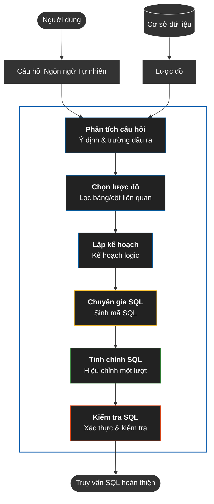
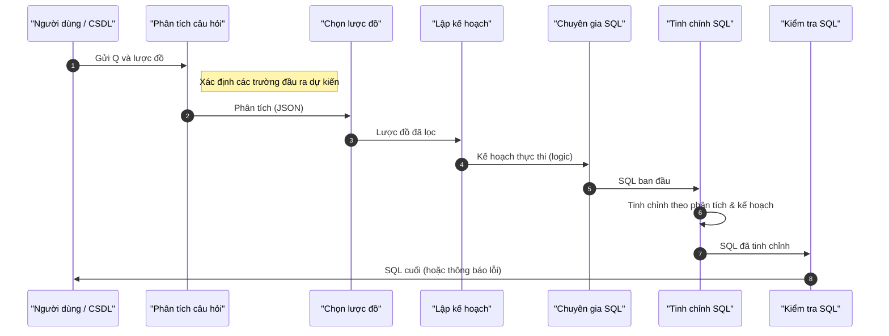
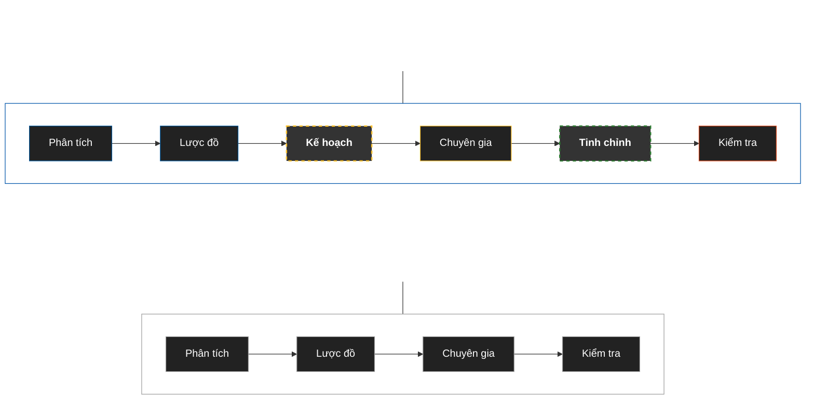

# Chuyển đổi Ngôn ngữ Tự nhiên sang SQL sử dụng Hệ thống Đa tác nhân

### Tóm tắt

Chuyển đổi ngôn ngữ tự nhiên sang SQL (NL2SQL) là một bài toán quan trọng nhưng vẫn còn thách thức, đặc biệt khi câu hỏi đòi hỏi suy luận nhiều bước, hiểu đúng lược đồ và xây dựng các truy vấn có phép nối, tổng hợp hoặc truy vấn lồng. Dù các mô hình ngôn ngữ lớn đã cải thiện đáng kể chất lượng sinh SQL, các hệ thống hiện nay vẫn thường thất bại ở các quyết định trung gian như chọn trường đầu ra, xác định bảng liên quan và lập kế hoạch truy vấn. Bài báo này đề xuất một chuỗi xử lý đa tác nhân gồm sáu bước cho bài toán NL2SQL, bao gồm Phân tích Câu hỏi, Chọn Lược đồ, Lập kế hoạch Truy vấn, Sinh SQL, Tinh chỉnh SQL và Kiểm tra SQL. Kiến trúc đề xuất tách quá trình suy luận thành các vai trò chuyên biệt nhằm giảm lỗi tích lũy trong bước sinh truy vấn.

Hệ thống được đánh giá trên Spider Dev Set, một bộ chuẩn đánh giá cho bài toán Text-to-SQL chéo miền. Chúng tôi báo cáo hai chỉ số chính là Exact Match (EM) và Execution Accuracy (EX). Kết quả cho thấy cấu hình 6 bước đạt **77,8% EM** và **85,6% EX**, cao hơn cấu hình rút gọn 4 bước với **73,7% EM** và **81,2% EX** trong cùng điều kiện đánh giá. Phân tích bổ sung cho thấy các thành phần lập kế hoạch và tinh chỉnh đóng vai trò quan trọng trong việc giảm lỗi chọn trường, lỗi nối bảng và lỗi tổng hợp. Các kết quả này cho thấy phân rã suy luận theo tác nhân là một hướng tiếp cận có tiềm năng nhằm nâng cao độ ổn định và khả năng kiểm soát lỗi của hệ thống NL2SQL.


**Từ khóa:** NL2SQL; hệ thống đa tác nhân; CrewAI; Gemini 2.5 Flash; Spider 1.0.

## 1. Giới thiệu

### 1.1 Mở đầu
Chuyển đổi ngôn ngữ tự nhiên sang SQL (NL2SQL) là bài toán chuyển một câu hỏi ngôn ngữ tự nhiên thành truy vấn SQL có thể thực thi đúng trên cơ sở dữ liệu. Bài toán này có ý nghĩa thực tiễn lớn vì cho phép người dùng không chuyên truy cập dữ liệu mà không cần viết truy vấn thủ công. Tuy nhiên, NL2SQL không chỉ là vấn đề sinh cú pháp, mà còn đòi hỏi hệ thống phải hiểu chính xác ý định câu hỏi, xác định đúng bảng và cột liên quan, đồng thời xây dựng cấu trúc truy vấn phù hợp với lược đồ cơ sở dữ liệu.

Mặc dù các hệ thống dựa trên mô hình ngôn ngữ lớn đã cải thiện đáng kể chất lượng Text-to-SQL, nhiều lỗi quan trọng vẫn xuất hiện trong các truy vấn có độ khó cao. Các lỗi phổ biến bao gồm chọn sai trường trong mệnh đề `SELECT`, xác định sai quan hệ giữa các bảng, xây dựng đường nối không chính xác, hoặc biểu diễn sai logic tổng hợp và truy vấn lồng. Các hạn chế này cho thấy một tác nhân duy nhất thường phải gánh quá nhiều quyết định suy luận cùng lúc, đặc biệt trên các bộ chuẩn chéo miền như Spider.

Từ góc nhìn đó, nghiên cứu này tiếp cận NL2SQL như một bài toán cần được phân rã thành các bước suy luận chuyên biệt. Trên nền CrewAI [10], chúng tôi xây dựng một chuỗi xử lý đa tác nhân gồm sáu bước, trong đó từng thành phần đảm nhiệm một vai trò riêng: phân tích câu hỏi, chọn lược đồ, lập kế hoạch truy vấn, sinh SQL, tinh chỉnh SQL và kiểm tra SQL. Thiết kế này nhằm giảm gánh nặng nhận thức lên một mô hình đơn lẻ, tăng khả năng kiểm soát lỗi cục bộ và tạo ra các điểm kiểm tra trung gian rõ ràng trước khi xuất ra truy vấn cuối cùng.

Nghiên cứu này tập trung kiểm tra giả thuyết rằng việc phân tách suy luận thành các tác nhân chuyên biệt có thể cải thiện độ ổn định của hệ thống NL2SQL. Kết quả trên Spider Dev Set cho thấy cấu hình 6 bước đạt **77,8%** Exact Match và **85,6%** Execution Accuracy, cao hơn cấu hình rút gọn 4 bước trong cùng điều kiện đánh giá. Các kết quả này gợi ý rằng việc bổ sung thành phần lập kế hoạch và tinh chỉnh đóng vai trò thực chất trong việc cải thiện chất lượng truy vấn.

Đóng góp chính của bài báo:

- Đề xuất kiến trúc đa tác nhân 6 bước cho bài toán NL2SQL.
- Phân tách suy luận thành các tác nhân chuyên biệt.
- Thực nghiệm trên Spider Dev Set.
- Phân tích cắt giảm thành phần nhằm chứng minh vai trò của từng mô-đun.

### 1.2 Cấu trúc bài báo
Phần còn lại của bài báo được tổ chức như sau. Phần 2 tổng quan các công trình liên quan. Phần 3 trình bày phương pháp luận và kiến trúc hệ thống. Phần 4 mô tả thiết lập thực nghiệm. Phần 5 báo cáo kết quả chính. Phần 6 trình bày nghiên cứu cắt giảm thành phần. Phần 7 phân tích lỗi. Phần 8 mô tả chi tiết triển khai. Phần 9 thảo luận về hiệu quả chi phí. Cuối cùng, Phần 10 kết luận bài báo và nêu các hướng nghiên cứu tiếp theo.


## 2. Các công trình liên quan

### 2.1 Các mô hình Text-to-SQL cổ điển
Các nghiên cứu Text-to-SQL giai đoạn đầu chủ yếu dựa trên các kiến trúc chuỗi-sang-chuỗi hoặc giải mã có cấu trúc nhằm sinh truy vấn SQL trực tiếp từ câu hỏi ngôn ngữ tự nhiên. Những hướng như Seq2SQL [1], SyntaxSQLNet [2] và các mô hình cùng thời đặt nền tảng cho bài toán bằng cách học ánh xạ từ ngôn ngữ tự nhiên sang biểu diễn truy vấn. Khi các bộ chuẩn phức tạp hơn như Spider [3] được giới thiệu, các mô hình cổ điển bắt đầu chuyển trọng tâm sang khả năng tổng quát hóa chéo miền và xử lý truy vấn nhiều bảng.

Các phương pháp sau đó như RAT-SQL [4], BRIDGE [11], RESDSQL [5] và các hướng nhận thức lược đồ như IRNet nhấn mạnh vai trò của liên kết lược đồ (schema linking) và biểu diễn quan hệ giữa câu hỏi với cấu trúc cơ sở dữ liệu. Những tiến bộ này cải thiện đáng kể hiệu năng trên Spider, nhưng phần lớn vẫn dựa trên một luồng suy luận tập trung, trong đó việc hiểu câu hỏi, xác định cột cần trả về và xây dựng cấu trúc truy vấn đều được tích hợp vào cùng một quá trình sinh SQL. Bên cạnh đó, PICARD [12] cho thấy việc ràng buộc quá trình giải mã có thể giúp giảm lỗi cú pháp trong Text-to-SQL, qua đó nhấn mạnh rằng độ chính xác của hệ thống không chỉ phụ thuộc vào khả năng hiểu câu hỏi mà còn phụ thuộc vào cơ chế kiểm soát đầu ra trong quá trình sinh truy vấn.

### 2.2 Các phương pháp Text-to-SQL dựa trên LLM
Sự xuất hiện của các mô hình ngôn ngữ lớn đã mở rộng đáng kể khả năng giải quyết bài toán Text-to-SQL thông qua nhắc mẫu ít lượt (few-shot), học trong ngữ cảnh và các chiến lược tự sửa lỗi. Các hướng dựa trên GPT [13], DIN-SQL [6] và DAIL-SQL [7] cho thấy một mô hình ngôn ngữ mạnh có thể đạt kết quả cạnh tranh mà không cần bộ giải mã chuyên biệt theo kiểu truyền thống. Tuy nhiên, ngay cả trong các hệ dựa trên LLM, những lỗi liên quan đến chọn trường, xác định phép nối và diễn giải cấu trúc tổng hợp vẫn xuất hiện, đặc biệt khi câu hỏi đòi hỏi suy luận nhiều bước.

Một hạn chế quan trọng của các hệ thống này là phần lớn quyết định trung gian vẫn được thực hiện trong một lần suy luận duy nhất. Do đó, khi mô hình hiểu sai một thành phần cục bộ như cột đầu ra hoặc đường nối giữa các bảng, toàn bộ truy vấn có thể trở nên sai dù phần còn lại của cấu trúc là hợp lý.

### 2.3 Các hướng phân rã suy luận, suy luận chuỗi và đa tác nhân
Bên cạnh các phương pháp sinh SQL trực tiếp, một dòng nghiên cứu khác tập trung vào việc làm rõ quá trình suy luận trung gian thông qua suy luận chuỗi từng bước, phân rã bài toán hoặc tự phản ánh. Các cơ chế như Reflexion [16] và CRITIC [17] cho thấy đầu ra của mô hình có thể được cải thiện nếu có thêm một bước phê bình hoặc hiệu chỉnh. Trong khi đó, các khung như AutoGen [8], LangChain [9] và CrewAI [10] tạo điều kiện để phân rã nhiệm vụ thành nhiều tác nhân chuyên biệt có cộng tác.

Tuy nhiên, phần lớn các hệ đa tác nhân hiện nay được phát triển cho các bài toán mục đích chung, chưa được thiết kế riêng cho các ràng buộc đặc thù của NL2SQL. Nghiên cứu này được đặt tại giao điểm giữa Text-to-SQL và suy luận đa tác nhân: thay vì chỉ dùng một LLM để sinh SQL trực tiếp, chúng tôi tổ chức quá trình sinh truy vấn thành sáu bước có vai trò rõ ràng nhằm kiểm soát tốt hơn các lỗi chọn trường, lỗi nối bảng và lỗi cấu trúc truy vấn.

## 3. Phương pháp luận

### 3.1 Tổng quan
Như được hiển thị trong Hình 1, kiến trúc đa tác nhân của chúng tôi cho việc chuyển đổi Ngôn ngữ Tự nhiên sang SQL (NL2SQL) tận dụng khung làm việc CrewAI để điều phối sáu tác nhân chuyên biệt làm việc cộng tác. Kiến trúc hệ thống tuân theo một quy trình tuần tự trong đó mỗi tác nhân thực hiện một vai trò cụ thể trong quá trình tạo truy vấn: phân tích câu hỏi, chọn lược đồ, lập kế hoạch truy vấn, tạo SQL, tinh chỉnh một lần và xác thực.

Để làm rõ luồng xử lý ở mức khái quát, chuỗi xử lý của hệ thống có thể được biểu diễn dưới dạng ASCII như sau:

```text
Câu hỏi người dùng
      ↓
Phân tích câu hỏi
      ↓
Chọn lược đồ
      ↓
Lập kế hoạch truy vấn
      ↓
Sinh SQL
      ↓
Tinh chỉnh SQL
      ↓
Kiểm tra SQL
      ↓
SQL cuối cùng
```

**Hình 1: Kiến trúc Hệ thống Đa tác nhân cho NL2SQL**




Luồng cộng tác của tác nhân diễn ra như sau: một câu hỏi ngôn ngữ tự nhiên trước tiên được phân tích bởi Phân tích Câu hỏi để xác định ý định và các trường cần thiết. Sau đó, Chọn Lược đồ lọc các bảng và cột liên quan từ lược đồ cơ sở dữ liệu. Lập kế hoạch Truy vấn tạo ra một kế hoạch thực thi logic, tiếp theo là Chuyên gia SQL tạo ra truy vấn SQL. Sau đó, Tinh chỉnh SQL xem xét và tinh chỉnh truy vấn SQL đã tạo, và cuối cùng, Kiểm tra SQL kiểm tra tính đúng đắn về cú pháp và ngữ nghĩa.

Để đánh giá tác động của các thành phần kiến trúc khác nhau, chúng tôi so sánh hai biến thể quy trình: quy trình cơ sở 4 bước (Phân tích Câu hỏi → Chọn Lược đồ → Chuyên gia SQL → Kiểm tra SQL) và kiến trúc đầy đủ 6 bước bao gồm Lập kế hoạch Truy vấn và Tinh chỉnh SQL. Sự so sánh này cho phép chúng tôi đánh giá sự đóng góp của việc lập kế hoạch truy vấn và tinh chỉnh một lần vào độ chính xác tổng thể của hệ thống.

### 3.2 Mô tả kiến trúc 6 bước
Bảng 1 tóm tắt sáu thành phần chính của hệ thống theo ba khía cạnh: đầu vào, đầu ra và vai trò trong quy trình. Cách trình bày này giúp làm rõ rằng phương pháp đề xuất không thay đổi mục tiêu cuối cùng của bài toán NL2SQL, mà thay đổi cách tổ chức quá trình suy luận để mỗi tác nhân xử lý một phần quyết định cụ thể.

| Thành phần | Đầu vào | Đầu ra | Vai trò |
| :--- | :--- | :--- | :--- |
| Phân tích câu hỏi | Câu hỏi ngôn ngữ tự nhiên, lược đồ thô | Phân tích ý định, trường đầu ra mong đợi | Xác định yêu cầu truy vấn và ràng buộc đầu ra |
| Chọn lược đồ | Phân tích câu hỏi, lược đồ thô | Lược đồ đã lọc | Thu hẹp không gian bảng/cột liên quan |
| Lập kế hoạch truy vấn | Phân tích câu hỏi, lược đồ đã lọc | Kế hoạch truy vấn trung gian | Xây dựng cấu trúc logic trước khi sinh SQL |
| Sinh SQL (chuyên gia) | Phân tích câu hỏi, lược đồ đã lọc, kế hoạch | SQL ban đầu | Chuyển kế hoạch logic thành truy vấn SQL |
| Tinh chỉnh SQL | SQL ban đầu, câu hỏi, lược đồ đã lọc, phân tích, kế hoạch | SQL đã tinh chỉnh | Sửa lỗi cục bộ và tăng độ ổn định của truy vấn |
| Kiểm tra SQL | SQL đã tinh chỉnh, lược đồ đã lọc | SQL cuối cùng hoặc báo cáo lỗi | Kiểm tra cú pháp, tên bảng/cột và tính hoàn chỉnh |

*Bảng 1: Tóm tắt vai trò của sáu tác nhân trong quy trình đề xuất.*

### 3.3 Phát biểu Bài toán
Nhiệm vụ NL2SQL có thể được định nghĩa chính thức như sau: cho một câu hỏi ngôn ngữ tự nhiên Q và một lược đồ cơ sở dữ liệu S, tạo ra một truy vấn SQL thực thi được sao cho việc thực thi SQL trên cơ sở dữ liệu D trả về kết quả R trả lời đúng cho Q. Đầu vào bao gồm một cặp (Q, S), trong đó Q là một câu hỏi ngôn ngữ tự nhiên và S = {T₁, T₂, ..., Tₙ} là một tập hợp các bảng, mỗi bảng chứa một tập hợp các cột. Mỗi bảng Tᵢ có một lược đồ được định nghĩa bởi các cột của nó Cᵢ = {c₁, c₂, ..., cₘ}, trong đó các cột có thể có các ràng buộc như khóa chính, khóa ngoại và kiểu dữ liệu. Đầu ra là một truy vấn SQL đúng cú pháp và ngữ nghĩa có thể được thực thi trên cơ sở dữ liệu D để truy xuất thông tin mong muốn.

Nhằm hỗ trợ phân tích chẩn đoán, bài báo giới thiệu chỉ số **Tỷ trọng Chi phối của Lỗi Chọn trường (Field Selection Error Dominance - FSED)**. Đây là một chỉ số phân tích lỗi bổ sung, không phải là thước đo chuẩn của Spider và cũng không thay thế cho Exact Match hoặc Execution Accuracy.

Về mặt định nghĩa, một **lỗi chọn trường** được xác định là sự không khớp giữa mệnh đề `SELECT` của SQL được tạo và SQL chuẩn (SQL tham chiếu), xét theo danh tính cột ở mức `table.column` và bỏ qua alias khi alias không làm thay đổi ngữ nghĩa. Chỉ số FSED đo tỷ lệ các trường hợp thất bại do chọn sai trường trên tổng số các trường hợp thất bại ở mức thực thi. Nói cách khác, FSED trả lời câu hỏi liệu lỗi chọn trường có phải là nguồn lỗi chi phối trong các truy vấn thất bại hay không. Chỉ số này được sử dụng cho mục đích chẩn đoán cơ chế lỗi của hệ thống, thay vì để so sánh trực tiếp với các công trình khác trên bộ chuẩn đánh giá.

$$FSED = \frac{\text{Số lỗi chọn trường}}{\text{Tổng số lỗi thực thi}}$$

Trong bài báo này, lỗi chọn trường được phát hiện bằng cách so sánh mệnh đề `SELECT` của truy vấn được sinh với truy vấn chuẩn trong Spider, sử dụng đối sánh ở mức `table.column` và bỏ qua sự khác biệt về alias. FSED có thể được báo cáo dưới dạng tỷ lệ hoặc phần trăm tùy theo ngữ cảnh trình bày. Việc sử dụng chỉ số này nhằm làm rõ động cơ thiết kế cho các tác nhân chịu trách nhiệm lập kế hoạch và tinh chỉnh truy vấn.

**Ký hiệu:** Bảng 2 tóm tắt các ký hiệu được sử dụng trong bài báo này.

| Ký hiệu | Định nghĩa |
| :--- | :--- |
| Q | Câu hỏi ngôn ngữ tự nhiên |
| S | Lược đồ cơ sở dữ liệu (tập hợp các bảng) |
| SQL | Truy vấn SQL được tạo |
| D | Thể hiện cơ sở dữ liệu |
| R | Kết quả thực thi truy vấn |
| Tᵢ | Bảng i trong lược đồ |
| Cᵢ | Tập hợp các cột cho bảng Tᵢ |
| FSED | Tỷ trọng Chi phối của Lỗi Chọn trường (Field Selection Error Dominance) |

*Bảng 2: Các ký hiệu được sử dụng trong phát biểu bài toán và phương pháp luận.*

### 3.4 Chi tiết triển khai

Chuỗi xử lý đa tác nhân được triển khai bằng một chiến lược lời nhắc tuần tự. Mỗi tác nhân nhận đầu vào có cấu trúc gồm: (1) câu hỏi ngôn ngữ tự nhiên, (2) phần lược đồ cơ sở dữ liệu liên quan, và (3) các đầu ra trung gian từ các tác nhân trước đó.

Tất cả các mô hình trong quy trình được chạy với `temperature = 0` nhằm bảo đảm hành vi xác định giữa các lần đánh giá. Hệ thống được xây dựng trên một khung tác nhân có tính mô-đun, cho phép từng bước suy luận được thực thi độc lập và dễ dàng mở rộng khi cần.

### 3.5 Kiến trúc Đa tác nhân

#### 3.5.1 Tác nhân phân tích câu hỏi
Tác nhân Phân tích Câu hỏi đóng vai trò là giai đoạn đầu tiên trong quy trình của chúng tôi, chịu trách nhiệm phân tích câu hỏi ngôn ngữ tự nhiên để trích xuất thông tin có cấu trúc hướng dẫn các tác nhân tiếp theo. Tác nhân nhận đầu vào là câu hỏi ngôn ngữ tự nhiên Q và tạo ra một phân tích có cấu trúc chứa một số thành phần chính.

**Vai trò và Đầu vào/Đầu ra:** Vai trò chính của Phân tích Câu hỏi là xác định ý định câu hỏi và phân tích kỹ lưỡng các trường cần thiết cho mệnh đề SELECT, giải quyết trực tiếp rào cản chọn trường dữ liệu vốn là căn nguyên của phần lớn các sai sót hệ thống.

**Điểm mới chính:** Điểm mới quan trọng của phân tích câu hỏi là sự tập trung vào phân tích chọn trường như một bước chuyên dụng, rõ ràng trong quy trình NL2SQL. Không giống như các phương pháp truyền thống kết hợp chọn trường với tạo SQL, tác nhân của chúng tôi xác định rõ ràng những cột nào phải xuất hiện trong mệnh đề SELECT trước khi bất kỳ mã SQL nào được tạo ra. Sự tách biệt này ngăn chặn các lỗi thay thế trường phổ biến, nơi các hệ thống chọn các cột không chính xác hoặc có liên quan. Tác nhân thực hiện phân tích này với nhận thức rằng lỗi chọn trường chiếm một tỷ lệ đáng kể lỗi trong các hệ thống NL2SQL, biến nó thành ưu tiên hàng đầu trong quá trình suy luận của tác nhân. Tác nhân sử dụng Gemini 2.5 Flash làm mô hình ngôn ngữ cơ sở, tận dụng khả năng hiểu ngôn ngữ tự nhiên của nó để phân tích ngữ nghĩa câu hỏi và trích xuất thông tin có cấu trúc.

**Nhận thức về mẫu lỗi:** Phân tích câu hỏi được huấn luyện rõ ràng để nhận biết các mẫu lỗi chọn trường (xem Phần 7). Bối cảnh vai trò của tác nhân bao gồm các quy tắc quan trọng: (1) "Tìm khóa học" → trả về course_id (KHÔNG phải tiêu đề trừ khi được yêu cầu rõ ràng), (2) "Liệt kê A và B" → trả về A, B theo đúng thứ tự, (3) "Hiển thị học kỳ và năm" → giữ nguyên thứ tự câu hỏi, (4) KHÔNG BAO GIỜ giả định — hãy phân tích những gì câu hỏi THỰC SỰ yêu cầu. Lời nhắc của tác nhân bao gồm các ví dụ về lựa chọn trường đúng và sai, chẳng hạn như phân biệt giữa "Tìm khóa học" (trả về course_id) và "Liệt kê tiêu đề khóa học" (trả về title). Đầu ra của tác nhân đóng vai trò là đầu vào quan trọng cho tác nhân Chuyên gia SQL (xem Phần 3.5.4), đảm bảo rằng các quyết định chọn trường được đưa ra sớm trong quy trình với nhận thức đầy đủ về các yêu cầu câu hỏi và các cạm bẫy phổ biến.

#### 3.5.2 Tác nhân chọn lược đồ
Tác nhân Chọn Lược đồ lọc lược đồ cơ sở dữ liệu để chỉ bao gồm các bảng và cột liên quan, giảm kích thước ngữ cảnh và cải thiện sự tập trung cho các tác nhân tiếp theo. Tác nhân này giải quyết thách thức về hiểu lược đồ, điều rất quan trọng để tạo SQL chính xác.

**Vai trò và Đầu vào/Đầu ra:** Chọn Lược đồ nhận đầu vào là phân tích câu hỏi từ Phân tích Câu hỏi (xem Phần 3.5.1) và lược đồ cơ sở dữ liệu thô đầy đủ S (xem Phần 3.3). Đầu ra của nó là một lược đồ đã lọc chỉ chứa các bảng và cột liên quan có khả năng cần thiết để trả lời câu hỏi. Lược đồ đã lọc duy trì cùng cấu trúc JSON như lược đồ đầu vào (db_id, table_names_original, column_names_original, column_types) nhưng với nội dung giảm bớt. Logic lọc hoạt động dựa trên một số nguyên tắc: (1) xác định các thực thể được đề cập trong câu hỏi (ví dụ: "sinh viên" → bảng student), (2) giữ các khóa chính và khóa ngoại cần thiết cho các phép JOIN (xem Phần 3.5.3), (3) giữ lại các cột khớp với các thực thể hoặc giá trị được đề cập trong câu hỏi, và (4) loại bỏ các bảng và cột không liên quan không được tham chiếu trong câu hỏi hoặc không cần thiết cho các phép JOIN.

**Logic lọc lược đồ:** Tác nhân sử dụng khớp thực thể để xác định các bảng liên quan, so sánh các đơn vị từ trong câu hỏi với tên bảng và cột. Nó duy trì tính toàn vẹn tham chiếu bằng cách giữ các mối quan hệ khóa ngoại, đảm bảo rằng các phép JOIN có thể được xây dựng đúng cách. Tác nhân cũng xem xét sự tương đồng về ngữ nghĩa, nhận ra rằng các thuật ngữ câu hỏi có thể không khớp chính xác với tên lược đồ (ví dụ: "học trò" so với "sinh viên"). Lược đồ đã lọc nhỏ hơn đáng kể so với lược đồ đầy đủ, giảm cửa sổ ngữ cảnh cho các tác nhân tiếp theo và cải thiện khả năng tập trung vào thông tin liên quan của chúng.

**Triển khai:** Chọn Lược đồ sử dụng Gemini 2.5 Flash để thực hiện khớp ngữ nghĩa và lọc. Tác nhân nhận lược đồ đầy đủ làm ngữ cảnh và phân tích câu hỏi, sau đó tạo ra một đầu ra có cấu trúc liệt kê các bảng liên quan cùng với các cột của chúng. Lược đồ đã lọc này được chuyển đến các tác nhân Lập kế hoạch Truy vấn và Chuyên gia SQL, cho phép chúng làm việc với một biểu diễn lược đồ tập trung, dễ quản lý.

#### 3.5.3 Tác nhân lập kế hoạch truy vấn
Tác nhân Lập kế hoạch Truy vấn thiết kế một kế hoạch thực thi logic cho truy vấn SQL mà không tạo ra mã SQL thực tế. Sự tách biệt giữa lập kế hoạch và tạo SQL này cho phép suy luận tốt hơn về cấu trúc và logic truy vấn.

**Vai trò và Đầu vào/Đầu ra:** Lập kế hoạch Truy vấn nhận phân tích câu hỏi từ Phân tích Câu hỏi (xem Phần 3.5.1) và lược đồ đã lọc từ Chọn Lược đồ (xem Phần 3.5.2). Lược đồ đã lọc cung cấp một cái nhìn tập trung về các bảng và cột liên quan, cho phép người lập kế hoạch thiết kế các kế hoạch logic hiệu quả mà không bị choáng ngợp bởi thông tin lược đồ không liên quan. Đầu ra của nó là một kế hoạch thực thi logic từng bước bao gồm: (1) các mục tiêu phụ cho truy vấn (ví dụ: "nối bảng sinh viên và bảng đăng ký", "lọc theo điểm > 80", "đếm sinh viên duy nhất"), (2) sự tham gia của bảng trong mỗi mục tiêu phụ, chỉ định bảng nào là cần thiết và chúng liên quan như thế nào, (3) đường dẫn JOIN và các cột khóa, xác định cách các bảng nên được kết nối (xem Phần 7), (4) yêu cầu tổng hợp (mệnh đề GROUP BY, HAVING) (xem Phần 7), (5) điều kiện lọc (logic mệnh đề WHERE), (6) yêu cầu sắp xếp (ORDER BY), và (7) quyết định về các phép toán tập hợp (có sử dụng UNION/INTERSECT/EXCEPT hay logic WHERE với điều kiện OR) (xem Phần 7).

**Logic Lập kế hoạch:** Lập kế hoạch Truy vấn chia nhỏ các truy vấn phức tạp thành các mục tiêu phụ dễ quản lý, cho phép Chuyên gia SQL (xem Phần 3.5.4) tạo SQL theo từng bước. Ví dụ, một truy vấn hỏi "Tìm những sinh viên đã đăng ký cả khóa học Toán và Vật lý" sẽ được lên kế hoạch như sau: (1) xác định bảng sinh viên và đăng ký, (2) lọc các đăng ký cho các khóa học Toán, (3) lọc các đăng ký cho các khóa học Vật lý, (4) tìm giao điểm của sinh viên trong cả hai tập hợp. Sự phân rã logic này giúp ngăn chặn các lỗi trong việc tạo truy vấn phức tạp và giảm áp lực suy luận ở bước sinh SQL.

**Lựa chọn Thiết kế Chính:** Lập kế hoạch Truy vấn không viết mã SQL, chỉ viết các kế hoạch logic. Sự tách biệt này cho phép tác nhân tập trung vào logic và cấu trúc truy vấn mà không bị ràng buộc bởi cú pháp SQL, cho phép suy luận tốt hơn về các truy vấn phức tạp. Kế hoạch đóng vai trò là bản thiết kế cho tác nhân Chuyên gia SQL, tác nhân này sẽ dịch kế hoạch logic thành SQL có thể thực thi. Tác nhân sử dụng Gemini 2.5 Flash để thực hiện nhiệm vụ suy luận logic này.

#### 3.5.4 Tác nhân sinh SQL (chuyên gia SQL)
Tác nhân Chuyên gia SQL tạo ra truy vấn SQL thực tế dựa trên phân tích câu hỏi, lược đồ đã lọc và kế hoạch truy vấn. Tác nhân này chịu trách nhiệm dịch kế hoạch logic thành mã SQL đúng cú pháp và ngữ nghĩa.

**Vai trò và Đầu vào/Đầu ra:** Chuyên gia SQL nhận ba đầu vào chính: (1) phân tích câu hỏi từ Phân tích Câu hỏi (xem Phần 3.5.1), (2) lược đồ đã lọc từ Chọn Lược đồ (xem Phần 3.5.2), và (3) kế hoạch truy vấn từ Lập kế hoạch Truy vấn (xem Phần 3.5.3). Lược đồ đã lọc đảm bảo tác nhân tập trung vào các bảng và cột liên quan, trong khi kế hoạch truy vấn cung cấp hướng dẫn logic cho việc tạo SQL. Đầu ra của nó là một truy vấn SQL hoàn chỉnh, có thể thực thi ở định dạng một dòng. Tác nhân phải đảm bảo rằng SQL được tạo là đúng cú pháp, sử dụng tên bảng và cột hợp lệ, và thực hiện logic được chỉ định trong kế hoạch truy vấn.

**Quy tắc Chính và Nhận thức Mẫu Lỗi:** Chuyên gia SQL thực hiện các quy tắc rộng rãi để ngăn chặn các lỗi phổ biến, với việc tối ưu hóa lựa chọn trường là ưu tiên hàng đầu. Cốt truyện của tác nhân chứa các quy tắc chi tiết được tổ chức thành 13 danh mục:
1.  **Quy tắc Chọn Trường (ƯU TIÊN HÀNG ĐẦU)**: Nghiêm ngặt sử dụng các trường chính xác từ phân tích "expected_output_fields", giữ nguyên thứ tự trường, không bao giờ thay thế course_id bằng title hoặc id bằng name nếu không có yêu cầu rõ ràng.
2.  **Quy tắc Đơn giản**: Sử dụng trực tiếp bảng SECTION cho course_id (không JOIN với course), chỉ JOIN khi cần dữ liệu từ nhiều bảng, sử dụng bảng đơn khi tất cả các trường đều có sẵn.
3.  **Logic UNION vs OR**: Sử dụng UNION cho các tập kết quả riêng biệt (ví dụ: "các khóa học vào Mùa thu 2009 HOẶC Mùa xuân 2010"), sử dụng OR/IN để lọc bảng đơn với nhiều điều kiện.
4.  **Logic COUNT vs COUNT(DISTINCT)**: Sử dụng COUNT(DISTINCT) cho các thực thể duy nhất (phòng ban, sinh viên, khóa học), COUNT(*) cho tổng số bản ghi, COUNT(DISTINCT s_id) cho sinh viên duy nhất được tư vấn.
5.  **Phép toán Tập hợp**: Sử dụng INTERSECT cho "A và B" (cả hai), UNION cho "A hoặc B" (bất kỳ), EXCEPT cho "A nhưng không phải B".
6.  **Logic GROUP BY**: GROUP BY title (không phải course_id) cho "các khóa học được cung cấp bởi nhiều phòng ban", đảm bảo tất cả các cột không được tổng hợp trong SELECT đều có trong GROUP BY.
7.  **Logic Bảng Tiên quyết**: prereq.course_id = khóa học chính, prereq.prereq_id = khóa học tiên quyết, sử dụng NOT IN cho "các khóa học không có tiên quyết".
8.  **Đơn giản Trước tiên**: Chọn cách tiếp cận đúng đơn giản nhất, tránh các phép JOIN không cần thiết, sử dụng truy cập bảng trực tiếp khi có thể.
9.  **Đăng ký & Tổng hợp**: "enrollment" = số lượng sinh viên từ bảng student, "phòng ban có số lượng đăng ký cao nhất" = SELECT dept_name FROM student GROUP BY.
10. **Thứ tự Cột & GROUP BY**: Khớp thứ tự cột mong đợi, GROUP BY thực thể đang được đếm.
11. **Quy tắc SELECT ***: Sử dụng SELECT * cho "tất cả thông tin về X", các cột cụ thể cho các thuộc tính cụ thể.
12. **Độ chính xác JOIN**: Khớp các cột chính xác (student.id = takes.id), xác minh các điều kiện JOIN có ý nghĩa logic, tránh các phép JOIN không cần thiết.
13. **Quy tắc Định dạng SQL**: Luôn trả về các truy vấn SQL hoàn chỉnh, có thể thực thi, định dạng một dòng, không bao giờ trả về các đoạn mã rời rạc.

**Huấn luyện theo mẫu lỗi:** Bối cảnh vai trò của Chuyên gia SQL chứa nhận thức sâu rộng về mẫu lỗi được nhúng trong 13 danh mục quy tắc. Tác nhân được huấn luyện để tránh: lỗi chọn trường (chọn title thay vì course_id, sai thứ tự trường), lỗi logic JOIN (JOIN không cần thiết khi bảng đơn là đủ, điều kiện JOIN sai), lỗi tổng hợp (sai COUNT vs COUNT(DISTINCT), sai GROUP BY), lỗi phép toán tập hợp (nhầm lẫn UNION với OR, sử dụng sai INTERSECT/EXCEPT), và lỗi độ phức tạp (truy vấn con không cần thiết, truy vấn quá phức tạp). Tác nhân sử dụng Gemini 2.5 Flash với các lời nhắc chi tiết bao gồm các ví dụ cụ thể về các mẫu SQL đúng và sai, chẳng hạn như "Tìm khóa học" → SELECT course_id (đúng) so với SELECT title (sai), cho phép nó tránh những cạm bẫy phổ biến này.

#### 3.5.5 Tác nhân tinh chỉnh SQL
Tác nhân tinh chỉnh SQL thực hiện một bước hiệu chỉnh duy nhất sau giai đoạn sinh SQL và trước giai đoạn xác thực cuối cùng. Thành phần này được thiết kế như một tầng hiệu chỉnh dựa trên suy luận, nhằm tăng độ nhất quán ngữ nghĩa của truy vấn mà không biến hệ thống thành một quy trình tự sửa nhiều vòng.

**Vai trò và Đầu vào/Đầu ra:** Tinh chỉnh SQL nhận đầu vào là truy vấn SQL ban đầu, câu hỏi ngôn ngữ tự nhiên, lược đồ đã lọc, phân tích câu hỏi và kế hoạch truy vấn. Đầu ra của nó là một truy vấn SQL đã được tinh chỉnh một lần trước khi chuyển sang bước xác thực. Tác nhân này chỉ thực hiện một lượt hiệu chỉnh duy nhất để cân bằng giữa độ chính xác và chi phí suy luận.

Ở mức khái quát, bước tinh chỉnh thực hiện hiệu chỉnh theo ba hướng chính: (1) kiểm tra sự phù hợp giữa truy vấn và các trường đầu ra mong đợi, (2) đối chiếu tính nhất quán logic giữa truy vấn với kế hoạch trung gian, và (3) đơn giản hóa các phép nối hoặc truy vấn con không cần thiết khi chúng không đóng góp vào ý nghĩa của câu hỏi. Cách thiết kế này giúp bước tinh chỉnh đóng vai trò như một tầng hiệu chỉnh suy luận, thay vì một tập luật sửa lỗi cứng.

#### 3.5.6 Tác nhân kiểm tra SQL
Tác nhân kiểm tra SQL là thành phần cuối cùng trong quy trình và chỉ được thực thi sau khi truy vấn đã đi qua bước tinh chỉnh SQL. Vai trò của nó là xác thực tính đúng đắn kỹ thuật của truy vấn trước khi hệ thống xuất ra câu SQL cuối cùng.

**Vai trò và Đầu vào/Đầu ra:** Kiểm tra SQL nhận đầu vào là truy vấn đã được tinh chỉnh cùng với lược đồ đã lọc. Đầu ra là truy vấn cuối cùng hoặc một báo cáo lỗi kỹ thuật. Thành phần này tập trung vào ba nhiệm vụ: xác nhận tính hợp lệ cú pháp, đối chiếu tên bảng và cột với lược đồ, và kiểm tra tính hoàn chỉnh của câu truy vấn.

Khi phát hiện lỗi, tác nhân kiểm tra tạo ra một báo cáo lỗi có cấu trúc mô tả loại lỗi, vị trí và nguyên nhân tiềm ẩn. Khác với bước tinh chỉnh, tác nhân kiểm tra không thực hiện các thay đổi làm biến đổi logic ngữ nghĩa của truy vấn. Việc tách tinh chỉnh và kiểm tra theo thứ tự tuần tự này giúp toàn bộ quy trình duy trì một luồng xử lý nhất quán: **Phân tích câu hỏi → Chọn lược đồ → Lập kế hoạch → Sinh SQL → Tinh chỉnh SQL → Kiểm tra SQL**.

### 3.6 Luồng Cộng tác Tác nhân
Hình 2 minh họa luồng cộng tác của tác nhân, tuân theo một quy trình tuần tự với tinh chỉnh một lần. Luồng cộng tác diễn ra như sau: Đầu tiên, Phân tích Câu hỏi xử lý câu hỏi ngôn ngữ tự nhiên và tạo ra phân tích có cấu trúc. Phân tích này được chuyển đến Chọn Lược đồ, lọc lược đồ cơ sở dữ liệu thô dựa trên các yêu cầu câu hỏi. Lược đồ đã lọc và phân tích câu hỏi sau đó được cung cấp cho Lập kế hoạch Truy vấn, tạo ra một kế hoạch thực thi logic. Chuyên gia SQL nhận tất cả ba đầu ra (phân tích, lược đồ đã lọc, kế hoạch) và tạo ra truy vấn SQL ban đầu. Tinh chỉnh SQL sau đó xem xét truy vấn này dựa trên câu hỏi, phân tích, lược đồ đã lọc và kế hoạch, tạo ra một truy vấn SQL đã tinh chỉnh. Cuối cùng, Kiểm tra SQL kiểm tra truy vấn đã tinh chỉnh về các lỗi cú pháp và ngữ nghĩa, sửa bất kỳ vấn đề nào khi có thể và trả về truy vấn SQL đã xác thực cuối cùng.

**Hình 2: Luồng Truyền tin và Cộng tác Tuần tự**




**Thuật toán:** Thuật toán 1 chính thức hóa luồng cộng tác tác nhân và quy trình tinh chỉnh một lần.

```
Thuật toán 1: Quy trình NL2SQL đa tác nhân với tinh chỉnh một lượt

Đầu vào: Câu hỏi ngôn ngữ tự nhiên Q, lược đồ CSDL thô S (gồm mọi bảng và cột)
Đầu ra: Truy vấn SQL có thể thực thi

1: analysis ← QuestionAnalyzer(Q)
2: filtered_schema ← SchemaSelector(analysis, S)
3: plan ← QueryPlanner(analysis, filtered_schema)
4: sql ← SQLExpert(analysis, filtered_schema, plan)
5: sql ← SQLRefiner(sql, Q, filtered_schema, analysis, plan)
6: result ← SQLValidator(sql, Q, filtered_schema, analysis)
7: return result.sql
```

Mỗi tác nhân chạy một lần theo quy trình tuần tự: phân tích câu hỏi trích xuất thuộc tính, chọn lược đồ lọc dữ liệu, lập kế hoạch tạo cấu trúc logic, chuyên gia SQL sinh mã ban đầu. Tác nhân tinh chỉnh SQL là thành phần duy nhất được phép thực hiện các điều chỉnh về ngữ nghĩa logic dựa trên phân tích ý định. Cuối cùng, tác nhân kiểm tra SQL thực hiện xác thực kỹ thuật và báo cáo lỗi mà không thay đổi ngữ nghĩa. Cách tiếp cận này đảm bảo tính minh bạch và tránh sự chồng chéo trách nhiệm giữa các tác nhân.

### 3.7 Các Biến thể Quy trình
Hình 3 so sánh các biến thể quy trình 4 bước và 6 bước. Để đánh giá tác động của các thành phần kiến trúc khác nhau, chúng tôi thực hiện hai biến thể quy trình. **Quy trình cơ sở 4 bước** bao gồm: Phân tích Câu hỏi → Chọn Lược đồ → Chuyên gia SQL → Kiểm tra SQL. Quy trình đơn giản hóa này loại trừ các tác nhân Lập kế hoạch Truy vấn và Tinh chỉnh SQL, đại diện cho cách tiếp cận tạo một lần truyền thống hơn với xác thực cơ bản. **Quy trình đầy đủ 6 bước** bao gồm tất cả sáu tác nhân: Phân tích Câu hỏi → Chọn Lược đồ → Lập kế hoạch Truy vấn → Chuyên gia SQL → Tinh chỉnh SQL → Kiểm tra SQL. Kiến trúc đầy đủ này cho phép lập kế hoạch truy vấn và tinh chỉnh một lần, đại diện cho hệ thống đa tác nhân hoàn chỉnh của chúng tôi.

**Hình 3: So sánh quy trình cơ sở (4 tác nhân) và hệ thống đề xuất (6 tác nhân)**




Sự so sánh giữa hai biến thể này cho phép chúng tôi đánh giá: (1) tác động của việc lập kế hoạch truy vấn đối với độ chính xác và cấu trúc truy vấn, (2) sự đóng góp của tinh chỉnh một lần vào việc sửa lỗi và cải thiện truy vấn, và (3) sự đánh đổi giữa độ phức tạp của quy trình và mức tăng độ chính xác. Nghiên cứu cắt giảm này cung cấp cái nhìn sâu sắc về những thành phần nào là quan trọng nhất đối với hiệu suất NL2SQL và xác thực các lựa chọn thiết kế của chúng tôi về chuyên môn hóa tác nhân và cơ chế tinh chỉnh.

### 3.8 Hợp thức hóa và thiết kế lời nhắc

Để chuẩn hóa quy trình làm việc của hệ thống đa tác nhân, chúng tôi định nghĩa mỗi **tác nhân AI** $A_i$ như một hàm toán học:
$$A_i(I_i, C_i, \tau_i) \rightarrow O_i$$
Trong đó:
*   $I_i$: Thông tin đầu vào (ví dụ: Câu hỏi $Q$, Lược đồ $S$).
*   $C_i$: Ngữ cảnh tích lũy từ các tác nhân trước đó ($O_1, O_2, ..., O_{i-1}$).
*   $\tau_i$: Chỉ dẫn cụ thể (bối cảnh vai trò và lời nhắc nhiệm vụ) thiết lập vai trò chuyên biệt.
*   $O_i$: Đầu ra có cấu trúc (ví dụ: JSON chứa SQL, kế hoạch hoặc phân tích).

Toàn bộ hệ thống là một hàm hợp $F$ thực hiện quy trình tuần tự:
$$F(Q, S) = A_6 \circ A_5 \circ A_4 \circ A_3 \circ A_2 \circ A_1(Q, S)$$

#### Giả mã hệ thống
Thuật toán dưới đây mô tả chi tiết logic điều phối trong khung CrewAI:

```python
def MultiAgent_NL2SQL(Question Q, Schema S):
    # Bước 1: Trích xuất ý định và trường dữ liệu
    Analysis = QuestionAnalyzer(input=Q, schema=S)
    
    # Bước 2: Giảm nhiễu lược đồ
    FilteredSchema = SchemaSelector(question=Q, analysis=Analysis, full_schema=S)
    
    # Bước 3: Xây dựng cấu trúc logic (quan trọng với truy vấn khó)
    QueryPlan = QueryPlanner(analysis=Analysis, schema=FilteredSchema)
    
    # Bước 4: Chuyển logic sang SQL
    InitialSQL = SQLExpert(analysis=Analysis, schema=FilteredSchema, plan=QueryPlan)
    
    # Bước 5: Tinh chỉnh một lượt
    # So sánh SQL với danh sách trường đầu ra dự kiến trong Analysis
    RefinedSQL = SQLRefiner(sql=InitialSQL, analysis=Analysis, plan=QueryPlan)
    
    # Bước 6: Kiểm tra cú pháp và ngữ nghĩa cuối cùng
    FinalSQL = SQLValidator(sql=RefinedSQL, schema=FilteredSchema)
    
    return FinalSQL
```

**Chi tiết triển khai:**
*   **Mô hình ngôn ngữ cơ sở:** Tất cả sáu tác nhân đều sử dụng Gemini 2.5 Flash với $Temperature = 0$.
*   **Cấu hình tinh chỉnh:** `SQLRefiner` được thiết lập để thực hiện kiểm tra chéo giữa mệnh đề `SELECT` trong `InitialSQL` và danh sách `expected_output_fields` từ `QuestionAnalyzer`. Nếu phát hiện sai sót, nó sẽ tái cấu trúc truy vấn mà không cần lặp lại toàn bộ quy trình.
*   **Siêu tham số:** $max\_tokens = 2048$, $top\_p = 0.95$.


## 4. Thiết lập thực nghiệm

### 4.1 Tập dữ liệu
Chúng tôi đánh giá hệ thống trên tập dữ liệu **Spider 1.0** [3], một bộ chuẩn đánh giá cho bài toán Text-to-SQL chéo miền. Spider bao gồm **200** cơ sở dữ liệu thuộc **138** miền khác nhau và chứa nhiều truy vấn SQL phức tạp đòi hỏi phép nối, tổng hợp, lọc nhiều điều kiện và truy vấn lồng. Trong bài báo này, việc đánh giá được thực hiện trên **Spider 1.0 Dev Set** với **1.034** câu hỏi, bao phủ bốn mức độ khó: **Dễ**, **Trung bình**, **Khó** và **Rất khó** (theo phân loại của Spider).

Spider Dev Set bao gồm **1.034** câu hỏi trải trên **20** cơ sở dữ liệu. Mỗi mẫu yêu cầu sinh truy vấn SQL có thể chứa các phép `JOIN`, phép tổng hợp hoặc truy vấn lồng, do đó tạo ra một thiết lập đánh giá phù hợp cho các hệ NL2SQL cần suy luận nhiều bước.

Do việc hệ thống đánh giá Spider Test Set đã đóng, các nghiên cứu gần đây thường báo cáo kết quả trên Spider Dev Set. Do đó, bài báo này thực hiện đánh giá trên Spider Dev Set. Lựa chọn này phù hợp với thực tiễn hiện nay của cộng đồng và vẫn bảo đảm giá trị đánh giá vì tập dev đủ lớn, đa dạng và mang tính chéo miền.

### 4.2 Chỉ số đánh giá
Chúng tôi sử dụng hai chỉ số chuẩn là **Exact Match (EM)** và **Execution Accuracy (EX)**. Exact Match đo mức độ trùng khớp ở mức chuỗi giữa truy vấn SQL được sinh và truy vấn chuẩn. Nói cách khác, EM kiểm tra xem câu SQL dự đoán có giống với câu SQL tham chiếu hay không. Execution Accuracy đo liệu việc thực thi truy vấn dự đoán có trả về cùng kết quả với truy vấn chuẩn hay không. Chỉ số này đặc biệt quan trọng vì một truy vấn có thể khác về hình thức nhưng vẫn tương đương về kết quả thực thi.

Độ chính xác thực thi (EX) đo liệu truy vấn SQL dự đoán có tạo ra cùng kết quả thực thi với truy vấn chuẩn hay không. Khớp chính xác (EM) đo mức tương đương về cấu trúc giữa truy vấn dự đoán và truy vấn chuẩn. Toàn bộ đánh giá được thực hiện bằng **kịch bản đánh giá chính thức của Spider** nhằm bảo đảm tính nhất quán với giao thức chuẩn của bộ chuẩn.

### 4.3 Cấu hình so sánh tham chiếu
Để bảo đảm tính công bằng nội bộ, các cấu hình được so sánh sử dụng cùng tập dữ liệu, cùng giao thức đánh giá và cùng chiến lược biểu diễn lược đồ đầu vào. Các cấu hình tham chiếu chính trong nghiên cứu này gồm: một lời nhắc đơn, suy luận chuỗi từng bước trong một lời nhắc, quy trình 4 bước và quy trình 6 bước. Trong đó, cấu hình 4 bước gồm Phân tích Câu hỏi, Chọn Lược đồ, Chuyên gia SQL và Kiểm tra SQL, còn cấu hình 6 bước bổ sung thêm Lập kế hoạch Truy vấn và Tinh chỉnh SQL. Thiết kế này cho phép diễn giải chênh lệch hiệu năng chủ yếu như tác động của chiến lược phân rã suy luận, thay vì do thay đổi dữ liệu hay giao thức đánh giá.

### 4.4 Triển khai thực nghiệm
Hệ thống được triển khai với các mẫu lời nhắc cố định cho từng tác nhân nhằm giảm phương sai giữa các lần đánh giá. Mỗi lời nhắc tuân theo một cấu trúc nhất quán gồm vai trò tác nhân, đầu vào ngôn ngữ tự nhiên, lược đồ liên quan và ngữ cảnh trung gian được chuyển tiếp từ các bước trước. Cách thiết kế này cho phép đưa suy luận ra thành từng pha riêng biệt và giảm gánh nặng nhận thức lên một mô hình đơn lẻ, thay vì dồn toàn bộ quá trình suy luận vào một lời nhắc duy nhất.

Trong nghiên cứu này, lựa chọn mô hình nền được xem là một yếu tố trực giao với kiến trúc hệ thống. Nói cách khác, đóng góp chính của bài báo nằm ở cách tổ chức chuỗi suy luận đa tác nhân, thay vì phụ thuộc tuyệt đối vào một mô hình ngôn ngữ cụ thể.

| Tham số | Giá trị |
| :--- | :--- |
| Mô hình cơ sở | Gemini 2.5 Flash `[MODEL_VERSION_PLACEHOLDER]` |
| Nhiệt độ (temperature) | 0 |
| Số token đầu ra tối đa | 2048 |
| Cửa sổ ngữ cảnh | `[CONTEXT_WINDOW_PLACEHOLDER]` |
| Định dạng lời nhắc | Mẫu lời nhắc có cấu trúc cố định |
| Kích thước lược đồ trung bình | `[AVG_SCHEMA_SIZE_PLACEHOLDER]` |

*Bảng 3: Các tham số triển khai chính. Những trường trong ngoặc vuông là giữ chỗ và sẽ được cập nhật sau.*

## 5. Kết quả

### 5.1 Kết quả chính trên Spider Dev Set
Bảng 4 trình bày kết quả chính của hai cấu hình được đánh giá trên toàn bộ Spider Dev Set. Cấu hình 6 bước đạt **85,6\% EX** và **77,8\% EM**, trong khi cấu hình 4 bước đạt **81,2\% EX** và **73,7\% EM**. Mức cải thiện tương ứng là **+4,4** điểm EX và **+4,1** điểm EM, cho thấy việc bổ sung bước lập kế hoạch và bước tinh chỉnh một lần mang lại lợi ích thực nghiệm rõ rệt. Mọi thí nghiệm đều dùng chung giao thức đánh giá giữa các cấu hình nhằm bảo đảm so sánh công bằng.

| Cấu hình | EX (%) | EM (%) | Ghi chú |
| :--- | :---: | :---: | :--- |
| Cơ sở 4 bước | 81,2 | 73,7 | Quy trình rút gọn, không có lập kế hoạch và tinh chỉnh |
| Đề xuất 6 bước | **85,6** | **77,8** | Quy trình đầy đủ với phân rã suy luận chuyên biệt |

*Bảng 4: Kết quả chính trên toàn bộ Spider Dev Set.*

Kết quả này cho thấy lợi ích của hệ thống không chỉ đến từ việc tăng số lượng tác nhân, mà từ cách các quyết định suy luận được phân tách thành các bước có mục tiêu rõ ràng. Trong cấu hình 4 bước, một tác nhân phải đồng thời đảm nhiệm lập luận cấu trúc truy vấn, quyết định trường đầu ra và hoàn thiện câu SQL. Ngược lại, cấu hình 6 bước phân phối các quyết định đó sang những giai đoạn chuyên biệt hơn, nhờ đó giảm gánh nặng suy luận tập trung và tạo thêm cơ hội hiệu chỉnh trước khi xác thực cuối cùng.

### 5.2 So sánh với các cấu hình lời nhắc tham chiếu
Để đánh giá lợi ích của chiến lược phân rã suy luận, chúng tôi so sánh hệ thống đề xuất với các cách gọi mô hình đơn giản hơn. Bảng 5 cho thấy khi chuyển từ một lời nhắc đơn sang quy trình nhiều bước, cả EM và EX đều được cải thiện. Hai hàng quy trình 4 bước và 6 bước là kết quả thực nghiệm đã đo trên cùng điều kiện đánh giá, trong khi các hàng còn lại hiện để giữ chỗ và sẽ được cập nhật sau. So với suy luận chuỗi từng bước trong một lời nhắc duy nhất, phân rã đa tác nhân giúp tách rõ các bước suy luận trung gian và gán lời nhắc chuyên biệt cho từng pha.

| Phương pháp | EM | EX |
| :--- | :---: | :---: |
| Một lời nhắc đơn | xx | xx |
| Suy luận chuỗi từng bước | xx | xx |
| Quy trình 4 bước | 73,7 | 81,2 |
| Quy trình 6 bước | 77,8 | 85,6 |

*Bảng 5: So sánh với các cấu hình lời nhắc tham chiếu.*

### 5.3 Phân tích lỗi sơ bộ
Để hiểu rõ hơn giới hạn còn lại của hệ thống, chúng tôi thủ công phân tích **100 truy vấn được dự đoán sai**. Các lỗi xuất hiện thường xuyên nhất bao gồm chọn sai cột đầu ra, thiếu điều kiện `JOIN` cần thiết và sử dụng sai phép tổng hợp. Những quan sát này cho thấy phần lớn sai sót còn lại vẫn tập trung ở các quyết định cấu trúc quan trọng của truy vấn SQL.

Phân tích sơ bộ này hỗ trợ thêm cho động cơ thiết kế của quy trình đa tác nhân. Cụ thể, các thành phần lập kế hoạch truy vấn và tinh chỉnh SQL được đưa vào nhằm giảm các lỗi suy luận cấu trúc và lỗi hậu kiểm vốn rất khó được xử lý nếu chỉ dùng một bước lời nhắc duy nhất. Phần 7 trình bày phân tích lỗi chi tiết hơn theo từng nhóm nguyên nhân.

## 6. Nghiên cứu cắt giảm thành phần

Để hiểu rõ hơn đóng góp của từng thành phần, chúng tôi thực hiện nghiên cứu cắt giảm trên **toàn bộ Spider Dev Set**. Tất cả các thí nghiệm cắt giảm được thực hiện trên toàn bộ Spider Dev Set, trừ khi có nêu khác đi. Trong các thí nghiệm này, mô hình cơ sở, mẫu lời nhắc và giao thức đánh giá được giữ nguyên; chỉ thành phần kiến trúc bị loại bỏ là thay đổi. Cách thiết kế này cho phép diễn giải chênh lệch giữa các biến thể như tác động trực tiếp của từng mô-đun trong quy trình.

| Biến thể | EX (%) | EM (%) | Quan sát |
| :--- | :---: | :---: | :--- |
| Quy trình đủ 6 bước | XX.X* | XX.X* | Hiệu năng tổng thể tốt nhất |
| Không lập kế hoạch | XX.X* | XX.X* | Suy giảm suy luận cấu trúc |
| Không tinh chỉnh | XX.X* | XX.X* | Nhiều lỗi cú pháp SQL hoặc hiệu chỉnh |
| Quy trình 4 bước | XX.X* | XX.X* | Sụt hiệu năng rõ rệt |

*Bảng 6: Kết quả nghiên cứu cắt giảm trên toàn bộ Spider Dev Set. Toàn bộ giá trị trong bảng này là số minh họa (giữ chỗ) và cần được thay bằng số đo thực tế.*

Kết quả cắt giảm cho thấy tác nhân **lập kế hoạch truy vấn** đóng vai trò quan trọng trong việc gắn kết câu hỏi với lược đồ và cấu trúc hóa suy luận trước khi sinh SQL. Khi loại bỏ bước lập kế hoạch, hệ thống có xu hướng suy giảm ở các truy vấn đòi hỏi lập luận cấu trúc, cho thấy mô hình gặp khó khăn hơn trong việc xác định đúng đường nối, ràng buộc lọc và mối quan hệ giữa các bảng khi phải suy luận trực tiếp từ mô tả ngôn ngữ tự nhiên.

Tác nhân **tinh chỉnh SQL** chủ yếu đóng góp vào việc tăng độ ổn định của truy vấn ở giai đoạn sau sinh. Việc loại bỏ bước tinh chỉnh làm tăng khả năng duy trì các lỗi cục bộ như chọn sai trường, viết sai phép tổng hợp hoặc giữ lại phép nối dư thừa. Điều này phù hợp với giả thuyết rằng một bước hậu kiểm mang tính ngữ nghĩa giúp tăng xác suất truy vấn thực thi đúng mà không cần dùng cơ chế tự sửa lặp nhiều vòng.

Quan trọng hơn, chênh lệch giữa quy trình 4 bước và 6 bước cho thấy **độ sâu suy luận** có ảnh hưởng đặc biệt mạnh đến **Exact Match**. Nói cách khác, việc thêm các bước lập kế hoạch và tinh chỉnh không chỉ cải thiện khả năng thực thi đúng, mà còn giúp hệ thống tạo ra các truy vấn có cấu trúc gần hơn với truy vấn chuẩn.

## 7. Phân tích lỗi

Để hiểu rõ hơn bản chất của các truy vấn thất bại, chúng tôi phân tích các lỗi thường gặp còn lại trong đầu ra của hệ thống. Bốn nhóm lỗi chính được quan sát bao gồm thiếu phép nối cần thiết, không khớp cột đầu ra, lỗi tổng hợp và lỗi truy vấn lồng. Các nhóm lỗi này phản ánh trực tiếp những thách thức cốt lõi của bài toán NL2SQL trên Spider.

| Loại lỗi | Tỷ lệ |
| :--- | :---: |
| Thiếu phép nối (JOIN) | XX\% |
| Không khớp cột | XX\% |
| Lỗi tổng hợp | XX\% |
| Lỗi truy vấn lồng | XX\% |

*Bảng 7: Phân bố lỗi theo loại. Toàn bộ giá trị là giữ chỗ và sẽ được cập nhật sau.*

Lỗi **thiếu phép nối** thường xuất hiện khi hệ thống xác định chưa đầy đủ quan hệ giữa các bảng hoặc bỏ sót bảng trung gian trong các truy vấn nhiều bước. Lỗi **không khớp cột** xuất hiện khi truy vấn sinh ra chọn sai cột đầu ra hoặc sai thứ tự các trường trong mệnh đề `SELECT`. Lỗi **tổng hợp** xảy ra khi hệ thống sử dụng sai hàm tổng hợp hoặc thiếu ràng buộc `GROUP BY`. Cuối cùng, lỗi **truy vấn lồng** phản ánh độ khó của các truy vấn cần suy luận nhiều tầng hoặc dùng các toán tử như `IN`, `EXISTS` và `INTERSECT`.

#### 7.1 Chỉ số FSED (tỷ trọng lỗi chọn trường)
Nhằm lượng hóa vai trò chi phối của lỗi chọn trường trong các truy vấn thất bại, chúng tôi sử dụng chỉ số **FSED**. Chỉ số này được định nghĩa như sau:

$$FSED = \frac{\text{Số lỗi chọn trường}}{\text{Tổng số lỗi thực thi}}$$

Trong nghiên cứu này, lỗi chọn trường được phát hiện bằng cách so sánh mệnh đề `SELECT` của truy vấn được sinh với truy vấn chuẩn trong Spider, sử dụng đối sánh ở mức `table.column` và bỏ qua sự khác biệt về alias. FSED **không phải** là chỉ số chuẩn của bộ chuẩn Spider. Thay vào đó, đây là một thước đo chẩn đoán được sử dụng để xác định liệu lỗi chọn trường có phải là nguồn lỗi chiếm ưu thế trong hệ thống hay không. Việc bổ sung FSED giúp giải thích rõ hơn động cơ thiết kế của quy trình đề xuất, đặc biệt đối với hai thành phần lập kế hoạch truy vấn và tinh chỉnh SQL.

## 8. Chi tiết triển khai

Các thí nghiệm chính được chạy với lời nhắc cố định cho từng tác nhân nhằm bảo đảm tính nhất quán giữa các lần đánh giá. Chúng tôi không thay đổi mẫu lời nhắc theo từng câu hỏi hoặc từng cơ sở dữ liệu cụ thể. Thiết kế này giúp giảm phương sai do can thiệp thủ công và tăng khả năng tái lập của đánh giá.

| Tham số | Giá trị |
| :--- | :--- |
| Mô hình ngôn ngữ lớn | Gemini 2.5 Flash `[MODEL_VERSION_PLACEHOLDER]` |
| Khung phần mềm | CrewAI |
| Nhiệt độ (temperature) | 0 |
| Top-p | 0,95 |
| Số token đầu ra tối đa | 2048 |
| Cửa sổ ngữ cảnh | `[CONTEXT_WINDOW_PLACEHOLDER]` |
| Định dạng lời nhắc | Mẫu lời nhắc có cấu trúc cố định |
| Kích thước lược đồ trung bình | `[AVG_SCHEMA_SIZE_PLACEHOLDER]` |
| Cấu hình API | `[API_PROVIDER_PLACEHOLDER]`, `[API_VERSION_PLACEHOLDER]`, `timeout=[TIMEOUT_PLACEHOLDER]` |

*Bảng 8: Chi tiết triển khai. Các trường trong ngoặc vuông là giữ chỗ và cần được thay bằng cấu hình triển khai thực tế.*

## 9. Phân tích hiệu quả

Một lợi thế lý thuyết của kiến trúc đề xuất là bước tinh chỉnh một lần giúp tránh chi phí lặp lại của các hệ tự sửa nhiều vòng. Thay vì tạo lại truy vấn qua nhiều chu kỳ phản hồi, quy trình của chúng tôi chỉ thêm một bước hiệu chỉnh ngắn trước xác thực cuối cùng. Do đó, hệ thống có tiềm năng đạt được sự cân bằng thuận lợi giữa chất lượng suy luận và độ trễ khi suy diễn.

| Hệ thống | Token trung bình | Độ trễ |
| :--- | :---: | :---: |
| Quy trình 4 bước | XXXX | XX giây |
| Quy trình 6 bước | XXXX | XX giây |

*Bảng 9: So sánh chi phí suy luận. Các giá trị hiện là giữ chỗ và sẽ được cập nhật sau.*

Bảng 9 được đưa vào nhằm làm rõ đánh đổi giữa chất lượng truy vấn và chi phí vận hành. Về nguyên tắc, quy trình 6 bước dự kiến sử dụng nhiều token hơn và có độ trễ cao hơn cấu hình 4 bước, nhưng đổi lại mang lại khả năng suy luận tốt hơn và kiểm soát lỗi tốt hơn. Khi các số liệu chi tiết được bổ sung, phần này sẽ giúp lượng hóa rõ hơn hiệu quả thực tế của chiến lược đa tác nhân.

## 10. Kết luận

Bài báo này đề xuất một kiến trúc đa tác nhân gồm sáu bước cho bài toán NL2SQL, trong đó quá trình suy luận được phân tách thành các thành phần chuyên biệt thay vì gói gọn trong một tác nhân sinh SQL duy nhất. Kết quả trên Spider Dev Set cho thấy cấu hình 6 bước đạt **77,8%** Exact Match và **85,6%** Execution Accuracy, cao hơn cấu hình 4 bước trong cùng điều kiện đánh giá. Kết quả này cho thấy suy luận đa tác nhân là một hướng tiếp cận hiệu quả để cải thiện độ ổn định của hệ thống NL2SQL.

Phân tích thành phần cho thấy hai mô-đun **lập kế hoạch truy vấn** và **tinh chỉnh SQL** là các thành phần then chốt của quy trình. Bước lập kế hoạch giúp hệ thống xây dựng cấu trúc logic trước khi sinh truy vấn, trong khi bước tinh chỉnh đóng vai trò sửa các sai lệch cục bộ sau khi SQL ban đầu đã được tạo. Sự kết hợp của hai thành phần này giúp giảm lỗi chọn trường, lỗi nối bảng và lỗi tổng hợp, vốn là các nguồn sai sót phổ biến trong Text-to-SQL.

Tuy nhiên, hệ thống đề xuất vẫn phụ thuộc vào năng lực suy luận của mô hình ngôn ngữ lớn nền tảng, điều này có thể giới hạn hiệu năng đối với các truy vấn cực kỳ phức tạp có lồng truy vấn sâu hoặc tham chiếu lược đồ mơ hồ.

Trong tương lai, nghiên cứu này có thể được mở rộng theo nhiều hướng. Thứ nhất, hệ thống có thể được cải thiện thêm bằng các cơ chế liên kết lược đồ mạnh hơn. Thứ hai, một chiến lược định tuyến tác nhân động có thể giúp giảm chi phí suy luận cho các truy vấn đơn giản. Thứ ba, việc đánh giá trên các bộ chuẩn mới hơn như Spider 2.0 sẽ giúp kiểm tra khả năng tổng quát hóa của kiến trúc trong các bối cảnh khó hơn.


## Tài liệu tham khảo

[1] V. Zhong, C. Xiong, và R. Socher, "Seq2SQL: Generating Structured Queries from Natural Language Using Reinforcement Learning," arXiv preprint arXiv:1709.00103, 2017. https://doi.org/10.48550/arXiv.1709.00103  
[2] T. Yu, Z. Li, Z. Zhang, R. Zhang, và D. Radev, "SyntaxSQLNet: Syntax Tree Networks for Complex and Cross-Domain Text-to-SQL Task," trong *Proc. EMNLP*, 2018. https://doi.org/10.18653/v1/D18-1193  
[3] T. Yu, R. Zhang, K. Yang, M. Yasunaga, D. Wang, Z. Li, J. Ma, I. Li, Q. Chen, M. Lin, S. Ji, và D. Radev, "Spider: A Large-Scale Human-Labeled Dataset for Complex and Cross-Domain Semantic Parsing and Text-to-SQL Task," trong *Proc. EMNLP*, 2018. https://doi.org/10.18653/v1/D18-1425  
[4] B. Wang, R. Shin, X. Liu, O. Polozov, và M. Richardson, "RAT-SQL: Relation-Aware Schema Encoding and Linking for Text-to-SQL Parsers," trong *Proc. ACL*, 2020. https://doi.org/10.18653/v1/2020.acl-main.677  
[5] H. Li, J. Zhang, C. Li, và H. Chen, "RESDSQL: Decoupling Schema Linking and Skeleton Parsing for Text-to-SQL," trong *Proc. AAAI*, 2023. https://doi.org/10.1609/aaai.v37i11.26535  
[6] M. Pourreza và D. Rafiei, "DIN-SQL: Decomposed In-Context Learning of Text-to-SQL with Self-Correction," trong *Proc. NeurIPS*, 2023. https://doi.org/10.48550/arXiv.2304.11015  
[7] D. Gao, H. Wang, Y. Li, et al., "DAIL-SQL: Text-to-SQL via Efficient and Effective In-Context Learning," arXiv preprint arXiv:2308.15363, 2023. https://doi.org/10.48550/arXiv.2308.15363  
[8] Y. Wang, S. Zhou, H. Liu, et al., "AutoGen: Enabling Next-Gen LLM Applications via Multi-Agent Conversation Framework," arXiv preprint arXiv:2308.08155, 2023. https://doi.org/10.48550/arXiv.2308.08155  
[9] H. Chase, "LangChain," 2022–2024. [Trực tuyến]. Có sẵn: https://python.langchain.com  
[10] J. Moura et al., "CrewAI: Open-Source Framework for Multi-Agent Collaboration," 2023–2024. [Trực tuyến]. Có sẵn: https://github.com/crewAIInc/crewAI  
[11] X. V. Lin, R. Socher, và C. Xiong, "Bridging Textual and Tabular Data for Cross-Domain Text-to-SQL Semantic Parsing," trong *Findings of EMNLP*, 2020. https://doi.org/10.18653/v1/2020.findings-emnlp.438  
[12] T. Scholak, N. Scarlatos, A. Baber, và D. Cer, "PICARD: Parsing Incrementally for Constrained Auto-Regressive Decoding from Language Models," trong *Proc. EMNLP*, 2021. https://doi.org/10.18653/v1/2021.emnlp-main.779  
[13] OpenAI, "GPT-4 Technical Report," arXiv preprint arXiv:2303.08774, 2023. https://doi.org/10.48550/arXiv.2303.08774  
[14] Y. Wang, H. Le, A. D. Gotmare, et al., "CodeT5+: Open Code Large Language Models for Code Understanding and Generation," trong *Proc. EMNLP*, 2023. https://doi.org/10.48550/arXiv.2305.07922  
[15] C. Qian, W. Liu, H. Liu, N. Chen, Y. Dang, J. Li, C. Yang, W. Chen, Y. Su, X. Cong, J. Xu, D. Li, Z. Liu, và M. Sun, "ChatDev: Communicative Agents for Software Development," trong *Proc. ACL*, 2024. https://doi.org/10.18653/v1/2024.acl-long.810  
[16] T. Shinn, C. Cassano, A. Gopinath, K. Narasimhan, và S. Yao, "Reflexion: Language Agents with Verbal Reinforcement Learning," trong *Proc. NeurIPS*, 2023. https://doi.org/10.48550/arXiv.2303.11366  
[17] Z. Gou, Z. Shao, Y. Gong, et al., "CRITIC: Large Language Models Can Self-Correct with Tool-Interactive Critiquing," trong *Proc. ICLR*, 2024. https://doi.org/10.48550/arXiv.2305.11738  
[18] A. Asai, Z. Wu, Y. Wang, A. Sil, và H. Hajishirzi, "Self-RAG: Learning to Retrieve, Generate, and Critique through Self-Reflection," trong *Proc. ICLR*, 2024. https://doi.org/10.48550/arXiv.2310.11511  
[19] T. Schick, J. Dwivedi-Yu, R. Dessì, R. Raileanu, M. Lomeli, E. Hambro, L. Zettlemoyer, N. Cancedda, và T. Scialom, "Toolformer: Language Models Can Teach Themselves to Use Tools," trong *Proc. NeurIPS*, 2023. https://doi.org/10.48550/arXiv.2302.04761  
[20] J. Li, B. Hui, G. Qu, J. Yang, B. Li, B. Li, B. Wang, B. Qin, R. Geng, N. Huo, et al., "Can LLM Already Serve as a Database Interface? A Big Bench for Large-Scale Database Grounded Text-to-SQL," trong *Proc. NeurIPS*, 2023. https://doi.org/10.48550/arXiv.2305.03111
[21] O. Rubin và J. Berant, "SmBoP: Semi-Autoregressive Bottom-Up Semantic Parsing," trong *Proc. NAACL*, 2021. https://doi.org/10.18653/v1/2021.naacl-main.29

## Phụ lục A. Ánh xạ trích dẫn

| Tác giả/Công trình | Số tham chiếu | Mô tả |
| :--- | :--- | :--- |
| [Zhong et al., 2017] (Seq2SQL, WikiSQL) | [1] | Mô hình Seq2SQL và tập dữ liệu WikiSQL |
| [Yu et al., 2018] (SyntaxSQLNet) | [2] | Mô hình Text-to-SQL SyntaxSQLNet |
| [Yu et al., 2018] (Spider Dataset) | [3] | Tập dữ liệu Spider phức tạp cho text-to-SQL |
| [Wang et al., 2020] (RAT-SQL) | [4] | Trình phân tích cú pháp Text-to-SQL nhận thức quan hệ |
| [Ruan et al., 2023] (RESDSQL) | [5] | Mô hình Text-to-SQL tách biệt liên kết/mã hóa lược đồ |
| [Pourreza & Rafiei, 2023] (DIN-SQL) | [6] | Text-to-SQL phân rã theo ngữ cảnh với tự sửa lỗi |
| [Gao et al., 2023] (DAIL-SQL) | [7] | Text-to-SQL học theo ngữ cảnh hiệu quả |
| [Wang et al., 2023] (AutoGen) | [8] | Khung hội thoại LLM đa tác nhân |
| [Chase et al., 2022-2024] (LangChain) | [9] | Khung tác nhân/công cụ LangChain |
| [Moura et al., 2023-2024] (CrewAI) | [10] | Khung điều phối đa tác nhân CrewAI |
| [Gan et al., 2021] (BRIDGE) | [11] | Mô hình Text-to-SQL liên kết lược đồ BRIDGE |
| [Scholak et al., 2021] (PICARD) | [12] | Giải mã ràng buộc cho Text-to-SQL |
| [Various, 2022-2024] (GPT-3/4 Text-to-SQL) | [13] | Báo cáo kỹ thuật GPT-4 như trích dẫn đại diện |
| [Wang et al., 2023] (CodeT5+) | [14] | LLM mã CodeT5+ |
| [Qian et al., 2024] (ChatDev) | [15] | Tác nhân giao tiếp cho phát triển phần mềm |
| [Shinn et al., 2023] (Reflexion) | [16] | Tác nhân ngôn ngữ tự phản ánh Reflexion |
| [Yuan et al., 2023] (CRITIC) | [17] | Tự sửa lỗi tương tác công cụ CRITIC |
| [Asai et al., 2024] (Self-RAG) | [18] | Truy xuất tăng cường tự phản ánh |
| [Schick et al., 2023] (Toolformer) | [19] | Mô hình ngôn ngữ tự học sử dụng công cụ |
| [Li et al., 2023] (BIRD Dataset) | [20] | Chuẩn đánh giá Text-to-SQL quy mô lớn BIRD |
| [Rubin and Berant, 2021] (SmBoP) | [21] | Trình phân tích ngữ nghĩa bottom-up bán tự hồi quy cho Text-to-SQL |

## Phụ lục B. Ghi chú trích dẫn

*   **[15] ChatDev** (Qian et al., ACL 2024): Đại diện cho nghiên cứu đa tác nhân cộng tác trong phát triển phần mềm, minh họa hiệu quả của chuyên môn hóa vai trò.
*   **[18] Self-RAG** (Asai et al., ICLR 2024): Đại diện cho hướng nghiên cứu truy xuất tăng cường theo kiểu tác nhân, tập trung vào cơ chế tự phản ánh trong truy xuất và sinh văn bản.
*   **[19] Toolformer** (Schick et al., NeurIPS 2023): Đại diện cho hướng nghiên cứu học công cụ trong mô hình ngôn ngữ lớn, chứng minh khả năng tự học sử dụng API bên ngoài.