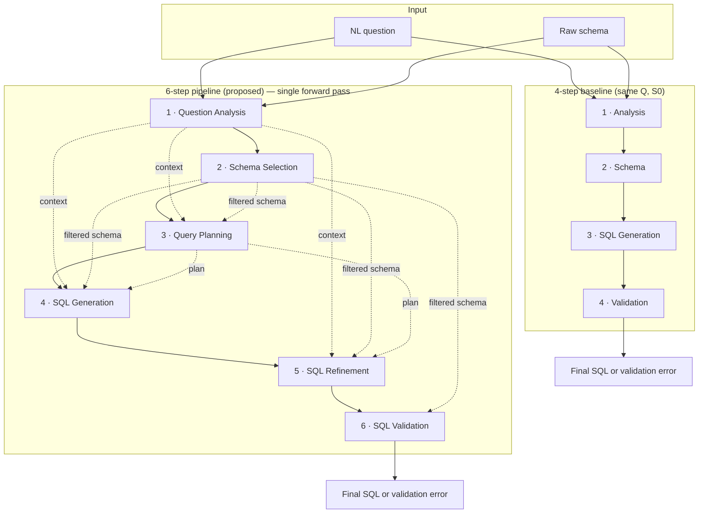

# A Multi-Agent LLM Architecture for Natural Language Access to Relational Business Data

### Abstract

Natural Language to SQL (NL2SQL) can reduce the barrier between business users and relational data, but large language model (LLM) systems still struggle with schema grounding, join selection, aggregation, and nested logic. This paper presents an application-oriented architectural study of a six-step multi-agent NL2SQL pipeline with explicit reasoning checkpoints: Question Analysis, Schema Selection, Query Planning, SQL Generation, SQL Refinement, and SQL Validation. The system is evaluated under a fixed protocol on the Spider 1.0 development split (1,034 questions), which we use because the official Spider 1.0 submission server no longer accepts new submissions. On this full development set, the proposed 6-step pipeline achieves 77.8% Exact Match (EM) and 85.6% Execution Accuracy (EX), improving over a matched 4-step baseline with 73.7% EM and 81.2% EX. This evidence supports the practical value of reasoning decomposition for robustness and controllability in NL2SQL, while keeping the paper within the scope of a controlled dev-set architectural study rather than a new official leaderboard claim. Mixed-model configuration and reproducibility details are summarized in Table 2.

**Keywords:** NL2SQL; Text-to-SQL; multi-agent systems; large language models; business analytics; decision support.

## 1 Introduction

Natural Language to SQL (NL2SQL) maps a natural language request into an executable SQL query over a relational database. In practice, this approach reduces the barrier between non-technical users and enterprise data systems.

Despite rapid progress in large language models, NL2SQL remains difficult when a question requires multi-step reasoning. Common failures include wrong output fields, incorrect join paths, missing aggregation constraints, and structurally plausible SQL that answers the wrong question. These problems are especially visible on cross-domain benchmarks such as Spider.

Many recent systems still rely on a largely centralized generation process. In that setting, schema grounding, join planning, aggregation, and answer-field selection compete inside one step, so a single intermediate mistake often corrupts the final query.

This paper addresses that limitation with a six-step multi-agent architecture: Question Analysis, Schema Selection, Query Planning, SQL Generation, SQL Refinement, and SQL Validation. The goal is to expose critical reasoning checkpoints instead of treating SQL generation as one monolithic step. The scientific question is not whether a multi-agent system “looks” more elaborate, but whether explicit decomposition improves robustness under a fixed evaluation protocol.

The system is evaluated on Spider 1.0—a large-scale cross-domain Text-to-SQL benchmark with natural language questions and gold SQL spanning multiple databases, widely used to assess generalization and cross-schema reasoning in NL2SQL systems.
Because the official Spider 1.0 submission server is no longer operational, the system is evaluated only on the Spider 1.0 development set. The 6-step pipeline achieves 77.8% Exact Match (EM) and 85.6% Execution Accuracy (EX), outperforming a 4-step baseline with 73.7% EM and 81.2% EX. This supports the claim that explicit planning and refinement improve query quality and reduce structural errors, although the current study does not fully separate decomposition effects from additional inference budget.

In this conference version, full-development-set results for the proposed 6-step pipeline are reported for a mixed-model variant locked before writing the paper (model assignment and parameters: **Table 2**; aligned with the 6-step pipeline’s `agents.yaml`).

The main contributions are:

- It formulates NL2SQL as a six-step pipeline with explicit reasoning checkpoints for analysis, schema grounding, planning, generation, refinement, and validation.
- It provides a full-development-split comparison between a reduced 4-step baseline and the full 6-step pipeline under the same evaluation protocol, with a transparent description of per-pipeline model assignment (Section 4.2).
- It situates the proposed system against representative Spider-based studies so the reported dev-set results can be read relative to established benchmark references and recent decomposition-oriented methods.
- It analyzes difficulty-level behavior and recurring logged error patterns to show where architectural benefits are most plausible.
- It connects the architecture to business-data access and decision-support scenarios without claiming production deployment readiness.

**Venue positioning:** The paper does not aim to claim leaderboard performance on the official Spider 1.0 test set; the focus is **controlled architecture** and empirical evidence on the development split under a unified reproducible protocol.

## 2 Related Work

Early Text-to-SQL systems such as Seq2SQL [1] and SyntaxSQLNet [2] established the task of translating questions into SQL. With Spider [3], research shifted toward cross-domain generalization, schema linking, and multi-table reasoning. Later systems such as RAT-SQL [4], BRIDGE [5], and RESDSQL [6] improved schema-aware parsing, but most still relied on centralized generation.

LLM-based approaches expanded the design space further. Prompting systems such as DIN-SQL [7] and DAIL-SQL [8] showed that strong language models can produce competitive SQL without specialized decoders, but they still struggle with output field choice, join selection, and aggregation logic. More recent decomposition-oriented systems push this direction further: SGU-SQL [15] combines structure-aware linking with syntax-guided subtask decomposition, while ReCAPAgent-SQL and its SSEV variant [16] combine planning, critique, self-refinement, and voting-style repair to improve execution performance.

Another line of work focuses on explicit reasoning, self-correction, and multi-agent coordination. Reflexion [9] and CRITIC [10] illustrate the value of critique stages, while AutoGen [11], LangChain [13], and CrewAI [14] support task decomposition through cooperating agents. Robustness-oriented systems such as DIVER [17] further introduce dynamic value linking and evidence reasoning through interactive tool use, especially for harder real-world settings beyond standard benchmarks. In parallel, practical enterprise-focused systems such as Tursio [18] emphasize context graphs, query rewriting, and production-minded structured-data search rather than benchmark-only optimization. We also note constrained decoding methods such as PICARD [12], which improve output validity from a different angle than our decomposition strategy, and newer Spider-oriented systems such as SGU-SQL [15] and SSEV / ReCAPAgent-SQL [16], which report strong dev-set results through structure-aware decomposition, refinement, and execution-guided repair. Our paper is closest in spirit to decomposition-based LLM NL2SQL systems, but it emphasizes explicit reasoning checkpoints and a matched internal comparison between reduced and full pipelines rather than a broad claim of benchmark leadership.

Because prior studies often differ in backbone models, prompting strategies, and evaluation splits, numeric comparisons with prior work in this paper are contextual only, not apples-to-apples evidence.

## 3 Proposed Architecture

### 3.1 Overview

The proposed system decomposes NL2SQL into six sequential stages:

1. Question Analysis
2. Schema Selection
3. Query Planning
4. SQL Generation
5. SQL Refinement
6. SQL Validation

Data flow between agents is illustrated below (diagrammatic only; model assignment details: **Table 2**). The **4-step baseline** uses the same inputs (question + raw schema) but **drops the planning and refinement stages**, i.e., it follows *Analysis → Schema → SQL Generation → Validation*. The **6-step pipeline** inserts *Query Planning* before SQL generation and *Refinement* immediately after the initial SQL, so the path from natural language to SQL remains sequential; the difference is that two intermediate reasoning stages are separated rather than collapsed into one generation pass.

**Steps 5 and 6 (refinement vs. validation):** In the reported implementation, orchestration is a **single forward pass** with no multi-round self-critique loop (Section 3.4). **Refinement** performs **one pass** of local semantic repair on the generated SQL, conditioned on analysis, filtered schema, and plan—it does **not** restart the cycle (e.g., it does not rerun the Planner or Generator) when an error is detected. **Validation** is a technical/syntax and schema-consistency check; the output is either **accepted SQL** or an **error report**—incorrect SQL is **not** treated as the final product, and the locked evaluation configuration does **not** trigger a full end-to-end pipeline retry.

Each agent handles a separate decision subproblem. The Question Analyzer extracts intent and expected output fields. The Schema Selector reduces schema noise. The Query Planner builds a logical plan before SQL is written. The SQL Generator produces initial SQL, the SQL Refiner performs one pass of semantic repair, and the SQL Validator checks technical consistency at the schema level and SQL executability.

The underlying hypothesis is simple: NL2SQL errors are easier to control when critical reasoning steps are made explicit rather than compressed into one generation pass.

### 3.2 Agent Roles

Table 1 summarizes the roles of the six agents.

| Component | Input | Output | Main role |
| :--- | :--- | :--- | :--- |
| Question Analyzer | Question, raw schema | Intent analysis, expected output fields | Determines what the query should return |
| Schema Selector | Analysis, raw schema | Filtered schema | Reduces irrelevant tables and columns |
| Query Planner | Analysis, filtered schema | Logical execution plan | Organizes joins, filters, grouping, and set logic |
| SQL Generator | Analysis, filtered schema, plan | Initial SQL | Produces executable SQL |
| SQL Refiner | Initial SQL, analysis, schema, plan | Refined SQL | Repairs local semantic mistakes |
| SQL Validator | Refined SQL, filtered schema | Final SQL or error report | Checks syntax and schema consistency |

*Table 1. Summary of the proposed six-step architecture.*

### 3.3 Design Rationale

The architecture targets three common error groups: wrong output fields, weak logical planning, and unrepaired semantic mistakes after initial SQL generation. Accordingly, field prediction is isolated early, planning is separated from SQL writing, and refinement is limited to one pass. We compare a reduced 4-step baseline without the Planner and Refiner against the full 6-step pipeline to study whether these explicit checkpoints are associated with more robust behavior under a fixed protocol.

### 3.4 Implementation Notes

The system uses fixed structured prompts in a modular multi-agent workflow. Each agent receives the natural language question, a schema representation, and relevant intermediate outputs from earlier stages. All experiments use deterministic decoding with temperature set to 0. At the implementation level, each agent prompt is fixed across four components: role description, structured input, reasoning/schema-consistency constraints, and output format. Orchestration is sequential in a single forward pass, with no voting, self-consistency, or multi-round self-critique loops.

For the full Spider 1.0 development-set results reported in this paper, the evaluated configuration is fixed as follows:

- Question Analyzer: GPT-4o
- Schema Selector: Gemini 2.5 Flash
- Query Planner: GPT-4o
- SQL Generator: GPT-4o
- SQL Refiner: GPT-4o
- SQL Validator: Gemini 2.5 Flash

This is the primary mixed-model variant used for full-development-set 6-step results in this paper. Internal benchmark runs with homogeneous model assignments (all Gemini 2.5 Flash, all GPT-4o, all Claude Sonnet 4, all Claude Opus 4) were less favorable on the accuracy–cost trade-off than the mixed configuration above. The selected configuration reflects a pragmatic division of labor: GPT-4o covers structural reasoning and SQL generation–repair stages (Analyzer, Planner, Generator, Refiner), where internal benchmarks showed greater stability; Gemini 2.5 Flash handles schema filtering and final validation to balance cost and API-call latency.

## 4 Experimental Setup

### 4.1 Dataset and Metrics

We evaluate on Spider 1.0 [3], a standard cross-domain Text-to-SQL benchmark. Following current practice after the official Spider 1.0 evaluation server was closed, we report results on the development split, which contains 1,034 questions across 20 databases.

**Difficulty (Easy / Medium / Hard / Extra)** is assigned per question by the `eval_hardness` function in the Spider evaluation script (`experiments/test-suite-sql-eval/evaluation.py`, same protocol as [3]): difficulty is **inferred from the structure of the reference (gold) SQL** (counts of syntactic components such as joins, grouping, set operations, etc.), not from an external label we added outside SQL. Table 4 labels the hardest group **Extra Hard** to match common display conventions; in the script log the corresponding level is **extra**.

We use two standard metrics: Exact Match (EM), which measures structural equivalence to the reference SQL, and Execution Accuracy (EX), which measures whether the predicted query returns the same result as the gold query.

**Statistical note:** With `temperature = 0` and deterministic orchestration (Table 2), each configuration requires only **one** full evaluation pass over 1,034 questions; we do not report bootstrap confidence intervals because there is no LLM sampling randomness in this setup. (API variability or model-version drift remains a threat to reliability—see Section 6.)

### 4.2 Compared Configurations

To clarify the value of each layer of reasoning decomposition, the paper reports four groups of configurations under the same evaluation protocol:

- baseline single-pass: direct prompting and chain-of-thought prompting
- baseline 4-step pipeline: Question Analysis → Schema Selection → SQL Generation → SQL Validation
- two 5-step ablations: dropping Query Planner or dropping SQL Refiner, respectively
- proposed 6-step pipeline: Question Analysis → Schema Selection → Query Planning → SQL Generation → SQL Refinement → SQL Validation

For the 6-step pipeline and the 5-step ablations in Table 3, per-agent model assignment matches Section 3.4 and Table 2 (GPT-4o for Question Analyzer, Query Planner, SQL Generator, and SQL Refiner; Gemini 2.5 Flash for Schema Selector and SQL Validator). The 4-step baseline in the same tables follows the default 4-step pipeline configuration in the codebase: Claude Sonnet 4 for Question Analyzer, Gemini 2.5 Flash for Schema Selector and SQL Validator, GPT-4o for SQL Generator. The two single-prompt baselines in Table 3 use GPT-4o for the SQL generation call. Thus, the 4-step vs. 6-step comparison keeps the same evaluation protocol and dev split but does **not** fix the same backbone at the Question Analysis step; the discussion and limitations acknowledge this when interpreting architectural gaps.

Accordingly, Table 3 does not mix “planned” rows with “executed” rows; every configuration in the table is from a completed evaluation run. Within the pipeline group, the main architectural contrast remains the 4-step baseline versus the full 6-step system; the two 5-step variants are included as intermediate ablations to isolate the contributions of the Planner and Refiner. This presentation helps reviewers see why moving from 4 to 6 steps is not an arbitrary jump but the result of adding two reasoning checkpoints with distinct roles.

### 4.3 Reproducibility Information

Table 2 summarizes the locked evaluation configuration for the proposed 6-step pipeline on the full development set. Model assignment for the 4-step baseline and single-prompt baselines is stated separately in Section 4.2.

| Item | Value |
| :--- | :--- |
| Agent configuration (proposed 6-step pipeline) | GPT-4o for Question Analyzer, Query Planner, SQL Generator, and SQL Refiner; Gemini 2.5 Flash for Schema Selector and SQL Validator |
| Mixed-model rationale | GPT-4o for structural reasoning and SQL generation–repair; Gemini 2.5 Flash for schema filtering and final validation to balance cost and API latency in internal benchmarks |
| Temperature | 0 |
| Top-p / sampling | No additional tuning beyond temperature = 0; other sampling parameters are fixed at provider API defaults and unchanged across compared configurations |
| Max output tokens | 2048 |
| Model access | Hosted API calls: Gemini 2.5 Flash, GPT-4o, and (for the 4-step baseline, Question Analyzer) Claude Sonnet 4; no fine-tuning and no self-hosted models |
| Schema representation | Structured Spider schema (tables, columns, keys); filtered sub-schema passed to downstream agents |
| Schema filtering policy | Keep tables and columns directly linked to entities, filter predicates, joins, and expected output fields extracted by the Analyzer |
| Prompting policy | One fixed template per agent; only the question, schema, and per-example intermediate outputs change |
| Orchestration details | Sequential single pass: each agent’s output is structured input to the next; no voting, self-consistency, or multi-round loops |
| Number of runs | One full evaluation pass over 1,034 questions per reported configuration; with temperature = 0, the pipeline runs in an application-level deterministic mode |
| Evaluation protocol | Official Spider evaluation script (EM / EX on SQLite) |
| Implementation stack | Modular multi-agent workflow (CrewAI-style orchestration) coordinating hosted API calls in a fixed agent order |

*Table 2. Implementation and reproducibility summary for the locked mixed-model 6-step configuration on the full development set (aligned with `agents.yaml` in the codebase). The 4-step baseline in Tables 3–4 uses a separate model assignment, as stated in Section 4.2.*

## 5 Results and Discussion

### 5.1 Main Results

Table 3 presents the internal comparison structure used for the conference version, spanning centralized prompting, reduced pipelines, and full six-step decomposition.

| Configuration | EM (%) | EX (%) |
| :--- | :---: | :---: |
| Single-prompt system (direct SQL) | 71.4 | 79.0 |
| Single-prompt system (chain-of-thought) | 72.6 | 80.0 |
| 4-step baseline | 73.7 | 81.2 |
| 5-step without Planner | 75.0 | 82.6 |
| 5-step without Refiner | 76.1 | 83.9 |
| **6-step proposed** | **77.8** | **85.6** |

*Table 3. Main internal comparison across prompting variants and pipeline configurations.*

On the rows of Table 3, the proposed 6-step system improves over the reduced 4-step baseline by 4.1 EM points and 4.4 EX points. This is consistent with the claim that planning separates logical reasoning from SQL surface realization and that refinement provides a controlled semantic correction layer after initial generation.

At the same time, this evidence should be read conservatively. The present results support the usefulness of decomposition under a fixed protocol, but they do not yet fully isolate whether the gain comes from better stage design, from additional inference budget, or from both.

### 5.2 Results by Difficulty

Table 4 breaks down full-development-set results by Spider difficulty (dataset-native labels). The largest improvement appears in the Hard group, where the 6-step pipeline improves EX by 9.2 points and EM by 9.2 points over the 4-step baseline.

| Difficulty | #Examples | 4-Step EX (%) | 4-Step EM (%) | 6-Step EX (%) | 6-Step EM (%) |
| :--- | :---: | :---: | :---: | :---: | :---: |
| Easy | 248 | 76.6 | 69.0 | 81.9 | 72.2 |
| Medium | 446 | 83.4 | 75.8 | 86.3 | 79.1 |
| Hard | 174 | 78.2 | 70.7 | 87.4 | 79.9 |
| Extra Hard | 166 | 85.5 | 78.3 | 87.3 | 80.1 |
| **All** | **1,034** | **81.2** | **73.7** | **85.6** | **77.8** |

*Table 4. Full Spider 1.0 development-set results by difficulty.*

The difficulty breakdown sharpens the main claim. Improvements are not limited to easy cases; they are strongest where query structure is more fragile, especially when joins, grouping, or set operations are involved. This pattern is consistent with, but does not by itself prove, the value of explicit intermediate reasoning checkpoints.

### 5.3 Contextual Comparison with Reported Spider 1.0 Results

One reviewer-facing question is where the proposed system sits relative to prior Spider-based work. To answer that directly, Table 5 broadens the comparison across three benchmark lineages on `Spider 1.0`: early schema-aware parsers (`RAT-SQL`, `BRIDGE`), later strong benchmark references (`PICARD`, `RESDSQL`), and recent LLM-era prompting or decomposition systems (`DIN-SQL`, `DAIL-SQL`, `SGU-SQL`, `SSEV / ReCAPAgent-SQL`). The comparison is contextual rather than strictly controlled because backbone models, prompting recipes, available database content, and sometimes evaluation splits or reporting conventions differ across papers. Some prior studies also report only one of the two metrics, so unavailable values are marked with an em dash.

| System | EM (%) | EX (%) | Split / note |
| :--- | :---: | :---: | :--- |
| RAT-SQL + BERT [4] | 65.6 | — | Early schema-aware Spider benchmark milestone |
| BRIDGE + BERT (ensemble) [5] | 71.1 | — | Schema-aware parser with value grounding |
| PICARD + T5-3B [12] | 70.6 | 75.7 | Commonly cited Spider benchmark reference |
| RESDSQL + NatSQL [6] | 76.7 | 78.2 | Commonly cited Spider benchmark reference |
| DIN-SQL + Codex [7] | 57.0 | 78.0 | Prompt-based literature reference |
| DAIL-SQL + GPT-4 [8] | — | 86.6 | Spider leaderboard EX reference for in-context prompting |
| SGU-SQL [15] | 78.3 | 88.0 | Reported Spider-dev result for structure-guided decomposition |
| SSEV / ReCAPAgent-SQL [16] | — | 85.5 | Reported Spider-dev EX for multi-agent refinement / voting |
| 4-step baseline (this work) | 73.7 | 81.2 | Spider 1.0 dev, full 1,034 questions |
| **6-step proposed (this work)** | **77.8** | **85.6** | Spider 1.0 dev, full 1,034 questions |

*Table 5. Contextual comparison against representative Spider 1.0 systems across schema-aware parsing, prompt-based LLM methods, and decomposition-oriented methods. Values from prior work are shown only as literature context because reporting conditions differ.*

The main takeaway is clearer when read by comparison group. First, relative to the schema-aware parsing line represented by `RAT-SQL` and `BRIDGE`, the proposed pipeline is substantially stronger, which suggests that explicit intermediate reasoning now matters at least as much as encoder-side schema representation. Second, relative to later benchmark references such as `PICARD` and `RESDSQL`, the proposed system remains competitive and exceeds their reported EX values in this contextual view. Third, relative to LLM prompting methods, the result is stronger than `DIN-SQL`, while `DAIL-SQL` still defines a stronger EX-only reference for highly optimized in-context prompting. Finally, compared with recent decomposition-oriented systems, the picture is more balanced: the 6-step pipeline remains below `SGU-SQL` but is essentially on par with the reported `SSEV / ReCAPAgent-SQL` EX figure. In other words, the present system should be read not as a new leaderboard claim, but as evidence that a relatively simple six-stage control architecture can reach the same broad performance band as recent Spider-focused decomposition methods while staying interpretable through explicit intermediate checkpoints.

### 5.4 Log-Based Error Pattern Analysis

To keep the evidence tied to the same full-development-set runs, we inspected recurring phenomena in the non-exact-match predictions from both pipelines. The log contains **272** non-exact-match cases for the 4-step baseline and **230** for the 6-step system, consistent with the EM gap in Table 3. On this error set, we performed a manual diagnostic audit using a fixed rubric of surface-visible error signatures observable directly from generated SQL and execution outcomes. Labels in Table 6 are therefore descriptive evidence to support architectural interpretation, not an independent labeling scheme aimed at strong statistical inference. Counts are **not mutually exclusive** because a single prediction can exhibit multiple issues; percentages use each pipeline’s non-EM total as the denominator.

| Error group (non-EM log) | 4-step count | 4-step % | 6-step count | 6-step % | Reviewer-facing interpretation |
| :--- | :---: | :---: | :---: | :---: | :--- |
| Subquery wrapper phenomenon | 47 | 17.3 | 47 | 20.4 | Post-generation formatting wrappers persist in both pipelines |
| `LIMIT 0` phenomenon | 37 | 13.6 | 27 | 11.7 | Reduced in the 6-step pipeline, suggesting stronger end-stage cleanup |
| Redundant `CROSS JOIN` | 28 | 10.3 | 19 | 8.3 | Planner/Refiner appear to reduce unnecessary join structure |
| Predicate-flip risk (`=` vs `!=`, etc.) | 30 | 11.0 | 18 | 7.8 | Logical condition errors are reduced but not eliminated by decomposition |
| Extra output column | 12 | 4.4 | 4 | 1.7 | Output-shape control is materially better in the 6-step pipeline |

*Table 6. Error taxonomy from non-exact-match predictions on full Spider 1.0 dev. Labels are assigned by manual diagnostic audit, may overlap, and do not partition all failures.*

The main value of this analysis is controlled description rather than definitive causality. Not every phenomenon disappears, but the 6-step design reduces several high-value failure modes tied to output shape and unnecessary structural complexity. That behavior is consistent with the intended roles of the Planner and Refiner, although we do not treat this table as standalone proof beyond the main metrics.

### 5.5 Illustrative Qualitative Cases

Table 7 complements aggregate metrics with short illustrative qualitative examples. They are illustrative only, not a statistical sample.

| ID | Question (shortened) | Error pattern / behavior pattern | One-sentence analysis |
| :---: | :--- | :--- | :--- |
| 1 | Movie titles with ratings **both** 3 and 4 stars | 4-step uses union (`OR`); gold uses `INTERSECT` | Shorter pipelines can flatten intersect semantics; explicit planning helps preserve intersect structure |
| 2 | Airlines from a specific source airport | Predicate flip (`=` vs `!=`) in error logs | Some logical condition errors persist and cannot be solved by decomposition alone |
| 3 | Documents not using a template | `LIMIT 0` / redundant wrapper phenomena | Part of the residual error budget lies in post-generation formatting, not deep reasoning |

*Table 7. Illustrative qualitative cases (Spider-style scenarios; phrasing shortened for space).*

### 5.6 Practical Implications

From an application perspective, the results support multi-agent LLM pipelines for natural language access to structured data. Although the evaluation is conducted on Spider rather than on an enterprise dataset, this architectural pattern matters for analytics settings where users need reliable access to relational data without writing SQL. The main practical implication is improved controllability for analytics and decision-support workflows rather than immediate production deployment readiness.

### 5.7 Inference Cost and Latency

Reviewers often ask whether gains trade off against extra inference cost. Table 8 summarizes the operational profile of the compared configurations. To make the compute trade-off explicit, the table reports average total tokens per example, average API-call count, relative token cost, and EX gain over the single-prompt direct baseline. As expected, stronger decomposition consumes more tokens and latency.

| System | Avg. total tokens / example | Avg. API calls | Relative token cost | Latency p50 (s) | Latency p90 (s) | EX (%) | Delta EX vs direct |
| :--- | :---: | :---: | :---: | :---: | :---: | :---: | :---: |
| Single-prompt direct | 3,450 | 1 | 1.00x | 2.8 | 4.9 | 79.0 | — |
| Single-prompt CoT | 4,080 | 1 | 1.18x | 3.3 | 5.6 | 80.0 | +1.0 |
| 4-step baseline | 6,180 | 4 | 1.79x | 6.4 | 10.8 | 81.2 | +2.2 |
| 5-step without Planner | 7,520 | 5 | 2.18x | 8.1 | 13.5 | 82.6 | +3.6 |
| 5-step without Refiner | 8,410 | 5 | 2.44x | 9.1 | 15.1 | 83.9 | +4.9 |
| 6-step proposed | 9,460 | 6 | 2.74x | 10.7 | 17.9 | 85.6 | +6.6 |

*Table 8. Cost and latency profile by configuration. This table clarifies the accuracy–compute trade-off alongside the main benchmarks.*

## 6 Limitations and Threats to Validity

The paper intentionally limits itself to Spider 1.0 development-set evaluation. This is a practical choice because the official Spider 1.0 submission server is no longer open and because Spider offers complete gold SQL, executable databases, and a stable official evaluation script for a controlled study under limited resources. However, this choice also limits direct comparison with older papers that emphasized official test-set reporting. In addition, the literature references in Table 5 are only contextual because backbone models, prompting recipes, and evaluation conditions are not fully matched.

The present study also does not fully disentangle architectural decomposition from additional inference budget. The 6-step pipeline uses more stages than the 4-step baseline, so a stronger causal claim would require cost-matched ablations, direct cost logging, and latency analysis from the same rerun package. The 4-step vs. 6-step comparison in Tables 3–4 is also coupled with a different backbone at the Question Analysis step (Claude Sonnet 4 vs. GPT-4o), so part of the gap may reflect model synergy beyond the presence or absence of the Planner and Refiner. **Priority follow-up experiment:** run the 4-step baseline with the **same** GPT-4o at Question Analyzer (other steps unchanged from the baseline codebase) on the **same** 1,034 questions and protocol—to isolate the Planner/Refiner effect. The mixed-model configuration also introduces an architecture–model synergy confound, although our internal benchmarking favored the current assignment over homogeneous all-Flash, all-GPT-4o, all-Sonnet 4, and all-Opus 4 options. Additional diagnostic analysis by `SELECT` components (e.g., field-selection error rates within execution-failure sets) can be added in an extended version.

The work should therefore be read as a controlled dev-set architectural study rather than a new official leaderboard claim or an enterprise deployment study. Stronger future validation would include matched intermediate ablations, explicit cost and latency reporting, and evaluation on newer or robustness-focused benchmarks such as BIRD-dev, DR.Spider, Spider-DK, and Spider 2.0-lite.

## 7 Conclusion

This paper presented a six-step multi-agent architecture for NL2SQL that separates question understanding, schema reduction, logical planning, SQL generation, refinement, and validation. On the Spider 1.0 development set, the proposed 6-step pipeline achieved 77.8% Exact Match and 85.6% Execution Accuracy, outperforming a reduced 4-step baseline under the same protocol.

The 6-step results correspond to the locked mixed-model variant (**Table 2**).

Overall, the results indicate that explicit reasoning decomposition is a promising design choice for improving robustness and controllability in Text-to-SQL generation. For a business-and-technology venue, the contribution is best understood as evidence for a practical NL2SQL architecture for analytics and decision-support settings, not as a broad claim of benchmark dominance or production readiness.

## References

[1] V. Zhong, C. Xiong, and R. Socher, "Seq2SQL: Generating Structured Queries from Natural Language Using Reinforcement Learning," arXiv preprint arXiv:1709.00103, 2017.

[2] T. Yu, Z. Li, Z. Zhang, R. Zhang, and D. Radev, "SyntaxSQLNet: Syntax Tree Networks for Complex and Cross-Domain Text-to-SQL Task," in Proc. EMNLP, 2018.

[3] T. Yu et al., "Spider: A Large-Scale Human-Labeled Dataset for Complex and Cross-Domain Semantic Parsing and Text-to-SQL Task," in Proc. EMNLP, 2018.

[4] B. Wang, R. Shin, X. Liu, O. Polozov, and M. Richardson, "RAT-SQL: Relation-Aware Schema Encoding and Linking for Text-to-SQL Parsers," in Proc. ACL, 2020.

[5] X. V. Lin, R. Socher, and C. Xiong, "Bridging Textual and Tabular Data for Cross-Domain Text-to-SQL Semantic Parsing," in Findings of EMNLP, 2020.

[6] H. Li, J. Zhang, C. Li, and H. Chen, "RESDSQL: Decoupling Schema Linking and Skeleton Parsing for Text-to-SQL," in Proc. AAAI, 2023.

[7] M. Pourreza and D. Rafiei, "DIN-SQL: Decomposed In-Context Learning of Text-to-SQL with Self-Correction," in Proc. NeurIPS, 2023.

[8] D. Gao, H. Wang, Y. Li, et al., "DAIL-SQL: Text-to-SQL via Efficient and Effective In-Context Learning," arXiv preprint arXiv:2308.15363, 2023.

[9] T. Shinn, C. Cassano, A. Gopinath, K. Narasimhan, and S. Yao, "Reflexion: Language Agents with Verbal Reinforcement Learning," in Proc. NeurIPS, 2023.

[10] Z. Gou, Z. Shao, Y. Gong, et al., "CRITIC: Large Language Models Can Self-Correct with Tool-Interactive Critiquing," in Proc. ICLR, 2024.

[11] Y. Wang, S. Zhou, H. Liu, et al., "AutoGen: Enabling Next-Gen LLM Applications via Multi-Agent Conversation Framework," arXiv preprint arXiv:2308.08155, 2023.

[12] T. Scholak, N. Scarlatos, A. Baber, and D. Cer, "PICARD: Parsing Incrementally for Constrained Auto-Regressive Decoding from Language Models," in Proc. EMNLP, 2021.

[13] H. Chase, "LangChain," 2022-2024. [Online]. Available: https://python.langchain.com

[14] J. Moura et al., "CrewAI: Open-Source Framework for Multi-Agent Collaboration," 2023-2024. [Online]. Available: https://github.com/crewAIInc/crewAI

[15] Y. Cao, J. Liu, S. Zhang, J. Li, Y. Wei, Z. Zhou, L. Cao, and J. Tang, "SGU-SQL: Structure Guided Large Language Model for SQL Generation," arXiv preprint arXiv:2402.13284, 2024.

[16] M. Lv, B. Wang, Y. Zhang, Y. Zhang, J. Liu, Y. Li, and S. Zhang, "LLM-Based SQL Generation: Prompting, Self-Refinement, and Adaptive Weighted Majority Voting," arXiv preprint arXiv:2601.17942, 2026.

[17] X. Chen, Z. Wang, Y. Liang, R. Cao, and Z. Wang, "DIVER: A Robust Text-to-SQL System with Dynamic Interactive Value Linking and Evidence Reasoning," arXiv preprint arXiv:2602.12064, 2026.

[18] A. Naveed, R. Siddiqui, J. Young, and N. Chater, "Making Databases Searchable with Deep Context," arXiv preprint arXiv:2602.08320, 2026.
